# msqrob2PTM: DIA-NN case study - Unpaired phospho-enriched and non-enriched samples

## Background

- Mass spectrometry–based (MS) proteomics allows the identification and
  quantification of a myriad of posttranslational modifications (PTMs)
- This reveals additional complexity and diversity of the proteome.
- Indeed, PTMs greatly extend the number of different forms of a
  protein, that is, proteoforms, that can be found.
- More importantly, these PTMs can impact protein functions
- They are linked to a variety of diseases and developmental disorders.
- Aberrant PTM status can cause a number of detrimental effects ranging
  from the alteration of protein folding to the dysregulation of cell
  signaling.
- It is thus of great importance to study these PTMs in detail, not only
  through their correct identification but also by their correct
  quantification and subsequent statistical analysis.

### Vignette

In this vignette we start from quantified precursor level data to infer

- Differential abundance (DA) of precursors carrying
  post-translation-modifications,
- DA at the protein level
- Differential usage of precursors, i.e.  DA of precursors upon
  correction for DA at protein level
- Differential usage of PTMs, i.e. upon summarising the usages for all
  precursors that carry the same PTM at a specific residue (position in
  the protein),

using the msqrob2PTM workflow in the bioconductor package
[msqrob2](https://www.bioconductor.org/packages/release/bioc/html/msqrob2.html).

You can read more about - `msqrob2` on
<https://statomics.github.io/msqrob2book/> - `msqrob2PTM` in msqrob2PTM:
Differential Abundance and Differential Usage Analysis of MS-Based
Proteomics Data at the Posttranslational Modification and Peptidoform
Level. N. Demeulemeester, M. Gébelin, L. Caldi Gomes, C. Carapito, L.
Martens and L. Clement. Molecular & Cellular Proteomics, 2023; 23.
<https://doi.org/10.1016/j.mcpro.2023.100708>

### Experiment

Mutations in tRNAs can lead to mis-incorporation of an amino acid into a
growing polypeptide chain that differs from what is specified by the
mRNA in a process known as mistranslation. To better understand the
impact of mistranslating tRNA variants, Berg et al.  profiled the
proteome and phosphoproteome of yeast expressing three different
mistranslating tRNAs. The first is a proline tRNA with a G3:U70 base
pair in its acceptor stem that mis-incorporates alanine at proline
codons (Pro -\> Ala; Hoffman et al. 2017). The other two are serine
tRNAs with either a UGG proline or UCU arginine anticodon which
mis-incorporate serine at proline (Pro -\> Ser) or serine at arginine
codons (Arg -\> Ser), respectively (Berg et al. 2017, 2019b).

Six replicates of each strain were grown. From each replicate an
non-enriched (whole proteome) and a phospho-peptide-enriched sample was
prepared and quantified using a data independent acquisition workflow.

The data for the non-enriched and phospho-enriched samples are deposited
to PRIDE, dataset identifiers PXD068388 and PXD068392).

We will take a subset of the data to illustrate an unpaired analysis,
i.e. we will use the phospho-data from three random samples and the
non-enriched data for the remaining samples.

#### Summary:

- Mutations in tRNAs can lead to mis-incorporation of amino acids during
  protein translation.
- 4 strains: WT, 3 strains with mutations leading to miss-incorporations
  (Pro -\> Ala, Pro -\> Ser and Arg -\> Ser).
- 6 biological repeats per strain
- Here we use the non-enriched MS runs from three random bio-repeats and
  phospho-enriched MS runs from the other three bio-repeats so as to
  have unpaired samples.

!['tRNA variants induce mistranslation. a) Schematic representing the
three mistranslating tRNAs used in this study. b) Mistranslation
frequency for each strain determined by mass spectrometry. Wild-type
yeast strain BY4741 expressing either an empty vector control or a
mistranslating tRNA variant were grown in minimal media lacking uracil
to an OD600 of ∼1.0 and mass spectrometry analysis of the cellular
proteome was performed. The percent of unique peptides detected with
either proline to alanine, proline to serine or arginine to serine
substitutions was calculated for each respective variant and the control
strain. c) Growth rate for the control strain and strains expressing
each mistranslating tRNA was determined from growth curves performed in
minimal media lacking uracil. Strains were diluted to an OD600 of ∼0.1
and grown for 24 h. Growth relative to the control strain, set as 1.0,
was calculated from the doubling time. d) Representative growth of the
control strain and strains expressing each mistranslating tRNA on solid
minimal media lacking uracil. Overnight cultures of each strain were
grown in minimal media lacking uracil, spotted in 10-fold serial
dilutions and grown for 2 days. e) Correlation between relative growth
rate of each strain as determined in (c) vs mistranslation frequency
calculated by summing the total intensity of all identified
mistranslated peptides and normalized to the total intensity of peptides
identified in the mass spectrometry data. In all panels, each point
represents 1 biological replicate.' Berg et al.
2026](https://raw.githubusercontent.com/statOmics/2026_eurobioc_workshop_msqrob2ptm/devel/vignettes/figs/figureExperiment.jpeg)

‘tRNA variants induce mistranslation. a) Schematic representing the
three mistranslating tRNAs used in this study. b) Mistranslation
frequency for each strain determined by mass spectrometry. Wild-type
yeast strain BY4741 expressing either an empty vector control or a
mistranslating tRNA variant were grown in minimal media lacking uracil
to an OD600 of ∼1.0 and mass spectrometry analysis of the cellular
proteome was performed. The percent of unique peptides detected with
either proline to alanine, proline to serine or arginine to serine
substitutions was calculated for each respective variant and the control
strain. c) Growth rate for the control strain and strains expressing
each mistranslating tRNA was determined from growth curves performed in
minimal media lacking uracil. Strains were diluted to an OD600 of ∼0.1
and grown for 24 h. Growth relative to the control strain, set as 1.0,
was calculated from the doubling time. d) Representative growth of the
control strain and strains expressing each mistranslating tRNA on solid
minimal media lacking uracil. Overnight cultures of each strain were
grown in minimal media lacking uracil, spotted in 10-fold serial
dilutions and grown for 2 days. e) Correlation between relative growth
rate of each strain as determined in (c) vs mistranslation frequency
calculated by summing the total intensity of all identified
mistranslated peptides and normalized to the total intensity of peptides
identified in the mass spectrometry data. In all panels, each point
represents 1 biological replicate.’ Berg et al. 2026

M. Berg, A. Chang, R. Rodriguez-Mias, J. Villén, Mistranslating tRNA
variants impact the proteome and phosphoproteome of Saccharomyces
cerevisiae, G3 Genes\|Genomes\|Genetics, Volume 16, Issue 2, February
2026, jkaf284, <https://doi.org/10.1093/g3journal/jkaf284>

## Preamble

### Load packages

We load the `msqrob2` package, along with additional packages for data
manipulation and visualisation.

``` r

suppressPackageStartupMessages({
library("QFeatures")  
library("dplyr") 
library("tidyr")
library("ggplot2")
library("msqrob2")    
library("stringr")
library("ExploreModelMatrix")
library("MsCoreUtils") 
library("matrixStats")
library("patchwork")
library("kableExtra")
library("ComplexHeatmap")
library("purrr")
library("tibble")
library("scater")
library("BiocFileCache")
})
```

### Data

#### Precursor table

- We load the output from DIA-NN parquet files.
- Can be file path to local file or url to file that lives on the web.
- Here we use BiocFileCache so that we do not need to download the files
  again each time that the script is knit.

``` r

bfc <- BiocFileCache() # for usage in local rstudio session on local machine
precursorFile <- bfcrpath(bfc,"https://zenodo.org/records/20414816/files/WholeProteome_DIANNreport.parquet?download=1")
precursorFilePTM <- bfcrpath(bfc,"https://zenodo.org/records/20414816/files/Phosphoproteome_DIANNreport.parquet?download=1")
```

We can import the report.parquet file using the `read_parquet` function
from the `arrow` package.

``` r

precursors <- arrow::read_parquet(precursorFile) # function from the arrow package
precursorsPTM <- arrow::read_parquet(precursorFilePTM) # function from the arrow package
#precursors <- data.table::fread(precursorFile) # For older versions the results are stored as tsv files. 
```

We subset the precursor files to reduce the memory footprint and only
keep the variables that we need in the downstream analysis.

Note that `Protein.Sites` refers to the exact modified residue position
in the full protein sequence, which will be useful when assessing
PTM-level quantification.

Note, that we also filter out the strain with the ProSer variant here.

``` r

precursors <- precursors |> 
  filter(!grepl("ProSer",Run)) |>
  select(
         Run, 
         Precursor.Id, 
         Modified.Sequence, 
         Stripped.Sequence, 
         Precursor.Charge, 
         Protein.Group, 
         Protein.Names,
         Protein.Ids,
         Protein.Sites, #exact modified residue position in the full protein sequence
         Genes,
         Precursor.Quantity,
         Precursor.Normalised,
         Normalisation.Factor,
         Ms1.Area,
         Ms1.Normalised,
         PG.MaxLFQ,
         Q.Value, 
         Lib.Q.Value,
         PG.Q.Value,
         Lib.PG.Q.Value,
         Proteotypic,
         Decoy, # Not available in older versions of DIA-NN
         RT)
precursorsPTM <- precursorsPTM |> 
  filter(!grepl("ProSer",Run)) |>
  select(
         Run, 
         Precursor.Id, 
         Modified.Sequence, 
         Stripped.Sequence, 
         Precursor.Charge, 
         Protein.Group, 
         Protein.Names,
         Protein.Ids,
         Protein.Sites, #exact modified residue position in the full protein sequence
         Genes,
         Precursor.Quantity,
         Precursor.Normalised,
         Normalisation.Factor,
         Ms1.Area,
         Ms1.Normalised,
         PG.MaxLFQ,
         Q.Value, 
         Lib.Q.Value,
         PG.Q.Value,
         Lib.PG.Q.Value,
         Proteotypic,
         Decoy, # Not available in older versions of DIA-NN
         RT)
```

``` r

precursorsPTM |> 
  select(Protein.Sites, Modified.Sequence, Stripped.Sequence) |> 
  head(20)
```

    ## # A tibble: 20 × 3
    ##    Protein.Sites      Modified.Sequence                        Stripped.Sequence
    ##    <chr>              <chr>                                    <chr>            
    ##  1 [P52871:A2,S4]     (UniMod:1)AAS(UniMod:21)VPPGGQR          AASVPPGGQR       
    ##  2 [P52871:A2,S4]     (UniMod:1)AAS(UniMod:21)VPPGGQR          AASVPPGGQR       
    ##  3 [P52871:A2,S4]     (UniMod:1)AAS(UniMod:21)VPPGGQR          AASVPPGGQR       
    ##  4 [P52871:A2,S4]     (UniMod:1)AAS(UniMod:21)VPPGGQR          AASVPPGGQR       
    ##  5 [P52871:A2,S4]     (UniMod:1)AAS(UniMod:21)VPPGGQR          AASVPPGGQR       
    ##  6 [P52871:A2,S4]     (UniMod:1)AAS(UniMod:21)VPPGGQR          AASVPPGGQR       
    ##  7 [P04147:A2,T5]     (UniMod:1)ADIT(UniMod:21)DKTAEQLENLNIQD… ADITDKTAEQLENLNI…
    ##  8 [P04147:A2,T5]     (UniMod:1)ADIT(UniMod:21)DKTAEQLENLNIQD… ADITDKTAEQLENLNI…
    ##  9 [P04147:A2,T5]     (UniMod:1)ADIT(UniMod:21)DKTAEQLENLNIQD… ADITDKTAEQLENLNI…
    ## 10 [P04147:A2,T8]     (UniMod:1)ADITDKT(UniMod:21)AEQLENLNIQD… ADITDKTAEQLENLNI…
    ## 11 [P04147:A2,T8]     (UniMod:1)ADITDKT(UniMod:21)AEQLENLNIQD… ADITDKTAEQLENLNI…
    ## 12 [P04147:A2,T8]     (UniMod:1)ADITDKT(UniMod:21)AEQLENLNIQD… ADITDKTAEQLENLNI…
    ## 13 [P04147:A2,T8]     (UniMod:1)ADITDKT(UniMod:21)AEQLENLNIQD… ADITDKTAEQLENLNI…
    ## 14 [P04147:A2,T8]     (UniMod:1)ADITDKT(UniMod:21)AEQLENLNIQD… ADITDKTAEQLENLNI…
    ## 15 [P04147:A2,T8]     (UniMod:1)ADITDKT(UniMod:21)AEQLENLNIQD… ADITDKTAEQLENLNI…
    ## 16 [P04147:A2,T8]     (UniMod:1)ADITDKT(UniMod:21)AEQLENLNIQD… ADITDKTAEQLENLNI…
    ## 17 [P04147:A2,T8]     (UniMod:1)ADITDKT(UniMod:21)AEQLENLNIQD… ADITDKTAEQLENLNI…
    ## 18 [P40096:A2,T8,M32] (UniMod:1)ADQVPVT(UniMod:21)TQLPPIKPEHE… ADQVPVTTQLPPIKPE…
    ## 19 [P40096:A2,T8,M32] (UniMod:1)ADQVPVT(UniMod:21)TQLPPIKPEHE… ADQVPVTTQLPPIKPE…
    ## 20 [P40096:A2,T8,M32] (UniMod:1)ADQVPVT(UniMod:21)TQLPPIKPEHE… ADQVPVTTQLPPIKPE…

Garbage collection to free space

``` r

gc(); gc()
```

    ##            used  (Mb) gc trigger   (Mb)  max used   (Mb)
    ## Ncells 10309431 550.6   17865211  954.2  13665288  729.9
    ## Vcells 61236379 467.2  210117423 1603.1 262547018 2003.1

    ##            used  (Mb) gc trigger   (Mb)  max used   (Mb)
    ## Ncells 10309556 550.6   17865211  954.2  13665288  729.9
    ## Vcells 61236696 467.2  168093939 1282.5 262547018 2003.1

#### Subset phospho

In DIA-NN phosphorylation is indicated with (UniMod:21) in the sequence
stored in variable `Modified.Sequence`. This variable contains the
precursor sequence along with its modifications.

Here, we only keep precursors that are phosphorylated, i.e. with pattern
`(UniMod:21)` in the variable `Modified.Sequence`.

``` r

precursorsPTM <- precursorsPTM |>
  filter(grepl(pattern = "\\(UniMod:21\\)", Modified.Sequence)) 
```

Garbage collection to free space

``` r

gc(); gc()
```

    ##            used  (Mb) gc trigger   (Mb)  max used   (Mb)
    ## Ncells 10305306 550.4   17865211  954.2  13665288  729.9
    ## Vcells 59584282 454.6  168093939 1282.5 262547018 2003.1

    ##            used  (Mb) gc trigger   (Mb)  max used   (Mb)
    ## Ncells 10305313 550.4   17865211  954.2  13665288  729.9
    ## Vcells 59584329 454.6  168093939 1282.5 262547018 2003.1

#### Quick check for imputation

Quick check on distribution of precursors MS2 intensities.

``` r

precursors |> 
  filter(is.finite(Precursor.Quantity) & Precursor.Quantity > 0) |>
  ggplot(aes(x = log2(Precursor.Quantity))) +
  geom_density() +
  theme_minimal() +
  labs(subtitle = "Abundances (non-enriched)") + precursorsPTM |> 
  filter(is.finite(Precursor.Quantity) & Precursor.Quantity > 0) |>
  ggplot(aes(x = log2(Precursor.Quantity))) +
  geom_density() +
  theme_minimal() +
  labs(subtitle = "Abundances (phospho-enriched)")
```


Seems no imputation has been done.

``` r

#Garbage collection to free space 
gc(); gc()
```

    ##             used  (Mb) gc trigger   (Mb)  max used   (Mb)
    ## Ncells  10541465 563.0   17865211  954.2  13665288  729.9
    ## Vcells 100086229 763.6  168093939 1282.5 262547018 2003.1

    ##             used  (Mb) gc trigger   (Mb)  max used   (Mb)
    ## Ncells  10541454 563.0   17865211  954.2  13665288  729.9
    ## Vcells 100086247 763.6  168093939 1282.5 262547018 2003.1

#### Subset the data to make it unpaired

We select at random 3 biorepeats for phospho-enriched and 3 for
non-enriched samples.

``` r

set.seed(1245)
sampleNames <- paste0("_0",1:6,"_")
peSamp <- sample(sampleNames,3) |> sort()
neSamp <- sampleNames[!sampleNames %in% peSamp]
```

Subset the data

``` r

precursors <- precursors |> filter(grepl(paste(neSamp,collapse="|"), Run))
precursorsPTM <- precursorsPTM |> filter(grepl(paste(peSamp,collapse="|"), Run))
```

``` r

#Garbage collection to free space 
gc(); gc()
```

    ##            used  (Mb) gc trigger   (Mb)  max used   (Mb)
    ## Ncells 10542343 563.1   17865211  954.2  13665288  729.9
    ## Vcells 80207377 612.0  168093939 1282.5 262547018 2003.1

    ##            used  (Mb) gc trigger   (Mb)  max used   (Mb)
    ## Ncells 10542347 563.1   17865211  954.2  13665288  729.9
    ## Vcells 80207420 612.0  168093939 1282.5 262547018 2003.1

#### Sample annotation tables

The [sample annotation table](#sec-annotation_table)) is not available
and can be generated from the run labels, as the researchers included
information on the design in the filenames.

1.  Extract unique Run labels
2.  Split Run label into variables using the “\_” separator
3.  Rename the variable Run to runCol (needed for `readQFeatures`
    function)
4.  Add sampleId
5.  Sort annotation file according to sampleId

``` r

annot <- precursors |> 
  dplyr::distinct(Run) |>  ## 1.
  separate(Run,
           into=c("run","label2","strain","rep","type","acquisition"),
           sep="_",
           remove=FALSE) |>   ## 2.
  rename(runCol = Run) |> ## 3.
  mutate(sampleId = paste0(strain,rep)) |> #4.
  arrange(sampleId) #5.
annot
```

    ## # A tibble: 9 × 8
    ##   runCol                    run   label2 strain rep   type  acquisition sampleId
    ##   <chr>                     <chr> <chr>  <chr>  <chr> <chr> <chr>       <chr>   
    ## 1 e14629_MB057_ArgSer_01_P… e146… MB057  ArgSer 01    Prot… DIA         ArgSer01
    ## 2 e14632_MB057_ArgSer_02_P… e146… MB057  ArgSer 02    Prot… DIA         ArgSer02
    ## 3 e14650_MB057_ArgSer_05_P… e146… MB057  ArgSer 05    Prot… DIA         ArgSer05
    ## 4 e14627_MB057_Ctrl_01_Pro… e146… MB057  Ctrl   01    Prot… DIA         Ctrl01  
    ## 5 e14635_MB057_Ctrl_02_Pro… e146… MB057  Ctrl   02    Prot… DIA         Ctrl02  
    ## 6 e14648_MB057_Ctrl_05_Pro… e146… MB057  Ctrl   05    Prot… DIA         Ctrl05  
    ## 7 e14630_MB057_ProAla_01_P… e146… MB057  ProAla 01    Prot… DIA         ProAla01
    ## 8 e14634_MB057_ProAla_02_P… e146… MB057  ProAla 02    Prot… DIA         ProAla02
    ## 9 e14647_MB057_ProAla_05_P… e146… MB057  ProAla 05    Prot… DIA         ProAla05

We do the same for the phospho data.

``` r

annotPTM <- precursorsPTM |> 
   dplyr::distinct(Run) |>  ## 1.
  separate(Run,
           into=c("label1","label2","strain","rep","type","acquisition"),
           sep="_",
           remove=FALSE) |>   ## 2.
  rename(runCol = Run) |> ## 3.
  mutate(sampleId = paste0(strain,rep)) |> #4.
  arrange(sampleId) #5.
annotPTM
```

    ## # A tibble: 9 × 8
    ##   runCol                   label1 label2 strain rep   type  acquisition sampleId
    ##   <chr>                    <chr>  <chr>  <chr>  <chr> <chr> <chr>       <chr>   
    ## 1 e14498_MB057_ArgSer_03_… e14498 MB057  ArgSer 03    Phos… DIA         ArgSer03
    ## 2 e14503_MB057_ArgSer_04_… e14503 MB057  ArgSer 04    Phos… DIA         ArgSer04
    ## 3 e14512_MB057_ArgSer_06_… e14512 MB057  ArgSer 06    Phos… DIA         ArgSer06
    ## 4 e14497_MB057_Ctrl_03_Ph… e14497 MB057  Ctrl   03    Phos… DIA         Ctrl03  
    ## 5 e14501_MB057_Ctrl_04_Ph… e14501 MB057  Ctrl   04    Phos… DIA         Ctrl04  
    ## 6 e14513_MB057_Ctrl_06_Ph… e14513 MB057  Ctrl   06    Phos… DIA         Ctrl06  
    ## 7 e14499_MB057_ProAla_03_… e14499 MB057  ProAla 03    Phos… DIA         ProAla03
    ## 8 e14502_MB057_ProAla_04_… e14502 MB057  ProAla 04    Phos… DIA         ProAla04
    ## 9 e14514_MB057_ProAla_06_… e14514 MB057  ProAla 06    Phos… DIA         ProAla06

``` r

#Garbage collection to free space 
gc(); gc()
```

    ##            used  (Mb) gc trigger   (Mb)  max used   (Mb)
    ## Ncells 10555723 563.8   17865211  954.2  13665288  729.9
    ## Vcells 80237612 612.2  168093939 1282.5 262547018 2003.1

    ##            used  (Mb) gc trigger   (Mb)  max used   (Mb)
    ## Ncells 10555679 563.8   17865211  954.2  13665288  729.9
    ## Vcells 80237575 612.2  168093939 1282.5 262547018 2003.1

### Convert to QFeatures

First, recall that the precursor table is file in long format. Every
quantitative column in the precursor table contains information for
multiple runs. Therefore, the function split the table based on the run
identifier, given by the `runCol` argument (for DIA-NN, that identifier
is contained in `Run`). So, the `QFeatures` object after import will
contain as many sets as there are runs. Next, the function links the
annotation table with the PSM data. To achieve this, the annotation
table must contain a `runCol` column that provides the run identifier in
which each sample has been acquired, and this information will be used
to match the identifiers in the `Run` column of the precursor table.

Here, we will use the `Precursor.Quantity` column as quantification
input.

1.  We first combine the precursor and precursorPTM table in a list of
    QFeatures objects,
2.  which we subsequently reduce in one QFeatures object. Note that in
    QFeatures, the function [`c()`](https://rdrr.io/r/base/c.html) is
    defined to merge QFeatures objects, stacking all assays together
    into a single object.

This allows us to store the data of the phospho-enriched and the
non-enriched samples in the same QFeatures `object`.

``` r

(qf <- list(
  readQFeatures(assayData = precursors,  
                              colData = annot,
                              quantCols = "Precursor.Quantity",
                              runCol = "Run",
                              fnames = "Precursor.Id"),
  readQFeatures(assayData = precursorsPTM,  
                              colData = annotPTM,
                              quantCols = "Precursor.Quantity",
                              runCol = "Run",
                              fnames = "Precursor.Id") ##1.
) |> purrr::reduce(c) ##2.
)
```

    ## Checking arguments.

    ## Loading data as a 'SummarizedExperiment' object.

    ## Splitting data in runs.

    ##   |                                                                              |                                                                      |   0%  |                                                                              |========                                                              |  11%  |                                                                              |================                                                      |  22%  |                                                                              |=======================                                               |  33%  |                                                                              |===============================                                       |  44%  |                                                                              |=======================================                               |  56%  |                                                                              |===============================================                       |  67%  |                                                                              |======================================================                |  78%  |                                                                              |==============================================================        |  89%  |                                                                              |======================================================================| 100%

    ## Formatting sample annotations (colData).

    ## Formatting data as a 'QFeatures' object.

    ## Setting assay rownames.

    ## Checking arguments.

    ## Loading data as a 'SummarizedExperiment' object.

    ## Splitting data in runs.

    ##   |                                                                              |                                                                      |   0%  |                                                                              |========                                                              |  11%  |                                                                              |================                                                      |  22%  |                                                                              |=======================                                               |  33%  |                                                                              |===============================                                       |  44%  |                                                                              |=======================================                               |  56%  |                                                                              |===============================================                       |  67%  |                                                                              |======================================================                |  78%  |                                                                              |==============================================================        |  89%  |                                                                              |======================================================================| 100%

    ## Formatting sample annotations (colData).

    ## Formatting data as a 'QFeatures' object.

    ## Setting assay rownames.

    ## An instance of class QFeatures (type: bulk) with 18 sets:
    ## 
    ##  [1] e14627_MB057_Ctrl_01_Proteome_DIA: SummarizedExperiment with 76148 rows and 1 columns 
    ##  [2] e14629_MB057_ArgSer_01_Proteome_DIA: SummarizedExperiment with 74225 rows and 1 columns 
    ##  [3] e14630_MB057_ProAla_01_Proteome_DIA: SummarizedExperiment with 75711 rows and 1 columns 
    ##  ...
    ##  [16] e14512_MB057_ArgSer_06_Phospho_DIA: SummarizedExperiment with 28688 rows and 1 columns 
    ##  [17] e14513_MB057_Ctrl_06_Phospho_DIA: SummarizedExperiment with 29944 rows and 1 columns 
    ##  [18] e14514_MB057_ProAla_06_Phospho_DIA: SummarizedExperiment with 30520 rows and 1 columns

Remove data tables to free space.

``` r

rm(precursors, precursorsPTM)
```

``` r

#Garbage collection to free space 
gc(); gc()
```

    ##            used  (Mb) gc trigger   (Mb)  max used   (Mb)
    ## Ncells 10593941 565.8   17865211  954.2  17865211  954.2
    ## Vcells 81308197 620.4  168093939 1282.5 262547018 2003.1

    ##            used  (Mb) gc trigger   (Mb)  max used   (Mb)
    ## Ncells 10593945 565.8   17865211  954.2  17865211  954.2
    ## Vcells 81308240 620.4  168093939 1282.5 262547018 2003.1

## Data preprocessing

Here we conduct the following processing steps

1.  Replace zero’s by NA.
2.  Precursor filtering and assay joining
3.  Log-transformation
4.  Normalisation
5.  Summarisation for non-enriched runs

### Encoding missing values

We first replace any zero in the quantitative data with an `NA`.

``` r

qf <- zeroIsNA(qf, names(qf))
```

Note that `msqrob2` can handle missing data without having to rely on
hard-to-verify imputation assumptions, which is our general
recommendation. However, `msqrob2` does not prevent users from using
imputation, which can be performed with
[`impute()`](https://rdrr.io/pkg/ProtGenerics/man/protgenerics.html)
from the `QFeatures` package.

### Precursor Filtering

Filtering removes low-quality and unreliable precursors that would
otherwise introduce noise and artefacts in the data.

#### Remove questionable identifications

We apply standard filtering:

1.  q-value threshold of 0.01 for the identification of precursors
    (`Q.Value`) and protein groups (`PG.Q.Value`). If the file is
    processed via matching between runs, it is also useful to filter on
    Lib.Q.Value and Lib.PG.Q.Value.

2.  Remove precursors that could not be mapped, i.e. when `Precursor.Id`
    column is an empty string.

3.  Filter decoys, i.e. only keep precursors for which the `Decoy`
    column equals

4.  (Note, that the `Decoy` column is not present in the output of older
    versions of DIA-NN).

5.  Keeping only proteotypic peptides, which map uniquely to a specific
    protein.

``` r

qf <-  qf |>
  filterFeatures(~ Q.Value <= 0.01 & #1.
                     PG.Q.Value <= 0.01 &  #1.
                     Lib.Q.Value <= 0.01 & #1.
                     Lib.PG.Q.Value <= 0.01 & #1.
                     Precursor.Id != "" & #2.
                     Decoy == 0 & #3. (Note, that this filter is not available with previous versions of DIA-NN, as the report.tsv file did not include a Decoy column. So other strategies are needed if Decoys are in the output file.)
                     Proteotypic == 1) #4.
```

    ## 'Q.Value' found in 18 out of 18 assay(s).'PG.Q.Value' found in 18 out of 18 assay(s).'Lib.Q.Value' found in 18 out of 18 assay(s).'Lib.PG.Q.Value' found in 18 out of 18 assay(s).'Precursor.Id' found in 18 out of 18 assay(s).'Decoy' found in 18 out of 18 assay(s).'Proteotypic' found in 18 out of 18 assay(s).

Note, that it is important that the filtering criteria are not
distorting the distribution of the test statistics in the downstream
analysis for features that are non-DA. It can be shown that filtering
will not induce bias results when the filtering criterion is independent
of test statistic. The criteria that we proposed above are all based on
the results of the identification step, hence, they are independent of
the downstream test statistics that will be used to prioritize DA
proteins.

``` r

#Garbage collection to free space 
gc(); gc()
```

    ##            used  (Mb) gc trigger   (Mb)  max used   (Mb)
    ## Ncells 10599914 566.1   17865211  954.2  17865211  954.2
    ## Vcells 81976859 625.5  168093939 1282.5 262547018 2003.1

    ##            used  (Mb) gc trigger   (Mb)  max used   (Mb)
    ## Ncells 10599921 566.1   17865211  954.2  17865211  954.2
    ## Vcells 81976907 625.5  168093939 1282.5 262547018 2003.1

#### Assay joining

- Up to now, the data from different runs were kept in separate assays.
- We can now join the filtered sets into an precursor set using
  joinAssays().
- Sets are joined by stacking the columns (samples) in a matrix and rows
  (features) are matched according to a row identifier, here the
  `Precursor.Id`.
- We do this for the non-enriched and phospho samples, which we store in
  assays with names: `precursors` and `precursorsPTM`, respectively.

``` r

qf <- joinAssays(
  x = qf,
  i = grep("Proteome",names(qf), value = TRUE),
  fcol = "Precursor.Id",
  name = "precursors"
  )
```

    ## Using 'Precursor.Id' to join assays.

``` r

(qf <- joinAssays(
  x = qf,
  i = grep("Phospho",names(qf), value = TRUE),
  fcol = "Precursor.Id",
  name = "precursorsPTM"
  )
)
```

    ## Using 'Precursor.Id' to join assays.

    ## An instance of class QFeatures (type: bulk) with 20 sets:
    ## 
    ##  [1] e14627_MB057_Ctrl_01_Proteome_DIA: SummarizedExperiment with 73741 rows and 1 columns 
    ##  [2] e14629_MB057_ArgSer_01_Proteome_DIA: SummarizedExperiment with 71814 rows and 1 columns 
    ##  [3] e14630_MB057_ProAla_01_Proteome_DIA: SummarizedExperiment with 73265 rows and 1 columns 
    ##  ...
    ##  [18] e14514_MB057_ProAla_06_Phospho_DIA: SummarizedExperiment with 29322 rows and 1 columns 
    ##  [19] precursors: SummarizedExperiment with 85686 rows and 9 columns 
    ##  [20] precursorsPTM: SummarizedExperiment with 52645 rows and 9 columns

Remove the original assays to free space

``` r

qf <- qf[,,-c(1:18)]
```

    ## Warning: 'experiments' dropped; see 'drops()'

    ## harmonizing input:
    ##   removing 18 sampleMap rows not in names(experiments)

``` r

#Garbage collection to free space 
gc(); gc()
```

    ##            used  (Mb) gc trigger   (Mb)  max used   (Mb)
    ## Ncells 10605178 566.4   17865211  954.2  17865211  954.2
    ## Vcells 63863703 487.3  168093939 1282.5 262547018 2003.1

    ##            used  (Mb) gc trigger   (Mb)  max used   (Mb)
    ## Ncells 10605182 566.4   17865211  954.2  17865211  954.2
    ## Vcells 63863746 487.3  168093939 1282.5 262547018 2003.1

#### Filtering: Remove highly missing precursors

We keep peptides that were observed at least 3 times out of the $`n= 9`$
samples, so that we can estimate the peptide characteristics.

``` r

nObs <- 3
n <- ncol(qf[["precursors"]])

(qf <- filterNA(qf, i = c("precursors", "precursorsPTM"), pNA = (n - nObs) / n))
```

    ## An instance of class QFeatures (type: bulk) with 2 sets:
    ## 
    ##  [1] precursors: SummarizedExperiment with 78769 rows and 9 columns 
    ##  [2] precursorsPTM: SummarizedExperiment with 34209 rows and 9 columns

``` r

#Garbage collection to free space 
gc(); gc()
```

    ##            used  (Mb) gc trigger   (Mb)  max used   (Mb)
    ## Ncells 10605345 566.4   17865211  954.2  17865211  954.2
    ## Vcells 63207260 482.3  168093939 1282.5 262547018 2003.1

    ##            used  (Mb) gc trigger   (Mb)  max used   (Mb)
    ## Ncells 10605352 566.4   17865211  954.2  17865211  954.2
    ## Vcells 63207308 482.3  168093939 1282.5 262547018 2003.1

#### Filter one-hit wonders

We normally remove proteins that can only be found by one peptide, as
such proteins may not be trustworthy.

Here, we opt not to do this because we prefer a protein-level summary
based on on precursor so that we can estimate usages later on.

We leave the code here for your reference. But commented it out.

1.  We first calculate how many distinct peptides map to each protein
    group (`PG_ProteinGroups`). We use the stripped precursor sequence,
    i.e. sequence of the base peptide for this purpose.

2.  We store this information in the row data of the precursors assay

3.  We filter precursors of one-hit wonder proteins.

``` r

## Filter for peptides per protein
# pepsPerProtDf <- qf[["precursors"]] |> 
#    rowData() |> 
#    data.frame() |>
#    dplyr::select("Stripped.Sequence", "Protein.Group") |>
#    group_by(Protein.Group) |>
#    mutate(pepsPerProt = Stripped.Sequence |>
#               unique() |> length()
#           ) #1.

# rowData(qf[["precursors"]])$pepsPerProt <- pepsPerProtDf$pepsPerProt #2. 

#qf <- filterFeatures(qf, 
#                              ~ pepsPerProt > 1, 
#                              keep = TRUE) #3.
```

``` r

#Garbage collection to free space 
gc(); gc()
```

    ##            used  (Mb) gc trigger   (Mb)  max used   (Mb)
    ## Ncells 10605347 566.4   17865211  954.2  17865211  954.2
    ## Vcells 63207381 482.3  168093939 1282.5 262547018 2003.1

    ##            used  (Mb) gc trigger   (Mb)  max used   (Mb)
    ## Ncells 10605354 566.4   17865211  954.2  17865211  954.2
    ## Vcells 63207429 482.3  168093939 1282.5 262547018 2003.1

### Log-transformation

We perform log2-transformation with
[`logTransform()`](https://rformassspectrometry.github.io/QFeatures/reference/QFeatures-processing.html)
from the `QFeatures` package. We use `base = 2` and store the result in
a new summarized experiment named `precursors_log`.

``` r

qf <- logTransform(qf, 
                            base = 2, 
                            i = "precursors", 
                            name = "precursors_log")
qf <- logTransform(qf, 
                            base = 2, 
                            i = "precursorsPTM", 
                            name = "precursorsPTM_log")
```

### Normalisation

We first evaluate the distributions of the non-normalised precursors per
sample. For this, we perform a short data manipulation pipeline:

1.  We select an assay from the `QFeatures` object, `qf`.\
2.  We use
    [`longForm()`](https://rdrr.io/pkg/BiocGenerics/man/longForm.html)
    to convert the `QFeatures` object into a long table, where each row
    contains the quantitative information about one observation, in
    which column, row and set it was found. Long tables are particularly
    useful for manipulating data with the `tidyverse` ecosystem, namely
    with `ggplot2` for visualisation.
    [`longForm()`](https://rdrr.io/pkg/BiocGenerics/man/longForm.html)
    also allows to include annotations, and we here include all
    variables from the colData for filtering and colouring.
3.  [`longForm()`](https://rdrr.io/pkg/BiocGenerics/man/longForm.html)
    returns a `DataFrame` which we convert to a `data.frame`.
4.  We filter out the missing values.
5.  We make a plot with ggplot.
6.  We add aesthetics, we select the log2-intensities (`value`) as x,
    and color according to the strain and group according to the
    colname.
7.  We add a geom_dens layer to add a density plot.
8.  We add a title.
9.  Use a minimal theme.

``` r

qf[, , "precursors_log"] |> #1.
  longForm(colvars = colnames(colData(qf))) |>  #2. 
  data.frame() |> #3.
  filter(!is.na(value)) |> #4.
  ggplot() + #5.
  aes(x = value,
      colour = strain,
      group = colname) + #6.
  geom_density() + #7. 
  labs(subtitle = "precursors") + #8.
  theme_minimal() #9.
```

    ## harmonizing input:
    ##   removing 27 sampleMap rows not in names(experiments)
    ##   removing 9 colData rownames not in sampleMap 'primary'

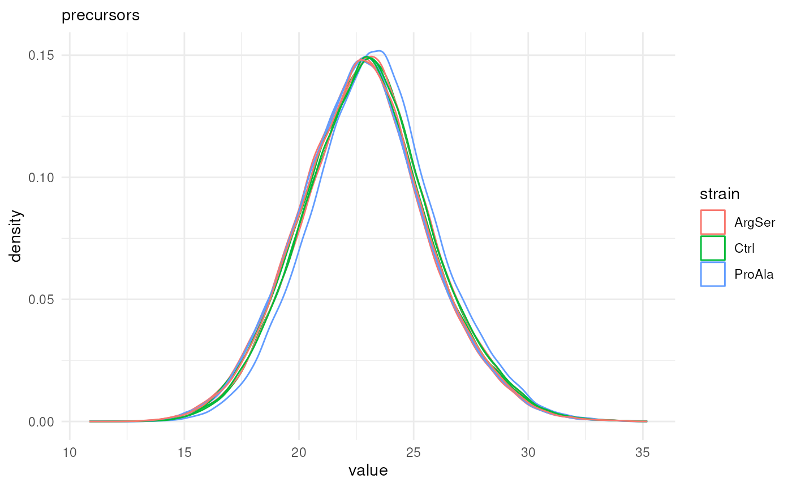

``` r

qf[, , "precursorsPTM_log"] |> #1.
  longForm(colvars = colnames(colData(qf))) |>  #2.
  data.frame() |> #3.
  filter(!is.na(value)) |> #4.
  ggplot() + #5.
  aes(x = value, 
      colour = strain,
      group = colname) + #6.
  geom_density() + #7. 
  labs(subtitle = "PTM - precursors") + #8. 
  theme_minimal() #9. 
```

    ## harmonizing input:
    ##   removing 27 sampleMap rows not in names(experiments)
    ##   removing 9 colData rownames not in sampleMap 'primary'

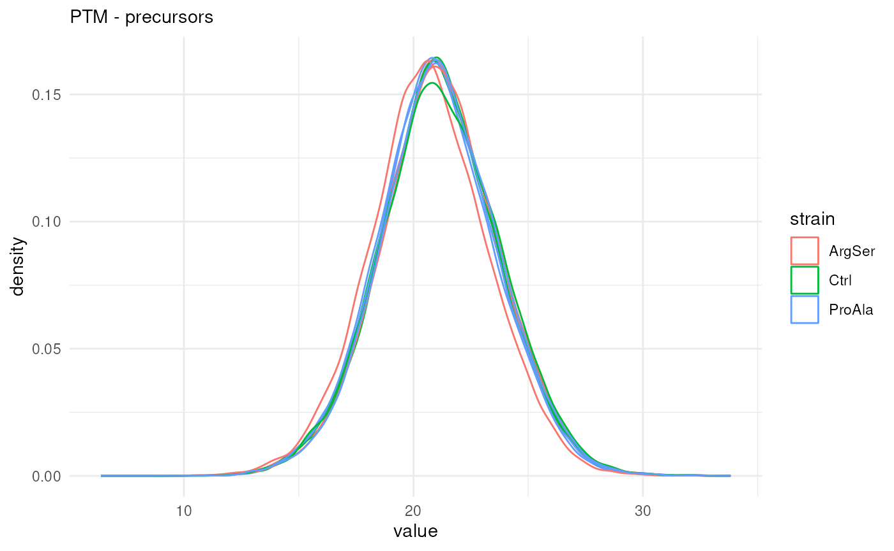

The data seems very clean. However, normalisation is still required.

We use the median of ratio normalisation, which addresses both
differences in loading as well as difference in compositionality.

- This first calculates a reference sample by using the log2 geometric
  mean, i.e.  the arithmetic mean on a log scale, for every feature.
- Subsequently log2 fold changes are calculated between each feature of
  a sample and the reference sample.
- Finally, the median of these log2 fold changes are used as the
  log2-tranformed normalisation factor.

The method is the default method for normalisation in bulk RNA-seq data
analysis with DESeq2. In our hands it performs very well in a proteomics
context.

``` r

qf <- sweep( #4. Subtract log2 norm factor column-by-column (MARGIN = 2)
  qf,
  MARGIN = 2,
  STATS = nfLogMedianOfRatios(qf,"precursors_log"),
  i = "precursors_log",
  name = "precursors_norm"
)
```

    ## This function aims to calculate norm factors on a log scale, 
    ##           the input data are assumed to be on the log-scale!

``` r

qf <- sweep( #4. Subtract log2 norm factor column-by-column (MARGIN = 2)
  qf,
  MARGIN = 2,
  STATS = nfLogMedianOfRatios(qf,"precursorsPTM_log"),
  i = "precursorsPTM_log",
  name = "precursorsPTM_norm"
)
```

    ## This function aims to calculate norm factors on a log scale, 
    ##           the input data are assumed to be on the log-scale!

We explore the effect of the global normalisation in the subsequent
plot.

Formally, the function applies the following operation on each sample
$`i`$ across all precursors $`p`$:

``` math
y_{ip}^{\text{norm}} = y_{ip} - \log_2(nf_i)
```

with $`y_ip`$ the log2-transformed intensities and $`nf_i`$ the
log2-transformed norm factor.

Upon normalisation, we can see that the distribution of the
$`y_{ip}^{\text{norm}}`$ nicely overlap (using the same code as above)

``` r

qf[, , "precursors_norm"] |>
  longForm(colvars = colnames(colData(qf))) |> 
  data.frame() |> 
  filter(!is.na(value)) |>
  ggplot() + 
  aes(x = value,
      colour = strain,
      group = colname) +
  geom_density() +
  labs(subtitle = "Median normalisation precursors") +
  theme_minimal()
```

    ## harmonizing input:
    ##   removing 45 sampleMap rows not in names(experiments)
    ##   removing 9 colData rownames not in sampleMap 'primary'

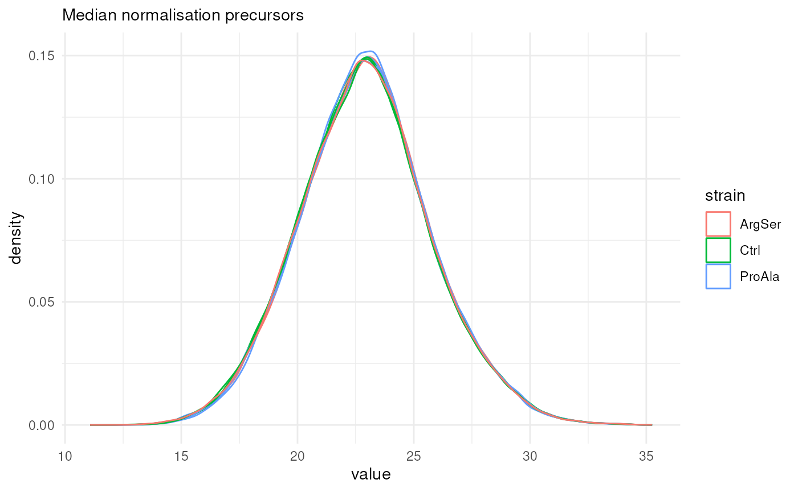

``` r

qf[, , "precursorsPTM_norm"] |>
  longForm(colvars = colnames(colData(qf))) |> 
  data.frame() |> 
  filter(!is.na(value)) |>
  ggplot() + 
  aes(x = value,
      colour = strain,
      group = colname) +
  geom_density() +
  labs(subtitle = "Median normalisation PTM precursors") +
  theme_minimal()
```

    ## harmonizing input:
    ##   removing 45 sampleMap rows not in names(experiments)
    ##   removing 9 colData rownames not in sampleMap 'primary'

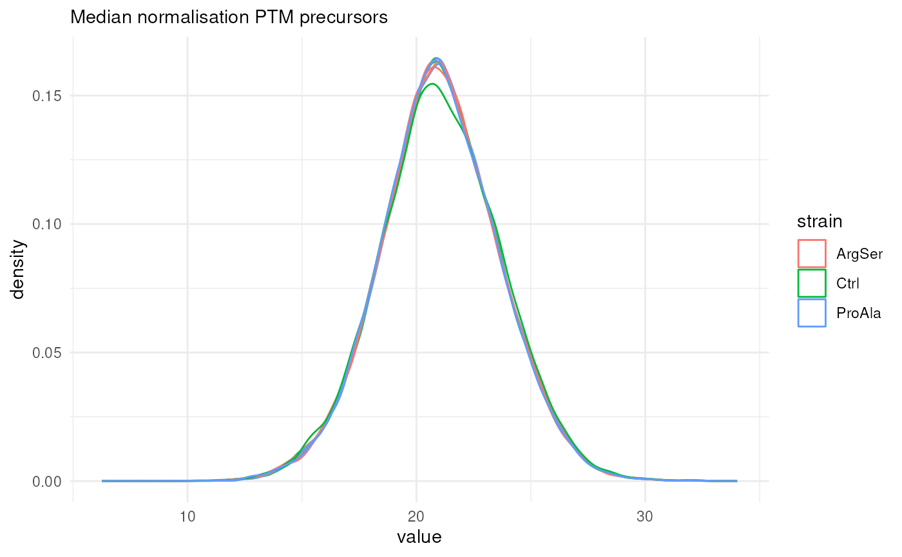

We also explore the normalisation for the common precursors.

``` r

precursorsCommon <- assay(qf[, , "precursors_log"]) |> na.exclude() |> rownames()
```

    ## harmonizing input:
    ##   removing 45 sampleMap rows not in names(experiments)
    ##   removing 9 colData rownames not in sampleMap 'primary'

``` r

qf[precursorsCommon, , "precursors_norm"] |>
  longForm(colvars = colnames(colData(qf))) |> 
  data.frame() |> 
  filter(!is.na(value)) |>
  ggplot() + 
  aes(x = value,
      colour = strain,
      group = colname) +
  geom_density() +
  theme_minimal() +
   labs(subtitle = "Median normalised log2 precursor intensities (common)")
```

    ## Warning: 'experiments' dropped; see 'drops()'

    ## harmonizing input:
    ##   removing 45 sampleMap rows not in names(experiments)
    ##   removing 9 colData rownames not in sampleMap 'primary'

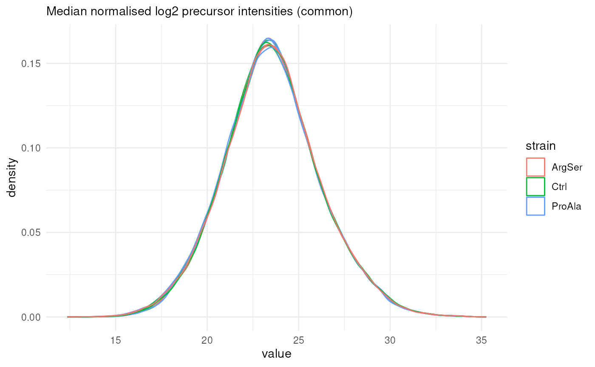

``` r

precursorsCommonPTM <- assay(qf[, , "precursorsPTM_log"]) |> na.exclude() |> rownames()
```

    ## harmonizing input:
    ##   removing 45 sampleMap rows not in names(experiments)
    ##   removing 9 colData rownames not in sampleMap 'primary'

``` r

qf[precursorsCommonPTM, , "precursorsPTM_norm"] |>
  longForm(colvars = colnames(colData(qf))) |> 
  data.frame() |> 
  filter(!is.na(value)) |>
  ggplot() + 
  aes(x = value,
      colour = strain,
      group = colname) +
  geom_density() +
  theme_minimal() +
   labs(subtitle = "Median normalised log2 precursor intensities (common)")
```

    ## Warning: 'experiments' dropped; see 'drops()'

    ## harmonizing input:
    ##   removing 45 sampleMap rows not in names(experiments)
    ##   removing 9 colData rownames not in sampleMap 'primary'

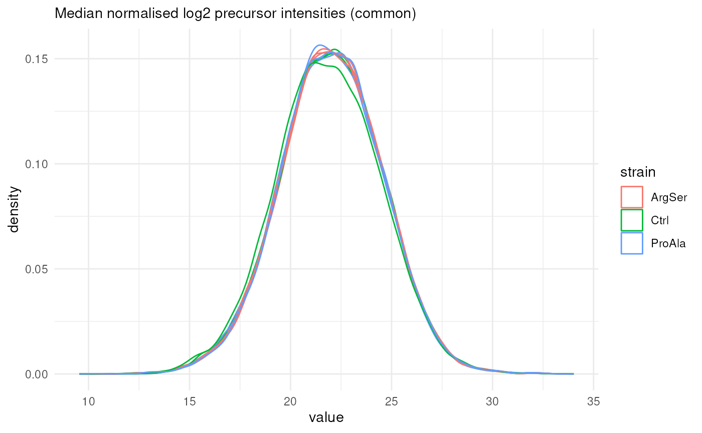

Remove temporarily objects

``` r

rm(precursorsCommon, precursorsCommonPTM)
```

``` r

#Garbage collection to free space 
gc(); gc()
```

    ##            used  (Mb) gc trigger   (Mb)  max used   (Mb)
    ## Ncells 10534893 562.7   17865211  954.2  17865211  954.2
    ## Vcells 26875710 205.1  134475152 1026.0 262547018 2003.1

    ##            used  (Mb) gc trigger  (Mb)  max used   (Mb)
    ## Ncells 10534891 562.7   17865211 954.2  17865211  954.2
    ## Vcells 26875743 205.1  107580122 820.8 262547018 2003.1

Note, that normalisation could have been avoided by using
Precursor.Normalised which is already internally normalised by DIA-NN.
However, we do not know the exact procedure for this.

This generally works well for many datasets.

In this vignette we have chosen to conduct the normalisation explicitly
ourselves using a method for which we know the underlying rationale.

### Summarisation

Here, we summarise the precursor-level data for the non-enriched runs
into protein intensities using maxLFQ, which is one of the default
methods used in DIA data analysis.

Note, that the maxLFQ implementation can become slow for large datasets.
In that case we recommend the median polish method.

- maxLFQ first calculates all pairwise log ratio’s between samples only
  using their shared precursors. Particularly, it uses the median of the
  log ratio’s between the shared precursors, i.e. 
  ``` math
  r_{ij} = median(y_{sj}-y_{si})
  ```
  .\
  Hence, it first eliminates ion effects.

- It then estimates the summaries by solving

``` math
\sum_i\sum_j(y^{prot}_j - y^{prot}_i - r_{ij})^2
```

It is implemented in the `maxLFQ` function of the `iq` package.

[`aggregateFeatures()`](https://rdrr.io/pkg/ProtGenerics/man/protgenerics.html)
in the QFeatures package streamlines summarisation. It requires the name
of a `rowData` column to group the precursors into proteins (or protein
groups), here `Protein.Group`. We provide the summarisation approach
through the `fun` argument.

The function will return a `QFeatures` object with a new set that we
called `proteins`.

Other summarisation methods are available from the `MsCoreUtils`
package, see
[`?aggregateFeatures`](https://rdrr.io/pkg/ProtGenerics/man/protgenerics.html)
for a comprehensive list.

``` r

(qf <- aggregateFeatures(
  qf, i = "precursors_norm", 
  name = "proteins",
  fcol = "Protein.Group", 
  fun = function(X) iq::maxLFQ(X)$estimate
))
```

    ##   |                                                                              |                                                                      |   0%  |                                                                              |======================================================================| 100%

    ## The following messages occurred during aggregation:

    ## 
    ## Your quantitative data contain missing values. Please read the relevant
    ## section(s) in the aggregateFeatures manual page regarding the effects
    ## of missing values on data aggregation.
    ## 
    ## Occurred during the aggregation of set(s): precursors

    ## An instance of class QFeatures (type: bulk) with 7 sets:
    ## 
    ##  [1] precursors: SummarizedExperiment with 78769 rows and 9 columns 
    ##  [2] precursorsPTM: SummarizedExperiment with 34209 rows and 9 columns 
    ##  [3] precursors_log: SummarizedExperiment with 78769 rows and 9 columns 
    ##  [4] precursorsPTM_log: SummarizedExperiment with 34209 rows and 9 columns 
    ##  [5] precursors_norm: SummarizedExperiment with 78769 rows and 9 columns 
    ##  [6] precursorsPTM_norm: SummarizedExperiment with 34209 rows and 9 columns 
    ##  [7] proteins: SummarizedExperiment with 4618 rows and 9 columns

``` r

#Garbage collection to free space 
gc(); gc()
```

    ##            used  (Mb) gc trigger  (Mb)  max used   (Mb)
    ## Ncells 10551197 563.5   17865211 954.2  17865211  954.2
    ## Vcells 27266501 208.1   86064098 656.7 262547018 2003.1

    ##            used  (Mb) gc trigger  (Mb)  max used   (Mb)
    ## Ncells 10551204 563.5   17865211 954.2  17865211  954.2
    ## Vcells 27266549 208.1   86064098 656.7 262547018 2003.1

## Data exploration and QC

Data exploration aims to highlight the main sources of variation in the
data prior to data modelling and can pinpoint to outlying or
off-behaving samples.

We first performance the QC for the Phospho-enriched runs then for the
non-enriched runs.

### Phospho-enriched runs

#### Marginal distribution at precursor level

``` r

qf[, , "precursorsPTM_norm"] |>
  longForm(colvars = colnames(colData(qf))) |> 
  data.frame() |> 
  filter(!is.na(value)) |>
  ggplot() + 
  aes(x = value,
      colour = strain,
      group = colname) +
  geom_density() +
  theme_minimal() +
   labs(subtitle = "Normalised log2 PTM precursor intensities")
```

    ## harmonizing input:
    ##   removing 54 sampleMap rows not in names(experiments)
    ##   removing 9 colData rownames not in sampleMap 'primary'

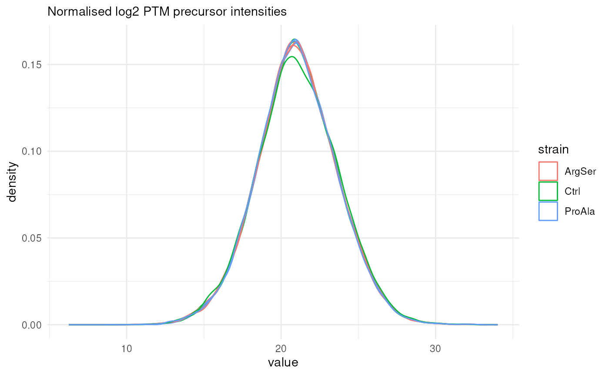

``` r

qf[, , "precursorsPTM_norm"] |>
  longForm(colvars = colnames(colData(qf))) |> 
  data.frame() |> 
  filter(!is.na(value)) |>
  ggplot() + 
  aes(x = sampleId,
      y = value,
      colour = strain,
      group = colname) +
  xlab("sample") +
  geom_boxplot() +
  theme_minimal() +
   labs(subtitle = "Normalised log2 PTM precursor intensities")
```

    ## harmonizing input:
    ##   removing 54 sampleMap rows not in names(experiments)
    ##   removing 9 colData rownames not in sampleMap 'primary'

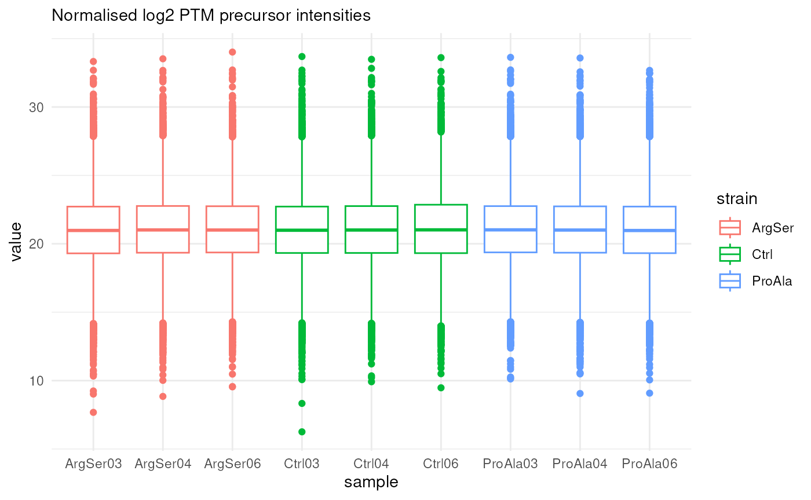

``` r

#Garbage collection to free space 
gc(); gc()
```

    ##            used  (Mb) gc trigger  (Mb)  max used   (Mb)
    ## Ncells 10580861 565.1   17865211 954.2  17865211  954.2
    ## Vcells 29000425 221.3   86064098 656.7 262547018 2003.1

    ##            used  (Mb) gc trigger  (Mb)  max used   (Mb)
    ## Ncells 10580868 565.1   17865211 954.2  17865211  954.2
    ## Vcells 29000473 221.3   86064098 656.7 262547018 2003.1

#### Charge state

``` r

qf[, , "precursorsPTM_norm"] |>
  longForm(colvars = colnames(colData(qf)), rowvars = "Precursor.Charge") |>
  as.data.frame() |>
  filter(!is.na(value)) |>
  filter(Precursor.Charge<=4) |> 
ggplot(aes(x = sampleId)) +
  geom_bar(aes(fill = factor(Precursor.Charge, levels = 4:1)),
           colour = "black") +
  labs(title = "Number of phospho-ions per sample",
       x = "Sample",
       fill = "Charge state") +
  theme_bw() + 
  theme(axis.text.x = element_text(angle = 90))
```

    ## harmonizing input:
    ##   removing 54 sampleMap rows not in names(experiments)
    ##   removing 9 colData rownames not in sampleMap 'primary'

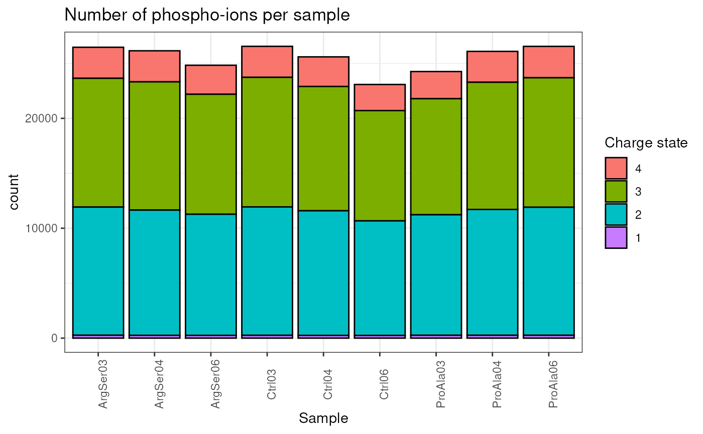

``` r

#Garbage collection to free space 
gc(); gc()
```

    ##            used  (Mb) gc trigger  (Mb)  max used   (Mb)
    ## Ncells 10588369 565.5   17865211 954.2  17865211  954.2
    ## Vcells 29106512 222.1   86064098 656.7 262547018 2003.1

    ##            used  (Mb) gc trigger  (Mb)  max used   (Mb)
    ## Ncells 10588376 565.5   17865211 954.2  17865211  954.2
    ## Vcells 29106560 222.1   86064098 656.7 262547018 2003.1

### Identifications per sample

``` r

qf[,,"precursorsPTM_norm"] |> 
  longForm(colvars = colnames(colData(qf)), 
           rowvars= c("Precursor.Id", 
                      "Protein.Group")) |>
  data.frame() |>
  filter(!is.na(value)) |>
  group_by(strain, sampleId) |>
  summarise(Precursors = length(unique(Precursor.Id)),
            `Protein Groups` = length(unique(Protein.Group))) |> 
  pivot_longer(-(1:2),
               names_to = "Feature",
               values_to = "IDs") |> 
  ggplot(aes(x = sampleId, y = IDs, fill = strain)) +
  geom_col() +
  #scale_fill_observable() +
  facet_wrap(~Feature,
             scales = "free_y") +
  labs(title = "Precursor and protein group identificiations per PTM sample",
       x = "Sample",
       y = "Identifications") +
  theme_bw() + 
  theme(axis.text.x = element_text(angle = 90))
```

    ## harmonizing input:
    ##   removing 54 sampleMap rows not in names(experiments)
    ##   removing 9 colData rownames not in sampleMap 'primary'

    ## `summarise()` has regrouped the output.
    ## ℹ Summaries were computed grouped by strain and sampleId.
    ## ℹ Output is grouped by strain.
    ## ℹ Use `summarise(.groups = "drop_last")` to silence this message.
    ## ℹ Use `summarise(.by = c(strain, sampleId))` for per-operation grouping
    ##   (`?dplyr::dplyr_by`) instead.

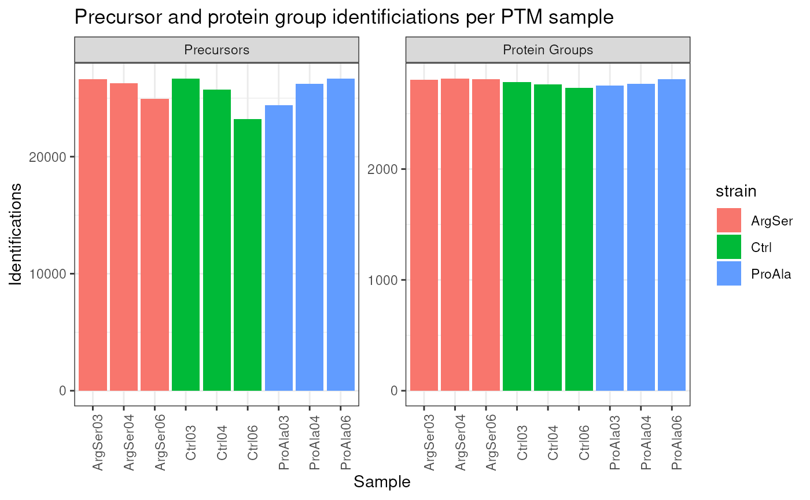

``` r

# Data Modeling (Robust Regression){#sec-modelling}
```

``` r

#Garbage collection to free space 
gc(); gc()
```

    ##            used  (Mb) gc trigger  (Mb)  max used   (Mb)
    ## Ncells 10644699 568.5   17865211 954.2  17865211  954.2
    ## Vcells 25886378 197.5   86064098 656.7 262547018 2003.1

    ##            used  (Mb) gc trigger  (Mb)  max used   (Mb)
    ## Ncells 10644679 568.5   17865211 954.2  17865211  954.2
    ## Vcells 25886381 197.5   86064098 656.7 262547018 2003.1

### Dimensionality reduction plot

A common approach for data exploration is to perform dimension
reduction, such as Multi Dimensional Scaling (MDS). We will first
extract the set to explore along the sample annotations (used for plot
colouring).

``` r

getWithColData(qf, "precursorsPTM_norm") |> 
  as("SingleCellExperiment") |> 
  runMDS(exprs_values = 1) |> 
  plotMDS(colour_by = "strain") 
```

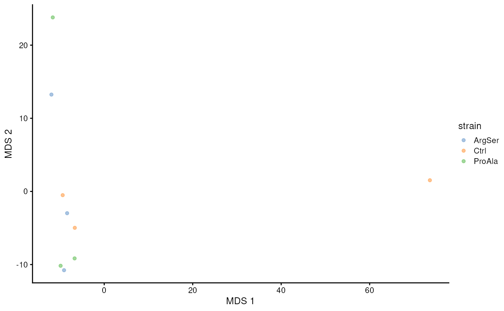

``` r

#Garbage collection to free space 
gc(); gc()
```

    ##            used  (Mb) gc trigger  (Mb)  max used   (Mb)
    ## Ncells 10666816 569.7   17865211 954.2  17865211  954.2
    ## Vcells 25952050 198.0   86064098 656.7 262547018 2003.1

    ##            used  (Mb) gc trigger  (Mb)  max used   (Mb)
    ## Ncells 10666805 569.7   17865211 954.2  17865211  954.2
    ## Vcells 25952068 198.0   86064098 656.7 262547018 2003.1

### Non-enriched runs

#### Marginal distribution at precursor and protein level

``` r

qf[, , "precursors_norm"] |>
  longForm(colvars = colnames(colData(qf))) |> 
  data.frame() |> 
  filter(!is.na(value)) |>
  ggplot() + 
  aes(x = value,
      colour = strain,
      group = colname) +
  geom_density() +
  theme_minimal() +
   labs(subtitle = "Normalised log2 precursor intensities")
```

    ## harmonizing input:
    ##   removing 54 sampleMap rows not in names(experiments)
    ##   removing 9 colData rownames not in sampleMap 'primary'

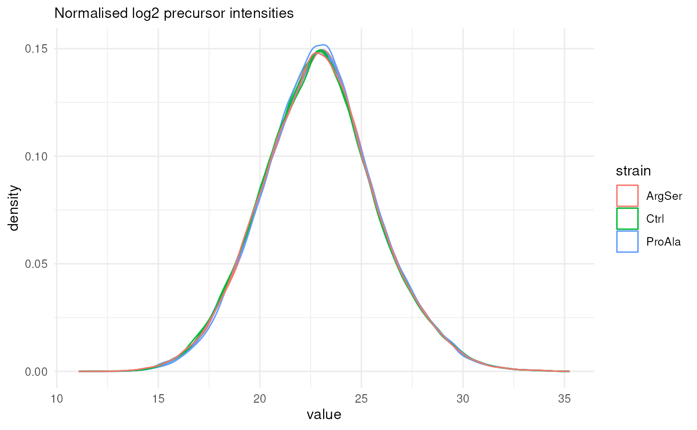

``` r

qf[, , "precursors_norm"] |>
  longForm(colvars = colnames(colData(qf))) |> 
  data.frame() |> 
  filter(!is.na(value)) |>
  ggplot() + 
  aes(x = sampleId,
      y = value,
      colour = strain,
      group = colname) +
  xlab("sample") +
  geom_boxplot() +
  theme_minimal() +
   labs(subtitle = "Normalised log2 precursor intensities")
```

    ## harmonizing input:
    ##   removing 54 sampleMap rows not in names(experiments)
    ##   removing 9 colData rownames not in sampleMap 'primary'

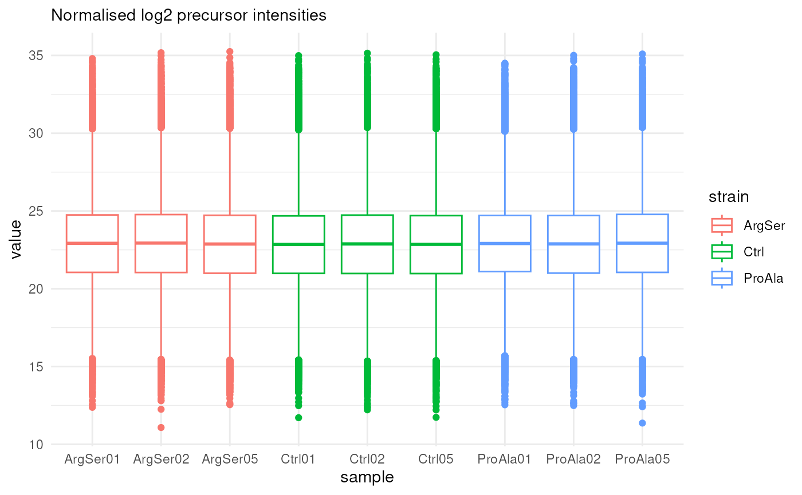

``` r

qf[, , "proteins"] |>
  longForm(colvars = colnames(colData(qf))) |> 
  data.frame() |> 
  filter(!is.na(value)) |>
  ggplot() + 
  aes(x = value,
      colour = strain,
      group = colname) +
  geom_density() +
  theme_minimal() +
   labs(subtitle = "log2 protein intensities (normalised precursors)")
```

    ## harmonizing input:
    ##   removing 54 sampleMap rows not in names(experiments)
    ##   removing 9 colData rownames not in sampleMap 'primary'

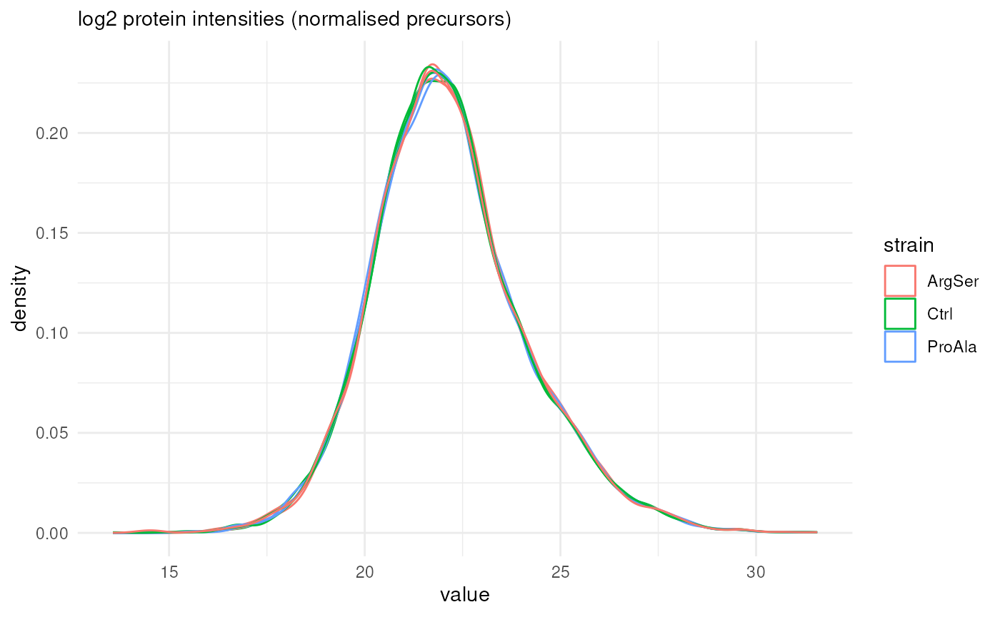

``` r

qf[, , "proteins"] |>
  longForm(colvars = colnames(colData(qf))) |> 
  data.frame() |> 
  filter(!is.na(value)) |>
  ggplot() + 
  aes(x = sampleId,
      y = value,
      colour = strain,
      group = colname) +
  xlab("sample") +
  geom_boxplot() +
  theme_minimal() +
   labs(subtitle = "log2 protein intensities (normalised precursors)")
```

    ## harmonizing input:
    ##   removing 54 sampleMap rows not in names(experiments)
    ##   removing 9 colData rownames not in sampleMap 'primary'

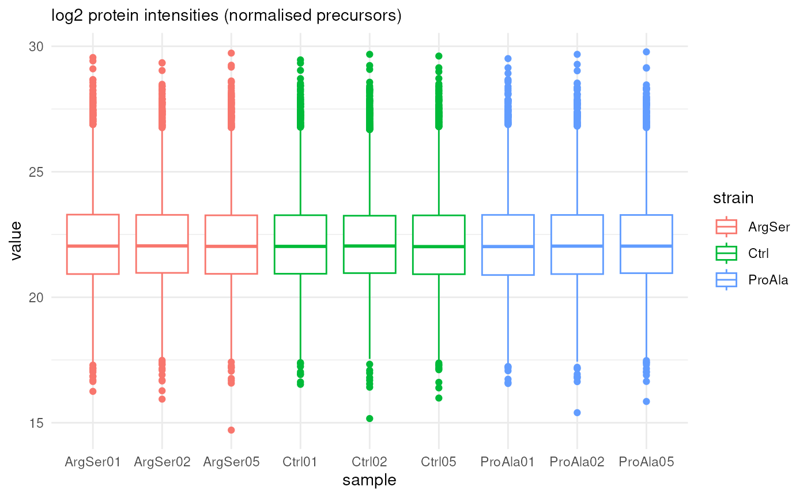

``` r

#Garbage collection to free space 
gc(); gc()
```

    ##            used  (Mb) gc trigger  (Mb)  max used   (Mb)
    ## Ncells 10667293 569.7   17865211 954.2  17865211  954.2
    ## Vcells 26508126 202.3   86064098 656.7 262547018 2003.1

    ##            used  (Mb) gc trigger  (Mb)  max used   (Mb)
    ## Ncells 10667297 569.7   17865211 954.2  17865211  954.2
    ## Vcells 26508169 202.3   86064098 656.7 262547018 2003.1

#### Charge state

``` r

qf[, , "precursors_norm"] |>
  longForm(colvars = colnames(colData(qf)), rowvars = "Precursor.Charge") |>
  as.data.frame() |>
  filter(!is.na(value)) |>
  filter(Precursor.Charge<=4) |> 
ggplot(aes(x = sampleId)) +
  geom_bar(aes(fill = factor(Precursor.Charge, levels = 4:1)),
           colour = "black") +
  labs(title = "Number of precursor ions per sample",
       x = "Sample",
       fill = "Charge state") +
  theme_bw() +
  theme(axis.text.x = element_text(angle = 90))
```

    ## harmonizing input:
    ##   removing 54 sampleMap rows not in names(experiments)
    ##   removing 9 colData rownames not in sampleMap 'primary'

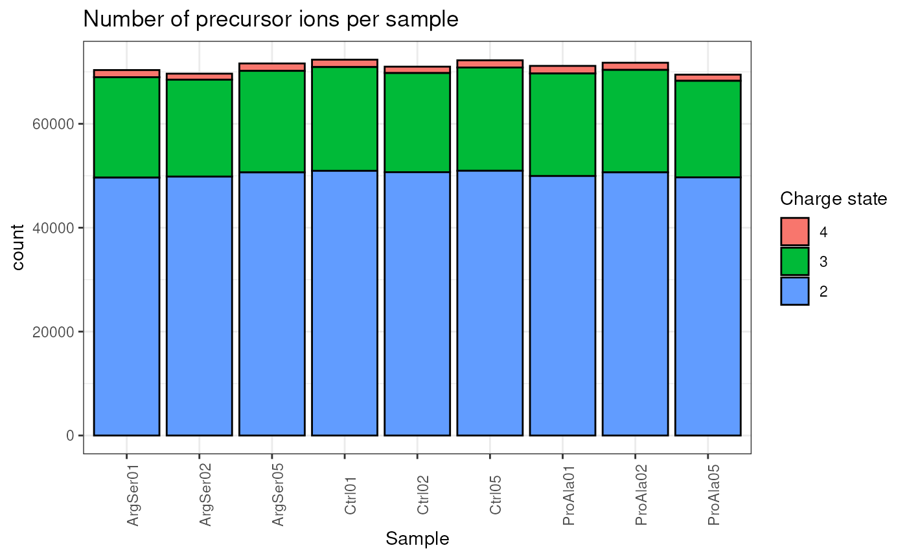

``` r

#Garbage collection to free space 
gc(); gc()
```

    ##            used  (Mb) gc trigger  (Mb)  max used   (Mb)
    ## Ncells 10667292 569.7   17865211 954.2  17865211  954.2
    ## Vcells 35242937 268.9   86064098 656.7 262547018 2003.1

    ##            used  (Mb) gc trigger  (Mb)  max used   (Mb)
    ## Ncells 10667299 569.7   17865211 954.2  17865211  954.2
    ## Vcells 35242985 268.9   86064098 656.7 262547018 2003.1

#### Identifications per sample

``` r

qf[,,"precursors_norm"] |> 
  longForm(colvars = colnames(colData(qf)), 
           rowvars= c("Precursor.Id", 
                      "Protein.Group")) |>
  data.frame() |>
  filter(!is.na(value)) |>
  group_by(strain, sampleId) |>
  summarise(Precursors = length(unique(Precursor.Id)),
            `Protein Groups` = length(unique(Protein.Group))) |> 
  pivot_longer(-(1:2),
               names_to = "Feature",
               values_to = "IDs") |> 
  ggplot(aes(x = sampleId, y = IDs, fill = strain)) +
  geom_col() +
  #scale_fill_observable() +
  facet_wrap(~Feature,
             scales = "free_y") +
  labs(title = "Precursor and protein group identificiations per sample",
       x = "Sample",
       y = "Identifications") +
  theme_bw() + 
  theme(axis.text.x = element_text(angle = 90))
```

    ## harmonizing input:
    ##   removing 54 sampleMap rows not in names(experiments)
    ##   removing 9 colData rownames not in sampleMap 'primary'

    ## `summarise()` has regrouped the output.
    ## ℹ Summaries were computed grouped by strain and sampleId.
    ## ℹ Output is grouped by strain.
    ## ℹ Use `summarise(.groups = "drop_last")` to silence this message.
    ## ℹ Use `summarise(.by = c(strain, sampleId))` for per-operation grouping
    ##   (`?dplyr::dplyr_by`) instead.

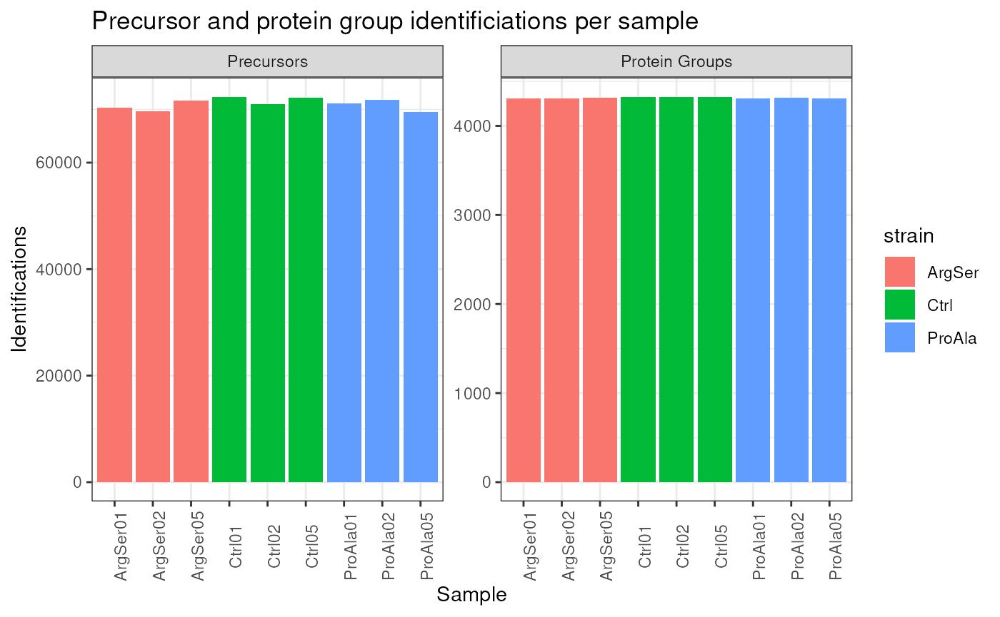

``` r

#Garbage collection to free space 
gc(); gc()
```

    ##            used  (Mb) gc trigger  (Mb)  max used   (Mb)
    ## Ncells 10667428 569.8   17865211 954.2  17865211  954.2
    ## Vcells 25937382 197.9   86064098 656.7 262547018 2003.1

    ##            used  (Mb) gc trigger  (Mb)  max used   (Mb)
    ## Ncells 10667411 569.8   17865211 954.2  17865211  954.2
    ## Vcells 25937390 197.9   86064098 656.7 262547018 2003.1

### Dimensionality reduction plot

``` r

getWithColData(qf, "proteins") |> 
  as("SingleCellExperiment") |> 
  runMDS(exprs_values = 1) |> 
  plotMDS(colour_by = "strain") 
```

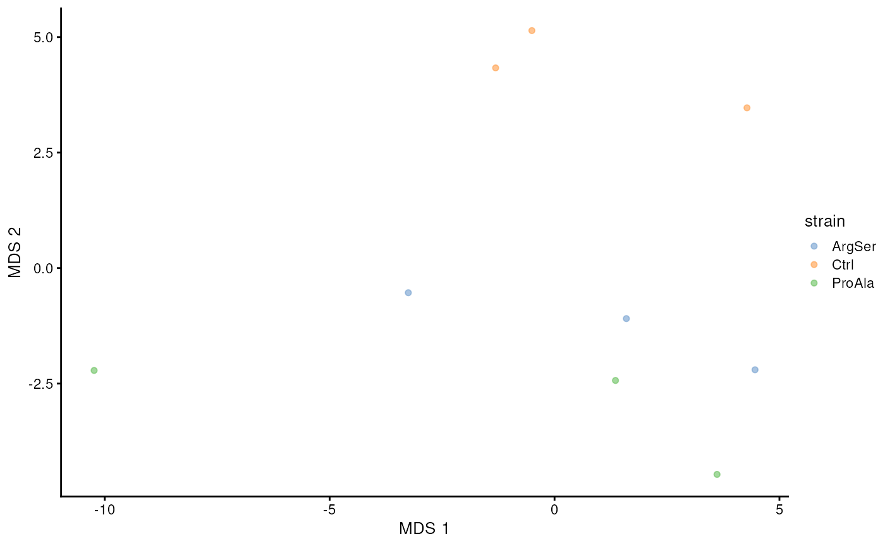

``` r

#Garbage collection to free space 
gc(); gc()
```

    ##            used  (Mb) gc trigger  (Mb)  max used   (Mb)
    ## Ncells 10666991 569.7   17865211 954.2  17865211  954.2
    ## Vcells 25938561 197.9   86064098 656.7 262547018 2003.1

    ##            used  (Mb) gc trigger  (Mb)  max used   (Mb)
    ## Ncells 10666980 569.7   17865211 954.2  17865211  954.2
    ## Vcells 25938579 197.9   86064098 656.7 262547018 2003.1

## Data Modeling at phospho-precursor-level

### Model estimation

1.  We first define the model. We only have one source of variability in
    the experiment that we can model, i.e. the effect of the strain.

2.  We fit the model to each phosphorylated precursor in the
    `precursorsPTM_norm` summarised experiment of the QFeatures object
    `qf` using the msqrob function.

``` r

model <- ~ strain
qf <- msqrob(
  qf,
  i = "precursorsPTM_norm",
  formula = model,
  robust = TRUE)
```

We enabled M-estimation (`robust = TRUE`) for improved robustness
against outliers.

``` r

#Garbage collection to free space 
gc(); gc()
```

    ##            used  (Mb) gc trigger  (Mb)  max used   (Mb)
    ## Ncells 11299148 603.5   17865211 954.2  17865211  954.2
    ## Vcells 27543173 210.2   86064098 656.7 262547018 2003.1

    ##            used  (Mb) gc trigger  (Mb)  max used   (Mb)
    ## Ncells 11299155 603.5   17865211 954.2  17865211  954.2
    ## Vcells 27543221 210.2   86064098 656.7 262547018 2003.1

### Inference

We can now convert the research question “Is the abundance of
phospho-precursors different between the strains” into a statistical
hypotheses.

In other words, we need to translate this question in a null and
alternative hypothesis on a single model parameter or a linear
combination of model parameters, which is also referred to with a
contrast.

To aid defining contrasts, we will visualise the experimental design
using the `ExploreModelMatrix` package.

``` r

vd <- ExploreModelMatrix::VisualizeDesign(
    sampleData =  colData(qf),
    designFormula = model,
    textSizeFitted = 4
)
vd$plotlist
```

    ## [[1]]

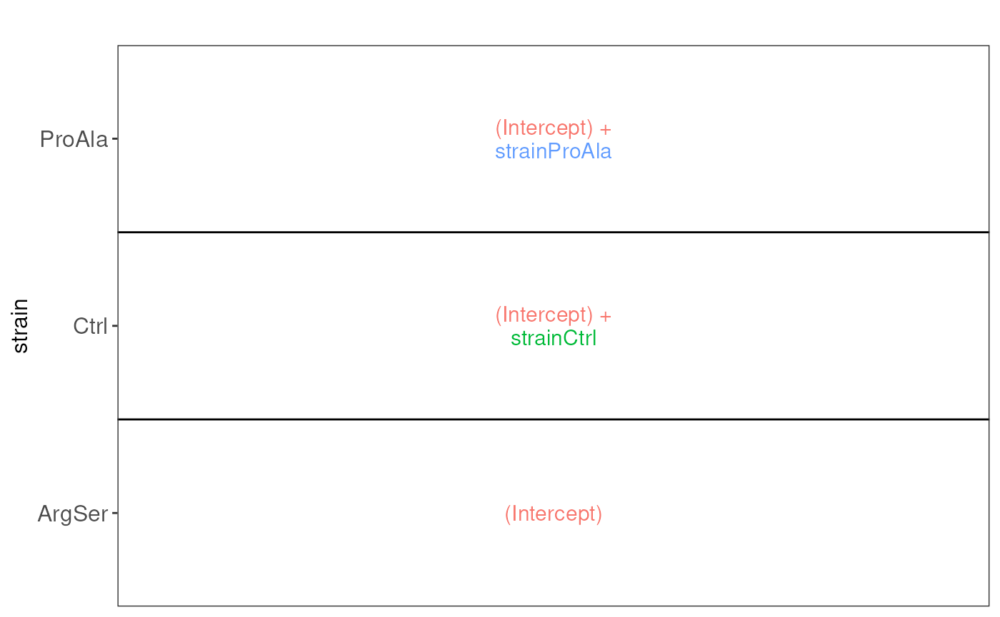

We have 3 interesting research questions related to the strain.

1.  Is a precursor DA between ArgSer strain and the WT (control)
2.  Is a precursor DA between ProAla strain and the WT (control)\
3.  Is a precursor DA between ProAla strain and the ArgSer strain.

Each of these contrasts can be translated in a log2 FC or a difference
in log2 FC and can be estimated with one or a linear combination of the
model parameters.

Below we define the contrast and construct the corresponding contrast
matrix.

We can generate the null-hypothesess for all pairwise comparisons
manually. However, here we will use the `createPairwiseContrasts`
function in `msqrob2`.

``` r

(allHypotheses <- createPairwiseContrasts(
  model, colData(qf), "strain"
  )
)
```

    ## Warning: the 'nobars' function has moved to the reformulas package. Please update your imports, or ask an upstream package maintainer to do so.
    ## This warning is displayed once per session.

    ## [1] "strainCtrl = 0"                "strainProAla = 0"             
    ## [3] "strainProAla - strainCtrl = 0"

Based on these null hypothesis we now generate the contrast matrix with
all three contrasts using the `makeContrast` function. Note, that
experienced users can also define the contrast matrix, directly.

``` r

(L <- makeContrast(
  allHypotheses,
  parameterNames = colnames(vd$designmatrix)
))
```

    ##              strainCtrl strainProAla strainProAla - strainCtrl
    ## (Intercept)           0            0                         0
    ## strainCtrl            1            0                        -1
    ## strainProAla          0            1                         1

We assess the contrast for each precursor.

``` r

qf <- hypothesisTest(qf, i = "precursorsPTM_norm", contrast = L, overwrite = TRUE)
```

We extract the results table from the `precursorsPTM_norm` summarised
experiment in the `qf` object.

``` r

inferencesPTM <- 
  msqrobCollect(qf[["precursorsPTM_norm"]], L)
```

``` r

#Garbage collection to free space 
gc(); gc()
```

    ##            used  (Mb) gc trigger  (Mb)  max used   (Mb)
    ## Ncells 11459838 612.1   17865211 954.2  17865211  954.2
    ## Vcells 30201764 230.5   86064098 656.7 262547018 2003.1

    ##            used  (Mb) gc trigger  (Mb)  max used   (Mb)
    ## Ncells 11459842 612.1   17865211 954.2  17865211  954.2
    ## Vcells 30201807 230.5   86064098 656.7 262547018 2003.1

### Report results

We report the results using a results table, volcano plots and heatmaps.

#### Results table

We use the 5% nominal FDR level to report results

``` r

alpha <- 0.05
```

``` r

for (j in colnames(L)) {

  inference <- inferencesPTM |> 
    dplyr::filter(adjPval < alpha & contrast == j)

  cat("**Median - Contrast:**", j, "= 0 (", nrow(inference),
      "significant precursors)\n\n")

  cat('<div style="max-height:300px; overflow-y:auto;">')

  print(
    kable(
      inference |>
        dplyr::arrange(pval) |>
        dplyr::relocate(feature),
      row.names = FALSE
    )
  )

  cat('</div>')

  cat("\n\n\n---\n\n")
}
```

**Median - Contrast:** strainCtrl = 0 ( 1 significant precursors)

| feature | logFC | se | df | t | pval | adjPval | contrast |
|:---|---:|---:|---:|---:|---:|---:|:---|
| IGDS(UniMod:21)LQGSPQR2 | -2.907071 | 0.1393496 | 6.823797 | -20.86171 | 2e-07 | 0.0045824 | strainCtrl |

------------------------------------------------------------------------

**Median - Contrast:** strainProAla = 0 ( 4 significant precursors)

| feature | logFC | se | df | t | pval | adjPval | contrast |
|:---|---:|---:|---:|---:|---:|---:|:---|
| AVQES(UniMod:21)DS(UniMod:21)TTS(UniMod:21)RIIEEHESPIDAEK3 | -3.860267 | 0.1557383 | 5.826762 | -24.78688 | 4.0e-07 | 0.0092686 | strainProAla |
| S(UniMod:21)DSEVNQEAKPEVK3 | 1.921745 | 0.1343868 | 6.342927 | 14.30010 | 4.6e-06 | 0.0467721 | strainProAla |
| NTSYQES(UniMod:21)PGLQERPK3 | -1.113769 | 0.1049216 | 7.826762 | -10.61525 | 6.4e-06 | 0.0467721 | strainProAla |
| (UniMod:1)SDS(UniMod:21)EVNQEAKPEVK2 | 2.002423 | 0.1433679 | 6.038833 | 13.96702 | 8.0e-06 | 0.0467721 | strainProAla |

------------------------------------------------------------------------

**Median - Contrast:** strainProAla - strainCtrl = 0 ( 19 significant
precursors)

| feature | logFC | se | df | t | pval | adjPval | contrast |
|:---|---:|---:|---:|---:|---:|---:|:---|
| IGDS(UniMod:21)LQGSPQR2 | 3.0414472 | 0.1557899 | 6.823797 | 19.522750 | 3.00e-07 | 0.0054041 | strainProAla - strainCtrl |
| AVQES(UniMod:21)DS(UniMod:21)TTS(UniMod:21)RIIEEHESPIDAEK3 | -3.7465156 | 0.1557383 | 5.826762 | -24.056476 | 5.00e-07 | 0.0054041 | strainProAla - strainCtrl |
| GQVVSEEQRPGT(UniMod:21)PLFTVK3 | 2.2682125 | 0.1336666 | 6.779026 | 16.969186 | 8.00e-07 | 0.0064050 | strainProAla - strainCtrl |
| (UniMod:1)SDS(UniMod:21)EVNQEAKPEVK2 | 2.0997487 | 0.1203906 | 6.038833 | 17.441138 | 2.10e-06 | 0.0123465 | strainProAla - strainCtrl |
| (UniMod:1)SDEEHTFENADAGAS(UniMod:21)ATYPMQC(UniMod:4)SALR4 | -7.2887717 | 0.4604139 | 5.736513 | -15.830911 | 5.90e-06 | 0.0233619 | strainProAla - strainCtrl |
| VDIIANDQGNRT(UniMod:21)TPSFVAFTDTER3 | 1.4613762 | 0.1367441 | 7.826762 | 10.686943 | 6.10e-06 | 0.0233619 | strainProAla - strainCtrl |
| S(UniMod:21)DSEVNQEAKPEVK3 | 1.8128444 | 0.1489254 | 6.342927 | 12.172839 | 1.24e-05 | 0.0392179 | strainProAla - strainCtrl |
| LTNMPFGGNPTANQSGS(UniMod:21)GNSLFGTK3 | -2.4850090 | 0.2265396 | 6.646603 | -10.969426 | 1.68e-05 | 0.0392179 | strainProAla - strainCtrl |
| LIDENATENGLAGS(UniMod:21)PKDEDGIIM(UniMod:35)TNK3 | -3.5131571 | 0.2707854 | 5.765748 | -12.973952 | 1.74e-05 | 0.0392179 | strainProAla - strainCtrl |
| NTSYQES(UniMod:21)PGLQERPK3 | -0.9528266 | 0.1049216 | 7.826762 | -9.081320 | 2.00e-05 | 0.0392179 | strainProAla - strainCtrl |
| PHTPFIS(UniMod:21)KLNTHQDSSYLSPNT(UniMod:21)TST(UniMod:21)TTPSNNNSNSNQAK4 | 3.8675421 | 0.2460948 | 4.826762 | 15.715662 | 2.49e-05 | 0.0392179 | strainProAla - strainCtrl |
| RAT(UniMod:21)YAGFLLADPK3 | 2.5531200 | 0.2564607 | 6.826762 | 9.955209 | 2.60e-05 | 0.0392179 | strainProAla - strainCtrl |
| RGQVVSEEQRPGT(UniMod:21)PLFTVK3 | 1.8197408 | 0.2057852 | 7.695480 | 8.842913 | 2.69e-05 | 0.0392179 | strainProAla - strainCtrl |
| TTPSFVAFT(UniMod:21)DTER2 | 1.2275840 | 0.1377368 | 7.598572 | 8.912537 | 2.75e-05 | 0.0392179 | strainProAla - strainCtrl |
| TT(UniMod:21)PSFVAFTDTER2 | 1.3146921 | 0.1515195 | 7.826293 | 8.676717 | 2.77e-05 | 0.0392179 | strainProAla - strainCtrl |
| S(UniMod:21)DSEVNQEAKPEVK2 | 2.0603552 | 0.2182683 | 7.086695 | 9.439554 | 2.89e-05 | 0.0392179 | strainProAla - strainCtrl |
| NIAPPPT(UniMod:21)T(UniMod:21)SVSAPS(UniMod:21)TPTLSSSSQMANMASPSTDNGDNEEK4 | -5.8974392 | 0.5097645 | 5.826762 | -11.568948 | 3.08e-05 | 0.0392179 | strainProAla - strainCtrl |
| RFS(UniMod:21)QHSS(UniMod:21)MLINNPATPNQK3 | 4.5073908 | 0.2202057 | 4.021668 | 20.469003 | 3.23e-05 | 0.0392179 | strainProAla - strainCtrl |
| ETVES(UniMod:21)ESSQTALSK2 | 0.9869042 | 0.1087065 | 7.253952 | 9.078612 | 3.24e-05 | 0.0392179 | strainProAla - strainCtrl |

------------------------------------------------------------------------

#### Volcanoplots

``` r

plotVolcano(inferencesPTM) + 
  facet_wrap(~contrast) + 
  labs(title = "Precursor-level Phospho DA")
```

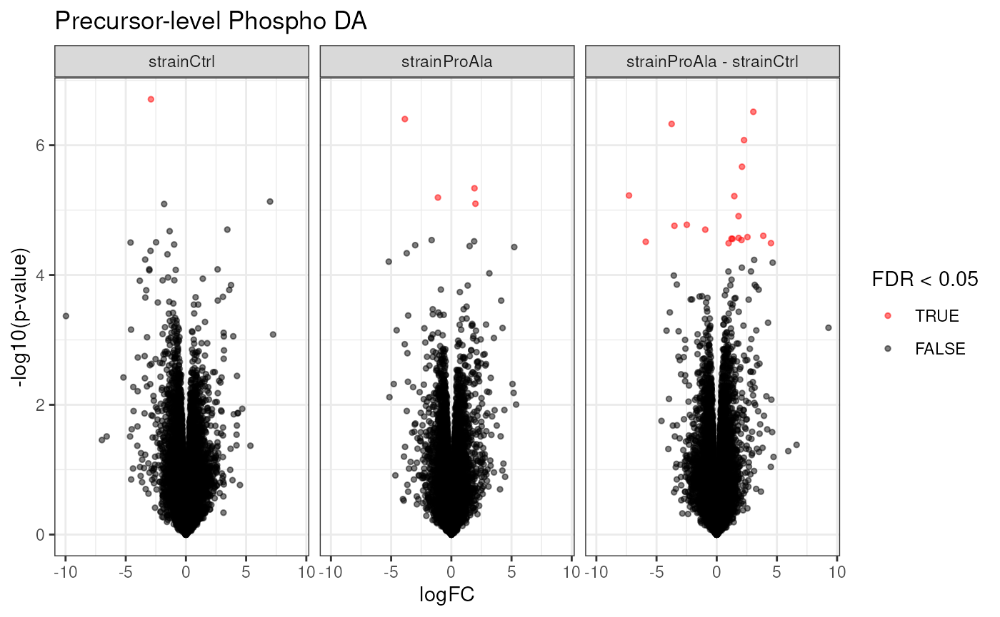

``` r

inferencesPTM |> 
  filter(adjPval < alpha) |> 
  mutate(DA = sign(logFC) |> as.factor() |> recode("-1"= "down","1" = "up")) |>
  group_by(contrast, DA) |> 
  ggplot(aes(x = contrast)) +
  geom_bar(aes(fill = factor(DA)),
           colour = "black") +
  theme_minimal() +
  theme(axis.text.x = element_text(angle = 90))
```

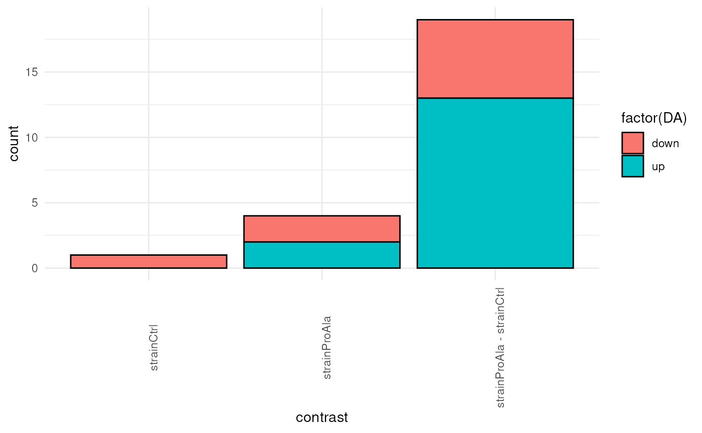

#### Heatmaps

We will make a heatmap for each contrast. Note that we cluster the rows
ourselves to avoid issues with missing values.

``` r

lapply(colnames(L),
                   function(contrast, se, alpha)
                   {
                     sig <- rowData(se)[[contrast]] |> 
                       filter(adjPval < alpha) |> 
                       rownames()
                     if (length(sig) > 2)
                     {
                     quants <- t(scale(t(assay(se[sig,]))))
                     colnames(quants) <- se$sampleId #specific to this dataset to get short colnames
                     rowclushlp <- quants
                     rowclushlp[is.na(rowclushlp)] <- min(quants,na.rm=TRUE) - 2
                     rowclus <- hclust(dist(rowclushlp))
                     annotations <- columnAnnotation(
                       group = se$strain
                       ) #3.
                     set.seed(1234) ## annotation colours are randomly generated by default
                     return(
                       Heatmap(show_row_names = FALSE,
                       quants, 
                       name = "log2 intensity",
                       top_annotation = annotations, 
                       column_title = paste0(contrast, " = 0"),
                       cluster_rows = rowclus
                       )
                     )
                     } else return(ggplot() + theme_minimal() + ggtitle(paste0(contrast, " = 0")))
                   },
                   se = getWithColData(qf, "precursorsPTM_norm"),
                   alpha = alpha)
```

    ## [[1]]


    ## 
    ## [[2]]

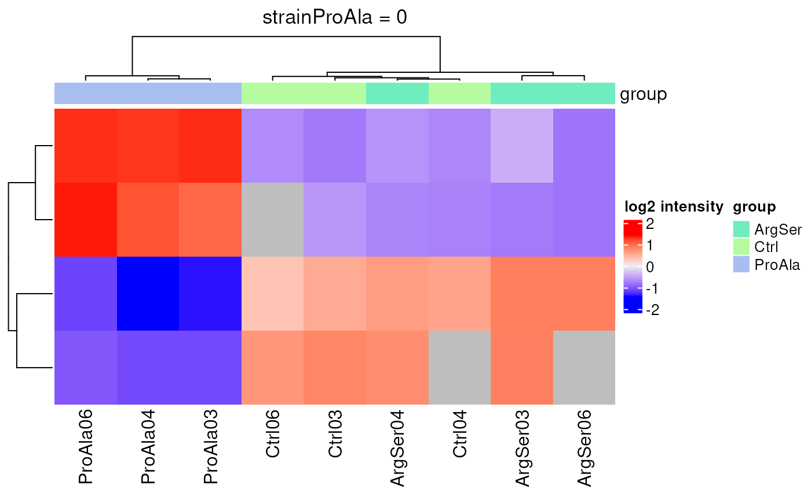

    ## 
    ## [[3]]

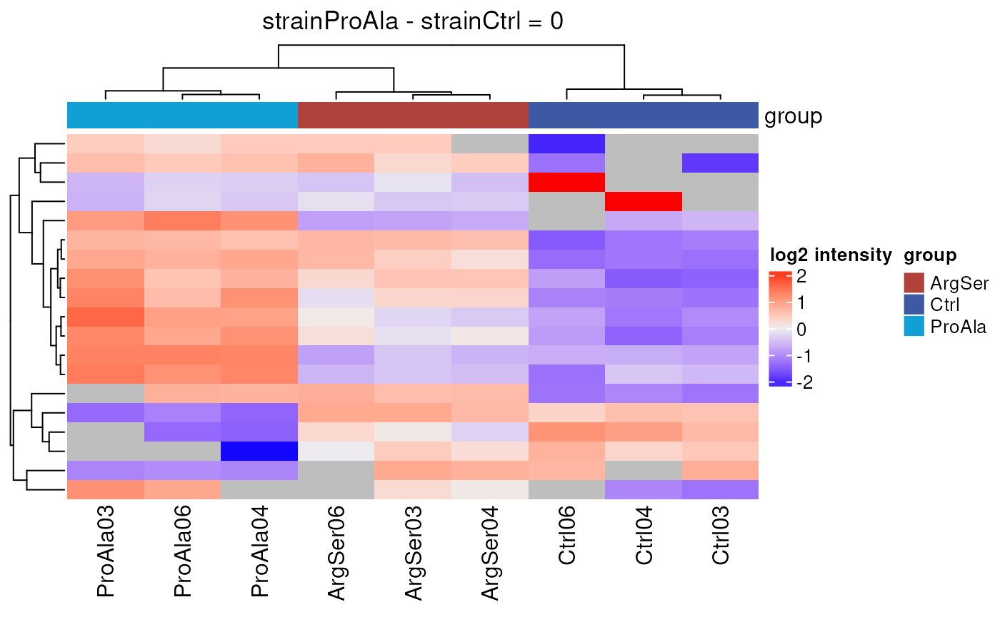

``` r

#Garbage collection to free space 
gc(); gc()
```

    ##            used (Mb) gc trigger  (Mb)  max used   (Mb)
    ## Ncells 11682377  624   17865211 954.2  17865211  954.2
    ## Vcells 30660624  234   86064098 656.7 262547018 2003.1

    ##            used (Mb) gc trigger  (Mb)  max used   (Mb)
    ## Ncells 11682387  624   17865211 954.2  17865211  954.2
    ## Vcells 30660676  234   86064098 656.7 262547018 2003.1

#### Detail plots

We can explore the data for a precursor to validate the statistical
inference results. For example, let’s explore the precursor and the
normalised precursor intensities for the precursor with the most
significant log2 fold change.

``` r

(target_feature <- inferencesPTM |> 
   dplyr::slice(which.min(pval)) |> 
   pull(feature)
)
```

    ## [1] "IGDS(UniMod:21)LQGSPQR2"

``` r

inferencesPTM |> 
  filter(feature == target_feature)
```

    ##                                                        logFC        se       df
    ## strainCtrl.IGDS(UniMod:21)LQGSPQR2                -2.9070713 0.1393496 6.823796
    ## strainProAla.IGDS(UniMod:21)LQGSPQR2               0.1343759 0.1557591 6.823796
    ## strainProAla - strainCtrl.IGDS(UniMod:21)LQGSPQR2  3.0414472 0.1557899 6.823796
    ##                                                            t         pval
    ## strainCtrl.IGDS(UniMod:21)LQGSPQR2                -20.861711 1.955531e-07
    ## strainProAla.IGDS(UniMod:21)LQGSPQR2                0.862716 4.175794e-01
    ## strainProAla - strainCtrl.IGDS(UniMod:21)LQGSPQR2  19.522750 3.054750e-07
    ##                                                       adjPval
    ## strainCtrl.IGDS(UniMod:21)LQGSPQR2                0.004582395
    ## strainProAla.IGDS(UniMod:21)LQGSPQR2              0.986318960
    ## strainProAla - strainCtrl.IGDS(UniMod:21)LQGSPQR2 0.005404076
    ##                                                                    contrast
    ## strainCtrl.IGDS(UniMod:21)LQGSPQR2                               strainCtrl
    ## strainProAla.IGDS(UniMod:21)LQGSPQR2                           strainProAla
    ## strainProAla - strainCtrl.IGDS(UniMod:21)LQGSPQR2 strainProAla - strainCtrl
    ##                                                                   feature
    ## strainCtrl.IGDS(UniMod:21)LQGSPQR2                IGDS(UniMod:21)LQGSPQR2
    ## strainProAla.IGDS(UniMod:21)LQGSPQR2              IGDS(UniMod:21)LQGSPQR2
    ## strainProAla - strainCtrl.IGDS(UniMod:21)LQGSPQR2 IGDS(UniMod:21)LQGSPQR2

To obtain the required data, we perform a little data manipulation
pipeline:

- We use the QFeatures subsetting functionality to retrieve all data
  related to ion data used for model fitting.
- We then convert the data with longForm() for plotting.
- Finally, we plot the log2 normalised intensities for each sample for
  the unnormalised and normalised phospho precursors.

``` r

qf[target_feature, , c("precursorsPTM_log","precursorsPTM_norm")] |> #1
  longForm(colvars = colnames(colData(qf))) |> #2
  data.frame() |> 
  ggplot() +
  aes(x = sampleId,
      y = value) +
  geom_line(aes(group = rowname), linewidth = 0.1) +
  geom_point(aes(colour = strain)) +
  facet_wrap(~ assay, scales = "free") +
  ggtitle(target_feature) +
  theme_minimal() +
  theme(axis.text.x = element_blank())
```

    ## Warning: 'experiments' dropped; see 'drops()'

    ## harmonizing input:
    ##   removing 45 sampleMap rows not in names(experiments)
    ##   removing 9 colData rownames not in sampleMap 'primary'

    ## Warning: Removed 2 rows containing missing values or values outside the scale range
    ## (`geom_point()`).

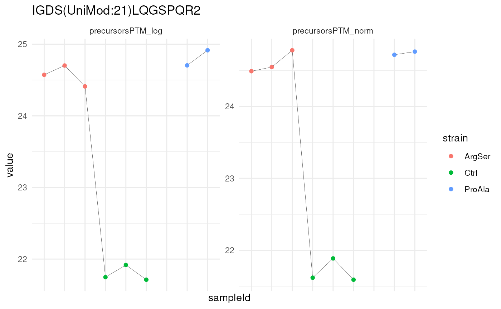

``` r

qf[target_feature, , c("precursorsPTM_log","precursorsPTM_norm")] |> #1
  longForm(colvars = colnames(colData(qf))) |> #2
  data.frame() |>
  filter(!is.na(value)) %>% 
  {
  ggplot(.) +
  aes(x = strain,
      y = value) +
  geom_boxplot(aes(colour = strain)) +
  facet_wrap(~ assay, scales = "free") +
  geom_jitter(aes(shape = rowname)) +
  scale_shape_manual(values = seq_len(dplyr::n_distinct(.$rowname))) +
  ggtitle(target_feature) +
  theme_minimal() +
  theme(axis.text.x = element_blank()) +
  guides(shape = "none")
  }
```

    ## Warning: 'experiments' dropped; see 'drops()'

    ## harmonizing input:
    ##   removing 45 sampleMap rows not in names(experiments)
    ##   removing 9 colData rownames not in sampleMap 'primary'

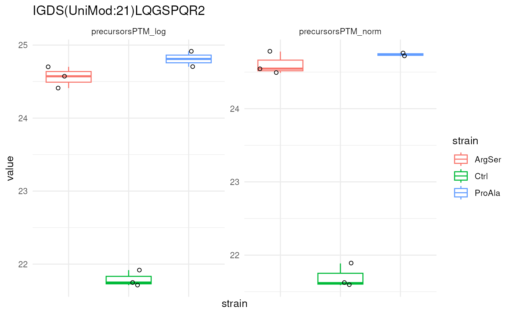

We now compare the intensities for the top 5 DA phospo-precursors for
the first contrast to these of their corresponding protein in the
non-enriched assay.

``` r

contr = colnames(L)[1]
top5 <- inferencesPTM |> 
  filter(contrast == contr) |> 
  arrange(pval) |> 
  head(n = 5) |> 
  pull(feature)

for (feat in top5)
{
  ptm_data <- qf[,,c("precursorsPTM_norm")] |> 
    longForm(colvars = colnames(colData(qf)), rowvars = "Protein.Group") |>
    data.frame() |> 
    filter(rowname==feat)
  feature_protein <- ptm_data |> 
    pull("Protein.Group") |> 
    unique()
  prot_data <- qf[,,"proteins"]|>
    longForm(colvars = colnames(colData(qf)), rowvars = "Protein.Group") |>
    data.frame() |> 
    filter(Protein.Group==feature_protein) 
  ptm_protein <- rbind(ptm_data, prot_data)
  ylims <- ptm_protein |> 
  group_by(assay) |> 
  summarise(cent = mean(range(value,na.rm=TRUE)), ampl = diff(range(value,na.rm=TRUE))) |> 
  mutate(lower = cent - max(ampl)/2, 
         upper = cent + max(ampl)/2) |> 
  select(-c(cent, ampl))
  
  comparison_plot <- ptm_protein |>
    ggplot() +
    aes(x = sampleId,
        y = value) +
    geom_line(aes(group = rowname), linewidth = 0.1) +
    geom_point(aes(colour = strain)) +
    facet_wrap(~ assay, scales = "free") +
    labs(
      title = paste0(feat," / ", feature_protein)
    ) +
    theme_minimal() +
    theme(axis.text.x = element_blank()) +
    ggh4x::facetted_pos_scales(
    y = list(
      assay == ylims$assay[1] ~ scale_y_continuous(limits = unlist(ylims[1,c("lower","upper")])),
      assay == ylims$assay[2] ~ scale_y_continuous(limits = unlist(ylims[2,c("lower","upper")]))
    )
    ) 
 print(comparison_plot)
}
```

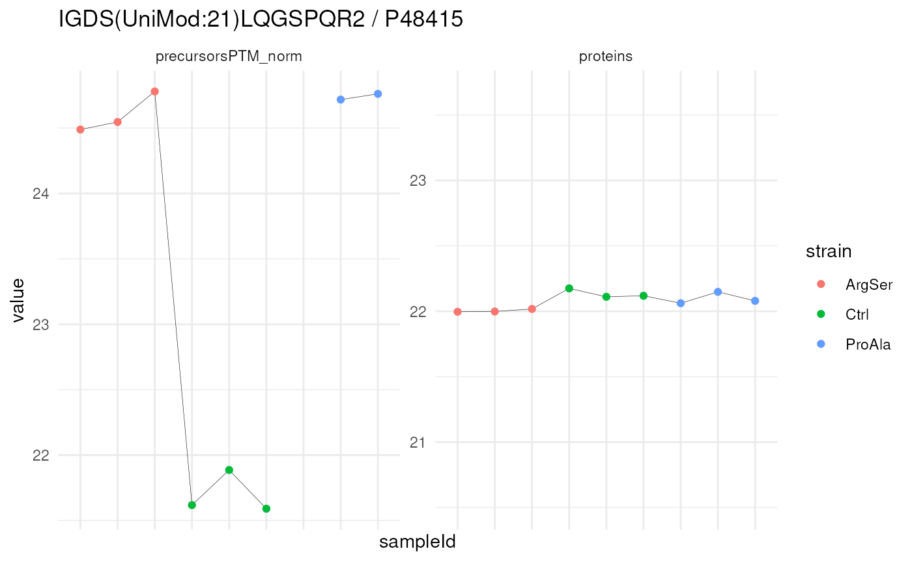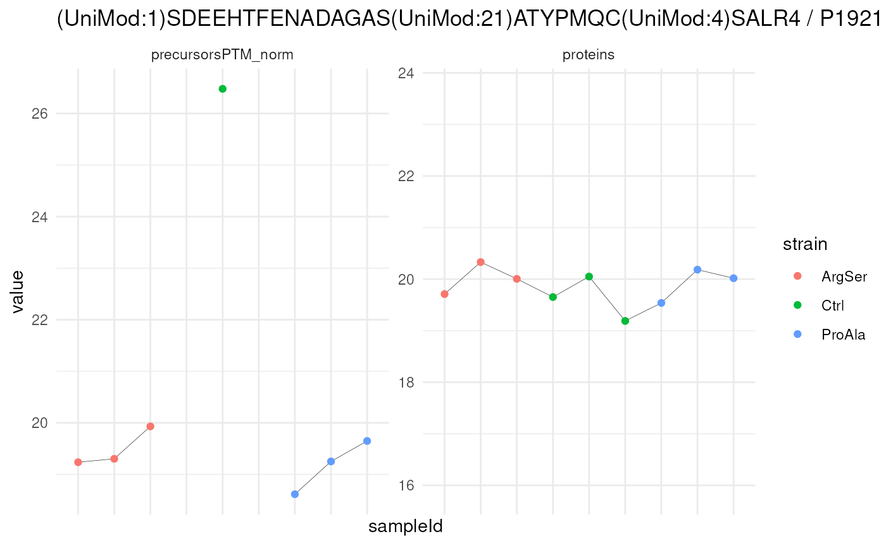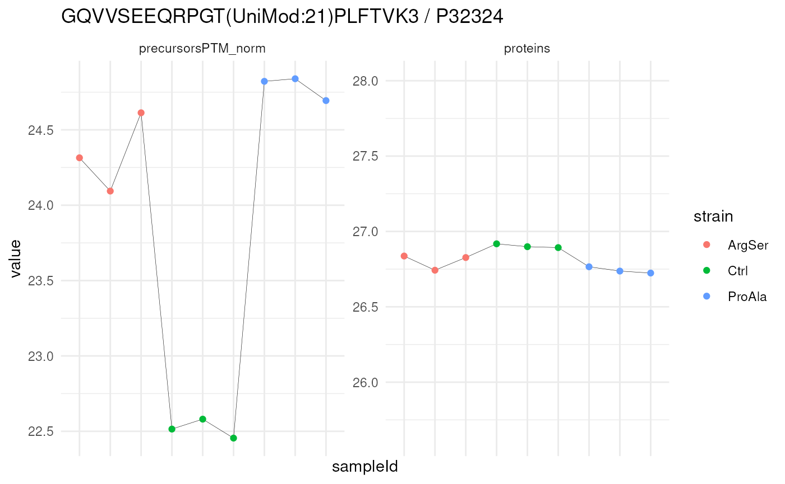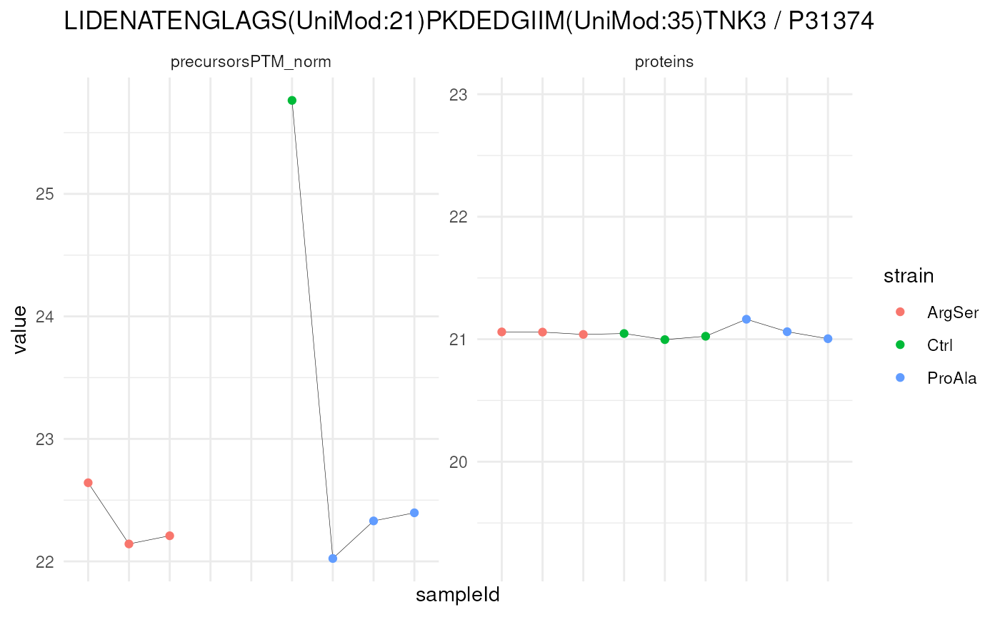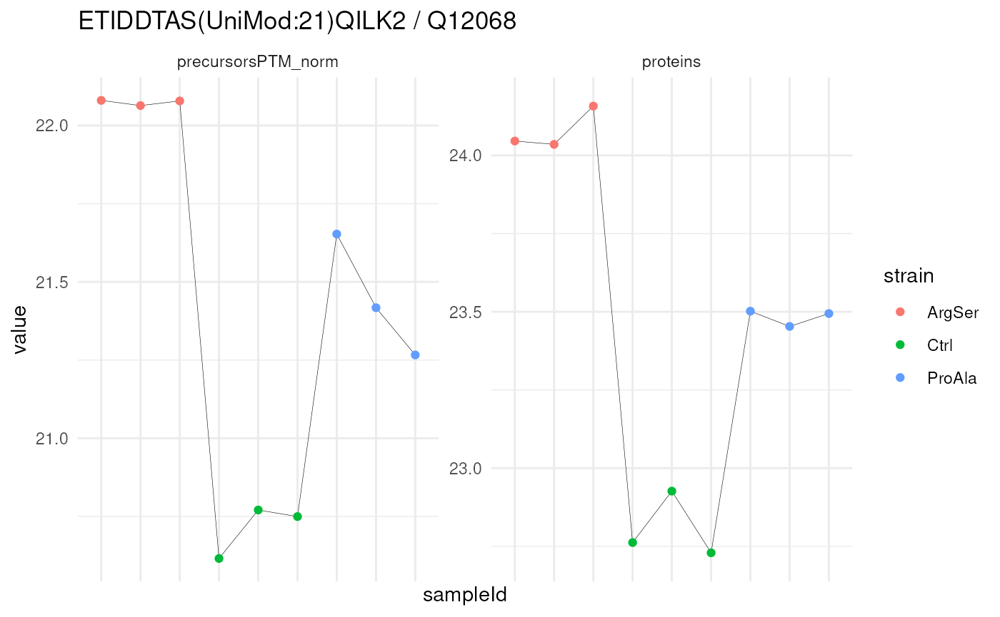

We prioritised DA phospho-precursors. However, they might be DA due to
the parent proteins on which the PTMs occur that can also change in
abundance regardless of the modification. Any changes in the abundance
of a phospho-peptidoform can thus be confounded with changes in protein
abundance.

We therefore assess differential abundance at the protein level for the
non-enriched samples.

``` r

#Garbage collection to free space 
gc(); gc()
```

    ##            used  (Mb) gc trigger  (Mb)  max used   (Mb)
    ## Ncells 11697327 624.8   17865211 954.2  17865211  954.2
    ## Vcells 30688572 234.2   86064098 656.7 262547018 2003.1

    ##            used  (Mb) gc trigger  (Mb)  max used   (Mb)
    ## Ncells 11697328 624.8   17865211 954.2  17865211  954.2
    ## Vcells 30688610 234.2   86064098 656.7 262547018 2003.1

## Data Modeling at protein-level (non-enriched samples)

### Model estimation

We can use the same model to model the protein-level data of the
non-enriched runs. Indeed, they stem from the same biological samples.

``` r

qf <- msqrob(
  qf,
  i = "proteins",
  formula = model,
  robust = TRUE)
```

We enabled M-estimation (`robust = TRUE`) for improved robustness
against outliers.

``` r

#Garbage collection to free space 
gc(); gc()
```

    ##            used  (Mb) gc trigger  (Mb)  max used   (Mb)
    ## Ncells 11794290 629.9   17865211 954.2  17865211  954.2
    ## Vcells 30968291 236.3   86064098 656.7 262547018 2003.1

    ##            used  (Mb) gc trigger  (Mb)  max used   (Mb)
    ## Ncells 11794297 629.9   17865211 954.2  17865211  954.2
    ## Vcells 30968339 236.3   86064098 656.7 262547018 2003.1

### Inference

We assess the contrast for each protein.

``` r

qf <- hypothesisTest(qf, i = "proteins", contrast = L, overwrite = TRUE)
```

We extract the results table from the `proteins` summarised experiment
in the `qf` object.

``` r

inferences <- 
  msqrobCollect(qf[["proteins"]], L)
```

``` r

#Garbage collection to free space 
gc(); gc()
```

    ##            used  (Mb) gc trigger  (Mb)  max used   (Mb)
    ## Ncells 11808423 630.7   17865211 954.2  17865211  954.2
    ## Vcells 31256743 238.5   86064098 656.7 262547018 2003.1

    ##            used  (Mb) gc trigger  (Mb)  max used   (Mb)
    ## Ncells 11808427 630.7   17865211 954.2  17865211  954.2
    ## Vcells 31256786 238.5   86064098 656.7 262547018 2003.1

### Report results

We report the results using a results table, volcano plots and heatmaps.

#### Results table

``` r

for (j in colnames(L)) {

  inference <- inferences |> 
    dplyr::filter(adjPval < alpha & contrast == j)

  cat("**Median - Contrast:**", j, "= 0 (", nrow(inference),
      "significant proteins)\n\n")

  cat('<div style="max-height:300px; overflow-y:auto;">')

  print(
    kable(
      inference |>
        dplyr::arrange(pval) |>
        dplyr::relocate(feature),
      row.names = FALSE
    )
  )

  cat('</div>')

  cat("\n\n\n---\n\n")
}
```

**Median - Contrast:** strainCtrl = 0 ( 97 significant proteins)

| feature |      logFC |        se |       df |          t |      pval |   adjPval | contrast   |
|:--------|-----------:|----------:|---------:|-----------:|----------:|----------:|:-----------|
| Q12068  | -1.2858668 | 0.0623825 | 7.856600 | -20.612626 | 0.0000000 | 0.0001823 | strainCtrl |
| P10591  | -0.6416910 | 0.0542390 | 7.820147 | -11.830802 | 0.0000029 | 0.0045931 | strainCtrl |
| P31539  | -0.4652723 | 0.0401815 | 7.715114 | -11.579276 | 0.0000038 | 0.0045931 | strainCtrl |
| P07264  |  0.4799705 | 0.0427679 | 7.731417 |  11.222691 | 0.0000047 | 0.0045931 | strainCtrl |
| P38260  | -0.4671770 | 0.0427232 | 7.801418 | -10.934961 | 0.0000053 | 0.0045931 | strainCtrl |
| P53912  | -0.7352203 | 0.0714466 | 8.130153 | -10.290482 | 0.0000061 | 0.0045931 | strainCtrl |
| P32644  | -0.4696154 | 0.0458452 | 7.947719 | -10.243507 | 0.0000074 | 0.0048135 | strainCtrl |
| P40008  | -0.3710818 | 0.0382674 | 8.130153 |  -9.697072 | 0.0000095 | 0.0054028 | strainCtrl |
| P38113  |  0.4949495 | 0.0528844 | 8.130153 |   9.359084 | 0.0000125 | 0.0060795 | strainCtrl |
| P40989  | -0.7668185 | 0.0754185 | 7.336839 | -10.167519 | 0.0000139 | 0.0060795 | strainCtrl |
| P08432  |  0.6956696 | 0.0673988 | 7.091172 |  10.321686 | 0.0000159 | 0.0060795 | strainCtrl |
| Q08422  | -0.4928202 | 0.0497299 | 7.311441 |  -9.909933 | 0.0000169 | 0.0060795 | strainCtrl |
| P03965  |  0.3706311 | 0.0402188 | 7.837836 |   9.215379 | 0.0000178 | 0.0060795 | strainCtrl |
| P34227  | -0.4795084 | 0.0541277 | 8.130153 |  -8.858834 | 0.0000188 | 0.0060795 | strainCtrl |
| P23337  |  0.7683919 | 0.0868942 | 8.016955 |   8.842842 | 0.0000208 | 0.0062846 | strainCtrl |
| Q12449  | -0.4237772 | 0.0510449 | 8.095924 |  -8.302050 | 0.0000311 | 0.0085824 | strainCtrl |
| P32643  |  0.4477980 | 0.0493183 | 7.258396 |   9.079761 | 0.0000322 | 0.0085824 | strainCtrl |
| P38737  | -0.3838188 | 0.0457762 | 7.807362 |  -8.384687 | 0.0000359 | 0.0090411 | strainCtrl |
| P40897  |  0.6875061 | 0.0839933 | 7.825186 |   8.185246 | 0.0000421 | 0.0095478 | strainCtrl |
| Q01217  |  0.3475246 | 0.0439393 | 8.130153 |   7.909189 | 0.0000433 | 0.0095478 | strainCtrl |
| P00635  | -1.3555446 | 0.1395676 | 6.438632 |  -9.712458 | 0.0000443 | 0.0095478 | strainCtrl |
| Q03148  |  0.4705315 | 0.0553298 | 7.209563 |   8.504123 | 0.0000520 | 0.0106970 | strainCtrl |
| P33416  | -0.3730155 | 0.0476515 | 7.814785 |  -7.827998 | 0.0000580 | 0.0114330 | strainCtrl |
| Q04792  |  0.5511865 | 0.0717361 | 7.928741 |   7.683528 | 0.0000612 | 0.0115516 | strainCtrl |
| Q03102  | -0.6965307 | 0.0857581 | 7.320891 |  -8.122039 | 0.0000646 | 0.0116071 | strainCtrl |
| O14467  | -0.4667767 | 0.0625468 | 8.114755 |  -7.462842 | 0.0000666 | 0.0116071 | strainCtrl |
| P36007  |  0.3780676 | 0.0511119 | 8.047346 |   7.396857 | 0.0000741 | 0.0119024 | strainCtrl |
| P15705  | -0.3275461 | 0.0440000 | 7.933444 |  -7.444237 | 0.0000763 | 0.0119024 | strainCtrl |
| P53691  | -0.3859967 | 0.0510114 | 7.743984 |  -7.566872 | 0.0000772 | 0.0119024 | strainCtrl |
| P21801  |  0.3511067 | 0.0480644 | 8.090969 |   7.304917 | 0.0000788 | 0.0119024 | strainCtrl |
| Q06625  |  0.5483745 | 0.0751393 | 8.027086 |   7.298107 | 0.0000826 | 0.0120257 | strainCtrl |
| P10592  | -0.4146738 | 0.0563681 | 7.895666 |  -7.356540 | 0.0000849 | 0.0120257 | strainCtrl |
| P53241  |  0.7777999 | 0.1089806 | 8.006521 |   7.137046 | 0.0000979 | 0.0129151 | strainCtrl |
| P00410  |  0.4332889 | 0.0604454 | 7.944987 |   7.168270 | 0.0000987 | 0.0129151 | strainCtrl |
| Q04432  | -0.4220678 | 0.0590986 | 7.968850 |  -7.141753 | 0.0000998 | 0.0129151 | strainCtrl |
| P16474  | -0.3107856 | 0.0432563 | 7.728117 |  -7.184740 | 0.0001114 | 0.0137194 | strainCtrl |
| P32775  |  0.4540852 | 0.0630966 | 7.700552 |   7.196663 | 0.0001121 | 0.0137194 | strainCtrl |
| P11972  |  0.5265683 | 0.0758005 | 7.975529 |   6.946767 | 0.0001206 | 0.0143711 | strainCtrl |
| P38162  | -0.4265252 | 0.0584673 | 7.307605 |  -7.295112 | 0.0001325 | 0.0151675 | strainCtrl |
| P06738  |  0.6189962 | 0.0883885 | 7.705213 |   7.003128 | 0.0001344 | 0.0151675 | strainCtrl |
| P03962  |  0.4553622 | 0.0672505 | 8.044515 |   6.771136 | 0.0001384 | 0.0151675 | strainCtrl |
| P47169  |  0.3831303 | 0.0568108 | 8.003448 |   6.743965 | 0.0001457 | 0.0151675 | strainCtrl |
| P53128  |  0.3241176 | 0.0474416 | 7.843884 |   6.831930 | 0.0001462 | 0.0151675 | strainCtrl |
| P39692  |  0.3951710 | 0.0584081 | 7.945350 |   6.765694 | 0.0001473 | 0.0151675 | strainCtrl |
| P53940  | -0.4278621 | 0.0634321 | 7.925819 |  -6.745200 | 0.0001521 | 0.0153153 | strainCtrl |
| P24000  |  0.3795597 | 0.0563463 | 7.751420 |   6.736192 | 0.0001699 | 0.0167359 | strainCtrl |
| P47164  |  0.4255347 | 0.0606982 | 7.274498 |   7.010664 | 0.0001752 | 0.0168847 | strainCtrl |
| P07702  |  0.2344919 | 0.0360841 | 8.041575 |   6.498477 | 0.0001842 | 0.0173816 | strainCtrl |
| Q99296  |  0.5366182 | 0.0815167 | 7.808860 |   6.582920 | 0.0001920 | 0.0177477 | strainCtrl |
| P22134  | -0.4409525 | 0.0689584 | 8.130153 |  -6.394469 | 0.0001963 | 0.0177834 | strainCtrl |
| D6VTK4  |  0.4166096 | 0.0631565 | 7.705194 |   6.596470 | 0.0002009 | 0.0178426 | strainCtrl |
| P32642  | -0.8208766 | 0.1286142 | 7.985490 |  -6.382474 | 0.0002147 | 0.0184814 | strainCtrl |
| Q12746  | -0.3090942 | 0.0469139 | 7.591229 |  -6.588543 | 0.0002162 | 0.0184814 | strainCtrl |
| P32334  |  0.6371185 | 0.0904413 | 6.675913 |   7.044555 | 0.0002531 | 0.0208564 | strainCtrl |
| P36141  | -0.3648480 | 0.0581623 | 7.895310 |  -6.272925 | 0.0002532 | 0.0208564 | strainCtrl |
| P32496  | -0.2499151 | 0.0409101 | 8.130153 |  -6.108882 | 0.0002686 | 0.0215330 | strainCtrl |
| P05694  |  0.2554873 | 0.0416662 | 8.061846 |   6.131762 | 0.0002709 | 0.0215330 | strainCtrl |
| P18544  |  0.3528427 | 0.0579990 | 8.130153 |   6.083603 | 0.0002763 | 0.0215781 | strainCtrl |
| Q03104  |  0.4812308 | 0.0756611 | 7.453815 |   6.360345 | 0.0002940 | 0.0225472 | strainCtrl |
| P53044  | -0.2768999 | 0.0461478 | 8.130153 |  -6.000285 | 0.0003034 | 0.0225472 | strainCtrl |
| P38182  | -0.5917176 | 0.0986254 | 8.130153 |  -5.999648 | 0.0003036 | 0.0225472 | strainCtrl |
| P24869  |  0.5928183 | 0.0975857 | 7.885393 |   6.074849 | 0.0003153 | 0.0229289 | strainCtrl |
| P21826  | -0.6663495 | 0.1120751 | 8.130153 |  -5.945561 | 0.0003228 | 0.0229289 | strainCtrl |
| P33734  |  0.2347572 | 0.0395074 | 8.130153 |   5.942102 | 0.0003241 | 0.0229289 | strainCtrl |
| P36152  | -0.2451877 | 0.0406710 | 7.901392 |  -6.028570 | 0.0003290 | 0.0229289 | strainCtrl |
| P07283  |  0.2147385 | 0.0365877 | 8.130153 |   5.869143 | 0.0003522 | 0.0241745 | strainCtrl |
| P29465  |  0.3088133 | 0.0517122 | 7.618186 |   5.971766 | 0.0004035 | 0.0272832 | strainCtrl |
| P23180  |  0.3166922 | 0.0548726 | 8.019322 |   5.771408 | 0.0004149 | 0.0275704 | strainCtrl |
| P25294  | -0.2995154 | 0.0508754 | 7.722007 |  -5.887235 | 0.0004199 | 0.0275704 | strainCtrl |
| P56628  |  0.6925242 | 0.1215891 | 8.130153 |   5.695613 | 0.0004305 | 0.0278624 | strainCtrl |
| P47988  |  0.3627114 | 0.0636578 | 8.082788 |   5.697833 | 0.0004387 | 0.0279907 | strainCtrl |
| P37012  |  0.4065687 | 0.0719683 | 8.097366 |   5.649273 | 0.0004613 | 0.0290205 | strainCtrl |
| P47085  |  0.5586458 | 0.0995655 | 8.130153 |   5.610840 | 0.0004756 | 0.0295139 | strainCtrl |
| P53549  | -0.2325660 | 0.0398359 | 7.517292 |  -5.838100 | 0.0004902 | 0.0300052 | strainCtrl |
| P38631  |  0.2466819 | 0.0443982 | 8.130153 |   5.556121 | 0.0005074 | 0.0306489 | strainCtrl |
| P22768  |  0.2858223 | 0.0477144 | 7.020019 |   5.990275 | 0.0005416 | 0.0322840 | strainCtrl |
| P40017  |  0.2658926 | 0.0479817 | 7.896734 |   5.541537 | 0.0005718 | 0.0336391 | strainCtrl |
| P09368  | -1.1305592 | 0.2081644 | 7.998871 |  -5.431089 | 0.0006228 | 0.0361721 | strainCtrl |
| P00815  |  0.2276790 | 0.0418806 | 7.942708 |   5.436382 | 0.0006339 | 0.0363515 | strainCtrl |
| P38777  | -0.3179463 | 0.0569127 | 7.506341 |  -5.586558 | 0.0006488 | 0.0367403 | strainCtrl |
| Q00955  |  0.1930587 | 0.0365118 | 8.130153 |   5.287571 | 0.0007014 | 0.0389708 | strainCtrl |
| P38809  |  0.2813054 | 0.0517472 | 7.643319 |   5.436149 | 0.0007224 | 0.0389708 | strainCtrl |
| P22202  | -0.3469077 | 0.0593513 | 6.727512 |  -5.844990 | 0.0007330 | 0.0389708 | strainCtrl |
| P54007  | -1.0682948 | 0.2035080 | 8.130153 |  -5.249400 | 0.0007350 | 0.0389708 | strainCtrl |
| P53078  |  0.3218235 | 0.0561190 | 6.926016 |   5.734666 | 0.0007370 | 0.0389708 | strainCtrl |
| P38202  | -0.5250471 | 0.1002693 | 8.130153 |  -5.236369 | 0.0007469 | 0.0389708 | strainCtrl |
| P19097  |  0.2142492 | 0.0400326 | 7.786936 |   5.351871 | 0.0007484 | 0.0389708 | strainCtrl |
| P53834  | -0.4601185 | 0.0885887 | 8.130153 |  -5.193872 | 0.0007871 | 0.0405203 | strainCtrl |
| Q03558  | -0.2543914 | 0.0470829 | 7.495610 |  -5.403057 | 0.0008009 | 0.0407670 | strainCtrl |
| P27614  | -0.2664446 | 0.0487609 | 7.227626 |  -5.464304 | 0.0008455 | 0.0420860 | strainCtrl |
| P07149  |  0.1991915 | 0.0388234 | 8.130153 |   5.130710 | 0.0008514 | 0.0420860 | strainCtrl |
| P05374  |  0.2987911 | 0.0545595 | 7.176266 |   5.476424 | 0.0008547 | 0.0420860 | strainCtrl |
| P40476  |  0.4438073 | 0.0862614 | 7.757837 |   5.144911 | 0.0009685 | 0.0468703 | strainCtrl |
| P16664  |  0.2191713 | 0.0435853 | 8.116487 |   5.028555 | 0.0009726 | 0.0468703 | strainCtrl |
| P33411  | -0.3071751 | 0.0612595 | 8.130153 |  -5.014328 | 0.0009852 | 0.0469774 | strainCtrl |
| Q9URQ5  | -0.1974970 | 0.0398230 | 8.130153 |  -4.959365 | 0.0010562 | 0.0496704 | strainCtrl |
| P38891  |  0.2363223 | 0.0474382 | 8.034339 |   4.981684 | 0.0010636 | 0.0496704 | strainCtrl |

------------------------------------------------------------------------

**Median - Contrast:** strainProAla = 0 ( 6 significant proteins)

| feature |      logFC |        se |       df |         t |     pval |   adjPval | contrast     |
|:--------|-----------:|----------:|---------:|----------:|---------:|----------:|:-------------|
| Q12068  | -0.5965520 | 0.0608742 | 7.856600 | -9.799745 | 1.12e-05 | 0.0343487 | strainProAla |
| P22202  |  0.5246570 | 0.0494757 | 6.727512 | 10.604330 | 1.92e-05 | 0.0343487 | strainProAla |
| Q03529  | -0.4269305 | 0.0466803 | 7.609532 | -9.145830 | 2.27e-05 | 0.0343487 | strainProAla |
| P00410  |  0.5025870 | 0.0614314 | 7.944987 |  8.181271 | 3.87e-05 | 0.0388436 | strainProAla |
| P22209  | -0.3907725 | 0.0486872 | 7.992714 | -8.026183 | 4.29e-05 | 0.0388436 | strainProAla |
| Q05902  | -0.3365115 | 0.0446886 | 8.130153 | -7.530141 | 6.18e-05 | 0.0466829 | strainProAla |

------------------------------------------------------------------------

**Median - Contrast:** strainProAla - strainCtrl = 0 ( 76 significant
proteins)

| feature | logFC | se | df | t | pval | adjPval | contrast |
|:---|---:|---:|---:|---:|---:|---:|:---|
| P10591 | 0.9774830 | 0.0527408 | 7.820147 | 18.533724 | 0.0000001 | 0.0004363 | strainProAla - strainCtrl |
| P31539 | 0.6801772 | 0.0411880 | 7.715114 | 16.513985 | 0.0000003 | 0.0006083 | strainProAla - strainCtrl |
| P33416 | 0.6951749 | 0.0463327 | 7.814785 | 15.003989 | 0.0000005 | 0.0007334 | strainProAla - strainCtrl |
| P22202 | 0.8715647 | 0.0593513 | 6.727512 | 14.684850 | 0.0000023 | 0.0026124 | strainProAla - strainCtrl |
| P15705 | 0.5145974 | 0.0447652 | 7.933444 | 11.495484 | 0.0000032 | 0.0026124 | strainProAla - strainCtrl |
| P38260 | 0.5050708 | 0.0439496 | 7.801418 | 11.492034 | 0.0000036 | 0.0026124 | strainProAla - strainCtrl |
| Q08422 | 0.6053975 | 0.0497299 | 7.311441 | 12.173707 | 0.0000041 | 0.0026124 | strainProAla - strainCtrl |
| Q12068 | 0.6893148 | 0.0623825 | 7.856600 | 11.049813 | 0.0000046 | 0.0026124 | strainProAla - strainCtrl |
| Q12449 | 0.5249903 | 0.0510449 | 8.095924 | 10.284878 | 0.0000063 | 0.0028801 | strainProAla - strainCtrl |
| P22209 | -0.5004624 | 0.0481131 | 7.992714 | -10.401782 | 0.0000064 | 0.0028801 | strainProAla - strainCtrl |
| P25294 | 0.5197272 | 0.0528403 | 7.722007 | 9.835807 | 0.0000123 | 0.0047646 | strainProAla - strainCtrl |
| P53947 | -0.8355490 | 0.0891749 | 8.038100 | -9.369781 | 0.0000133 | 0.0047646 | strainProAla - strainCtrl |
| P16474 | 0.4347358 | 0.0448986 | 7.728117 | 9.682604 | 0.0000137 | 0.0047646 | strainProAla - strainCtrl |
| Q08986 | -0.6472305 | 0.0701459 | 7.986551 | -9.226921 | 0.0000156 | 0.0050425 | strainProAla - strainCtrl |
| P40897 | -0.7508395 | 0.0839933 | 7.825186 | -8.939274 | 0.0000224 | 0.0067615 | strainProAla - strainCtrl |
| Q02785 | -0.6408201 | 0.0697312 | 7.497614 | -9.189861 | 0.0000242 | 0.0068397 | strainProAla - strainCtrl |
| P24869 | -0.8231398 | 0.0987022 | 7.885393 | -8.339631 | 0.0000352 | 0.0088985 | strainProAla - strainCtrl |
| P53691 | 0.4457985 | 0.0528619 | 7.743984 | 8.433261 | 0.0000362 | 0.0088985 | strainProAla - strainCtrl |
| P07264 | -0.3730610 | 0.0443765 | 7.731417 | -8.406717 | 0.0000374 | 0.0088985 | strainProAla - strainCtrl |
| P53940 | 0.5075856 | 0.0626365 | 7.925819 | 8.103673 | 0.0000420 | 0.0094994 | strainProAla - strainCtrl |
| P10592 | 0.4458560 | 0.0563681 | 7.895666 | 7.909727 | 0.0000510 | 0.0105803 | strainProAla - strainCtrl |
| P38631 | -0.3423173 | 0.0443982 | 8.130153 | -7.710156 | 0.0000521 | 0.0105803 | strainProAla - strainCtrl |
| P16664 | -0.3312315 | 0.0435853 | 8.116487 | -7.599609 | 0.0000584 | 0.0105803 | strainProAla - strainCtrl |
| P34227 | 0.4103033 | 0.0541277 | 8.130153 | 7.580282 | 0.0000589 | 0.0105803 | strainProAla - strainCtrl |
| P32589 | 0.4215615 | 0.0504759 | 7.189364 | 8.351743 | 0.0000595 | 0.0105803 | strainProAla - strainCtrl |
| P29465 | -0.3906906 | 0.0492411 | 7.618186 | -7.934235 | 0.0000608 | 0.0105803 | strainProAla - strainCtrl |
| P26364 | 1.5927037 | 0.2130483 | 8.130153 | 7.475787 | 0.0000651 | 0.0109201 | strainProAla - strainCtrl |
| P53128 | -0.3505347 | 0.0462379 | 7.843884 | -7.581118 | 0.0000712 | 0.0113860 | strainProAla - strainCtrl |
| Q04792 | -0.5472345 | 0.0730154 | 7.928741 | -7.494780 | 0.0000730 | 0.0113860 | strainProAla - strainCtrl |
| Q03178 | 0.4213284 | 0.0550891 | 7.595480 | 7.648121 | 0.0000794 | 0.0119818 | strainProAla - strainCtrl |
| P08153 | -0.5032768 | 0.0729907 | 8.130153 | -6.895084 | 0.0001159 | 0.0162066 | strainProAla - strainCtrl |
| P05375 | -0.5975765 | 0.0867358 | 8.130153 | -6.889616 | 0.0001166 | 0.0162066 | strainProAla - strainCtrl |
| Q12031 | 0.7241586 | 0.1028797 | 7.816722 | 7.038887 | 0.0001212 | 0.0162066 | strainProAla - strainCtrl |
| O14467 | 0.4282756 | 0.0624663 | 8.114755 | 6.856110 | 0.0001217 | 0.0162066 | strainProAla - strainCtrl |
| Q12118 | 0.3051768 | 0.0445934 | 7.927209 | 6.843541 | 0.0001376 | 0.0173403 | strainProAla - strainCtrl |
| P02829 | 0.8080804 | 0.1145291 | 7.583654 | 7.055675 | 0.0001379 | 0.0173403 | strainProAla - strainCtrl |
| P32353 | 0.3182236 | 0.0481599 | 8.130153 | 6.607642 | 0.0001563 | 0.0188446 | strainProAla - strainCtrl |
| P38113 | -0.3478951 | 0.0528844 | 8.130153 | -6.578408 | 0.0001612 | 0.0188446 | strainProAla - strainCtrl |
| P23337 | -0.5706664 | 0.0860547 | 8.016955 | -6.631436 | 0.0001624 | 0.0188446 | strainProAla - strainCtrl |
| Q03104 | -0.4891585 | 0.0706918 | 7.453815 | -6.919594 | 0.0001702 | 0.0192600 | strainProAla - strainCtrl |
| P38634 | 0.5843065 | 0.0866770 | 7.627441 | 6.741195 | 0.0001819 | 0.0199186 | strainProAla - strainCtrl |
| Q01217 | -0.2834188 | 0.0439393 | 8.130153 | -6.450230 | 0.0001848 | 0.0199186 | strainProAla - strainCtrl |
| Q99296 | -0.5205778 | 0.0791771 | 7.808860 | -6.574852 | 0.0001936 | 0.0199747 | strainProAla - strainCtrl |
| Q06625 | -0.4841364 | 0.0751393 | 8.027086 | -6.443186 | 0.0001968 | 0.0199747 | strainProAla - strainCtrl |
| P38737 | 0.3087693 | 0.0471358 | 7.807362 | 6.550635 | 0.0001986 | 0.0199747 | strainProAla - strainCtrl |
| Q03529 | -0.3237381 | 0.0490697 | 7.609532 | -6.597519 | 0.0002120 | 0.0208629 | strainProAla - strainCtrl |
| P00815 | -0.2603774 | 0.0411998 | 7.942708 | -6.319874 | 0.0002349 | 0.0224189 | strainProAla - strainCtrl |
| P19414 | -0.2963504 | 0.0477545 | 8.130153 | -6.205708 | 0.0002412 | 0.0224189 | strainProAla - strainCtrl |
| P53044 | 0.2859444 | 0.0461478 | 8.130153 | 6.196274 | 0.0002437 | 0.0224189 | strainProAla - strainCtrl |
| Q12680 | -0.2524486 | 0.0402691 | 7.945420 | -6.269036 | 0.0002477 | 0.0224189 | strainProAla - strainCtrl |
| P32496 | 0.2499406 | 0.0409101 | 8.130153 | 6.109505 | 0.0002684 | 0.0238188 | strainProAla - strainCtrl |
| Q12280 | -0.4309437 | 0.0708785 | 7.896816 | -6.080038 | 0.0003117 | 0.0271274 | strainProAla - strainCtrl |
| P40514 | -0.8862020 | 0.1374203 | 7.130153 | -6.448843 | 0.0003246 | 0.0277185 | strainProAla - strainCtrl |
| P32644 | 0.2791855 | 0.0465814 | 7.947719 | 5.993502 | 0.0003342 | 0.0280130 | strainProAla - strainCtrl |
| D6VTK4 | -0.3980004 | 0.0657105 | 7.705194 | -6.056878 | 0.0003523 | 0.0289923 | strainProAla - strainCtrl |
| P30605 | -0.3897167 | 0.0615510 | 7.080169 | -6.331603 | 0.0003742 | 0.0302454 | strainProAla - strainCtrl |
| P05694 | -0.2417076 | 0.0416662 | 8.061846 | -5.801045 | 0.0003932 | 0.0310778 | strainProAla - strainCtrl |
| Q06494 | 0.3115287 | 0.0525877 | 7.747890 | 5.923981 | 0.0003983 | 0.0310778 | strainProAla - strainCtrl |
| P29029 | 0.6455232 | 0.1078366 | 7.552042 | 5.986125 | 0.0004110 | 0.0315286 | strainProAla - strainCtrl |
| P38777 | 0.3592220 | 0.0605329 | 7.506341 | 5.934329 | 0.0004446 | 0.0332050 | strainProAla - strainCtrl |
| P33336 | -0.5550070 | 0.0980132 | 8.130153 | -5.662571 | 0.0004475 | 0.0332050 | strainProAla - strainCtrl |
| P38143 | -0.2669018 | 0.0468453 | 7.854507 | -5.697521 | 0.0004872 | 0.0355650 | strainProAla - strainCtrl |
| P32528 | -0.3004953 | 0.0535006 | 7.964707 | -5.616675 | 0.0005084 | 0.0365238 | strainProAla - strainCtrl |
| P48361 | -0.3039961 | 0.0550836 | 8.130153 | -5.518808 | 0.0005305 | 0.0375139 | strainProAla - strainCtrl |
| P39522 | -0.2465052 | 0.0446787 | 8.051486 | -5.517285 | 0.0005498 | 0.0378330 | strainProAla - strainCtrl |
| P28319 | -0.4177294 | 0.0749581 | 7.895534 | -5.572843 | 0.0005517 | 0.0378330 | strainProAla - strainCtrl |
| Q07824 | -0.5403775 | 0.0984979 | 8.088706 | -5.486183 | 0.0005614 | 0.0379227 | strainProAla - strainCtrl |
| P53912 | 0.3897506 | 0.0714466 | 8.130153 | 5.455129 | 0.0005725 | 0.0381028 | strainProAla - strainCtrl |
| P37012 | -0.3917561 | 0.0721669 | 8.097366 | -5.428477 | 0.0005993 | 0.0393109 | strainProAla - strainCtrl |
| Q12256 | -0.5620976 | 0.1033595 | 8.035407 | -5.438279 | 0.0006080 | 0.0393126 | strainProAla - strainCtrl |
| P39676 | 0.4457166 | 0.0827975 | 8.130153 | 5.383211 | 0.0006243 | 0.0397989 | strainProAla - strainCtrl |
| P40989 | 0.4576504 | 0.0819168 | 7.336839 | 5.586770 | 0.0007027 | 0.0441694 | strainProAla - strainCtrl |
| P36152 | 0.2199217 | 0.0413059 | 7.901392 | 5.324222 | 0.0007370 | 0.0453944 | strainProAla - strainCtrl |
| P33302 | -0.3243461 | 0.0615799 | 8.033312 | -5.267080 | 0.0007478 | 0.0453944 | strainProAla - strainCtrl |
| P40017 | -0.2495096 | 0.0470006 | 7.896734 | -5.308646 | 0.0007522 | 0.0453944 | strainProAla - strainCtrl |
| P47031 | -0.2933627 | 0.0546724 | 7.633153 | -5.365824 | 0.0007867 | 0.0468503 | strainProAla - strainCtrl |

------------------------------------------------------------------------

#### Volcanoplots

``` r

plotVolcano(inferences) + 
  facet_wrap(~contrast) + 
  labs(title = "Non-enriched")
```

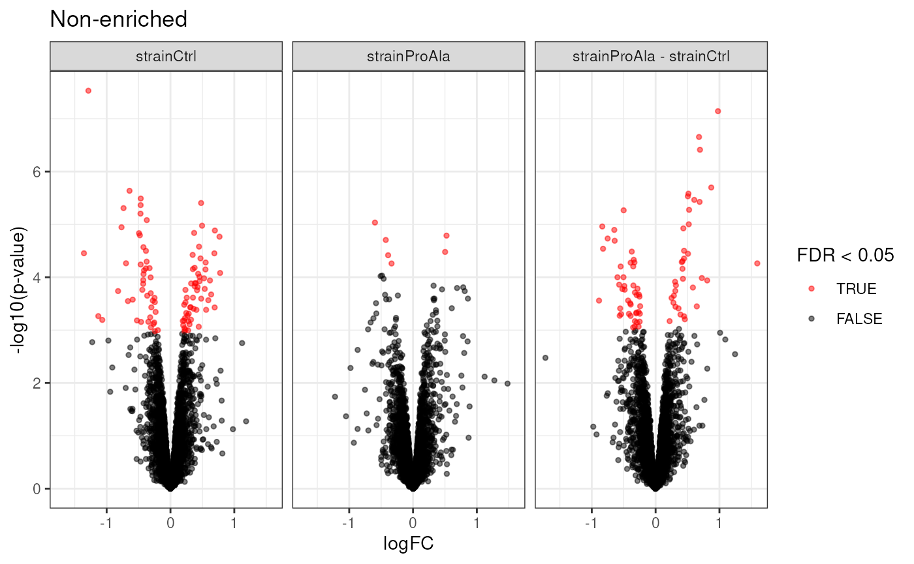

``` r

inferences |> 
  filter(adjPval < alpha) |> 
  mutate(DA = sign(logFC) |> as.factor() |> recode("-1"= "down","1" = "up")) |>
  group_by(contrast, DA) |> 
  ggplot(aes(x = contrast)) +
  geom_bar(aes(fill = factor(DA)),
           colour = "black") +
  theme_minimal() + 
  theme(axis.text.x = element_text(angle = 90))
```

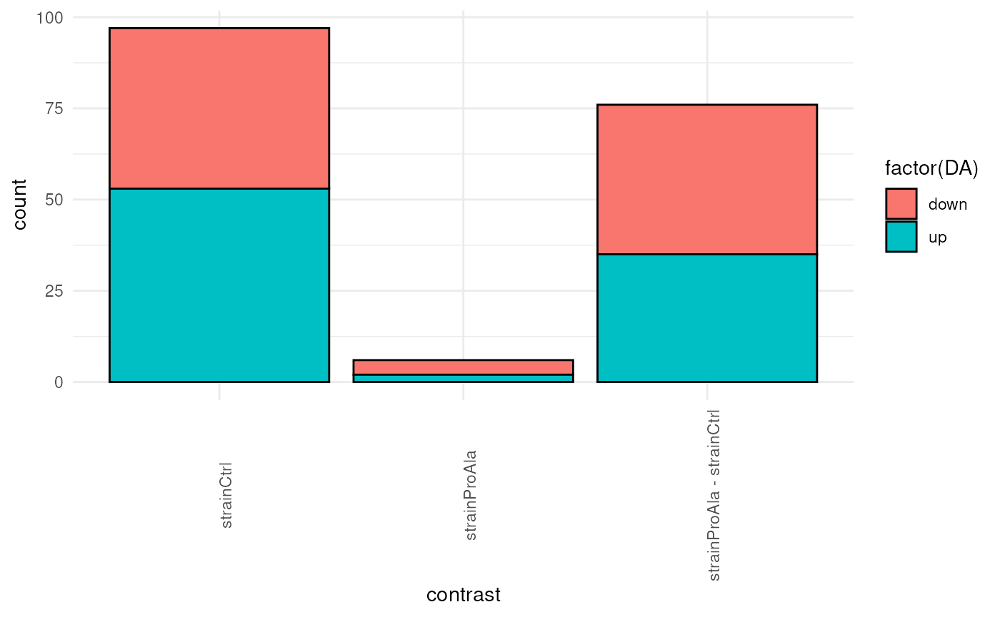

We notice that many proteins are DA at the nominal 5% FDR-level.

#### Heatmaps

``` r

lapply(colnames(L),
                   function(contrast, se, alpha)
                   {
                     sig <- rowData(se)[[contrast]] |> 
                       filter(adjPval < alpha) |> 
                       rownames()
                     quants <- t(scale(t(assay(se[sig,]))))
                     colnames(quants) <- se$sampleId #specific to this dataset to get short colnames
                     rowclushlp <- quants
                     rowclushlp[is.na(rowclushlp)] <- min(quants,na.rm=TRUE) - 2
                     rowclus <- hclust(dist(rowclushlp))
                     annotations <- columnAnnotation(
                       group = se$strain
                       ) #3.
                     set.seed(1234) ## annotation colours are randomly generated by default
                     return(
                       Heatmap(show_row_names = FALSE,
                       quants, 
                       name = "log2 intensity",
                       top_annotation = annotations, 
                       column_title = paste0(contrast, " = 0"),
                       cluster_rows = rowclus
                       )
                     )
                   },
                   se = getWithColData(qf, "proteins"),
                   alpha = alpha)
```

    ## [[1]]

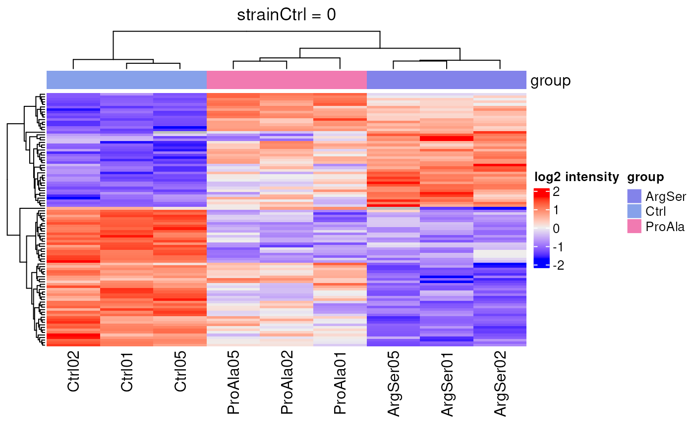

    ## 
    ## [[2]]

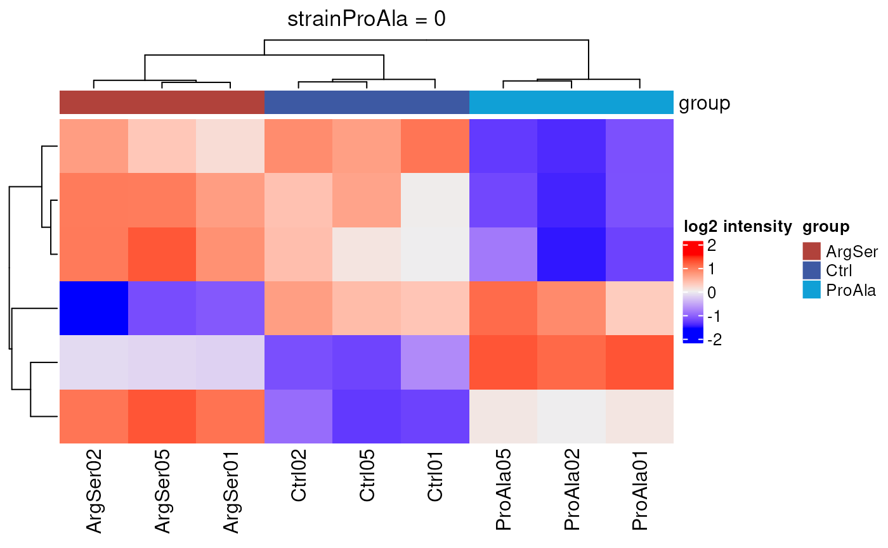

    ## 
    ## [[3]]

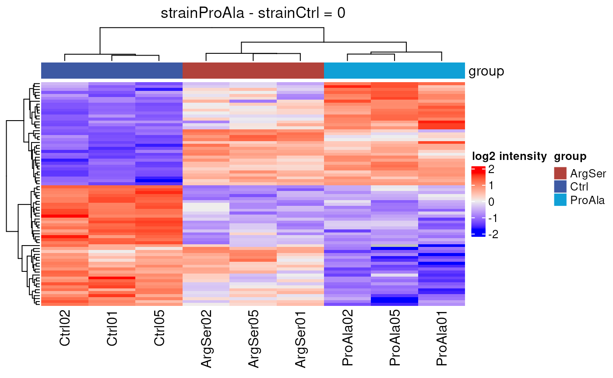

#### Detail plots

We can explore the data for a protein to validate the statistical
inference results. For example, let’s explore the normalised precursor
and the summarised protein intensities for the protein with the most
significant log2 fold change.

``` r

(target_feature <- inferences |> 
   dplyr::slice(which.min(pval)) |> 
   pull(feature)
)
```

    ## [1] "Q12068"

``` r

inferences |> 
  filter(feature == target_feature)
```

    ##                                       logFC         se     df          t
    ## strainCtrl.Q12068                -1.2858668 0.06238249 7.8566 -20.612626
    ## strainProAla.Q12068              -0.5965520 0.06087424 7.8566  -9.799745
    ## strainProAla - strainCtrl.Q12068  0.6893148 0.06238249 7.8566  11.049813
    ##                                          pval      adjPval
    ## strainCtrl.Q12068                4.023265e-08 0.0001822539
    ## strainProAla.Q12068              1.119660e-05 0.0343486565
    ## strainProAla - strainCtrl.Q12068 4.617641e-06 0.0026124306
    ##                                                   contrast feature
    ## strainCtrl.Q12068                               strainCtrl  Q12068
    ## strainProAla.Q12068                           strainProAla  Q12068
    ## strainProAla - strainCtrl.Q12068 strainProAla - strainCtrl  Q12068

To obtain the required data, we perform a little data manipulation
pipeline:

- We use the QFeatures subsetting functionality to retrieve all data
  related to and focusing on the precursors_log and proteins sets that
  contains the peptide ion data used for model fitting.
- We then convert the data with longForm() for plotting.
- Finally, we plot the log2 normalised intensities for each sample at
  the protein and at the peptide level. Since multiple peptides are
  recorded for the protein, we link peptides across samples using a grey
  line. Samples are colored according to strain.

``` r

qf[target_feature, , c("precursors_log","precursors_norm", "proteins")] |> #1
  longForm(colvars = colnames(colData(qf))) |> #2
  data.frame() |> 
  ggplot() +
  aes(x = colname,
      y = value) +
  geom_line(aes(group = rowname), linewidth = 0.1) +
  geom_point(aes(colour = strain)) +
  facet_wrap(~ assay, scales = "free") +
  ggtitle(target_feature) +
  theme_minimal() +
  theme(axis.text.x = element_blank())
```

    ## Warning: 'experiments' dropped; see 'drops()'

    ## harmonizing input:
    ##   removing 36 sampleMap rows not in names(experiments)
    ##   removing 9 colData rownames not in sampleMap 'primary'

    ## Warning: Removed 30 rows containing missing values or values outside the scale range
    ## (`geom_line()`).

    ## Warning: Removed 64 rows containing missing values or values outside the scale range
    ## (`geom_point()`).

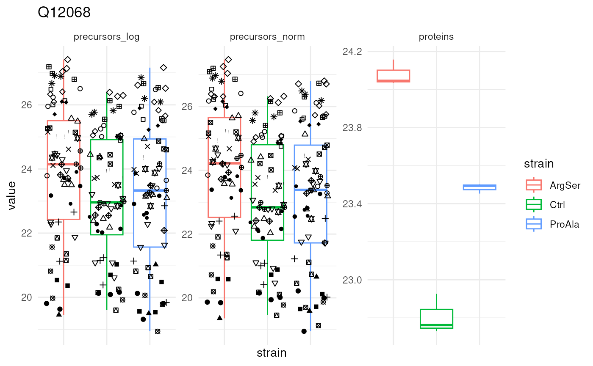

``` r

qf[target_feature, , c("precursors_log","precursors_norm", "proteins")] |> #1
  longForm(colvars = colnames(colData(qf))) |> #2
  data.frame() |>
  filter(!is.na(value)) %>% 
  {
  ggplot(.) +
  aes(x = strain,
      y = value) +
  geom_boxplot(aes(colour = strain)) +
  facet_wrap(~ assay, scales = "free") +
  geom_jitter(aes(shape = rowname)) +
  scale_shape_manual(values = seq_len(dplyr::n_distinct(.$rowname))) +
  ggtitle(target_feature) +
  theme_minimal() +
  theme(axis.text.x = element_blank()) +
  guides(shape = "none")
  }
```

    ## harmonizing input:
    ##   removing 36 sampleMap rows not in names(experiments)
    ##   removing 9 colData rownames not in sampleMap 'primary'


#### Compare phospo-precursor level intensities to protein level intensities

We compare the intensities for the top 5 DA phospo-precursors for the
first contrast to these of their corresponding protein in the
non-enriched assay.

``` r

contr = colnames(L)[1]
top5 <- inferencesPTM |> 
  filter(contrast == contr) |> 
  arrange(pval) |> 
  head(n = 5) |> 
  pull(feature)

for (feat in top5)
{
  ptm_data <- qf[,,c("precursorsPTM_norm")] |> 
    longForm(colvars = colnames(colData(qf)), rowvars = "Protein.Group") |>
    data.frame() |> 
    filter(rowname==feat)
  feature_protein <- ptm_data |> 
    pull("Protein.Group") |> 
    unique()
  prot_data <- qf[,,"proteins"]|>
    longForm(colvars = colnames(colData(qf)), rowvars = "Protein.Group") |>
    data.frame() |> 
    filter(Protein.Group==feature_protein) 
  ptm_protein <- rbind(ptm_data, prot_data)
  ylims <- ptm_protein |> 
  group_by(assay) |> 
  summarise(cent = mean(range(value,na.rm=TRUE)), ampl = diff(range(value,na.rm=TRUE))) |> 
  mutate(lower = cent - max(ampl)/2, 
         upper = cent + max(ampl)/2) |> 
  select(-c(cent, ampl))
  
  comparison_plot <- ptm_protein |>
    ggplot() +
    aes(x = sampleId,
        y = value) +
    geom_line(aes(group = rowname), linewidth = 0.1) +
    geom_point(aes(colour = strain)) +
    facet_wrap(~ assay, scales = "free") +
    labs(
      title = paste0(feat," / ", feature_protein),
      subtitle = paste("padj PTM =", 
                       inferencesPTM |> 
                         filter(feature == feat & contrast == contr) |> 
                         pull(adjPval) |> 
                         round(digits = 3))
    ) +
    theme_minimal() +
    theme(axis.text.x = element_blank()) +
    ggh4x::facetted_pos_scales(
    y = list(
      assay == ylims$assay[1] ~ scale_y_continuous(limits = unlist(ylims[1,c("lower","upper")])),
      assay == ylims$assay[2] ~ scale_y_continuous(limits = unlist(ylims[2,c("lower","upper")])),
      assay == ylims$assay[3] ~ scale_y_continuous(limits = unlist(ylims[3,c("lower","upper")]))
    )
    ) 
 print(comparison_plot)
}
```

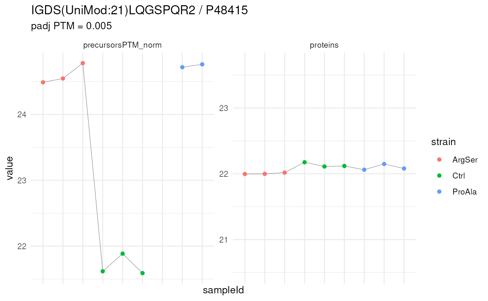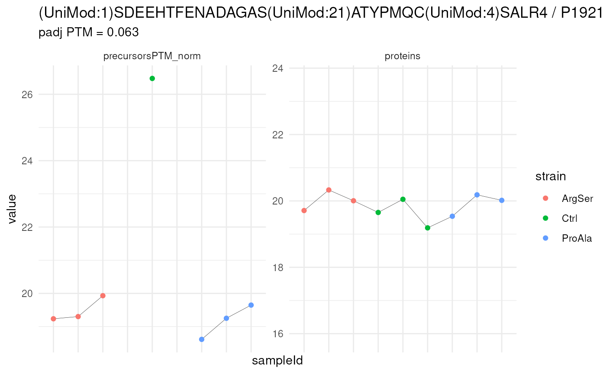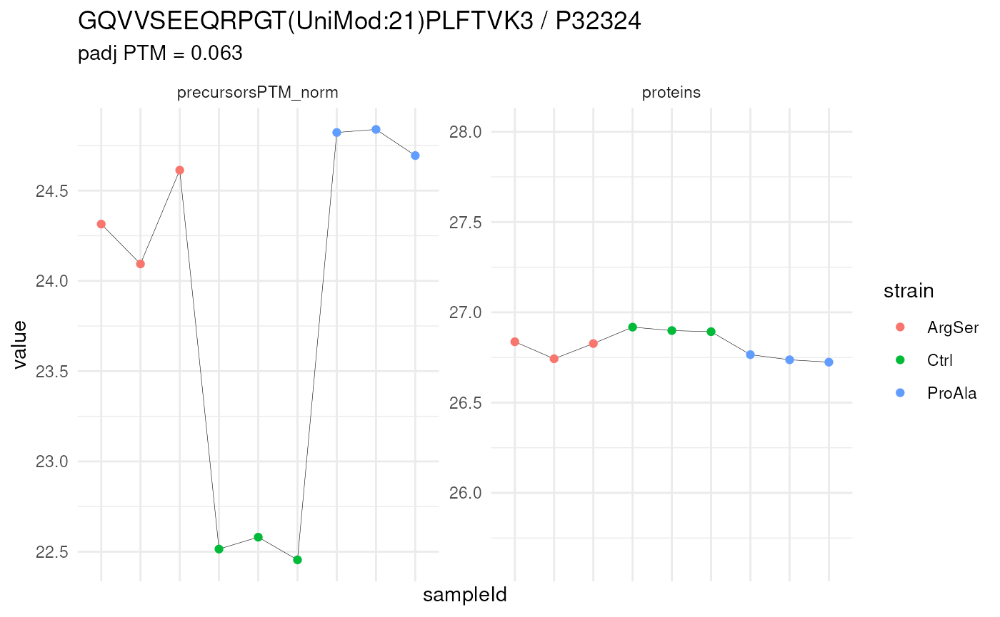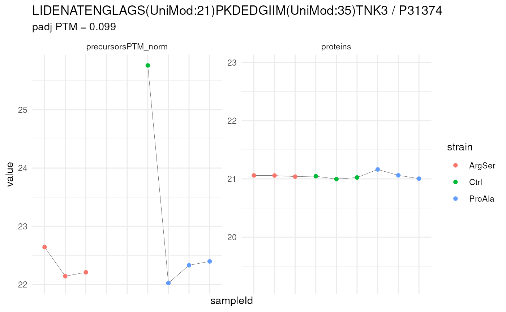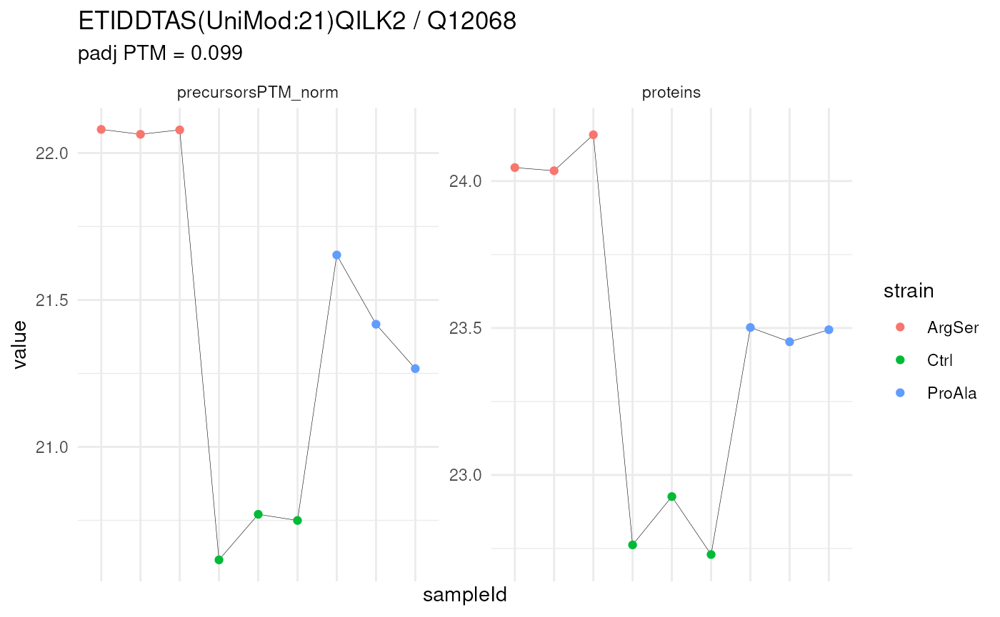

``` r

#Garbage collection to free space 
gc(); gc()
```

    ##            used  (Mb) gc trigger  (Mb)  max used   (Mb)
    ## Ncells 11810237 630.8   17865211 954.2  17865211  954.2
    ## Vcells 31264031 238.6   86064098 656.7 262547018 2003.1

    ##            used  (Mb) gc trigger  (Mb)  max used   (Mb)
    ## Ncells 11810244 630.8   17865211 954.2  17865211  954.2
    ## Vcells 31264079 238.6   86064098 656.7 262547018 2003.1

## Data Modeling of phospho-peptidoform usages

### Background

- Differentially abundant PTMs can arise either from changes in PTM
  regulation or simply from changes in the abundance of the underlying
  protein.

- To distinguish PTM-specific regulation from protein-level changes, we
  extend the concept of *differential usage* (DU) to PTMs:

``` math
\log_2 DU = \log_2 FC^\text{PTM} - \log_2 FC^\text{protein},
```

where $`log_2 FC^\text{PTM}`$ is the fold change of the modified
precursor/PTM and $`log_2 FC^\text{protein}`$ is the fold change of the
corresponding protein.

- In other words, differential usage represents the differential
  abundance (DA) of a PTM after correcting for changes in protein
  abundance.

- This metric highlights PTMs whose abundance changes cannot be
  explained solely by changes in the total protein level, thereby
  prioritising PTMs that may be under specific regulatory control.

Two experimental designs are commonly used to quantify precursor-level
(PTM-level) and protein-level abundances:

- **Paired design:** PTM and protein abundances are measured in the same
  biological replicate (sample).

- **Unpaired design:** PTM and protein abundances are measured in
  independent biological replicates (different samples).

#### Paired samples

1.  Perform regular data processing at the protein-level:

    - log2-transformation,
    - normalisation and
    - summarisation

2.  Calculate relative log2 transformed abundances at peptidoform level
    ``` math
    y^\text{pep,rel}_i = y^\text{pep}_i - y^\text{prot}_i
    ```

3.  Perform conventional differential msqrob2 analysis on the relative
    peptidoform level. $`\rightarrow`$ Immediately gives us diferential
    usages!

4.  Optionally

&nbsp;

1.  aggregate relative log2 transformed abundances at peptidoform level
    to PTM-level
2.  perform a differential msqrob2 analysis at PTM-level

&nbsp;

5.  The paired design has the advantage that both metrics are estimated
    on the same biorepeat/sample, which enables a better estimation of
    the standard error on the usages.

#### Unpaired PTM-level and protein samples

This is the default MSstatsTMT approach, which they also use for paired
designs?!

1.  Perform regular msqrob2 differential analysis at the protein-level
2.  Perform regular msqrob2 differential analysis at the peptidoform
    (PTM-level)
3.  Calculate usages

``` math
 
\begin{array}{ccc}
\log_2 \widehat{DU} & =& \log_2 \widehat{FC}^\text{PTM} - log_2 \widehat{FC}^\text{protein}\\
SE_\widehat{DU} &=& \sqrt{(SE_\widehat{FC}^{PTM})^2 + (SE_\widehat{FC}^{protein})^2}
\end{array}
```

#### Our study

For this dataset we have phospho-enriched and non-enriched runs on the
same biological samples.

We subsetted the data to have three unpaired samples for the
phospho-enriched and non-enriched runs for each straing. So we do the
Unpaired analysis

### Unpaired samples: calculate usages

We first define a function to correct phospho-precursor-level log-FC
with non-enriched logFC.

1.  Matches the phospho-precursor to the non-enriched Protein.Group
2.  For each contrast

- 2.1. Extracts the inference results for the contrast at tc protein
  level
- 2.2. Adds them to the inference results for the contrast at the lip
  precursor level
- 2.3. Calculates the lip relative differential abundance (RDA),
  i.e. the logFC corrected for the tc logFC at the protein level and the
  corresponding inference

``` r

calculate_usage <- function(qf, 
                          i_ptm, 
                          i_ne, 
                          contrasts, 
                          fcol_ptm = "Protein.Group", 
                          fcol_ne = "Protein.Group",  
                          satterthwaite = FALSE)
{
  match_precursor_to_protein_FC <- match(rowData(qf[[i_ptm]])[[fcol_ptm]],
                                         rowData(qf[[i_ne]])[[fcol_ne]]) #1. 
  for (contrast in contrasts)
    {
    results_ne <- rowData(qf[[i_ne]])[[contrast]] #2.1
    colnames(results_ne) <- results_ne |> 
      colnames() |> 
      paste0("_ne")
    rowData(qf[[i_ptm]])[[contrast]] <- cbind(
      rowData(qf[[i_ptm]])[[contrast]], 
      results_ne[match_precursor_to_protein_FC,]) |> #2.2 
      mutate(
        logUsage = logFC - logFC_ne, #2.3
        se_usage = sqrt(se^2 + se_ne^2),
        t_usage = logUsage /se_usage,
        df_usage = if (satterthwaite) (se^2 + se_ne^2)^2/(se^4/df + se_ne^4/df_ne) else df,
        pval_usage = pt(abs(t_usage), df_usage, lower.tail = FALSE)*2, 
        adjPval_usage = p.adjust(pval_usage, method = "fdr")
        )
  }
    return(qf)
}
```

Calculate log-transformed usages (relative differential abundances).

``` r

qf <- calculate_usage(qf, i_ptm = "precursorsPTM_norm", i_ne = "proteins", contrasts = colnames(L))
```

We extract the results table from the `precursorsPTM_norm` summarised
experiment in the `qf` object.

``` r

inferencesUsage <- 
  msqrobCollect(qf[["precursorsPTM_norm"]], L) |> 
  relocate(contains("sage"))
```

### Report results

We report the results using a results table, volcano plots and heatmaps.

#### Results table

``` r

for (j in colnames(L)) {

  inference <- inferencesUsage |> 
    dplyr::filter(adjPval_usage < alpha & contrast == j)

  cat("**Median - Contrast:**", j, "= 0 (", nrow(inference),
      "significant proteins)\n\n")

  cat('<div style="max-height:300px; overflow-y:auto;">')

  print(
    kable(
      inference |>
        dplyr::arrange(pval) |>
        dplyr::relocate(feature),
      row.names = FALSE
    )
  )

  cat('</div>')

  cat("\n\n\n---\n\n")
}
```

**Median - Contrast:** strainCtrl = 0 ( 1 significant proteins)

| feature | logUsage | se_usage | t_usage | df_usage | pval_usage | adjPval_usage | logFC | se | df | t | pval | adjPval | logFC_ne | se_ne | df_ne | t_ne | pval_ne | adjPval_ne | contrast |
|:---|---:|---:|---:|---:|---:|---:|---:|---:|---:|---:|---:|---:|---:|---:|---:|---:|---:|---:|:---|
| IGDS(UniMod:21)LQGSPQR2 | -3.035308 | 0.1459204 | -20.80113 | 6.823797 | 2e-07 | 0.0045262 | -2.907071 | 0.1393496 | 6.823797 | -20.86171 | 2e-07 | 0.0045824 | 0.1282368 | 0.0432948 | 7.567804 | 2.961945 | 0.0192543 | 0.2110896 | strainCtrl |

------------------------------------------------------------------------

**Median - Contrast:** strainProAla = 0 ( 1 significant proteins)

| feature | logUsage | se_usage | t_usage | df_usage | pval_usage | adjPval_usage | logFC | se | df | t | pval | adjPval | logFC_ne | se_ne | df_ne | t_ne | pval_ne | adjPval_ne | contrast |
|:---|---:|---:|---:|---:|---:|---:|---:|---:|---:|---:|---:|---:|---:|---:|---:|---:|---:|---:|:---|
| AVQES(UniMod:21)DS(UniMod:21)TTS(UniMod:21)RIIEEHESPIDAEK3 | -4.030669 | 0.1705019 | -23.64002 | 5.826762 | 5e-07 | 0.0118133 | -3.860267 | 0.1557383 | 5.826762 | -24.78688 | 4e-07 | 0.0092686 | 0.1704021 | 0.0694008 | 7.094431 | 2.455334 | 0.0433169 | 0.4645012 | strainProAla |

------------------------------------------------------------------------

**Median - Contrast:** strainProAla - strainCtrl = 0 ( 10 significant
proteins)

| feature | logUsage | se_usage | t_usage | df_usage | pval_usage | adjPval_usage | logFC | se | df | t | pval | adjPval | logFC_ne | se_ne | df_ne | t_ne | pval_ne | adjPval_ne | contrast |
|:---|---:|---:|---:|---:|---:|---:|---:|---:|---:|---:|---:|---:|---:|---:|---:|---:|---:|---:|:---|
| IGDS(UniMod:21)LQGSPQR2 | 3.083597 | 0.1621195 | 19.020521 | 6.823797 | 4.00e-07 | 0.0057587 | 3.0414472 | 0.1557899 | 6.823797 | 19.522750 | 3.00e-07 | 0.0054041 | -0.0421498 | 0.0448579 | 7.567804 | -0.9396288 | 0.3764250 | 0.7417064 | strainProAla - strainCtrl |
| AVQES(UniMod:21)DS(UniMod:21)TTS(UniMod:21)RIIEEHESPIDAEK3 | -3.760489 | 0.1705019 | -22.055406 | 5.826762 | 8.00e-07 | 0.0057587 | -3.7465156 | 0.1557383 | 5.826762 | -24.056476 | 5.00e-07 | 0.0054041 | 0.0139732 | 0.0694008 | 7.094431 | 0.2013412 | 0.8460831 | 0.9503887 | strainProAla - strainCtrl |
| GQVVSEEQRPGT(UniMod:21)PLFTVK3 | 2.429170 | 0.1400049 | 17.350610 | 6.779026 | 7.00e-07 | 0.0057587 | 2.2682125 | 0.1336666 | 6.779026 | 16.969186 | 8.00e-07 | 0.0064050 | -0.1609579 | 0.0416488 | 7.740504 | -3.8646436 | 0.0050886 | 0.1220742 | strainProAla - strainCtrl |
| (UniMod:1)SDS(UniMod:21)EVNQEAKPEVK2 | 2.069514 | 0.1553546 | 13.321232 | 6.038833 | 1.05e-05 | 0.0435310 | 2.0997487 | 0.1203906 | 6.038833 | 17.441138 | 2.10e-06 | 0.0123465 | 0.0302344 | 0.0981894 | 7.314497 | 0.3079188 | 0.7667282 | 0.9287311 | strainProAla - strainCtrl |
| (UniMod:1)SDEEHTFENADAGAS(UniMod:21)ATYPMQC(UniMod:4)SALR4 | -7.571817 | 0.5271283 | -14.364279 | 5.736513 | 1.03e-05 | 0.0435310 | -7.2887717 | 0.4604139 | 5.736513 | -15.830911 | 5.90e-06 | 0.0233619 | 0.2830457 | 0.2566773 | 8.130153 | 1.1027295 | 0.3017137 | 0.6860909 | strainProAla - strainCtrl |
| LTNMPFGGNPTANQSGS(UniMod:21)GNSLFGTK3 | -2.481942 | 0.2316531 | -10.714045 | 6.646603 | 1.95e-05 | 0.0435310 | -2.4850090 | 0.2265396 | 6.646603 | -10.969426 | 1.68e-05 | 0.0392179 | -0.0030673 | 0.0484043 | 7.892323 | -0.0633674 | 0.9510494 | 0.9828450 | strainProAla - strainCtrl |
| LIDENATENGLAGS(UniMod:21)PKDEDGIIM(UniMod:35)TNK3 | -3.558429 | 0.2759366 | -12.895822 | 5.765748 | 1.80e-05 | 0.0435310 | -3.5131571 | 0.2707854 | 5.765748 | -12.973952 | 1.74e-05 | 0.0392179 | 0.0452717 | 0.0530682 | 6.881750 | 0.8530846 | 0.4223077 | 0.7742443 | strainProAla - strainCtrl |
| RAT(UniMod:21)YAGFLLADPK3 | 2.714078 | 0.2598206 | 10.445970 | 6.826762 | 1.91e-05 | 0.0435310 | 2.5531200 | 0.2564607 | 6.826762 | 9.955209 | 2.60e-05 | 0.0392179 | -0.1609579 | 0.0416488 | 7.740504 | -3.8646436 | 0.0050886 | 0.1220742 | strainProAla - strainCtrl |
| RGQVVSEEQRPGT(UniMod:21)PLFTVK3 | 1.980699 | 0.2099576 | 9.433805 | 7.695480 | 1.70e-05 | 0.0435310 | 1.8197408 | 0.2057852 | 7.695480 | 8.842913 | 2.69e-05 | 0.0392179 | -0.1609579 | 0.0416488 | 7.740504 | -3.8646436 | 0.0050886 | 0.1220742 | strainProAla - strainCtrl |
| ETVES(UniMod:21)ESSQTALSK2 | 1.147862 | 0.1164119 | 9.860350 | 7.253952 | 1.85e-05 | 0.0435310 | 0.9869042 | 0.1087065 | 7.253952 | 9.078612 | 3.24e-05 | 0.0392179 | -0.1609579 | 0.0416488 | 7.740504 | -3.8646436 | 0.0050886 | 0.1220742 | strainProAla - strainCtrl |

------------------------------------------------------------------------

#### Volcanoplots

``` r

inferencesUsage |> 
  filter(is.finite(adjPval_usage)) |> 
  ggplot(aes(x = logUsage, 
             y = -log10(pval_usage), 
             col = adjPval_usage < alpha)) +
    geom_point(size = 1, alpha = 0.5) + 
    theme_bw() + 
    ylab("-log10(p-value)") + 
    scale_color_manual(values = c(`FALSE` = "black", `TRUE` = "red"), 
                       breaks = c("TRUE", "FALSE")) + 
    labs(color = paste0("FDR < ", alpha)) + 
    facet_wrap(~contrast) + 
    labs(title = "Usage")
```

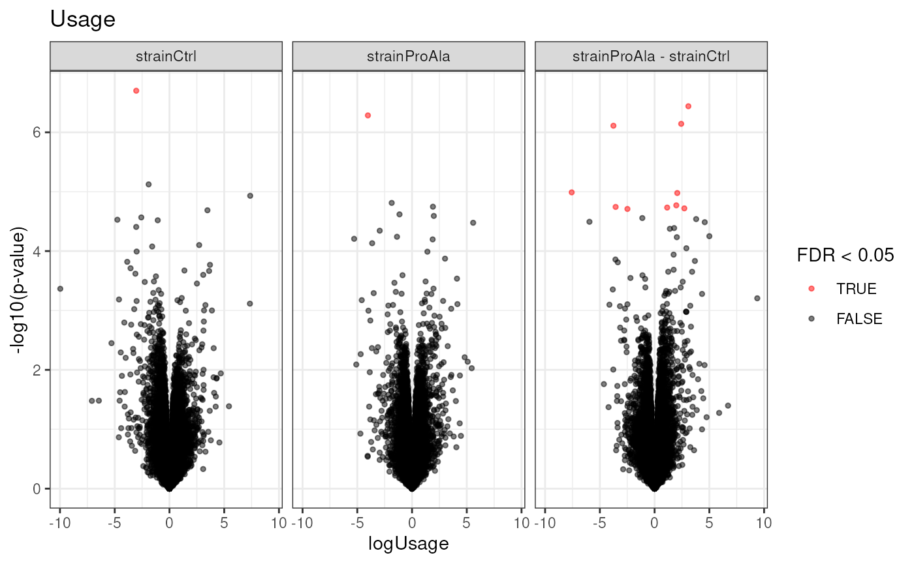

``` r

inferencesUsage |> 
  filter(adjPval_usage < alpha) |> 
  mutate(DA = sign(logUsage) |> as.factor() |> recode("-1"= "down","1" = "up")) |>
  group_by(contrast, DA) |> 
  ggplot(aes(x = contrast)) +
  geom_bar(aes(fill = factor(DA)),
           colour = "black") +
  theme_minimal() + 
  theme(axis.text.x = element_text(angle = 90))
```


We observe that the number of significant precursors reduced.

#### Detail plots

We can explore the data for a protein to validate the statistical
inference results. For example, let’s explore the normalised precursor
abundance as well as the summarised protein intensities for the
precursor with the most significant log2 usage.

``` r

(target_feature <- inferencesUsage |> 
   dplyr::slice(which.min(pval_usage)) |> 
   pull(feature)
)
```

    ## [1] "IGDS(UniMod:21)LQGSPQR2"

``` r

inferencesUsage |> 
  filter(feature == target_feature)
```

    ##                                                      logUsage  se_usage
    ## strainCtrl.IGDS(UniMod:21)LQGSPQR2                -3.03530811 0.1459204
    ## strainProAla.IGDS(UniMod:21)LQGSPQR2               0.04828887 0.1619233
    ## strainProAla - strainCtrl.IGDS(UniMod:21)LQGSPQR2  3.08359698 0.1621195
    ##                                                       t_usage df_usage
    ## strainCtrl.IGDS(UniMod:21)LQGSPQR2                -20.8011276 6.823796
    ## strainProAla.IGDS(UniMod:21)LQGSPQR2                0.2982207 6.823796
    ## strainProAla - strainCtrl.IGDS(UniMod:21)LQGSPQR2  19.0205214 6.823796
    ##                                                     pval_usage adjPval_usage
    ## strainCtrl.IGDS(UniMod:21)LQGSPQR2                1.994183e-07   0.004526198
    ## strainProAla.IGDS(UniMod:21)LQGSPQR2              7.744101e-01   0.999653849
    ## strainProAla - strainCtrl.IGDS(UniMod:21)LQGSPQR2 3.638940e-07   0.005758670
    ##                                                        logFC        se       df
    ## strainCtrl.IGDS(UniMod:21)LQGSPQR2                -2.9070713 0.1393496 6.823796
    ## strainProAla.IGDS(UniMod:21)LQGSPQR2               0.1343759 0.1557591 6.823796
    ## strainProAla - strainCtrl.IGDS(UniMod:21)LQGSPQR2  3.0414472 0.1557899 6.823796
    ##                                                            t         pval
    ## strainCtrl.IGDS(UniMod:21)LQGSPQR2                -20.861711 1.955531e-07
    ## strainProAla.IGDS(UniMod:21)LQGSPQR2                0.862716 4.175794e-01
    ## strainProAla - strainCtrl.IGDS(UniMod:21)LQGSPQR2  19.522750 3.054750e-07
    ##                                                       adjPval    logFC_ne
    ## strainCtrl.IGDS(UniMod:21)LQGSPQR2                0.004582395  0.12823677
    ## strainProAla.IGDS(UniMod:21)LQGSPQR2              0.986318960  0.08608698
    ## strainProAla - strainCtrl.IGDS(UniMod:21)LQGSPQR2 0.005404076 -0.04214978
    ##                                                        se_ne    df_ne
    ## strainCtrl.IGDS(UniMod:21)LQGSPQR2                0.04329478 7.567804
    ## strainProAla.IGDS(UniMod:21)LQGSPQR2              0.04425229 7.567804
    ## strainProAla - strainCtrl.IGDS(UniMod:21)LQGSPQR2 0.04485791 7.567804
    ##                                                         t_ne    pval_ne
    ## strainCtrl.IGDS(UniMod:21)LQGSPQR2                 2.9619450 0.01925433
    ## strainProAla.IGDS(UniMod:21)LQGSPQR2               1.9453679 0.08968875
    ## strainProAla - strainCtrl.IGDS(UniMod:21)LQGSPQR2 -0.9396288 0.37642501
    ##                                                   adjPval_ne
    ## strainCtrl.IGDS(UniMod:21)LQGSPQR2                 0.2110896
    ## strainProAla.IGDS(UniMod:21)LQGSPQR2               0.5871243
    ## strainProAla - strainCtrl.IGDS(UniMod:21)LQGSPQR2  0.7417064
    ##                                                                    contrast
    ## strainCtrl.IGDS(UniMod:21)LQGSPQR2                               strainCtrl
    ## strainProAla.IGDS(UniMod:21)LQGSPQR2                           strainProAla
    ## strainProAla - strainCtrl.IGDS(UniMod:21)LQGSPQR2 strainProAla - strainCtrl
    ##                                                                   feature
    ## strainCtrl.IGDS(UniMod:21)LQGSPQR2                IGDS(UniMod:21)LQGSPQR2
    ## strainProAla.IGDS(UniMod:21)LQGSPQR2              IGDS(UniMod:21)LQGSPQR2
    ## strainProAla - strainCtrl.IGDS(UniMod:21)LQGSPQR2 IGDS(UniMod:21)LQGSPQR2

We again make a similar plot as before.

``` r

ptm <-  qf[target_feature, , c("precursorsPTM_norm")] |> #1
  longForm(colvars = colnames(colData(qf)), rowvars = "Protein.Group") |> #2
  data.frame()
```

    ## Warning: 'experiments' dropped; see 'drops()'

    ## harmonizing input:
    ##   removing 54 sampleMap rows not in names(experiments)
    ##   removing 9 colData rownames not in sampleMap 'primary'

``` r

protein <- qf[unique(ptm$Protein.Group), , c("proteins")] |> #1
  longForm(colvars = colnames(colData(qf)), rowvars = "Protein.Group") |> #2
  data.frame()
```

    ## Warning: 'experiments' dropped; see 'drops()'

    ## harmonizing input:
    ##   removing 54 sampleMap rows not in names(experiments)
    ##   removing 9 colData rownames not in sampleMap 'primary'

``` r

ptm_protein <- rbind(ptm, protein)
ylims <- ptm_protein |> 
  group_by(assay) |> 
  summarise(cent = mean(range(value,na.rm=TRUE)), ampl = diff(range(value,na.rm=TRUE))) |> 
  mutate(lower = cent - max(ampl)/2, 
         upper = cent + max(ampl)/2) |> 
  select(-c(cent, ampl))

outplot <- ptm_protein |>
  ggplot() +
  aes(x = colname,
      y = value) +
  geom_line(aes(group = rowname), linewidth = 0.1) +
  geom_point(aes(colour = strain)) +
  facet_wrap(~ assay, scales = "free") +
  ggh4x::facetted_pos_scales(
    y = list(
      assay == ylims$assay[1] ~ scale_y_continuous(limits = unlist(ylims[1,c("lower","upper")])),
      assay == ylims$assay[2] ~ scale_y_continuous(limits = unlist(ylims[2,c("lower","upper")]))
    )
    ) +
  labs(subtitle = target_feature) +
  theme_minimal() +
  theme(axis.text.x = element_blank())
print(outplot)
```

    ## Warning: Removed 1 row containing missing values or values outside the scale range
    ## (`geom_point()`).

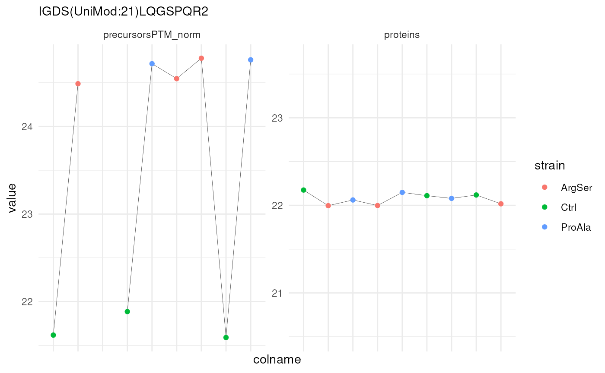

``` r

rbind(ptm, protein) %>%
  {
  ggplot(.) +
  aes(x = strain,
      y = value) +
  geom_boxplot(aes(colour = strain)) +
  facet_wrap(~ assay, scales = "free") +
  geom_jitter(aes(shape = rowname)) +
  scale_shape_manual(values = seq_len(dplyr::n_distinct(.$rowname))) +
  ggtitle(target_feature) +
  theme_minimal() +
  theme(axis.text.x = element_blank()) +
  guides(shape = "none")
  }
```

    ## Warning: Removed 1 row containing non-finite outside the scale range
    ## (`stat_boxplot()`).

    ## Warning: Removed 1 row containing missing values or values outside the scale range
    ## (`geom_point()`).

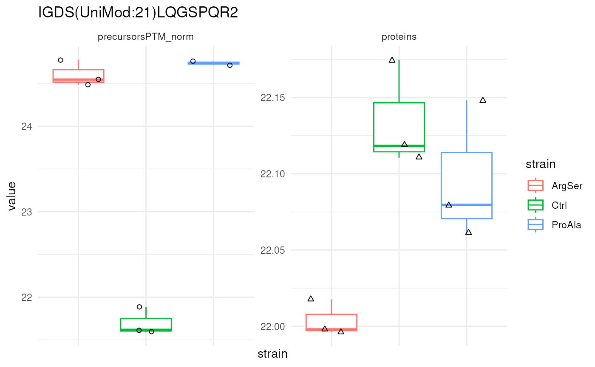

We compare the intensities for the top 5 DA phospo-precursors for the
first contrast to these of their corresponding protein in the
non-enriched assay and to the usages.

``` r

contr = colnames(L)[1]
top5 <- inferencesPTM |> 
  filter(contrast == contr) |> 
  arrange(pval) |> 
  head(n = 5) |> 
  pull(feature)

for (feat in top5)
{
  ptm_data <- qf[,,c("precursorsPTM_norm")] |> 
    longForm(colvars = colnames(colData(qf)), rowvars = "Protein.Group") |>
    data.frame() |> 
    filter(rowname==feat)
  feature_protein <- ptm_data |> 
    pull("Protein.Group") |> 
    unique()
  prot_data <- qf[,,"proteins"]|>
    longForm(colvars = colnames(colData(qf)), rowvars = "Protein.Group") |>
    data.frame() |> 
    filter(Protein.Group==feature_protein) 
  ptm_protein <- rbind(ptm_data, prot_data)
  ylims <- ptm_protein |> 
  group_by(assay) |> 
  summarise(cent = mean(range(value,na.rm=TRUE)), ampl = diff(range(value,na.rm=TRUE))) |> 
  mutate(lower = cent - max(ampl)/2, 
         upper = cent + max(ampl)/2) |> 
  select(-c(cent, ampl))
  
  comparison_plot <- ptm_protein |>
    ggplot() +
    aes(x = sampleId,
        y = value) +
    geom_line(aes(group = rowname), linewidth = 0.1) +
    geom_point(aes(colour = strain)) +
    facet_wrap(~ assay, scales = "free") +
    labs(
      title = paste0(feat," / ", feature_protein),
      subtitle = paste("padj PTM =", 
                       inferencesPTM |> 
                         filter(feature == feat & contrast == contr) |> 
                         pull(adjPval) |> 
                         round(digits = 3),
                       "padj usage =", 
                       inferencesUsage |> 
                         filter(feature == feat & contrast == contr) |> 
                         pull(adjPval_usage) |>
                         round(digits = 3))
    ) +
    theme_minimal() +
    theme(axis.text.x = element_blank()) +
    ggh4x::facetted_pos_scales(
    y = list(
      assay == ylims$assay[1] ~ scale_y_continuous(limits = unlist(ylims[1,c("lower","upper")])),
      assay == ylims$assay[2] ~ scale_y_continuous(limits = unlist(ylims[2,c("lower","upper")]))
    )
    ) 
 print(comparison_plot)
}
```

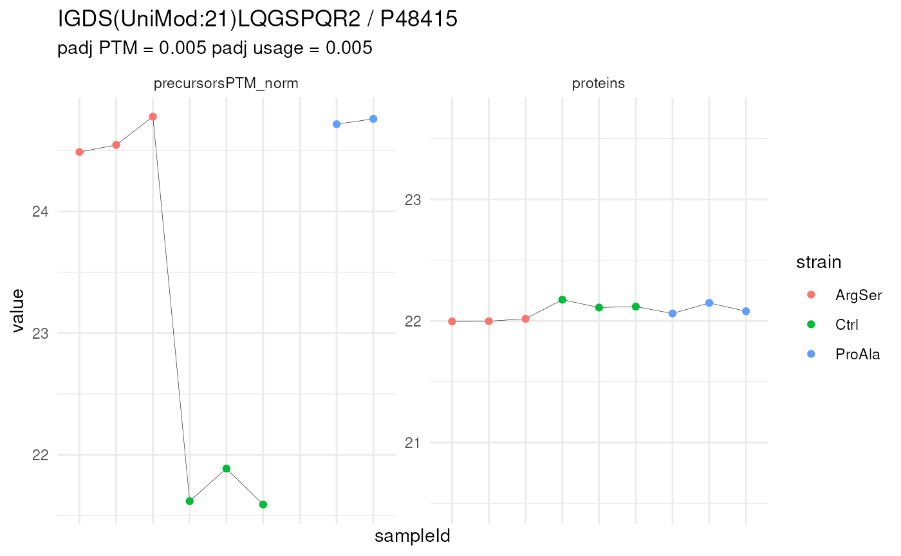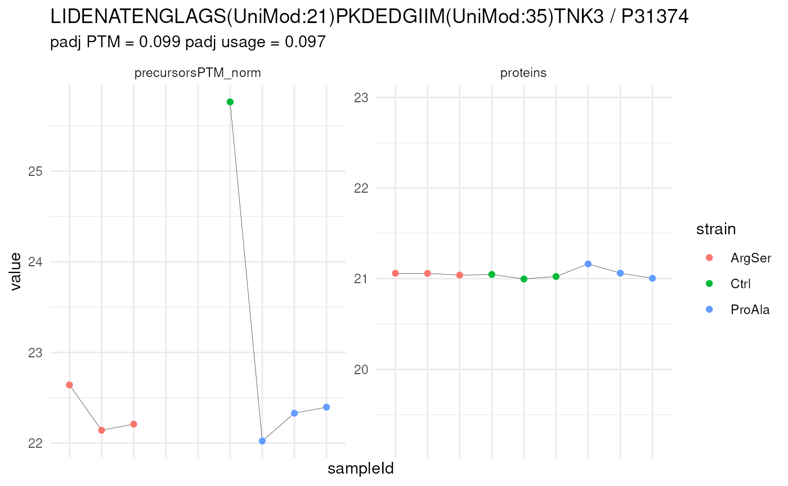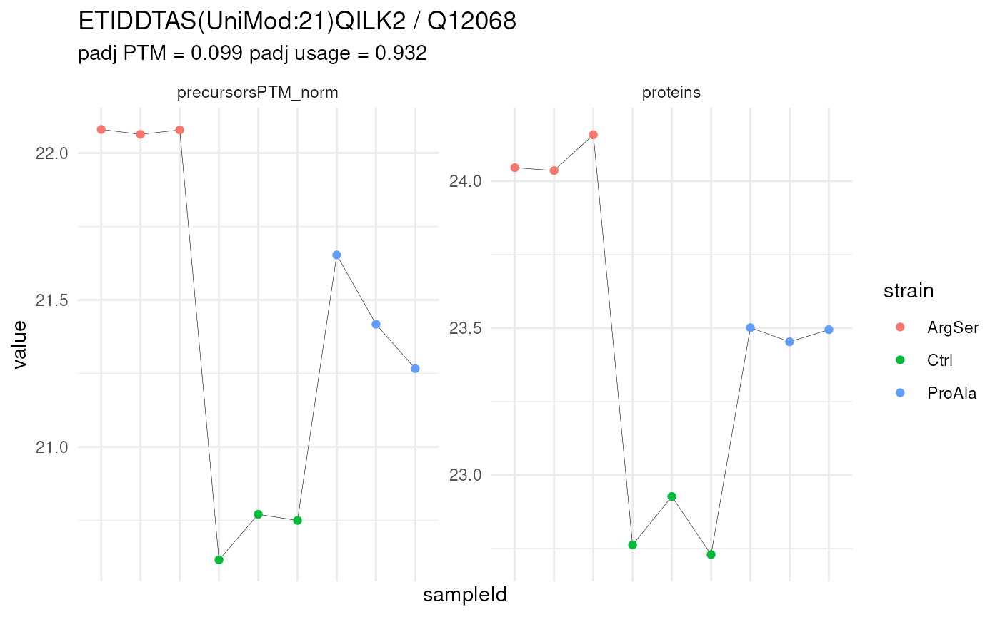

We compare the intensities for the top 5 DU phospo-precursors for the
first contrast to these of their corresponding protein in the
non-enriched assay and to their unadjusted abundances.

``` r

contr = colnames(L)[1]
top5 <- inferencesUsage |> 
  filter(contrast == contr) |> 
  arrange(pval_usage) |> 
  head(n = 5) |> 
  pull(feature)

for (feat in top5)
{
  ptm_data <- qf[,,c("precursorsPTM_norm")] |> 
    longForm(colvars = colnames(colData(qf)), rowvars = "Protein.Group") |>
    data.frame() |> 
    filter(rowname==feat)
  feature_protein <- ptm_data |> 
    pull("Protein.Group") |> 
    unique()
  prot_data <- qf[,,"proteins"]|>
    longForm(colvars = colnames(colData(qf)), rowvars = "Protein.Group") |>
    data.frame() |> 
    filter(Protein.Group==feature_protein) 
  ptm_protein <- rbind(ptm_data, prot_data)
  ylims <- ptm_protein |> 
  group_by(assay) |> 
  summarise(cent = mean(range(value,na.rm=TRUE)), ampl = diff(range(value,na.rm=TRUE))) |> 
  mutate(lower = cent - max(ampl)/2, 
         upper = cent + max(ampl)/2) |> 
  select(-c(cent, ampl))
  
  comparison_plot <- ptm_protein |>
    ggplot() +
    aes(x = sampleId,
        y = value) +
    geom_line(aes(group = rowname), linewidth = 0.1) +
    geom_point(aes(colour = strain)) +
    facet_wrap(~ assay, scales = "free") +
    labs(
      title = paste0(feat," / ", feature_protein),
      subtitle = paste("padj PTM =", 
                       inferencesPTM |> 
                         filter(feature == feat & contrast == contr) |> 
                         pull(adjPval) |> 
                         round(digits = 3),
                       "padj usage =", 
                       inferencesUsage |> 
                         filter(feature == feat & contrast == contr) |> 
                         pull(adjPval_usage) |>
                         round(digits = 3))
    ) +
    theme_minimal() +
    theme(axis.text.x = element_blank()) +
    ggh4x::facetted_pos_scales(
    y = list(
      assay == ylims$assay[1] ~ scale_y_continuous(limits = unlist(ylims[1,c("lower","upper")])),
      assay == ylims$assay[2] ~ scale_y_continuous(limits = unlist(ylims[2,c("lower","upper")])))
    ) 
 print(comparison_plot)
}
```

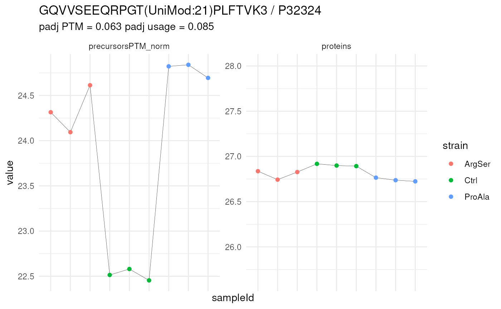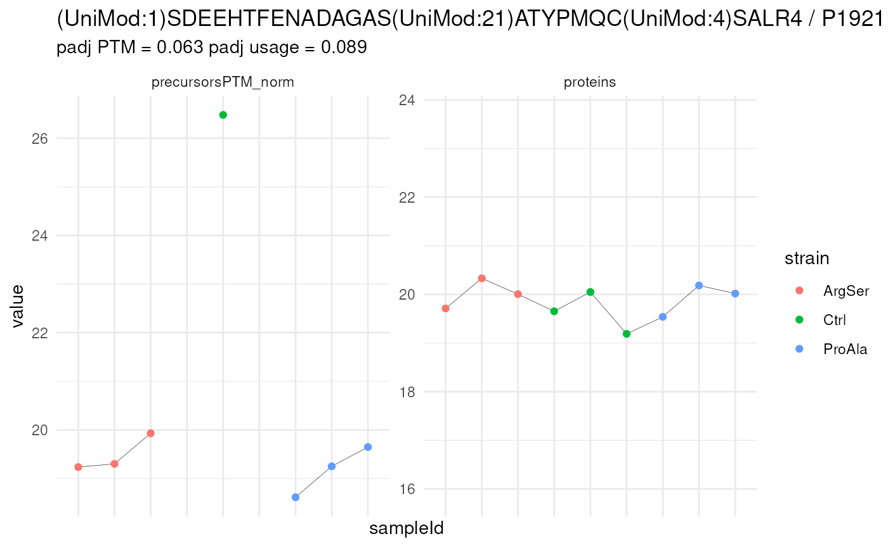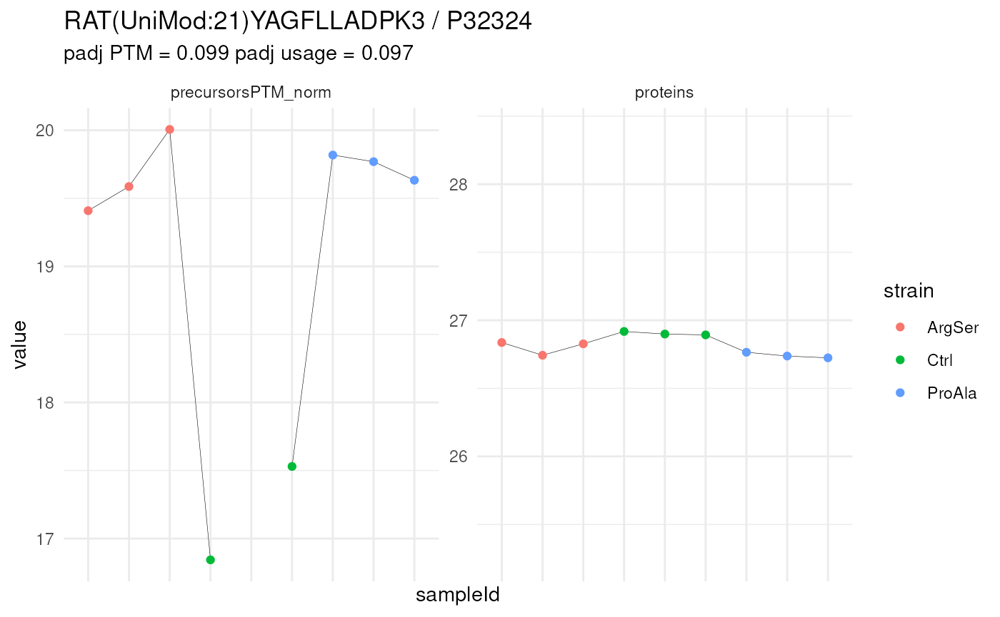

``` r

#Garbage collection to free space 
gc(); gc()
```

    ##            used  (Mb) gc trigger  (Mb)  max used   (Mb)
    ## Ncells 11826887 631.7   17865211 954.2  17865211  954.2
    ## Vcells 34677167 264.6   86064098 656.7 262547018 2003.1

    ##            used  (Mb) gc trigger  (Mb)  max used   (Mb)
    ## Ncells 11826879 631.7   17865211 954.2  17865211  954.2
    ## Vcells 34677190 264.6   86064098 656.7 262547018 2003.1

## Differential usage analysis at the PTM level

Multiple precursors are carrying the same PTM (cover the PTM at a
certain position in the protein). We can aggregate them together.

1.  Here we first aggregate the precursor level abundances
2.  Calculate the DA at the PTM-level
3.  Correct the DA at PTM-level with the DA at the protein level to
    obtain the usages

### Data processing

The variable `Protein.Sites` in the DIA-NN parquet file contains
information on the exact modified residue position in the full protein
sequence.

We first will make a new assay with duplicates for the precursors that
contain multiple phospho sites.

1.  We extract the usage assay
2.  We extract the row data with the original variables (drop msqrob2
    colums)
3.  Add a new variable with the modification type, which can derived
    from the variable `Modified.Sequence`. Indeed, all modifications
    start with string “UniMod:” followed by a number, i.e. 21 is a
    phoshorylation. So we extract all patterns “UniMod:\[0-9\]+”
    (`UniMod:` to match the literal text “UniMod:”, `[0-9]` to match any
    digit (0–9) and `+` to match one or more digits. We then replace
    pattern `Uniprot:` with an empty string.
4.  Add a new variable with the location of the modification on the
    original protein, which can be extracted from the variable
    `Protein.Sites`. Indeed, this variables contains the residu and its
    position in the protein sequence. If the sequence contains multiple
    modifications, the sites are separated with a `,`. Regex
    `(?<=:)[^\]]+` extracts all characters immediately after the colon
    without returning the colon and ignores `]`, e.g. for
    “\[P52871:A2,S4\]” it will return “A2,S4”. The resulting string is
    then splitted and subsequently the residue (first character) is
    removed.
5.  Replace the rowData of se
6.  Make vector of the row numbers with duplicates for the sequences
    containing multiple PTMs
7.  Make a corresponding vector with the positions of the individual PTM
    sites
8.  Make a corresponding vector with the modification type
9.  Extract the ids of rows that correspond to phospho sites
10. Make a new summarised experiment with duplicate entries for
    precursors with multiple phospho sites.
11. Add the position of the phospho site
12. Add a variable with the Protein.Group name and the phospho site
    position attached to it.
13. Make the rownames unique by appending the phospho site position to
    it.
14. Add the assay to the QFeatures object.

``` r

se <- qf[["precursorsPTM_norm"]] #1. 

rd <- rowData(se)[,names(rowData(qf[["precursorsPTM"]]))] |> ##2.
  as.data.frame() |> 
  mutate(
    mods  = str_extract_all(Modified.Sequence, 
                           "UniMod:[0-9]+") |> 
      lapply(FUN = gsub, pattern="UniMod:",replacement=""), ##3.
    pos = str_extract(Protein.Sites, 
                      "(?<=:)[^\\]]+") |> 
      strsplit(split = ",") |> 
      lapply(FUN=substr,start=2,stop=10000) |> 
      lapply(FUN=as.integer) ##4.
  )

rowData(se) <- rd ##5.

ids <- rep(rd |> 
             nrow() |>
             seq_len(), 
           rd |>
             pull(pos) |>
             sapply(FUN = length))##6.
pos <- unlist(rd$pos) ##7.
mod <- unlist(rd$mods) ##8. 

phosIds <- ids[mod == "21"] ##9.


seDup <- se[phosIds,] ##10.
rowData(seDup)$pos <- pos[mod == "21"] ##11.

rowData(seDup)$Protein.Group.Mod <- paste(
  rowData(seDup)$Protein.Group,
  rowData(seDup)$pos, sep = "_") ##12.

rownames(seDup) <- paste(rownames(seDup), rowData(seDup)$pos, sep = "_") ##13.
qf <- addAssay(qf, seDup, "precursorsPTM_norm_unnested") ##14.
```

We now aggregate the data of precursors that map to the same PTM
position on a protein in one protein expression value.

``` r

qf <- aggregateFeatures(qf, 
                   i = "precursorsPTM_norm_unnested",
                   fcol = "Protein.Group.Mod", 
                   name = "ptm",
                   fun = function(X, ...) iq::maxLFQ(X)$estimate
                   )
```

    ##   |                                                                              |                                                                      |   0%  |                                                                              |======================================================================| 100%

    ## The following messages occurred during aggregation:

    ## 
    ## Your quantitative data contain missing values. Please read the relevant
    ## section(s) in the aggregateFeatures manual page regarding the effects
    ## of missing values on data aggregation.
    ## 
    ## Occurred during the aggregation of set(s): precursors

We assess the distribution of the PTM usages.

``` r

qf[, , "ptm"] |> #1.
  longForm(colvars = colnames(colData(qf))) |>  #2. 
  data.frame() |> 
  filter(!is.na(value)) |>
  ggplot() + #3.
  aes(x = value,
      colour = strain,
      group = colname) +
  geom_density() +
  labs(subtitle = "PTM") +
  theme_minimal()
```

    ## harmonizing input:
    ##   removing 72 sampleMap rows not in names(experiments)
    ##   removing 9 colData rownames not in sampleMap 'primary'

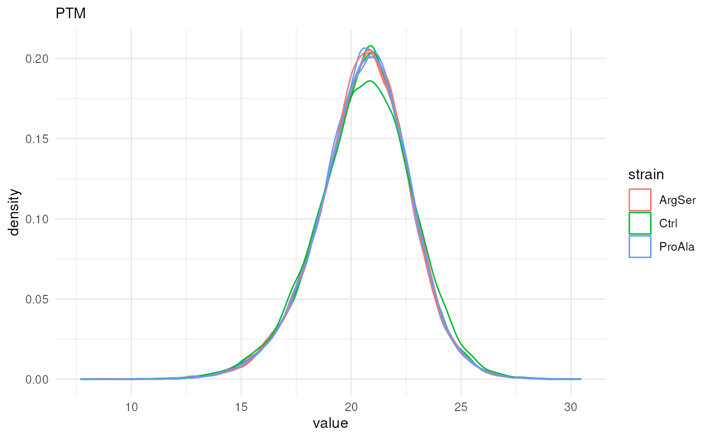

We remove temporarily objects

``` r

rm(se, seDup, mod, pos, ids, phosIds)
```

``` r

#Garbage collection to free space 
gc(); gc()
```

    ##            used  (Mb) gc trigger  (Mb)  max used   (Mb)
    ## Ncells 12022962 642.1   17865211 954.2  17865211  954.2
    ## Vcells 39477752 301.2   86064098 656.7 262547018 2003.1

    ##            used  (Mb) gc trigger  (Mb)  max used   (Mb)
    ## Ncells 12022963 642.1   17865211 954.2  17865211  954.2
    ## Vcells 39477790 301.2   86064098 656.7 262547018 2003.1

### Model estimation

Again we can estimate the same model but now for the usages.

``` r

qf <- msqrob(
  qf,
  i = "ptm",
  formula = model,
  robust = TRUE)
```

We enabled M-estimation (`robust = TRUE`) for improved robustness
against outliers.

``` r

#Garbage collection to free space 
gc(); gc()
```

    ##            used  (Mb) gc trigger   (Mb)  max used   (Mb)
    ## Ncells 12442628 664.6   22214481 1186.4  17865211  954.2
    ## Vcells 40581574 309.7   86064098  656.7 262547018 2003.1

    ##            used  (Mb) gc trigger   (Mb)  max used   (Mb)
    ## Ncells 12442635 664.6   22214481 1186.4  17865211  954.2
    ## Vcells 40581622 309.7   86064098  656.7 262547018 2003.1

### Inference

Contrasts remain the same. We assess the contrast for each precursor.

``` r

qf <- hypothesisTest(qf, i = "ptm", contrast = L)
```

Calculate log-transformed usages (relative differential abundances).

``` r

qf <- calculate_usage(qf, i_ptm = "ptm", i_ne = "proteins", contrasts = colnames(L))
```

We extract the results table from the `proteins` summarised experiment
in the `qf` object.

``` r

inferencesPtmUsage <- 
  msqrobCollect(qf[["ptm"]], L) |> 
  relocate(contains("sage"))
```

``` r

#Garbage collection to free space 
gc(); gc()
```

    ##            used  (Mb) gc trigger   (Mb)  max used   (Mb)
    ## Ncells 12509706 668.1   22214481 1186.4  22214481 1186.4
    ## Vcells 43548614 332.3   86064098  656.7 262547018 2003.1

    ##            used  (Mb) gc trigger   (Mb)  max used   (Mb)
    ## Ncells 12509707 668.1   22214481 1186.4  22214481 1186.4
    ## Vcells 43548652 332.3   86064098  656.7 262547018 2003.1

### Report results

We report the results using a results table, volcano plots and heatmaps.

#### Results table

``` r

for (j in colnames(L)) {

  inference <- inferencesPtmUsage |> 
    dplyr::filter(adjPval_usage < alpha & contrast == j)

  cat("**Median - Contrast:**", j, "= 0 (", nrow(inference),
      "significant proteins)\n\n")

  cat('<div style="max-height:300px; overflow-y:auto;">')

  print(
    kable(
      inference |>
        dplyr::arrange(pval) |>
        dplyr::relocate(feature),
      row.names = FALSE
    )
  )

  cat('</div>')

  cat("\n\n\n---\n\n")
}
```

**Median - Contrast:** strainCtrl = 0 ( 0 significant proteins)

| feature | logUsage | se_usage | t_usage | df_usage | pval_usage | adjPval_usage | logFC | se | df | t | pval | adjPval | logFC_ne | se_ne | df_ne | t_ne | pval_ne | adjPval_ne | contrast |
|----|----|----|----|----|----|----|----|----|----|----|----|----|----|----|----|----|----|----|----|

------------------------------------------------------------------------

**Median - Contrast:** strainProAla = 0 ( 0 significant proteins)

| feature | logUsage | se_usage | t_usage | df_usage | pval_usage | adjPval_usage | logFC | se | df | t | pval | adjPval | logFC_ne | se_ne | df_ne | t_ne | pval_ne | adjPval_ne | contrast |
|----|----|----|----|----|----|----|----|----|----|----|----|----|----|----|----|----|----|----|----|

------------------------------------------------------------------------

**Median - Contrast:** strainProAla - strainCtrl = 0 ( 1 significant
proteins)

| feature | logUsage | se_usage | t_usage | df_usage | pval_usage | adjPval_usage | logFC | se | df | t | pval | adjPval | logFC_ne | se_ne | df_ne | t_ne | pval_ne | adjPval_ne | contrast |
|:---|---:|---:|---:|---:|---:|---:|---:|---:|---:|---:|---:|---:|---:|---:|---:|---:|---:|---:|:---|
| P32324_763 | 2.255081 | 0.1526758 | 14.77039 | 6.603385 | 2.6e-06 | 0.0432843 | 2.094123 | 0.1468852 | 6.603385 | 14.25687 | 3.3e-06 | 0.0504516 | -0.1609579 | 0.0416488 | 7.740504 | -3.864644 | 0.0050886 | 0.1220742 | strainProAla - strainCtrl |

------------------------------------------------------------------------

#### Volcanoplots

``` r

inferencesPtmUsage |> 
  filter(is.finite(adjPval_usage)) |> 
  ggplot(aes(x = logUsage, 
             y = -log10(pval_usage), 
             col = adjPval_usage < alpha)) +
    geom_point(size = 1, alpha = 0.5) + 
    theme_bw() + 
    ylab("-log10(p-value)") + 
    scale_color_manual(values = c(`FALSE` = "black", `TRUE` = "red"), 
                       breaks = c("TRUE", "FALSE")) + 
    labs(color = paste0("FDR < ", alpha)) + 
    facet_wrap(~contrast) + 
    labs(title = "Usage")
```

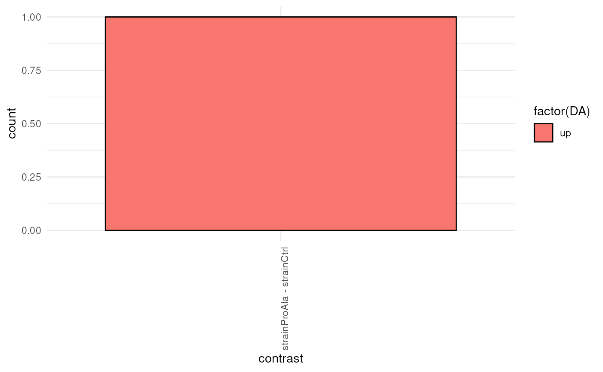

``` r

inferencesPtmUsage |> 
  filter(adjPval_usage < alpha) |> 
  mutate(DA = sign(logUsage) |> as.factor() |> recode("-1"= "down","1" = "up")) |>
  group_by(contrast, DA) |> 
  ggplot(aes(x = contrast)) +
  geom_bar(aes(fill = factor(DA)),
           colour = "black") +
  theme_minimal() + 
  theme(axis.text.x = element_text(angle = 90))
```


#### Detail plots

We can explore the data for a protein to validate the statistical
inference results. For example, let’s explore the precursor, summarized
PTM and summarised protein intensities for the PTM with the most
significant log2 fold change.

``` r

(target_feature <- inferencesPtmUsage |> 
   dplyr::slice(which.min(pval_usage)) |> 
   pull(feature)
)
```

    ## [1] "P32324_763"

``` r

inferencesPtmUsage |> 
  filter(feature == target_feature)
```

    ##                                        logUsage  se_usage    t_usage df_usage
    ## strainCtrl.P32324_763                -1.8058179 0.1445489 -12.492779 6.603385
    ## strainProAla.P32324_763               0.4492634 0.1468464   3.059411 6.603385
    ## strainProAla - strainCtrl.P32324_763  2.2550813 0.1526758  14.770395 6.603385
    ##                                        pval_usage adjPval_usage      logFC
    ## strainCtrl.P32324_763                7.728461e-06    0.12779782 -1.7136693
    ## strainProAla.P32324_763              1.971419e-02    0.90232289  0.3804542
    ## strainProAla - strainCtrl.P32324_763 2.645738e-06    0.04328427  2.0941234
    ##                                             se       df         t         pval
    ## strainCtrl.P32324_763                0.1379504 6.603385 -12.42236 8.011588e-06
    ## strainProAla.P32324_763              0.1403559 6.603385   2.71064 3.191573e-02
    ## strainProAla - strainCtrl.P32324_763 0.1468852 6.603385  14.25687 3.321220e-06
    ##                                         adjPval    logFC_ne      se_ne    df_ne
    ## strainCtrl.P32324_763                0.13557717  0.09214863 0.04317510 7.740504
    ## strainProAla.P32324_763              0.73171587 -0.06880924 0.04317510 7.740504
    ## strainProAla - strainCtrl.P32324_763 0.05045161 -0.16095787 0.04164883 7.740504
    ##                                           t_ne     pval_ne adjPval_ne
    ## strainCtrl.P32324_763                 2.134301 0.066493829  0.3514785
    ## strainProAla.P32324_763              -1.593725 0.150925890  0.6648050
    ## strainProAla - strainCtrl.P32324_763 -3.864644 0.005088624  0.1220742
    ##                                                       contrast    feature
    ## strainCtrl.P32324_763                               strainCtrl P32324_763
    ## strainProAla.P32324_763                           strainProAla P32324_763
    ## strainProAla - strainCtrl.P32324_763 strainProAla - strainCtrl P32324_763

``` r

ptm <-  qf[target_feature, , c("precursorsPTM_norm_unnested", "ptm")] |> #1
  longForm(colvars = colnames(colData(qf)), rowvars = "Protein.Group") |> #2
  data.frame()
```

    ## Warning: 'experiments' dropped; see 'drops()'

    ## harmonizing input:
    ##   removing 63 sampleMap rows not in names(experiments)
    ##   removing 9 colData rownames not in sampleMap 'primary'

``` r

protein <- qf[unique(ptm$Protein.Group), , c("proteins")] |> #1
  longForm(colvars = colnames(colData(qf)), rowvars = "Protein.Group") |> #2
  data.frame()
```

    ## Warning: 'experiments' dropped; see 'drops()'

    ## harmonizing input:
    ##   removing 72 sampleMap rows not in names(experiments)
    ##   removing 9 colData rownames not in sampleMap 'primary'

``` r

ptm_protein <- rbind(ptm, protein)
ylims <- ptm_protein |> 
  group_by(assay) |> 
  summarise(cent = mean(range(value,na.rm=TRUE)), ampl = diff(range(value,na.rm=TRUE))) |> 
  mutate(lower = cent - max(ampl)/2, 
         upper = cent + max(ampl)/2) |> 
  select(-c(cent, ampl))

ptm_protein |>
  filter(!is.na(value)) |>
  ggplot() +
  aes(x = sampleId,
      y = value) +
  geom_line(aes(group = rowname), linewidth = 0.1) +
  geom_point(aes(colour = strain)) +
  facet_wrap(~ assay, scales = "free") +
  ggh4x::facetted_pos_scales(
    y = list(
      assay == ylims$assay[1] ~ scale_y_continuous(limits = unlist(ylims[1,c("lower","upper")])),
      assay == ylims$assay[2] ~ scale_y_continuous(limits = unlist(ylims[2,c("lower","upper")])),
      assay == ylims$assay[3] ~ scale_y_continuous(limits = unlist(ylims[3,c("lower","upper")]))
    )
    ) +
  labs(subtitle = paste0("Protein:", sub("_"," / phosho-position: ", target_feature))) +
  theme_minimal() +
  theme(axis.text.x = element_blank())
```


``` r

rbind(ptm, protein) %>%
  {
  ggplot(.) +
  aes(x = strain,
      y = value) +
  geom_boxplot(aes(colour = strain)) +
  facet_wrap(~ assay, scales = "free") +
  geom_jitter(aes(shape = rowname)) +
  scale_shape_manual(values = seq_len(dplyr::n_distinct(.$rowname))) +
  labs(subtitle = paste0("Protein:", sub("_"," / phosho-position: ", target_feature))) +
  theme_minimal() +
  theme(axis.text.x = element_blank()) +
  guides(shape = "none")
  }
```

    ## Warning: Removed 5 rows containing non-finite outside the scale range
    ## (`stat_boxplot()`).

    ## Warning: Removed 5 rows containing missing values or values outside the scale range
    ## (`geom_point()`).

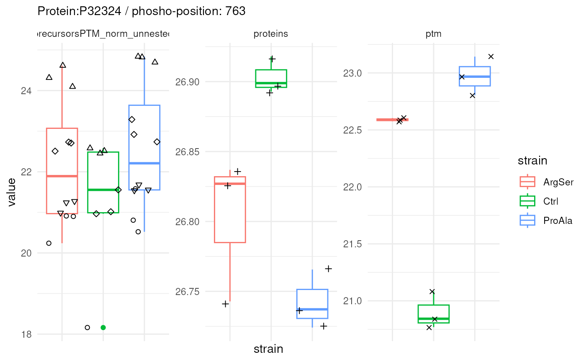

``` r

#Garbage collection to free space 
gc(); gc()
```

    ##            used  (Mb) gc trigger   (Mb)  max used   (Mb)
    ## Ncells 12510446 668.2   22214481 1186.4  22214481 1186.4
    ## Vcells 41283061 315.0   86064098  656.7 262547018 2003.1

    ##            used  (Mb) gc trigger   (Mb)  max used   (Mb)
    ## Ncells 12510447 668.2   22214481 1186.4  22214481 1186.4
    ## Vcells 41283099 315.0   86064098  656.7 262547018 2003.1

### Along Protein Mapping

In this section we will make Along Protein graphs. Therefore we need
sequence information on the protein sequence, which we can find in the
fasta file from uniprot that was used for mapping.

Note, that it is recommended to use the fasta that was used for the
mapping. However, this file was not uploaded by the authors so we use
the version of the current release for illustration purposes.

1.  Read fasta file (download it from uniprot)

``` r

fastaFile <- bfcrpath(bfc,"https://rest.uniprot.org/uniprotkb/stream?compressed=true&download=true&format=fasta&query=%28%28proteome%3AUP000002311%29+AND+reviewed%3Dtrue%29")
fasta <- seqinr::read.fasta(fastaFile, seqtype = "AA", as.string = T) #2.
```

2.  Extract the proteins from the fasta file.

``` r

# read in fasta file for protein sequence & length -> to calculate the coverage
mapping <- data.frame(fullName = fasta |> names(), 
                      accession = fasta |> names() |> stringr::str_split_i("\\|", 2),
                      sequence = unlist(fasta)) |> 
  mutate(length = nchar(sequence))
rownames(mapping) <- mapping$accession
```

#### PTM barcode plot

We make a barplot for all phosphorylated residues on protein P32324

We first gather the data:

1.  We extract the protein name
2.  we filter all PTMs for that protein
3.  we add the phospho-position in the rowData to it
4.  we make a new variable type to indicate if the PTM usage is up,
    down, non-significant or missing

``` r

prot <- sub("_.*","", target_feature) ## 1.
ptmListProt <- inferencesPtmUsage |> 
  filter(grepl(prot, feature)) |> ## 2. 
  left_join(rowData(qf[["ptm"]]) |> 
              as.data.frame() |> 
              select(Protein.Group.Mod, pos),
            by = c("feature" = "Protein.Group.Mod")) |> ## 3. 
  mutate(type = ifelse(is.na(adjPval_usage),  
                       "missing", 
                       ifelse(adjPval_usage < 0.05, 
                              ifelse(logUsage < 0, 
                                     "down",
                                     "up"),
                              "non-sig")) ## 4.
  )
```

We make the barplot by adding a geom_point layer and a vertical line
(geom_vline) to indicate the residue position.

``` r

ptmListProt |> 
  ggplot(aes(x=pos,y=0,col=type)) +
  geom_point() +
  geom_vline(aes(xintercept=pos,col=type)) + 
  xlab("residue") + 
  ylab("") +
  scale_color_manual(values = c("black","grey","blue","red"), 
                     breaks = c("missing","non-sig","down", "up")) +
  theme(
    axis.ticks.y = element_blank(),
    axis.text.y = element_blank(), 
    panel.grid = element_blank(),
    panel.background = element_blank(),
    panel.border = element_rect(color = "black", fill = NA),
    strip.background = element_rect(color = "black")
    ) +
  xlim(0, mapping[prot,"length"]) +
  ggtitle(paste0(prot, ": Phospho residues")) +
  facet_grid(contrast~.) 
```

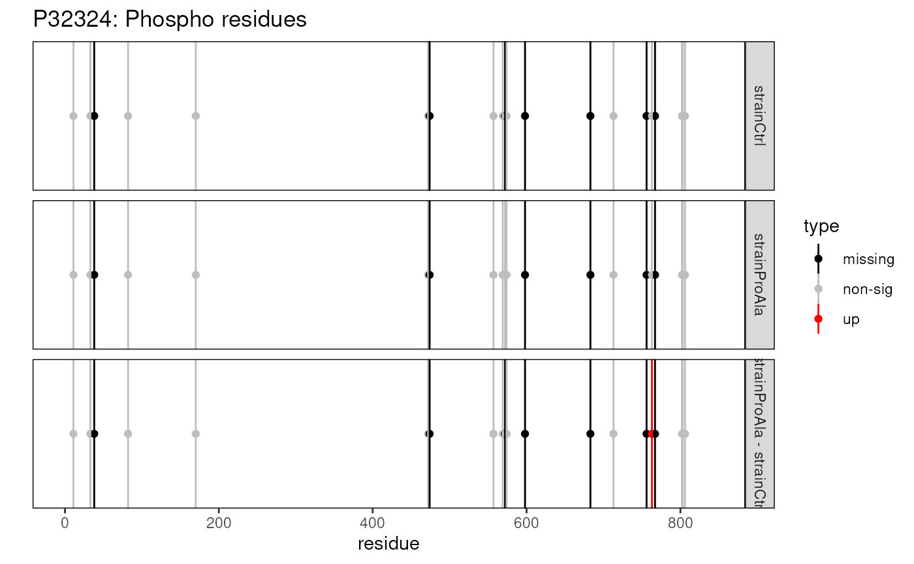

#### Along protein plot for all precursors

We first gather the data from all precursors that map to protein P32324

``` r

prot <- sub("_.*","", target_feature) ## 1.

precursorListProt <- inferencesUsage |> 
  left_join(rowData(qf[["precursorsPTM_norm"]]) |> 
              as.data.frame() |> 
              select(Precursor.Id, Protein.Group, Stripped.Sequence, Protein.Sites, Modified.Sequence),
            by = c("feature" = "Precursor.Id")) |> ## 2. 
  filter(Protein.Group == prot) |> ## 3. 
  mutate(seqOrder = as.factor(feature) |> as.numeric(),
         type = ifelse(is.na(adjPval_usage),  
                       "missing", 
                       ifelse(adjPval_usage < 0.05, 
                              ifelse(logUsage < 0, 
                                     "down",
                                     "up"),
                              "non-sig")), ## 4.
         tmp = str_locate_all(mapping[prot,"sequence"], Stripped.Sequence),
         start = purrr::map(tmp, ~ .x[, "start"]),
         end = purrr::map(tmp, ~ .x[, "end"])) |>
  unnest(c(start, end))
```

Add location of Phospo residues.

1.  Add a new variable with the modification type (21 is phosho)
2.  Add a new variable with the location of the modification on the
    original protein
3.  Make vector of the row numbers with duplicates for the sequences
    containing multiple PTMs
4.  Make a corresponding vector with the positions of the individual PTM
    sites
5.  Make a corresponding vector with the modification type
6.  Extract the ids of rows that correspond to phospho sites
7.  Make a data.frame with duplicate entries for precursors with
    multiple phospho sites with variables seqOrder, type and contrast
8.  Add the position of the phospho site

``` r

precursorListProt <-  precursorListProt |> mutate(
    mods  = str_extract_all(Modified.Sequence, 
                           "UniMod:[0-9]+") |> 
      lapply(FUN = gsub, pattern="UniMod:",replacement=""), ##1.
    pos = str_extract(Protein.Sites, 
                      "(?<=:)[^\\]]+") |> 
      strsplit(split = ",") |> 
      lapply(FUN=substr,start=2,stop=10000) |> 
      lapply(FUN=as.integer)) ## 2.

ids <- rep(precursorListProt |> 
             nrow() |>
             seq_len(), 
           precursorListProt |>
             pull(pos) |>
             sapply(FUN = length))## 3.
pos <- unlist(precursorListProt$pos) ## 4.
mod <- unlist(precursorListProt$mods) ## 5. 

phosIds <- ids[mod == "21"] ## 6.


precursorPosListProt <- precursorListProt[phosIds,] |> ## 7.
  select(seqOrder,type, contrast) |>
  mutate(pos = pos[mod == "21"]) ## 8.
```

Make along protein plot.

``` r

precursorListProt |> 
  ggplot(aes(y=seqOrder)) +
    geom_segment(aes(x = start, xend = end, yend = seqOrder, color = type),
                  linewidth = 1) + 
    xlim(0, mapping[prot,"length"]) +
  ylab("Precursors") + xlab("Residue") +  #6. 
  scale_y_continuous(breaks = precursorListProt$seqOrder, labels = precursorListProt$Stripped.Sequence) +
  scale_color_manual(values = c("black","grey","blue","red", "black"), 
                     breaks = c("missing","non-sig","down", "up", "black")) +
  geom_segment(data = precursorPosListProt,
               aes(x = pos, xend = pos, y = seqOrder - 0.5, yend = seqOrder + 0.5, 
                   color = "black"), linewidth = 1) +
  facet_grid(contrast~.) +
  theme(
    axis.ticks.y = element_blank(),
    axis.text.y = element_blank(), #We suppress the feature sequence here because there are too many sequences
    panel.grid = element_blank(),
    panel.background = element_blank(),
    panel.border = element_rect(color = "black", fill = NA),
    strip.background = element_rect(color = "black")
    ) +
    labs(title = paste0(prot, " along with precursors"),
           subtitle = "(phospho residue in black vertical line)") 
```

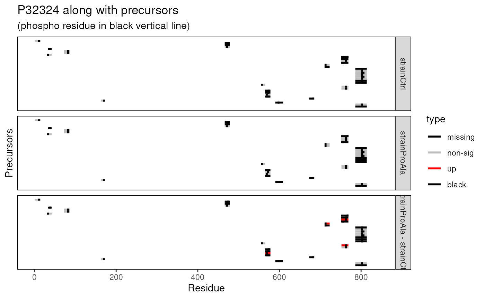
