# msqrob2PTM Workshop

## Background

- Mass spectrometry–based (MS) proteomics allows the identification and
  quantification of a myriad of posttranslational modifications (PTMs)
- This reveals additional complexity and diversity of the proteome.
- Indeed, PTMs greatly extend the number of different forms of a
  protein, that is, proteoforms, that can be found.
- More importantly, these PTMs can impact protein functions
- They are linked to a variety of diseases and developmental disorders.
- Aberrant PTM status can cause a number of detrimental effects ranging
  from the alteration of protein folding to the dysregulation of cell
  signaling.
- It is thus of great importance to study these PTMs in detail, not only
  through their correct identification but also by their correct
  quantification and subsequent statistical analysis.

### Vignette

In this vignette we start from quantified precursor level data to infer

- Differential abundance (DA) of precursors carrying
  post-translation-modifications,
- DA at the protein level
- Differential usage of precursors, i.e.  DA of precursors upon
  correction for DA at protein level
- Differential usage of PTMs, i.e. upon summarising the usages for all
  precursors that carry the same PTM at a specific residue (position in
  the protein),

using the msqrob2PTM workflow in the bioconductor package
[msqrob2](https://www.bioconductor.org/packages/release/bioc/html/msqrob2.html).

You can read more about

- `msqrob2` on <https://statomics.github.io/msqrob2book/>
- `msqrob2PTM` in msqrob2PTM: Differential Abundance and Differential
  Usage Analysis of MS-Based Proteomics Data at the Posttranslational
  Modification and Peptidoform Level. N. Demeulemeester, M. Gébelin, L.
  Caldi Gomes, C. Carapito, L. Martens and L. Clement. Molecular &
  Cellular Proteomics, 2023; 23.
  <https://doi.org/10.1016/j.mcpro.2023.100708>

### Conventional MS-based workflow

In a nutshell, the wetlab workflow starts with sample preparation where
the samples are collected, and the protein content is extracted and
digested into peptides. To reduce the sample complexity, the peptides
are then separated based on physicochemical properties (mostly
hydrophobicity) using liquid chromatography (LC). Peptides are then
ionised by an electrospray as they elute from the chromatographic
column. The signal over time generated by the eluting ions is called the
total ion chromatogram. The ions are then sent for a first round of MS
to record their m/z distribution for the intact ions. This provides an
overview of the ions that elute from the column and allows for further
separation of the ions in the m/z space. The second round of MS (MS2)
records the fragmented ions for a selection of ions, generally the most
intense MS1 peaks[^1]. This process is repeated for every sample so that
every sample is acquired in one MS run. This provides the ion’s mass
fingerprint. For LFQ workflows, the accumulated MS1 intensity over time,
also known as the area under the curve, around the target mass is used
as a quantification measure. On the other hand, the ion mass
fingerprint, called the MS2 spectrum, enables computational
identification of the corresponding peptide using search engines
(e.g. Andromeda has been used for this data set) that will provide
peptide-to-spectrum matches (PSM). The quantified PSM are further
processed by a search engine, e.g. MaxQuant.


Overview of an LFQ-based proteomics workflow.

- Peptide Characteristics

  - Modifications
  - Ionisation Efficiency: huge variability
  - Identification
    - Misidentification $`\rightarrow`$ outliers
    - MS$`^2`$ selection on peptide abundance
    - Context depending missingness
    - Non-random missingness

$`\rightarrow`$ Unbalanced peptide identifications across samples and
messy data

### Data Independent Acquisition

With data independent acquisition, however, the second round of MS (MS2)
does not record fragmented ions for selected ions. Instead the
instrument divides the m/z range into sequential windows (e.g., 400–425,
425–450 m/z) and all ions within each window are fragmented together.
This continues across the full mass range resulting in a systematic
fragmentation of all peptides. Hence, the MS2 spectra are complex as
many peptides mixed. So search engines and quantification software, such
as DIA-NN and Spectronaut, have to deconvolute the complex MS2 spectra
so as to identify and quantify individual precursors (MS1) in the m/z
window using their MS2 fragments. Hence, the quantification can be done
using either MS1 or MS2.


Data-independent acquisition.

- m/z range into sequential windows (e.g., 400–425, 425–450 m/z)

- MS2 spectra are complex as many peptides mixed

- Deconvolution of the MS2 signal using ion mobility and retention time

- With dedicated software such as Spectronaut or DIA-NN

  - Identification based on spectral libraries
  - Library free: FASTA database to predict in silico spectra, retention
    times, and ion mobilities, which are then used to search the DIA
    data
  - Use of decoys sequences to estimate false discovery rate of ID

- Quantification using MS2 and/or MS1 peaks

### Level of quantification

- MS-based proteomics returns peptides or precursors: pieces of proteins


- Quantification commonly required on the protein level


Here, we will also quantify directly at the precursor level because we
are interested in DA and DU of precursors that carry phosphorylations.

Moreover, we will also aggregate all precursors that carry a PTM on the
same residue of the protein to infer PTM DA and DU.

### Challenges

Behind this workflow lies several challenges that will affect the data
modelling:

- MS-based proteomics does not measure proteins directly, but their
  constituting **peptide ions**. The protein-level information needs to
  be reconstructed from the ion data. In this tutorial, we will start
  from the precursor-level data, which has been constructed from the ion
  data by DIA-NN.
- All peptides do not ionise with the same efficiency. Poor ionisation
  will lead to reduced signal as less ions will hit the detector, hence
  leading to a huge variability in intensity among different peptide
  species, even when they originate from the same protein.
- The identification step is not trivial and prone to errors[^2]. PSM
  misidentification leads to the assignment of a quantitative values
  from another peptide with likely another ionisation efficiency and
  relative abundance. Hence this misassigned values often lead to
  outliers.
- Moreover, there is a widespread data missingness, which is often
  related to the underlying quantification value. This phenomenon is
  known as missingness not at random. Next to that, many reasons can
  lead to ions not being identified irrespective of their quantification
  value leading to missingness that is not related to its quantitative
  value. This is referred to as missingness completely at random. The
  missingness issue is not negligible as we shall see upon reading the
  data.
- Identification issues lead to unbalanced peptide missingness across
  samples, and the patterns of missing values are potentially different
  for every peptide, highlighting the need for an automatised solution
  that is robust against missing values.
- Technical variations during the experiment can lead to systematic
  fluctuations across samples. The most obvious reason is when different
  sample amounts are injected into the instruments, due to small
  pipetting inconsistencies for instance. However, these differences
  lead to unwanted variation that should be discarded when answering
  biological questions.

### Experiment

Mutations in tRNAs can lead to mis-incorporation of an amino acid into a
growing polypeptide chain that differs from what is specified by the
mRNA in a process known as mistranslation. To better understand the
impact of mistranslating tRNA variants, Berg et al.  profiled the
proteome and phosphoproteome of yeast expressing three different
mistranslating tRNAs. The first is a proline tRNA with a G3:U70 base
pair in its acceptor stem that mis-incorporates alanine at proline
codons (Pro -\> Ala; Hoffman et al. 2017). The other two are serine
tRNAs with either a UGG proline or UCU arginine anticodon which
mis-incorporate serine at proline (Pro -\> Ser) or serine at arginine
codons (Arg -\> Ser), respectively (Berg et al. 2017, 2019b).

Six replicates of each strain were grown. From each replicate an
non-enriched (whole proteome) and a phospho-peptide-enriched sample was
prepared and quantified using a data independent acquisition workflow.

The data for the non-enriched and phospho-enriched samples are deposited
to PRIDE, dataset identifiers PXD068388 and PXD068392).

Summary:

- Mutations in tRNAs can lead to mis-incorporation of amino acids during
  protein translation.
- 4 strains: WT, 3 strains with mutations leading to miss-incorporations
  (Pro -\> Ala, Pro -\> Ser and Arg -\> Ser).
- 6 biological repeats per strain
- For each biological repeat: non-enriched and phospho-enriched MS run.

M. Berg, A. Chang, R. Rodriguez-Mias, J. Villén, Mistranslating tRNA
variants impact the proteome and phosphoproteome of Saccharomyces
cerevisiae, G3 Genes\|Genomes\|Genetics, Volume 16, Issue 2, February
2026, jkaf284, <https://doi.org/10.1093/g3journal/jkaf284>

## Preamble

### Load packages

We load the `msqrob2` package, along with additional packages for data
manipulation and visualisation.

``` r

suppressPackageStartupMessages({
library("QFeatures")  
library("dplyr") 
library("tidyr")
library("ggplot2")
library("msqrob2")    
library("stringr")
library("ExploreModelMatrix")
library("MsCoreUtils") 
library("matrixStats")
library("patchwork")
library("kableExtra")
library("ComplexHeatmap")
library("purrr")
library("tibble")
library("scater")
library("BiocFileCache")
})
```

### Data

#### Precursor table

- We load the output from DIA-NN parquet files.
- Can be file path to local file or url to file that lives on the web.
- Here we use BiocFileCache so that we do not need to download the files
  again each time that the script is knit.

``` r

bfc <- BiocFileCache() # for usage in local rstudio session on local machine
precursorFile <- bfcrpath(bfc,"https://zenodo.org/records/20414816/files/WholeProteome_DIANNreport.parquet?download=1")
precursorFilePTM <- bfcrpath(bfc,"https://zenodo.org/records/20414816/files/Phosphoproteome_DIANNreport.parquet?download=1")
```

We can import the report.parquet file using the `read_parquet` function
from the `arrow` package.

``` r

precursors <- arrow::read_parquet(precursorFile) # function from the arrow package
precursorsPTM <- arrow::read_parquet(precursorFilePTM) # function from the arrow package
#precursors <- data.table::fread(precursorFile) # For older versions the results are stored as tsv files. 
```

We subset the precursor files to reduce the memory footprint and only
keep the variables that we need in the downstream analysis.

Note that `Protein.Sites` refers to the exact modified residue position
in the full protein sequence, which will be useful when assessing
PTM-level quantification.

Note, that we also filter out the strain with the ProSer variant here.

``` r

precursors <- precursors |> 
  filter(!grepl("ProSer",Run)) |>
  select(
         Run, 
         Precursor.Id, 
         Modified.Sequence, 
         Stripped.Sequence, 
         Precursor.Charge, 
         Protein.Group, 
         Protein.Names,
         Protein.Ids,
         Protein.Sites, #exact modified residue position in the full protein sequence
         Genes,
         Precursor.Quantity,
         Precursor.Normalised,
         Normalisation.Factor,
         Ms1.Area,
         Ms1.Normalised,
         PG.MaxLFQ,
         Q.Value, 
         Lib.Q.Value,
         PG.Q.Value,
         Lib.PG.Q.Value,
         Proteotypic,
         Decoy, # Not available in older versions of DIA-NN
         RT)
precursorsPTM <- precursorsPTM |> 
  filter(!grepl("ProSer",Run)) |>
  select(
         Run, 
         Precursor.Id, 
         Modified.Sequence, 
         Stripped.Sequence, 
         Precursor.Charge, 
         Protein.Group, 
         Protein.Names,
         Protein.Ids,
         Protein.Sites, #exact modified residue position in the full protein sequence
         Genes,
         Precursor.Quantity,
         Precursor.Normalised,
         Normalisation.Factor,
         Ms1.Area,
         Ms1.Normalised,
         PG.MaxLFQ,
         Q.Value, 
         Lib.Q.Value,
         PG.Q.Value,
         Lib.PG.Q.Value,
         Proteotypic,
         Decoy, # Not available in older versions of DIA-NN
         RT)
```

``` r

precursorsPTM |> 
  select(Protein.Sites, Modified.Sequence, Stripped.Sequence) |> 
  head(20)
```

    ## # A tibble: 20 × 3
    ##    Protein.Sites      Modified.Sequence                        Stripped.Sequence
    ##    <chr>              <chr>                                    <chr>            
    ##  1 [P52871:A2,S4]     (UniMod:1)AAS(UniMod:21)VPPGGQR          AASVPPGGQR       
    ##  2 [P52871:A2,S4]     (UniMod:1)AAS(UniMod:21)VPPGGQR          AASVPPGGQR       
    ##  3 [P52871:A2,S4]     (UniMod:1)AAS(UniMod:21)VPPGGQR          AASVPPGGQR       
    ##  4 [P52871:A2,S4]     (UniMod:1)AAS(UniMod:21)VPPGGQR          AASVPPGGQR       
    ##  5 [P52871:A2,S4]     (UniMod:1)AAS(UniMod:21)VPPGGQR          AASVPPGGQR       
    ##  6 [P52871:A2,S4]     (UniMod:1)AAS(UniMod:21)VPPGGQR          AASVPPGGQR       
    ##  7 [P04147:A2,T5]     (UniMod:1)ADIT(UniMod:21)DKTAEQLENLNIQD… ADITDKTAEQLENLNI…
    ##  8 [P04147:A2,T5]     (UniMod:1)ADIT(UniMod:21)DKTAEQLENLNIQD… ADITDKTAEQLENLNI…
    ##  9 [P04147:A2,T5]     (UniMod:1)ADIT(UniMod:21)DKTAEQLENLNIQD… ADITDKTAEQLENLNI…
    ## 10 [P04147:A2,T8]     (UniMod:1)ADITDKT(UniMod:21)AEQLENLNIQD… ADITDKTAEQLENLNI…
    ## 11 [P04147:A2,T8]     (UniMod:1)ADITDKT(UniMod:21)AEQLENLNIQD… ADITDKTAEQLENLNI…
    ## 12 [P04147:A2,T8]     (UniMod:1)ADITDKT(UniMod:21)AEQLENLNIQD… ADITDKTAEQLENLNI…
    ## 13 [P04147:A2,T8]     (UniMod:1)ADITDKT(UniMod:21)AEQLENLNIQD… ADITDKTAEQLENLNI…
    ## 14 [P04147:A2,T8]     (UniMod:1)ADITDKT(UniMod:21)AEQLENLNIQD… ADITDKTAEQLENLNI…
    ## 15 [P04147:A2,T8]     (UniMod:1)ADITDKT(UniMod:21)AEQLENLNIQD… ADITDKTAEQLENLNI…
    ## 16 [P04147:A2,T8]     (UniMod:1)ADITDKT(UniMod:21)AEQLENLNIQD… ADITDKTAEQLENLNI…
    ## 17 [P04147:A2,T8]     (UniMod:1)ADITDKT(UniMod:21)AEQLENLNIQD… ADITDKTAEQLENLNI…
    ## 18 [P40096:A2,T8,M32] (UniMod:1)ADQVPVT(UniMod:21)TQLPPIKPEHE… ADQVPVTTQLPPIKPE…
    ## 19 [P40096:A2,T8,M32] (UniMod:1)ADQVPVT(UniMod:21)TQLPPIKPEHE… ADQVPVTTQLPPIKPE…
    ## 20 [P40096:A2,T8,M32] (UniMod:1)ADQVPVT(UniMod:21)TQLPPIKPEHE… ADQVPVTTQLPPIKPE…

Garbage collection to free space

``` r

gc(); gc()
```

    ##            used  (Mb) gc trigger   (Mb)  max used   (Mb)
    ## Ncells 10309403 550.6   17340017  926.1  12838751  685.7
    ## Vcells 61238365 467.3  210119764 1603.1 262549457 2003.1

    ##            used  (Mb) gc trigger   (Mb)  max used   (Mb)
    ## Ncells 10309528 550.6   17340017  926.1  12838751  685.7
    ## Vcells 61238682 467.3  168095812 1282.5 262549457 2003.1

#### Subset phospho

In DIA-NN phosphorylation is indicated with (UniMod:21) in the sequence
stored in variable `Modified.Sequence`. This variable contains the
precursor sequence along with its modifications.

Here, we only keep precursors that are phosphorylated, i.e. with pattern
`(UniMod:21)` in the variable `Modified.Sequence`.

``` r

precursorsPTM <- precursorsPTM |>
  filter(grepl(pattern = "\\(UniMod:21\\)", Modified.Sequence)) 
```

Garbage collection to free space

``` r

gc(); gc()
```

    ##            used  (Mb) gc trigger   (Mb)  max used   (Mb)
    ## Ncells 10305278 550.4   17340017  926.1  12838751  685.7
    ## Vcells 59586268 454.7  168095812 1282.5 262549457 2003.1

    ##            used  (Mb) gc trigger   (Mb)  max used   (Mb)
    ## Ncells 10305285 550.4   17340017  926.1  12838751  685.7
    ## Vcells 59586315 454.7  168095812 1282.5 262549457 2003.1

#### Quick check for imputation

Quick check on distribution of precursors MS2 intensities.

``` r

precursors |> 
  filter(is.finite(Precursor.Quantity) & Precursor.Quantity > 0) |>
  ggplot(aes(x = log2(Precursor.Quantity))) +
  geom_density() +
  theme_minimal() +
  labs(subtitle = "Abundances (non-enriched)") + precursorsPTM |> 
  filter(is.finite(Precursor.Quantity) & Precursor.Quantity > 0) |>
  ggplot(aes(x = log2(Precursor.Quantity))) +
  geom_density() +
  theme_minimal() +
  labs(subtitle = "Abundances (phospho-enriched)")
```


Seems no imputation has been done.

``` r

#Garbage collection to free space 
gc(); gc()
```

    ##             used  (Mb) gc trigger   (Mb)  max used   (Mb)
    ## Ncells  10541429 563.0   17340017  926.1  13472152  719.5
    ## Vcells 100088206 763.7  168095812 1282.5 262549457 2003.1

    ##             used  (Mb) gc trigger   (Mb)  max used   (Mb)
    ## Ncells  10541418 563.0   17340017  926.1  13472152  719.5
    ## Vcells 100088224 763.7  168095812 1282.5 262549457 2003.1

#### Sample annotation tables

The [sample annotation table](#sec-annotation_table)) is not available
and can be generated from the run labels, as the researchers included
information on the design in the filenames.

1.  Extract unique Run labels
2.  Split Run label into variables using the “\_” separator
3.  Rename the variable Run to runCol (needed for `readQFeatures`
    function)
4.  Add sampleId
5.  Sort annotation file according to sampleId

``` r

annot <- precursors |> 
  dplyr::distinct(Run) |>  ## 1.
  separate(Run,
           into=c("run","label2","strain","rep","type","acquisition"),
           sep="_",
           remove=FALSE) |>   ## 2.
  rename(runCol = Run) |> ## 3.
  mutate(sampleId = paste0(strain,rep)) |> #4.
  arrange(sampleId) #5.
annot
```

    ## # A tibble: 18 × 8
    ##    runCol                   run   label2 strain rep   type  acquisition sampleId
    ##    <chr>                    <chr> <chr>  <chr>  <chr> <chr> <chr>       <chr>   
    ##  1 e14629_MB057_ArgSer_01_… e146… MB057  ArgSer 01    Prot… DIA         ArgSer01
    ##  2 e14632_MB057_ArgSer_02_… e146… MB057  ArgSer 02    Prot… DIA         ArgSer02
    ##  3 e14639_MB057_ArgSer_03_… e146… MB057  ArgSer 03    Prot… DIA         ArgSer03
    ##  4 e14644_MB057_ArgSer_04_… e146… MB057  ArgSer 04    Prot… DIA         ArgSer04
    ##  5 e14650_MB057_ArgSer_05_… e146… MB057  ArgSer 05    Prot… DIA         ArgSer05
    ##  6 e14653_MB057_ArgSer_06_… e146… MB057  ArgSer 06    Prot… DIA         ArgSer06
    ##  7 e14627_MB057_Ctrl_01_Pr… e146… MB057  Ctrl   01    Prot… DIA         Ctrl01  
    ##  8 e14635_MB057_Ctrl_02_Pr… e146… MB057  Ctrl   02    Prot… DIA         Ctrl02  
    ##  9 e14638_MB057_Ctrl_03_Pr… e146… MB057  Ctrl   03    Prot… DIA         Ctrl03  
    ## 10 e14642_MB057_Ctrl_04_Pr… e146… MB057  Ctrl   04    Prot… DIA         Ctrl04  
    ## 11 e14648_MB057_Ctrl_05_Pr… e146… MB057  Ctrl   05    Prot… DIA         Ctrl05  
    ## 12 e14654_MB057_Ctrl_06_Pr… e146… MB057  Ctrl   06    Prot… DIA         Ctrl06  
    ## 13 e14630_MB057_ProAla_01_… e146… MB057  ProAla 01    Prot… DIA         ProAla01
    ## 14 e14634_MB057_ProAla_02_… e146… MB057  ProAla 02    Prot… DIA         ProAla02
    ## 15 e14640_MB057_ProAla_03_… e146… MB057  ProAla 03    Prot… DIA         ProAla03
    ## 16 e14643_MB057_ProAla_04_… e146… MB057  ProAla 04    Prot… DIA         ProAla04
    ## 17 e14647_MB057_ProAla_05_… e146… MB057  ProAla 05    Prot… DIA         ProAla05
    ## 18 e14655_MB057_ProAla_06_… e146… MB057  ProAla 06    Prot… DIA         ProAla06

We do the same for the phospho data.

``` r

annotPTM <- precursorsPTM |> 
   dplyr::distinct(Run) |>  ## 1.
  separate(Run,
           into=c("label1","label2","strain","rep","type","acquisition"),
           sep="_",
           remove=FALSE) |>   ## 2.
  rename(runCol = Run) |> ## 3.
  mutate(sampleId = paste0(strain,rep)) |> #4.
  arrange(sampleId) #5.
annotPTM
```

    ## # A tibble: 18 × 8
    ##    runCol                  label1 label2 strain rep   type  acquisition sampleId
    ##    <chr>                   <chr>  <chr>  <chr>  <chr> <chr> <chr>       <chr>   
    ##  1 e14488_MB057_ArgSer_01… e14488 MB057  ArgSer 01    Phos… DIA         ArgSer01
    ##  2 e14491_MB057_ArgSer_02… e14491 MB057  ArgSer 02    Phos… DIA         ArgSer02
    ##  3 e14498_MB057_ArgSer_03… e14498 MB057  ArgSer 03    Phos… DIA         ArgSer03
    ##  4 e14503_MB057_ArgSer_04… e14503 MB057  ArgSer 04    Phos… DIA         ArgSer04
    ##  5 e14509_MB057_ArgSer_05… e14509 MB057  ArgSer 05    Phos… DIA         ArgSer05
    ##  6 e14512_MB057_ArgSer_06… e14512 MB057  ArgSer 06    Phos… DIA         ArgSer06
    ##  7 e14486_MB057_Ctrl_01_P… e14486 MB057  Ctrl   01    Phos… DIA         Ctrl01  
    ##  8 e14494_MB057_Ctrl_02_P… e14494 MB057  Ctrl   02    Phos… DIA         Ctrl02  
    ##  9 e14497_MB057_Ctrl_03_P… e14497 MB057  Ctrl   03    Phos… DIA         Ctrl03  
    ## 10 e14501_MB057_Ctrl_04_P… e14501 MB057  Ctrl   04    Phos… DIA         Ctrl04  
    ## 11 e14507_MB057_Ctrl_05_P… e14507 MB057  Ctrl   05    Phos… DIA         Ctrl05  
    ## 12 e14513_MB057_Ctrl_06_P… e14513 MB057  Ctrl   06    Phos… DIA         Ctrl06  
    ## 13 e14489_MB057_ProAla_01… e14489 MB057  ProAla 01    Phos… DIA         ProAla01
    ## 14 e14493_MB057_ProAla_02… e14493 MB057  ProAla 02    Phos… DIA         ProAla02
    ## 15 e14499_MB057_ProAla_03… e14499 MB057  ProAla 03    Phos… DIA         ProAla03
    ## 16 e14502_MB057_ProAla_04… e14502 MB057  ProAla 04    Phos… DIA         ProAla04
    ## 17 e14506_MB057_ProAla_05… e14506 MB057  ProAla 05    Phos… DIA         ProAla05
    ## 18 e14514_MB057_ProAla_06… e14514 MB057  ProAla 06    Phos… DIA         ProAla06

``` r

#Garbage collection to free space 
gc(); gc()
```

    ##             used  (Mb) gc trigger   (Mb)  max used   (Mb)
    ## Ncells  10554812 563.7   17340017  926.1  13472152  719.5
    ## Vcells 100118703 763.9  168095812 1282.5 262549457 2003.1

    ##             used  (Mb) gc trigger   (Mb)  max used   (Mb)
    ## Ncells  10554768 563.7   17340017  926.1  13472152  719.5
    ## Vcells 100118666 763.9  168095812 1282.5 262549457 2003.1

### Convert to QFeatures

`msqrob2` is built around the `QFeatures` class. We refer to the [R for
mass spectrometry
book](https://rformassspectrometry.github.io/book/sec-quant.html) for a
comprehensive description of the class. In a nutshell, the `QFeatures`
package provides infrastructure to manage and analyse quantitative
features from mass spectrometry experiments. It is based on the
`SummarizedExperiment` and `MultiAssayExperiment` classes. It leverages
the hierarchical structure of proteomics experiments: data proteins are
composed of peptides, themselves produced by spectra. Each piece of
information in stored in an individual `SummarizedExperiment` object,
later referred to as a “set”. Throughout the aggregation and processing
of these data, the relations between sets are tracked and recorded, thus
allowing users to easily navigate across spectra, peptide and protein
quantitative data. Note, that for DIA data we start from precursor-level
data and typically opt to summarize the precursor-level data immediately
into protein level data.


Illustration of the `QFeatures` data class.

The
[`readQFeatures()`](https://rformassspectrometry.github.io/QFeatures/reference/readQFeatures.html)
enables a seamless conversion of tabular data into a `QFeatures` object.
We provide the feature table and the sample annotation table. If the
table is of wide format, `readQFeatures` will use the `quantCols` column
in the sample annotation table to understand which columns in feature
table contain the quantitative values, and automatically link the
corresponding sample annotation with the quantitative values. We also
tell the function to use as specific column as feature identifier, which
will be used as rownames. See `?readQFeatures()` for more details.

First, recall that the precursor table is file in long format. Every
quantitative column in the precursor table contains information for
multiple runs. Therefore, the function split the table based on the run
identifier, given by the `runCol` argument (for DIA-NN, that identifier
is contained in `Run`). So, the `QFeatures` object after import will
contain as many sets as there are runs. Next, the function links the
annotation table with the PSM data. To achieve this, the annotation
table must contain a `runCol` column that provides the run identifier in
which each sample has been acquired, and this information will be used
to match the identifiers in the `Run` column of the precursor table.

Here, we will use the `Precursor.Quantity` column as quantification
input.

1.  We first combine the precursor and precursorPTM table in a list of
    QFeatures objects,
2.  which we subsequently reduce in one QFeatures object. Note that in
    QFeatures, the function [`c()`](https://rdrr.io/r/base/c.html) is
    defined to merge QFeatures objects, stacking all assays together
    into a single object.

This allows us to store the data of the phospho-enriched and the
non-enriched samples in the same QFeatures `object`.

``` r

(qf <- list(
  readQFeatures(assayData = precursors,  
                              colData = annot,
                              quantCols = "Precursor.Quantity",
                              runCol = "Run",
                              fnames = "Precursor.Id"),
  readQFeatures(assayData = precursorsPTM,  
                              colData = annotPTM,
                              quantCols = "Precursor.Quantity",
                              runCol = "Run",
                              fnames = "Precursor.Id") ##1.
) |> purrr::reduce(c) ##2.
)
```

    ## Checking arguments.

    ## Loading data as a 'SummarizedExperiment' object.

    ## Splitting data in runs.

    ##   |                                                                              |                                                                      |   0%  |                                                                              |====                                                                  |   6%  |                                                                              |========                                                              |  11%  |                                                                              |============                                                          |  17%  |                                                                              |================                                                      |  22%  |                                                                              |===================                                                   |  28%  |                                                                              |=======================                                               |  33%  |                                                                              |===========================                                           |  39%  |                                                                              |===============================                                       |  44%  |                                                                              |===================================                                   |  50%  |                                                                              |=======================================                               |  56%  |                                                                              |===========================================                           |  61%  |                                                                              |===============================================                       |  67%  |                                                                              |===================================================                   |  72%  |                                                                              |======================================================                |  78%  |                                                                              |==========================================================            |  83%  |                                                                              |==============================================================        |  89%  |                                                                              |==================================================================    |  94%  |                                                                              |======================================================================| 100%

    ## Formatting sample annotations (colData).

    ## Formatting data as a 'QFeatures' object.

    ## Setting assay rownames.

    ## Checking arguments.

    ## Loading data as a 'SummarizedExperiment' object.

    ## Splitting data in runs.

    ##   |                                                                              |                                                                      |   0%  |                                                                              |====                                                                  |   6%  |                                                                              |========                                                              |  11%  |                                                                              |============                                                          |  17%  |                                                                              |================                                                      |  22%  |                                                                              |===================                                                   |  28%  |                                                                              |=======================                                               |  33%  |                                                                              |===========================                                           |  39%  |                                                                              |===============================                                       |  44%  |                                                                              |===================================                                   |  50%  |                                                                              |=======================================                               |  56%  |                                                                              |===========================================                           |  61%  |                                                                              |===============================================                       |  67%  |                                                                              |===================================================                   |  72%  |                                                                              |======================================================                |  78%  |                                                                              |==========================================================            |  83%  |                                                                              |==============================================================        |  89%  |                                                                              |==================================================================    |  94%  |                                                                              |======================================================================| 100%

    ## Formatting sample annotations (colData).

    ## Formatting data as a 'QFeatures' object.

    ## Setting assay rownames.

    ## An instance of class QFeatures (type: bulk) with 36 sets:
    ## 
    ##  [1] e14627_MB057_Ctrl_01_Proteome_DIA: SummarizedExperiment with 76148 rows and 1 columns 
    ##  [2] e14629_MB057_ArgSer_01_Proteome_DIA: SummarizedExperiment with 74225 rows and 1 columns 
    ##  [3] e14630_MB057_ProAla_01_Proteome_DIA: SummarizedExperiment with 75711 rows and 1 columns 
    ##  ...
    ##  [34] e14512_MB057_ArgSer_06_Phospho_DIA: SummarizedExperiment with 28688 rows and 1 columns 
    ##  [35] e14513_MB057_Ctrl_06_Phospho_DIA: SummarizedExperiment with 29944 rows and 1 columns 
    ##  [36] e14514_MB057_ProAla_06_Phospho_DIA: SummarizedExperiment with 30520 rows and 1 columns

Remove data tables to free space.

``` r

rm(precursors, precursorsPTM)
```

``` r

#Garbage collection to free space 
gc(); gc()
```

    ##             used  (Mb) gc trigger   (Mb)  max used   (Mb)
    ## Ncells  10595372 565.9   17340017  926.1  17340017  926.1
    ## Vcells 101654557 775.6  168095812 1282.5 262549457 2003.1

    ##             used  (Mb) gc trigger   (Mb)  max used   (Mb)
    ## Ncells  10595376 565.9   17340017  926.1  17340017  926.1
    ## Vcells 101654600 775.6  168095812 1282.5 262549457 2003.1

## Data preprocessing

Here we conduct the following processing steps

1.  Replace zero’s by NA.
2.  Precursor filtering and assay joining
3.  Log-transformation
4.  Normalisation
5.  Summarisation for non-enriched runs

### Encoding missing values

We first replace any zero in the quantitative data with an `NA`.

``` r

qf <- zeroIsNA(qf, names(qf))
```

Note that `msqrob2` can handle missing data without having to rely on
hard-to-verify imputation assumptions, which is our general
recommendation. However, `msqrob2` does not prevent users from using
imputation, which can be performed with
[`impute()`](https://rdrr.io/pkg/ProtGenerics/man/protgenerics.html)
from the `QFeatures` package.

### Precursor Filtering

Filtering removes low-quality and unreliable precursors that would
otherwise introduce noise and artefacts in the data.

#### Remove questionable identifications

We apply standard filtering:

1.  q-value threshold of 0.01 for the identification of precursors
    (`Q.Value`) and protein groups (`PG.Q.Value`). If the file is
    processed via matching between runs, it is also useful to filter on
    Lib.Q.Value and Lib.PG.Q.Value.

2.  Remove precursors that could not be mapped, i.e. when `Precursor.Id`
    column is an empty string.

3.  Filter decoys, i.e. only keep precursors for which the `Decoy`
    column equals

4.  (Note, that the `Decoy` column is not present in the output of older
    versions of DIA-NN).

5.  Keeping only proteotypic peptides, which map uniquely to a specific
    protein.

``` r

qf <-  qf |>
  filterFeatures(~ Q.Value <= 0.01 & #1.
                     PG.Q.Value <= 0.01 &  #1.
                     Lib.Q.Value <= 0.01 & #1.
                     Lib.PG.Q.Value <= 0.01 & #1.
                     Precursor.Id != "" & #2.
                     Decoy == 0 & #3. (Note, that this filter is not available with previous versions of DIA-NN, as the report.tsv file did not include a Decoy column. So other strategies are needed if Decoys are in the output file.)
                     Proteotypic == 1) #4.
```

    ## 'Q.Value' found in 36 out of 36 assay(s).'PG.Q.Value' found in 36 out of 36 assay(s).'Lib.Q.Value' found in 36 out of 36 assay(s).'Lib.PG.Q.Value' found in 36 out of 36 assay(s).'Precursor.Id' found in 36 out of 36 assay(s).'Decoy' found in 36 out of 36 assay(s).'Proteotypic' found in 36 out of 36 assay(s).

Note, that it is important that the filtering criteria are not
distorting the distribution of the test statistics in the downstream
analysis for features that are non-DA. It can be shown that filtering
will not induce bias results when the filtering criterion is independent
of test statistic. The criteria that we proposed above are all based on
the results of the identification step, hence, they are independent of
the downstream test statistics that will be used to prioritize DA
proteins.

``` r

#Garbage collection to free space 
gc(); gc()
```

    ##             used  (Mb) gc trigger   (Mb)  max used   (Mb)
    ## Ncells  10601330 566.2   17340017  926.1  17340017  926.1
    ## Vcells 102970185 785.7  168095812 1282.5 262549457 2003.1

    ##             used  (Mb) gc trigger   (Mb)  max used   (Mb)
    ## Ncells  10601334 566.2   17340017  926.1  17340017  926.1
    ## Vcells 102970228 785.7  168095812 1282.5 262549457 2003.1

#### Assay joining

- Up to now, the data from different runs were kept in separate assays.
- We can now join the filtered sets into an precursor set using
  joinAssays().
- Sets are joined by stacking the columns (samples) in a matrix and rows
  (features) are matched according to a row identifier, here the
  `Precursor.Id`.
- We do this for the non-enriched and phospho samples, which we store in
  assays with names: `precursors` and `precursorsPTM`, respectively.

``` r

qf <- joinAssays(
  x = qf,
  i = grep("Proteome",names(qf), value = TRUE),
  fcol = "Precursor.Id",
  name = "precursors"
  )
```

    ## Using 'Precursor.Id' to join assays.

``` r

(qf <- joinAssays(
  x = qf,
  i = grep("Phospho",names(qf), value = TRUE),
  fcol = "Precursor.Id",
  name = "precursorsPTM"
  )
)
```

    ## Using 'Precursor.Id' to join assays.

    ## An instance of class QFeatures (type: bulk) with 38 sets:
    ## 
    ##  [1] e14627_MB057_Ctrl_01_Proteome_DIA: SummarizedExperiment with 73741 rows and 1 columns 
    ##  [2] e14629_MB057_ArgSer_01_Proteome_DIA: SummarizedExperiment with 71814 rows and 1 columns 
    ##  [3] e14630_MB057_ProAla_01_Proteome_DIA: SummarizedExperiment with 73265 rows and 1 columns 
    ##  ...
    ##  [36] e14514_MB057_ProAla_06_Phospho_DIA: SummarizedExperiment with 29322 rows and 1 columns 
    ##  [37] precursors: SummarizedExperiment with 88291 rows and 18 columns 
    ##  [38] precursorsPTM: SummarizedExperiment with 59771 rows and 18 columns

Remove the original assays to free space

``` r

qf <- qf[,,-c(1:36)]
```

    ## Warning: 'experiments' dropped; see 'drops()'

    ## harmonizing input:
    ##   removing 36 sampleMap rows not in names(experiments)

``` r

#Garbage collection to free space 
gc(); gc()
```

    ##            used  (Mb) gc trigger   (Mb)  max used   (Mb)
    ## Ncells 10605027 566.4   17340017  926.1  17340017  926.1
    ## Vcells 66472312 507.2  168113666 1282.7 262549457 2003.1

    ##            used  (Mb) gc trigger   (Mb)  max used   (Mb)
    ## Ncells 10605031 566.4   17340017  926.1  17340017  926.1
    ## Vcells 66472355 507.2  168113666 1282.7 262549457 2003.1

#### Filtering: Remove highly missing precursors

We keep peptides that were observed at least 6 times out of the
$`n = 18`$ samples, so that we can estimate the peptide characteristics.

``` r

nObs <- 6
n <- ncol(qf[["precursors"]])

(qf <- filterNA(qf, i = c("precursors", "precursorsPTM"), pNA = (n - nObs) / n))
```

    ## An instance of class QFeatures (type: bulk) with 2 sets:
    ## 
    ##  [1] precursors: SummarizedExperiment with 78047 rows and 18 columns 
    ##  [2] precursorsPTM: SummarizedExperiment with 32916 rows and 18 columns

``` r

#Garbage collection to free space 
gc(); gc()
```

    ##            used  (Mb) gc trigger   (Mb)  max used   (Mb)
    ## Ncells 10605194 566.4   17340017  926.1  17340017  926.1
    ## Vcells 65211633 497.6  168113666 1282.7 262549457 2003.1

    ##            used  (Mb) gc trigger   (Mb)  max used   (Mb)
    ## Ncells 10605201 566.4   17340017  926.1  17340017  926.1
    ## Vcells 65211681 497.6  168113666 1282.7 262549457 2003.1

#### Filter one-hit wonders

We normally remove proteins that can only be found by one peptide, as
such proteins may not be trustworthy.

Here, we opt not to do this because we prefer a protein-level summary
based on one precursor so that we can estimate usages later on.

We leave the code here for your reference. But commented it out.

1.  We first calculate how many distinct peptides map to each protein
    group (`PG_ProteinGroups`). We use the stripped precursor sequence,
    i.e. sequence of the base peptide for this purpose.

2.  We store this information in the row data of the precursors assay

3.  We filter precursors of one-hit wonder proteins.

``` r

## Filter for peptides per protein
# pepsPerProtDf <- qf[["precursors"]] |> 
#    rowData() |> 
#    data.frame() |>
#    dplyr::select("Stripped.Sequence", "Protein.Group") |>
#    group_by(Protein.Group) |>
#    mutate(pepsPerProt = Stripped.Sequence |>
#               unique() |> length()
#           ) #1.

# rowData(qf[["precursors"]])$pepsPerProt <- pepsPerProtDf$pepsPerProt #2. 

#qf <- filterFeatures(qf, 
#                              ~ pepsPerProt > 1, 
#                              keep = TRUE) #3.
```

``` r

#Garbage collection to free space 
gc(); gc()
```

    ##            used  (Mb) gc trigger   (Mb)  max used   (Mb)
    ## Ncells 10605196 566.4   17340017  926.1  17340017  926.1
    ## Vcells 65211754 497.6  168113666 1282.7 262549457 2003.1

    ##            used  (Mb) gc trigger   (Mb)  max used   (Mb)
    ## Ncells 10605203 566.4   17340017  926.1  17340017  926.1
    ## Vcells 65211802 497.6  168113666 1282.7 262549457 2003.1

### Log-transformation

We perform log2-transformation with
[`logTransform()`](https://rformassspectrometry.github.io/QFeatures/reference/QFeatures-processing.html)
from the `QFeatures` package. We use `base = 2` and store the result in
a new summarized experiment named `precursors_log`.

``` r

qf <- logTransform(qf, 
                            base = 2, 
                            i = "precursors", 
                            name = "precursors_log")
qf <- logTransform(qf, 
                            base = 2, 
                            i = "precursorsPTM", 
                            name = "precursorsPTM_log")
```

### Normalisation

We first evaluate the distributions of the non-normalised precursors per
sample. For this, we perform a short data manipulation pipeline:

1.  We select an assay from the `QFeatures` object, `qf`.\
2.  We use
    [`longForm()`](https://rdrr.io/pkg/BiocGenerics/man/longForm.html)
    to convert the `QFeatures` object into a long table, where each row
    contains the quantitative information about one observation, in
    which column, row and set it was found. Long tables are particularly
    useful for manipulating data with the `tidyverse` ecosystem, namely
    with `ggplot2` for visualisation.
    [`longForm()`](https://rdrr.io/pkg/BiocGenerics/man/longForm.html)
    also allows to include annotations, and we here include all
    variables from the colData for filtering and colouring.
3.  [`longForm()`](https://rdrr.io/pkg/BiocGenerics/man/longForm.html)
    returns a `DataFrame` which we convert to a `data.frame`.
4.  We filter out the missing values.
5.  We make a plot with ggplot.
6.  We add aesthetics, we select the log2-intensities (`value`) as x,
    and color according to the strain and group according to the
    colname.
7.  We add a geom_dens layer to add a density plot.
8.  We add a title.
9.  Use a minimal theme.

``` r

qf[, , "precursors_log"] |> #1.
  longForm(colvars = colnames(colData(qf))) |>  #2. 
  data.frame() |> #3.
  filter(!is.na(value)) |> #4.
  ggplot() + #5.
  aes(x = value,
      colour = strain,
      group = colname) + #6.
  geom_density() + #7. 
  labs(subtitle = "precursors") + #8.
  theme_minimal() #9.
```

    ## harmonizing input:
    ##   removing 54 sampleMap rows not in names(experiments)
    ##   removing 18 colData rownames not in sampleMap 'primary'

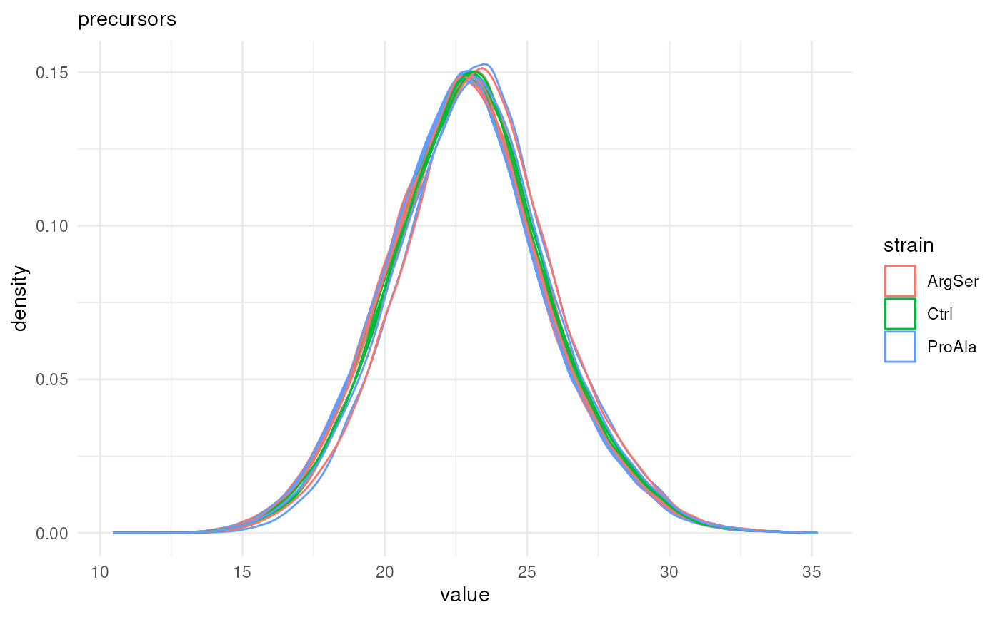

``` r

qf[, , "precursorsPTM_log"] |> #1.
  longForm(colvars = colnames(colData(qf))) |>  #2.
  data.frame() |> #3.
  filter(!is.na(value)) |> #4.
  ggplot() + #5.
  aes(x = value, 
      colour = strain,
      group = colname) + #6.
  geom_density() + #7. 
  labs(subtitle = "PTM - precursors") + #8. 
  theme_minimal() #9. 
```

    ## harmonizing input:
    ##   removing 54 sampleMap rows not in names(experiments)
    ##   removing 18 colData rownames not in sampleMap 'primary'

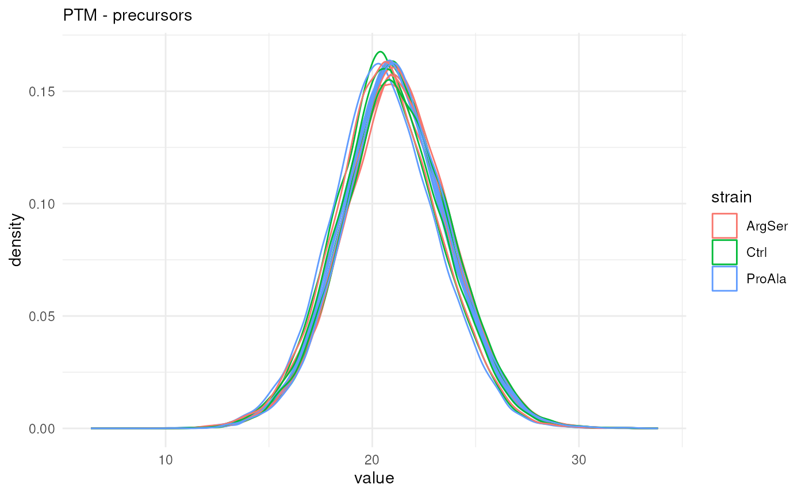

The data seems very clean. However, normalisation is still required.

We use the median of ratio normalisation, which addresses both
differences in loading as well as difference in compositionality.

- This first calculates a reference sample by using the log2 geometric
  mean, i.e.  the arithmetic mean on a log scale, for every feature.
- Subsequently log2 fold changes are calculated between each feature of
  a sample and the reference sample.
- Finally, the median of these log2 fold changes are used as the
  log2-tranformed normalisation factor.

The method is the default method for normalisation in bulk RNA-seq data
analysis with DESeq2. In our hands it performs very well in a proteomics
context.

``` r

qf <- sweep( #4. Subtract log2 norm factor column-by-column (MARGIN = 2)
  qf,
  MARGIN = 2,
  STATS = nfLogMedianOfRatios(qf,"precursors_log"),
  i = "precursors_log",
  name = "precursors_norm"
)
```

    ## This function aims to calculate norm factors on a log scale, 
    ##           the input data are assumed to be on the log-scale!

``` r

qf <- sweep( #4. Subtract log2 norm factor column-by-column (MARGIN = 2)
  qf,
  MARGIN = 2,
  STATS = nfLogMedianOfRatios(qf,"precursorsPTM_log"),
  i = "precursorsPTM_log",
  name = "precursorsPTM_norm"
)
```

    ## This function aims to calculate norm factors on a log scale, 
    ##           the input data are assumed to be on the log-scale!

We explore the effect of the global normalisation in the subsequent
plot.

Formally, the function applies the following operation on each sample
$`i`$ across all precursors $`p`$:

``` math
y_{ip}^{\text{norm}} = y_{ip} - \log_2(nf_i)
```

with $`y_ip`$ the log2-transformed intensities and $`nf_i`$ the
log2-transformed norm factor.

Upon normalisation, we can see that the distribution of the
$`y_{ip}^{\text{norm}}`$ nicely overlap (using the same code as above)

``` r

qf[, , "precursors_norm"] |>
  longForm(colvars = colnames(colData(qf))) |> 
  data.frame() |> 
  filter(!is.na(value)) |>
  ggplot() + 
  aes(x = value,
      colour = strain,
      group = colname) +
  geom_density() +
  labs(subtitle = "Median normalisation precursors") +
  theme_minimal()
```

    ## harmonizing input:
    ##   removing 90 sampleMap rows not in names(experiments)
    ##   removing 18 colData rownames not in sampleMap 'primary'

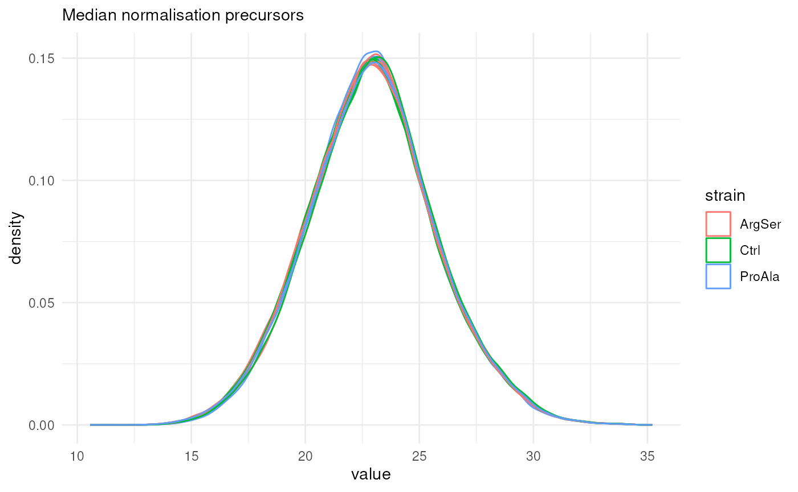

``` r

qf[, , "precursorsPTM_norm"] |>
  longForm(colvars = colnames(colData(qf))) |> 
  data.frame() |> 
  filter(!is.na(value)) |>
  ggplot() + 
  aes(x = value,
      colour = strain,
      group = colname) +
  geom_density() +
  labs(subtitle = "Median normalisation PTM precursors") +
  theme_minimal()
```

    ## harmonizing input:
    ##   removing 90 sampleMap rows not in names(experiments)
    ##   removing 18 colData rownames not in sampleMap 'primary'


We also explore the normalisation for the common precursors.

``` r

precursorsCommon <- assay(qf[, , "precursors_log"]) |> na.exclude() |> rownames()
```

    ## harmonizing input:
    ##   removing 90 sampleMap rows not in names(experiments)
    ##   removing 18 colData rownames not in sampleMap 'primary'

``` r

qf[precursorsCommon, , "precursors_norm"] |>
  longForm(colvars = colnames(colData(qf))) |> 
  data.frame() |> 
  filter(!is.na(value)) |>
  ggplot() + 
  aes(x = value,
      colour = strain,
      group = colname) +
  geom_density() +
  theme_minimal() +
   labs(subtitle = "Median normalised log2 precursor intensities (common)")
```

    ## Warning: 'experiments' dropped; see 'drops()'

    ## harmonizing input:
    ##   removing 90 sampleMap rows not in names(experiments)
    ##   removing 18 colData rownames not in sampleMap 'primary'

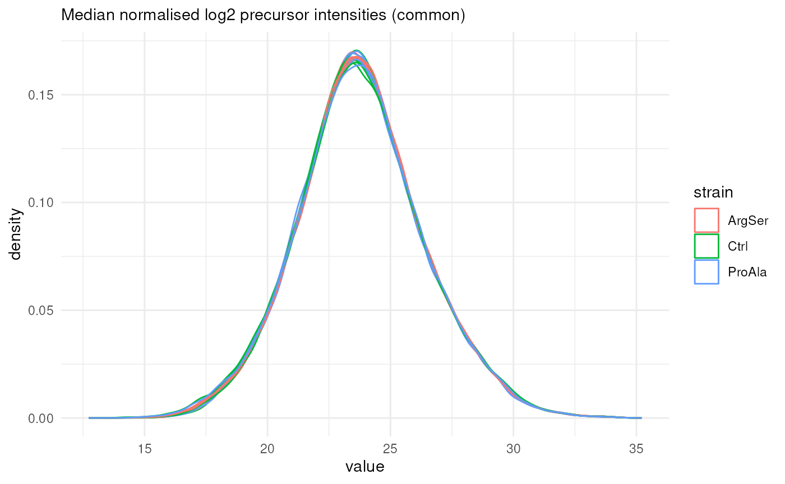

``` r

precursorsCommonPTM <- assay(qf[, , "precursorsPTM_log"]) |> na.exclude() |> rownames()
```

    ## harmonizing input:
    ##   removing 90 sampleMap rows not in names(experiments)
    ##   removing 18 colData rownames not in sampleMap 'primary'

``` r

qf[precursorsCommonPTM, , "precursorsPTM_norm"] |>
  longForm(colvars = colnames(colData(qf))) |> 
  data.frame() |> 
  filter(!is.na(value)) |>
  ggplot() + 
  aes(x = value,
      colour = strain,
      group = colname) +
  geom_density() +
  theme_minimal() +
   labs(subtitle = "Median normalised log2 precursor intensities (common)")
```

    ## Warning: 'experiments' dropped; see 'drops()'

    ## harmonizing input:
    ##   removing 90 sampleMap rows not in names(experiments)
    ##   removing 18 colData rownames not in sampleMap 'primary'

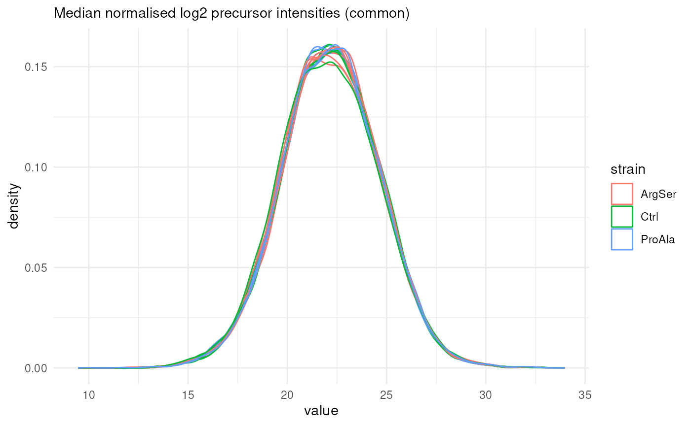

Remove temporarily objects

``` r

rm(precursorsCommon, precursorsCommonPTM)
```

``` r

#Garbage collection to free space 
gc(); gc()
```

    ##            used  (Mb) gc trigger   (Mb)  max used   (Mb)
    ## Ncells 10529810 562.4   17340017  926.1  17340017  926.1
    ## Vcells 31865796 243.2  134490933 1026.1 262549457 2003.1

    ##            used  (Mb) gc trigger  (Mb)  max used   (Mb)
    ## Ncells 10529814 562.4   17340017 926.1  17340017  926.1
    ## Vcells 31865839 243.2  107592747 820.9 262549457 2003.1

Note, that normalisation could have been avoided by using
Precursor.Normalised which is already internally normalised by DIA-NN.
However, we do not know the exact procedure for this.

This generally works well for many datasets.

In this vignette we have chosen to conduct the normalisation explicitly
ourselves using a method for which we know the underlying rationale.

### Summarisation

Here, we summarise the precursor-level data for the non-enriched runs
into protein intensities using maxLFQ, which is one of the default
methods used in DIA data analysis.

Note, that the maxLFQ implementation can become slow for large datasets.
In that case we recommend the median polish method.

- maxLFQ first calculates all pairwise log ratio’s between samples only
  using their shared precursors. Particularly, it uses the median of the
  log ratio’s between the shared precursors, i.e. 
  ``` math
  r_{ij} = median(y_{sj}-y_{si})
  ```
  .\
  Hence, it first eliminates ion effects.

- It then estimates the summaries by solving

``` math
\sum_i\sum_j(y^{prot}_j - y^{prot}_i - r_{ij})^2
```

It is implemented in the `maxLFQ` function of the `iq` package.

[`aggregateFeatures()`](https://rdrr.io/pkg/ProtGenerics/man/protgenerics.html)
in the QFeatures package streamlines summarisation. It requires the name
of a `rowData` column to group the precursors into proteins (or protein
groups), here `Protein.Group`. We provide the summarisation approach
through the `fun` argument.

The function will return a `QFeatures` object with a new set that we
called `proteins`.

Other summarisation methods are available from the `MsCoreUtils`
package, see
[`?aggregateFeatures`](https://rdrr.io/pkg/ProtGenerics/man/protgenerics.html)
for a comprehensive list.

``` r

(qf <- aggregateFeatures(
  qf, i = "precursors_norm", 
  name = "proteins",
  fcol = "Protein.Group", 
  fun = function(X) iq::maxLFQ(X)$estimate
))
```

    ##   |                                                                              |                                                                      |   0%  |                                                                              |======================================================================| 100%

    ## The following messages occurred during aggregation:

    ## 
    ## Your quantitative data contain missing values. Please read the relevant
    ## section(s) in the aggregateFeatures manual page regarding the effects
    ## of missing values on data aggregation.
    ## 
    ## Occurred during the aggregation of set(s): precursors

    ## An instance of class QFeatures (type: bulk) with 7 sets:
    ## 
    ##  [1] precursors: SummarizedExperiment with 78047 rows and 18 columns 
    ##  [2] precursorsPTM: SummarizedExperiment with 32916 rows and 18 columns 
    ##  [3] precursors_log: SummarizedExperiment with 78047 rows and 18 columns 
    ##  [4] precursorsPTM_log: SummarizedExperiment with 32916 rows and 18 columns 
    ##  [5] precursors_norm: SummarizedExperiment with 78047 rows and 18 columns 
    ##  [6] precursorsPTM_norm: SummarizedExperiment with 32916 rows and 18 columns 
    ##  [7] proteins: SummarizedExperiment with 4607 rows and 18 columns

``` r

#Garbage collection to free space 
gc(); gc()
```

    ##            used  (Mb) gc trigger  (Mb)  max used   (Mb)
    ## Ncells 10546098 563.3   17340017 926.1  17340017  926.1
    ## Vcells 32337048 246.8  107592747 820.9 262549457 2003.1

    ##            used  (Mb) gc trigger  (Mb)  max used   (Mb)
    ## Ncells 10546105 563.3   17340017 926.1  17340017  926.1
    ## Vcells 32337096 246.8  107592747 820.9 262549457 2003.1

## Data exploration and QC

Data exploration aims to highlight the main sources of variation in the
data prior to data modelling and can pinpoint to outlying or
off-behaving samples.

We first performance the QC for the Phospho-enriched runs then for the
non-enriched runs.

### Phospho-enriched runs

#### Marginal distribution at precursor level

``` r

qf[, , "precursorsPTM_norm"] |>
  longForm(colvars = colnames(colData(qf))) |> 
  data.frame() |> 
  filter(!is.na(value)) |>
  ggplot() + 
  aes(x = value,
      colour = strain,
      group = colname) +
  geom_density() +
  theme_minimal() +
   labs(subtitle = "Normalised log2 PTM precursor intensities")
```

    ## harmonizing input:
    ##   removing 108 sampleMap rows not in names(experiments)
    ##   removing 18 colData rownames not in sampleMap 'primary'

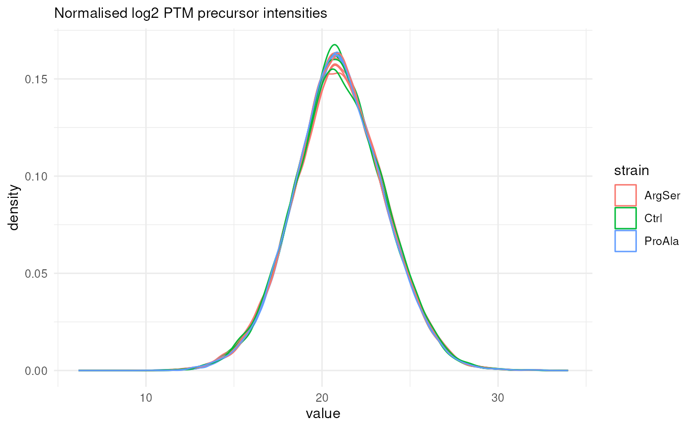

``` r

qf[, , "precursorsPTM_norm"] |>
  longForm(colvars = colnames(colData(qf))) |> 
  data.frame() |> 
  filter(!is.na(value)) |>
  ggplot() + 
  aes(x = sampleId,
      y = value,
      colour = strain,
      group = colname) +
  xlab("sample") +
  geom_boxplot() +
  theme_minimal() +
   labs(subtitle = "Normalised log2 PTM precursor intensities")
```

    ## harmonizing input:
    ##   removing 108 sampleMap rows not in names(experiments)
    ##   removing 18 colData rownames not in sampleMap 'primary'

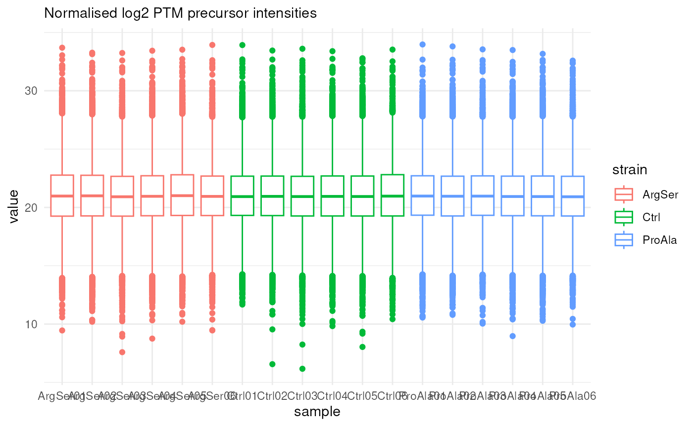

``` r

#Garbage collection to free space 
gc(); gc()
```

    ##            used  (Mb) gc trigger  (Mb)  max used   (Mb)
    ## Ncells 10575762 564.9   17340017 926.1  17340017  926.1
    ## Vcells 35984518 274.6  107592747 820.9 262549457 2003.1

    ##            used  (Mb) gc trigger  (Mb)  max used   (Mb)
    ## Ncells 10575769 564.9   17340017 926.1  17340017  926.1
    ## Vcells 35984566 274.6  107592747 820.9 262549457 2003.1

#### Charge state

``` r

qf[, , "precursorsPTM_norm"] |>
  longForm(colvars = colnames(colData(qf)), rowvars = "Precursor.Charge") |>
  as.data.frame() |>
  filter(!is.na(value)) |>
  filter(Precursor.Charge<=4) |> 
ggplot(aes(x = sampleId)) +
  geom_bar(aes(fill = factor(Precursor.Charge, levels = 4:1)),
           colour = "black") +
  labs(title = "Number of phospho-ions per sample",
       x = "Sample",
       fill = "Charge state") +
  theme_bw() + 
  theme(axis.text.x = element_text(angle = 90))
```

    ## harmonizing input:
    ##   removing 108 sampleMap rows not in names(experiments)
    ##   removing 18 colData rownames not in sampleMap 'primary'

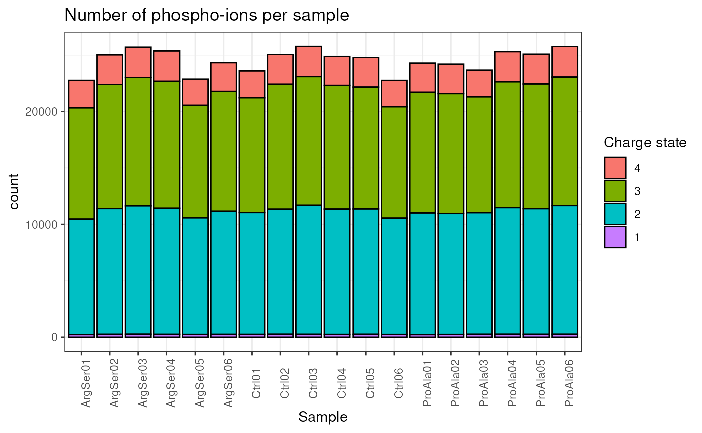

``` r

#Garbage collection to free space 
gc(); gc()
```

    ##            used  (Mb) gc trigger  (Mb)  max used   (Mb)
    ## Ncells 10583270 565.3   17340017 926.1  17340017  926.1
    ## Vcells 36181860 276.1  107592747 820.9 262549457 2003.1

    ##            used  (Mb) gc trigger  (Mb)  max used   (Mb)
    ## Ncells 10583277 565.3   17340017 926.1  17340017  926.1
    ## Vcells 36181908 276.1  107592747 820.9 262549457 2003.1

### Identifications per sample

``` r

qf[,,"precursorsPTM_norm"] |> 
  longForm(colvars = colnames(colData(qf)), 
           rowvars= c("Precursor.Id", 
                      "Protein.Group")) |>
  data.frame() |>
  filter(!is.na(value)) |>
  group_by(strain, sampleId) |>
  summarise(Precursors = length(unique(Precursor.Id)),
            `Protein Groups` = length(unique(Protein.Group))) |> 
  pivot_longer(-(1:2),
               names_to = "Feature",
               values_to = "IDs") |> 
  ggplot(aes(x = sampleId, y = IDs, fill = strain)) +
  geom_col() +
  #scale_fill_observable() +
  facet_wrap(~Feature,
             scales = "free_y") +
  labs(title = "Precursor and protein group identificiations per PTM sample",
       x = "Sample",
       y = "Identifications") +
  theme_bw() + 
  theme(axis.text.x = element_text(angle = 90))
```

    ## harmonizing input:
    ##   removing 108 sampleMap rows not in names(experiments)
    ##   removing 18 colData rownames not in sampleMap 'primary'

    ## `summarise()` has regrouped the output.
    ## ℹ Summaries were computed grouped by strain and sampleId.
    ## ℹ Output is grouped by strain.
    ## ℹ Use `summarise(.groups = "drop_last")` to silence this message.
    ## ℹ Use `summarise(.by = c(strain, sampleId))` for per-operation grouping
    ##   (`?dplyr::dplyr_by`) instead.

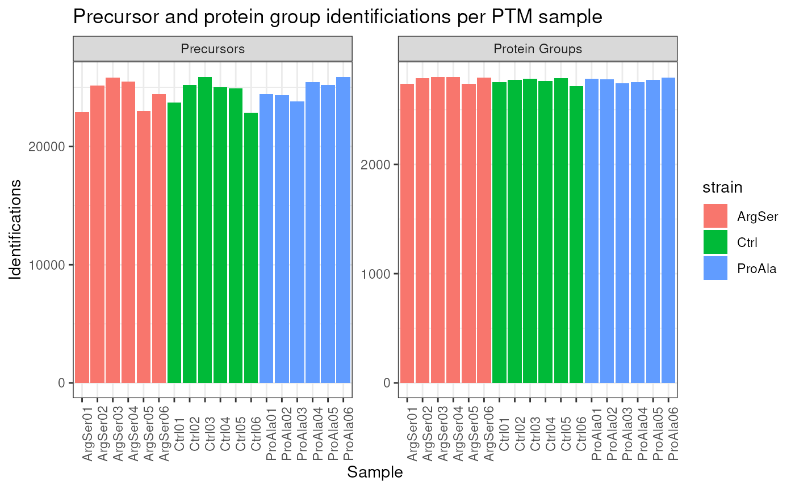

``` r

# Data Modeling (Robust Regression){#sec-modelling}
```

``` r

#Garbage collection to free space 
gc(); gc()
```

    ##            used  (Mb) gc trigger  (Mb)  max used   (Mb)
    ## Ncells 10639600 568.3   17340017 926.1  17340017  926.1
    ## Vcells 29893553 228.1   86074198 656.7 262549457 2003.1

    ##            used  (Mb) gc trigger  (Mb)  max used   (Mb)
    ## Ncells 10639580 568.3   17340017 926.1  17340017  926.1
    ## Vcells 29893556 228.1   86074198 656.7 262549457 2003.1

### Dimensionality reduction plot

A common approach for data exploration is to perform dimension
reduction, such as Multi Dimensional Scaling (MDS). We will first
extract the set to explore along the sample annotations (used for plot
colouring).

``` r

getWithColData(qf, "precursorsPTM_norm") |> 
  as("SingleCellExperiment") |> 
  runMDS(exprs_values = 1) |> 
  plotMDS(colour_by = "strain") 
```

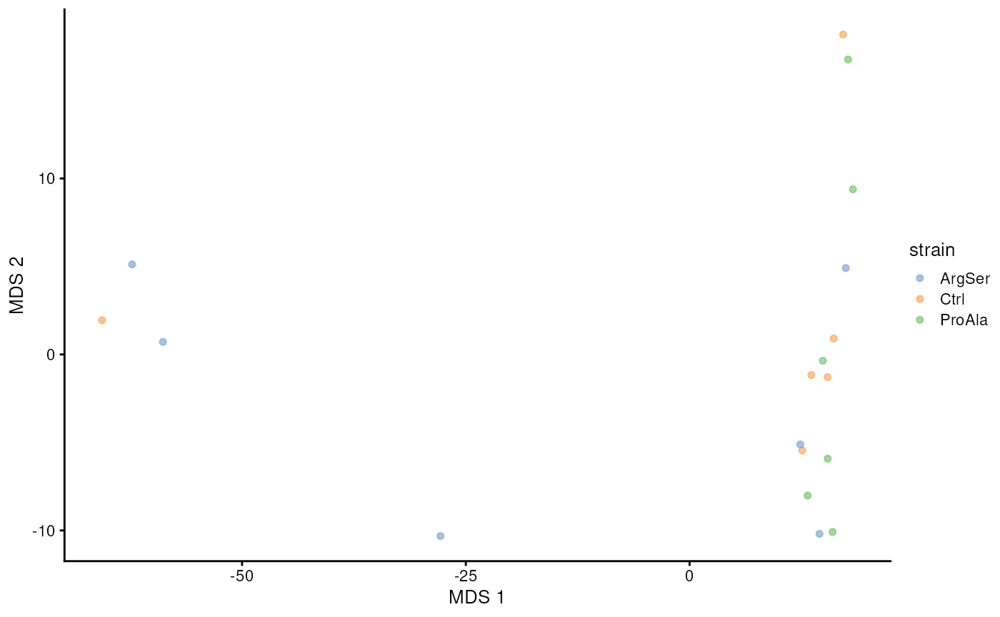

``` r

#Garbage collection to free space 
gc(); gc()
```

    ##            used  (Mb) gc trigger  (Mb)  max used   (Mb)
    ## Ncells 10661717 569.4   17340017 926.1  17340017  926.1
    ## Vcells 29958583 228.6   86074198 656.7 262549457 2003.1

    ##            used  (Mb) gc trigger  (Mb)  max used   (Mb)
    ## Ncells 10661706 569.4   17340017 926.1  17340017  926.1
    ## Vcells 29958601 228.6   86074198 656.7 262549457 2003.1

### Non-enriched runs

#### Marginal distribution at precursor and protein level

``` r

qf[, , "precursors_norm"] |>
  longForm(colvars = colnames(colData(qf))) |> 
  data.frame() |> 
  filter(!is.na(value)) |>
  ggplot() + 
  aes(x = value,
      colour = strain,
      group = colname) +
  geom_density() +
  theme_minimal() +
   labs(subtitle = "Normalised log2 precursor intensities")
```

    ## harmonizing input:
    ##   removing 108 sampleMap rows not in names(experiments)
    ##   removing 18 colData rownames not in sampleMap 'primary'

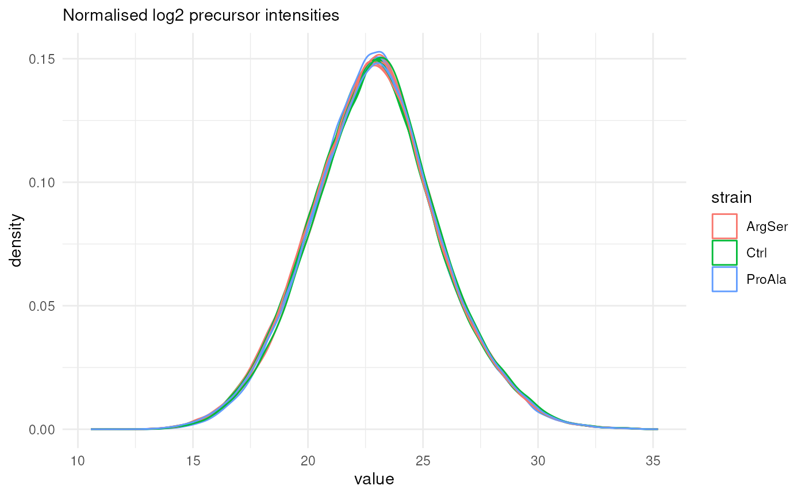

``` r

qf[, , "precursors_norm"] |>
  longForm(colvars = colnames(colData(qf))) |> 
  data.frame() |> 
  filter(!is.na(value)) |>
  ggplot() + 
  aes(x = sampleId,
      y = value,
      colour = strain,
      group = colname) +
  xlab("sample") +
  geom_boxplot() +
  theme_minimal() +
   labs(subtitle = "Normalised log2 precursor intensities")
```

    ## harmonizing input:
    ##   removing 108 sampleMap rows not in names(experiments)
    ##   removing 18 colData rownames not in sampleMap 'primary'

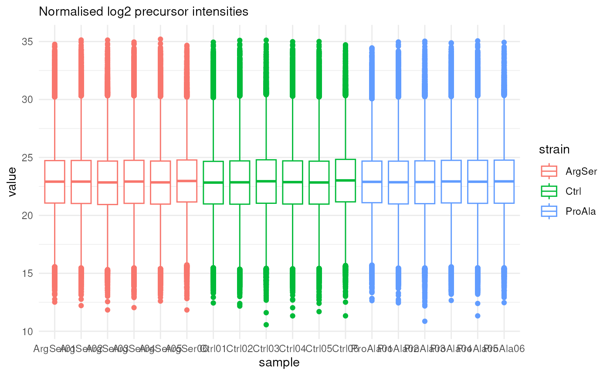

``` r

qf[, , "proteins"] |>
  longForm(colvars = colnames(colData(qf))) |> 
  data.frame() |> 
  filter(!is.na(value)) |>
  ggplot() + 
  aes(x = value,
      colour = strain,
      group = colname) +
  geom_density() +
  theme_minimal() +
   labs(subtitle = "log2 protein intensities (normalised precursors)")
```

    ## harmonizing input:
    ##   removing 108 sampleMap rows not in names(experiments)
    ##   removing 18 colData rownames not in sampleMap 'primary'

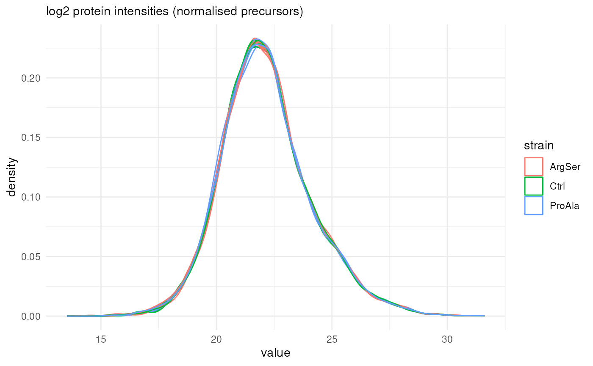

``` r

qf[, , "proteins"] |>
  longForm(colvars = colnames(colData(qf))) |> 
  data.frame() |> 
  filter(!is.na(value)) |>
  ggplot() + 
  aes(x = sampleId,
      y = value,
      colour = strain,
      group = colname) +
  xlab("sample") +
  geom_boxplot() +
  theme_minimal() +
   labs(subtitle = "log2 protein intensities (normalised precursors)")
```

    ## harmonizing input:
    ##   removing 108 sampleMap rows not in names(experiments)
    ##   removing 18 colData rownames not in sampleMap 'primary'

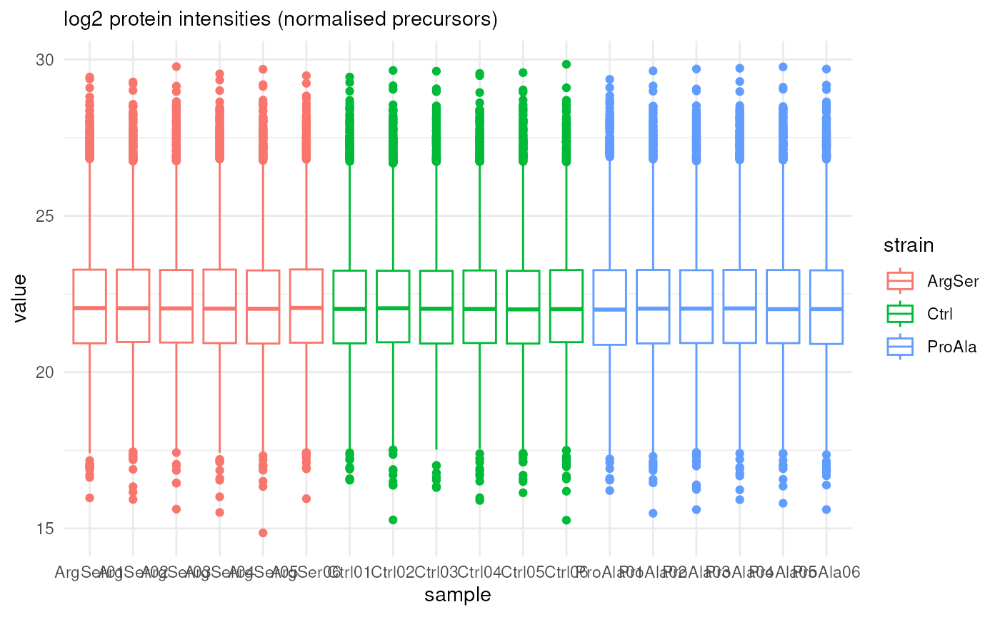

``` r

#Garbage collection to free space 
gc(); gc()
```

    ##            used  (Mb) gc trigger  (Mb)  max used   (Mb)
    ## Ncells 10662194 569.5   17340017 926.1  17340017  926.1
    ## Vcells 31084034 237.2  105312141 803.5 262549457 2003.1

    ##            used  (Mb) gc trigger  (Mb)  max used   (Mb)
    ## Ncells 10662198 569.5   17340017 926.1  17340017  926.1
    ## Vcells 31084077 237.2  105312141 803.5 262549457 2003.1

#### Charge state

``` r

qf[, , "precursors_norm"] |>
  longForm(colvars = colnames(colData(qf)), rowvars = "Precursor.Charge") |>
  as.data.frame() |>
  filter(!is.na(value)) |>
  filter(Precursor.Charge<=4) |> 
ggplot(aes(x = sampleId)) +
  geom_bar(aes(fill = factor(Precursor.Charge, levels = 4:1)),
           colour = "black") +
  labs(title = "Number of precursor ions per sample",
       x = "Sample",
       fill = "Charge state") +
  theme_bw() +
  theme(axis.text.x = element_text(angle = 90))
```

    ## harmonizing input:
    ##   removing 108 sampleMap rows not in names(experiments)
    ##   removing 18 colData rownames not in sampleMap 'primary'

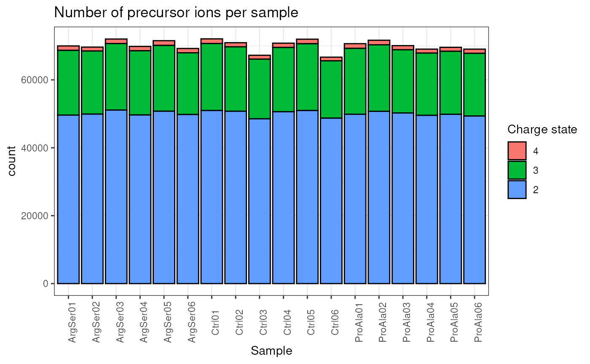

``` r

#Garbage collection to free space 
gc(); gc()
```

    ##            used  (Mb) gc trigger  (Mb)  max used   (Mb)
    ## Ncells 10662193 569.5   17340017 926.1  17340017  926.1
    ## Vcells 48246245 368.1  105312141 803.5 262549457 2003.1

    ##            used  (Mb) gc trigger  (Mb)  max used   (Mb)
    ## Ncells 10662200 569.5   17340017 926.1  17340017  926.1
    ## Vcells 48246293 368.1  105312141 803.5 262549457 2003.1

#### Identifications per sample

``` r

qf[,,"precursors_norm"] |> 
  longForm(colvars = colnames(colData(qf)), 
           rowvars= c("Precursor.Id", 
                      "Protein.Group")) |>
  data.frame() |>
  filter(!is.na(value)) |>
  group_by(strain, sampleId) |>
  summarise(Precursors = length(unique(Precursor.Id)),
            `Protein Groups` = length(unique(Protein.Group))) |> 
  pivot_longer(-(1:2),
               names_to = "Feature",
               values_to = "IDs") |> 
  ggplot(aes(x = sampleId, y = IDs, fill = strain)) +
  geom_col() +
  #scale_fill_observable() +
  facet_wrap(~Feature,
             scales = "free_y") +
  labs(title = "Precursor and protein group identificiations per sample",
       x = "Sample",
       y = "Identifications") +
  theme_bw() + 
  theme(axis.text.x = element_text(angle = 90))
```

    ## harmonizing input:
    ##   removing 108 sampleMap rows not in names(experiments)
    ##   removing 18 colData rownames not in sampleMap 'primary'

    ## `summarise()` has regrouped the output.
    ## ℹ Summaries were computed grouped by strain and sampleId.
    ## ℹ Output is grouped by strain.
    ## ℹ Use `summarise(.groups = "drop_last")` to silence this message.
    ## ℹ Use `summarise(.by = c(strain, sampleId))` for per-operation grouping
    ##   (`?dplyr::dplyr_by`) instead.

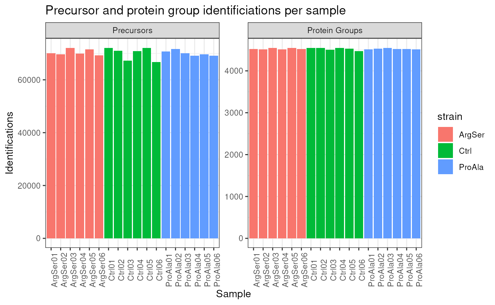

``` r

#Garbage collection to free space 
gc(); gc()
```

    ##            used  (Mb) gc trigger  (Mb)  max used   (Mb)
    ## Ncells 10662308 569.5   17340017 926.1  17340017  926.1
    ## Vcells 29944507 228.5  105312141 803.5 262549457 2003.1

    ##            used  (Mb) gc trigger  (Mb)  max used   (Mb)
    ## Ncells 10662312 569.5   17340017 926.1  17340017  926.1
    ## Vcells 29944550 228.5  105312141 803.5 262549457 2003.1

### Dimensionality reduction plot

``` r

getWithColData(qf, "proteins") |> 
  as("SingleCellExperiment") |> 
  runMDS(exprs_values = 1) |> 
  plotMDS(colour_by = "strain") 
```

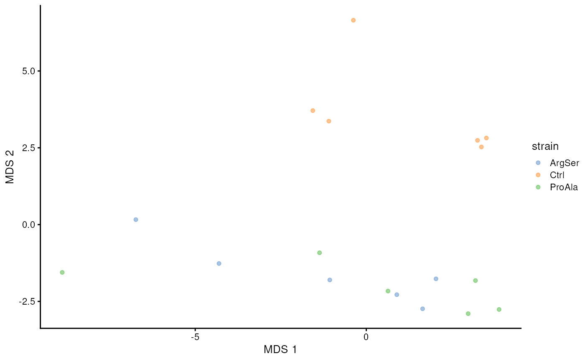

``` r

#Garbage collection to free space 
gc(); gc()
```

    ##            used  (Mb) gc trigger  (Mb)  max used   (Mb)
    ## Ncells 10661892 569.5   17340017 926.1  17340017  926.1
    ## Vcells 29945728 228.5  105312141 803.5 262549457 2003.1

    ##            used  (Mb) gc trigger  (Mb)  max used   (Mb)
    ## Ncells 10661881 569.5   17340017 926.1  17340017  926.1
    ## Vcells 29945746 228.5  105312141 803.5 262549457 2003.1

## Data Modeling at phospho-precursor-level

### Model estimation

1.  We first define the model. We only have one source of variability in
    the experiment that we can model, i.e. the effect of the strain.

2.  We fit the model to each phosphorylated precursor in the
    `precursorsPTM_norm` summarised experiment of the QFeatures object
    `qf` using the msqrob function.

``` r

model <- ~ strain
qf <- msqrob(
  qf,
  i = "precursorsPTM_norm",
  formula = model,
  robust = TRUE)
```

We enabled M-estimation (`robust = TRUE`) for improved robustness
against outliers.

``` r

#Garbage collection to free space 
gc(); gc()
```

    ##            used  (Mb) gc trigger  (Mb)  max used   (Mb)
    ## Ncells 11362893 606.9   17340017 926.1  17340017  926.1
    ## Vcells 31937024 243.7  105312141 803.5 262549457 2003.1

    ##            used  (Mb) gc trigger  (Mb)  max used   (Mb)
    ## Ncells 11362903 606.9   17340017 926.1  17340017  926.1
    ## Vcells 31937077 243.7  105312141 803.5 262549457 2003.1

### Inference

We can now convert the research question “Is the abundance of
phospho-precursors different between the strains” into a statistical
hypotheses.

In other words, we need to translate this question in a null and
alternative hypothesis on a single model parameter or a linear
combination of model parameters, which is also referred to with a
contrast.

To aid defining contrasts, we will visualise the experimental design
using the `ExploreModelMatrix` package.

``` r

vd <- ExploreModelMatrix::VisualizeDesign(
    sampleData =  colData(qf),
    designFormula = model,
    textSizeFitted = 4
)
vd$plotlist
```

    ## [[1]]


We have 3 interesting research questions related to the strain.

1.  Is a precursor DA between ArgSer strain and the WT (control)
2.  Is a precursor DA between ProAla strain and the WT (control)\
3.  Is a precursor DA between ProAla strain and the ArgSer strain.

Each of these contrasts can be translated in a log2 FC or a difference
in log2 FC and can be estimated with one or a linear combination of the
model parameters.

Below we define the contrast and construct the corresponding contrast
matrix.

We can generate the null-hypothesess for all pairwise comparisons
manually. However, here we will use the `createPairwiseContrasts`
function in `msqrob2`.

``` r

(allHypotheses <- createPairwiseContrasts(
  model, colData(qf), "strain"
  )
)
```

    ## Warning: the 'nobars' function has moved to the reformulas package. Please update your imports, or ask an upstream package maintainer to do so.
    ## This warning is displayed once per session.

    ## [1] "strainCtrl = 0"                "strainProAla = 0"             
    ## [3] "strainProAla - strainCtrl = 0"

Based on these null hypothesis we now generate the contrast matrix with
all three contrasts using the `makeContrast` function. Note, that
experienced users can also define the contrast matrix, directly.

``` r

(L <- makeContrast(
  allHypotheses,
  parameterNames = colnames(vd$designmatrix)
))
```

    ##              strainCtrl strainProAla strainProAla - strainCtrl
    ## (Intercept)           0            0                         0
    ## strainCtrl            1            0                        -1
    ## strainProAla          0            1                         1

We assess the contrast for each precursor.

``` r

qf <- hypothesisTest(qf, i = "precursorsPTM_norm", contrast = L, overwrite = TRUE)
```

We extract the results table from the `precursorsPTM_norm` summarised
experiment in the `qf` object.

``` r

inferencesPTM <- 
  msqrobCollect(qf[["precursorsPTM_norm"]], L)
```

``` r

#Garbage collection to free space 
gc(); gc()
```

    ##            used  (Mb) gc trigger  (Mb)  max used   (Mb)
    ## Ncells 11519710 615.3   17340017 926.1  17340017  926.1
    ## Vcells 34493937 263.2  105312141 803.5 262549457 2003.1

    ##            used  (Mb) gc trigger  (Mb)  max used   (Mb)
    ## Ncells 11519714 615.3   17340017 926.1  17340017  926.1
    ## Vcells 34493980 263.2  105312141 803.5 262549457 2003.1

### Report results

We report the results using a results table, volcano plots and heatmaps.

#### Results table

We use the 5% nominal FDR level to report results

``` r

alpha <- 0.05
```

``` r

for (j in colnames(L)) {

  inference <- inferencesPTM |> 
    dplyr::filter(adjPval < alpha & contrast == j)

  cat("**Median - Contrast:**", j, "= 0 (", nrow(inference),
      "significant precursors)\n\n")

  cat('<div style="max-height:300px; overflow-y:auto;">')

  print(
    kable(
      inference |>
        dplyr::arrange(pval) |>
        dplyr::relocate(feature),
      row.names = FALSE
    )
  )

  cat('</div>')

  cat("\n\n\n---\n\n")
}
```

**Median - Contrast:** strainCtrl = 0 ( 132 significant precursors)

| feature | logFC | se | df | t | pval | adjPval | contrast |
|:---|---:|---:|---:|---:|---:|---:|:---|
| ETIDDTAS(UniMod:21)QILK2 | -1.3878725 | 0.0868676 | 16.425974 | -15.976871 | 0.0000000 | 0.0000005 | strainCtrl |
| GQVVSEEQRPGT(UniMod:21)PLFTVK3 | -1.7606517 | 0.1054288 | 15.293748 | -16.699911 | 0.0000000 | 0.0000005 | strainCtrl |
| ETVES(UniMod:21)ESSQTALSK2 | -0.9019349 | 0.0690039 | 16.403443 | -13.070775 | 0.0000000 | 0.0000046 | strainCtrl |
| IARPLS(UniMod:21)VPGS(UniMod:21)PK2 | 0.7155560 | 0.0647198 | 16.256685 | 11.056212 | 0.0000000 | 0.0000451 | strainCtrl |
| RGQVVSEEQRPGT(UniMod:21)PLFTVK3 | -1.3829874 | 0.1323581 | 14.249637 | -10.448831 | 0.0000000 | 0.0002299 | strainCtrl |
| DLARENS(UniMod:21)LETTFSSVNTR3 | -0.8330567 | 0.0883323 | 16.386810 | -9.430945 | 0.0000001 | 0.0002299 | strainCtrl |
| RAT(UniMod:21)YAGFLLADPK3 | -2.7224415 | 0.2243879 | 11.815432 | -12.132749 | 0.0000001 | 0.0002299 | strainCtrl |
| LYDLLGVS(UniMod:21)PSANEQELK2 | -1.4023471 | 0.1407479 | 14.806088 | -9.963536 | 0.0000001 | 0.0002364 | strainCtrl |
| T(UniMod:21)GAAPQTTFNVAPNSTPIVSTAATGLQHK3 | -0.6373352 | 0.0682631 | 16.019004 | -9.336459 | 0.0000001 | 0.0002494 | strainCtrl |
| ETVESESS(UniMod:21)QTALSK2 | -1.8228595 | 0.1448704 | 10.011209 | -12.582688 | 0.0000002 | 0.0005918 | strainCtrl |
| LVQIT(UniMod:21)PDGK2 | 0.8050579 | 0.0997421 | 15.547762 | 8.071393 | 0.0000006 | 0.0015085 | strainCtrl |
| GSEIVIAT(UniMod:21)PGR2 | -1.0818005 | 0.1276423 | 14.091319 | -8.475248 | 0.0000007 | 0.0015085 | strainCtrl |
| T(UniMod:21)GAAPQTTFNVAPNSTPIVSTAATGLQHK4 | -1.1061639 | 0.1321426 | 14.224166 | -8.370989 | 0.0000007 | 0.0015085 | strainCtrl |
| IS(UniMod:21)PPVVAYR2 | -1.8161978 | 0.2294100 | 15.617433 | -7.916820 | 0.0000007 | 0.0015085 | strainCtrl |
| GSSS(UniMod:21)LYTLVINDAGK2 | 1.1815421 | 0.1540268 | 16.592491 | 7.671014 | 0.0000008 | 0.0015085 | strainCtrl |
| GSS(UniMod:21)SLYTLVINDAGK3 | 1.1091290 | 0.1390355 | 15.378296 | 7.977308 | 0.0000008 | 0.0015085 | strainCtrl |
| HAS(UniMod:21)PLLEDVEDEEVDRYNESLSR3 | -2.0647672 | 0.2549966 | 14.690577 | -8.097233 | 0.0000009 | 0.0016133 | strainCtrl |
| AAS(UniMod:21)FQDSTIPDAR2 | -0.7091997 | 0.0919711 | 15.887975 | -7.711115 | 0.0000009 | 0.0016589 | strainCtrl |
| RGQVVSEEQRPGT(UniMod:21)PLFTVK4 | -1.5676621 | 0.1700761 | 11.266455 | -9.217417 | 0.0000014 | 0.0023369 | strainCtrl |
| NLS(UniMod:21)NENC(UniMod:4)SFK2 | 0.6834720 | 0.0933326 | 16.375363 | 7.322972 | 0.0000015 | 0.0023875 | strainCtrl |
| DSGYGVS(UniMod:21)VGR2 | 0.5426223 | 0.0727577 | 15.519801 | 7.457932 | 0.0000016 | 0.0025035 | strainCtrl |
| KSDS(UniMod:21)GTVLGAIPLNSR2 | -0.5679243 | 0.0748780 | 14.361829 | -7.584663 | 0.0000022 | 0.0029837 | strainCtrl |
| VDIIANDQGNRT(UniMod:21)TPSFVAFTDTER3 | -0.7321217 | 0.0926959 | 13.314083 | -7.898105 | 0.0000022 | 0.0029837 | strainCtrl |
| VSSFNHS(UniMod:21)SSGMTSSDSLASEEVPSNK3 | 4.1866327 | 0.2650858 | 6.417882 | 15.793502 | 0.0000022 | 0.0029837 | strainCtrl |
| SHS(UniMod:21)NILKPPVR3 | -0.6884790 | 0.0982175 | 15.727572 | -7.009740 | 0.0000032 | 0.0041514 | strainCtrl |
| ENSTIQSSS(UniMod:21)SSNLR2 | -0.7781743 | 0.0997623 | 12.534773 | -7.800283 | 0.0000037 | 0.0045667 | strainCtrl |
| AC(UniMod:4)VVYGGS(UniMod:21)PIGNQLR2 | -0.7870067 | 0.1152159 | 15.669475 | -6.830714 | 0.0000045 | 0.0053546 | strainCtrl |
| S(UniMod:21)FIFPETSNQSK2 | -0.5135915 | 0.0773459 | 16.609444 | -6.640194 | 0.0000047 | 0.0053751 | strainCtrl |
| SIS(UniMod:21)SVTNSDSNISSSK2 | -0.4492690 | 0.0684650 | 16.778774 | -6.562022 | 0.0000052 | 0.0053980 | strainCtrl |
| KSDS(UniMod:21)GTVLGAIPLNSR3 | -0.5644426 | 0.0833325 | 15.546547 | -6.773382 | 0.0000052 | 0.0053980 | strainCtrl |
| EAS(UniMod:21)LQEELEPLR2 | -1.1595078 | 0.1670403 | 14.722408 | -6.941485 | 0.0000052 | 0.0053980 | strainCtrl |
| IETES(UniMod:21)TTIPNDSDR2 | 0.4523919 | 0.0683473 | 16.110299 | 6.619020 | 0.0000057 | 0.0057061 | strainCtrl |
| YDETTFSGS(UniMod:21)PER2 | 0.5824588 | 0.0856507 | 14.947062 | 6.800393 | 0.0000061 | 0.0059222 | strainCtrl |
| M(UniMod:35)TEAGS(UniMod:21)LDLIDDAGENS(UniMod:21)DLEDRIDNSLPGSQR4 | -2.8911505 | 0.2386328 | 6.894347 | -12.115480 | 0.0000067 | 0.0063329 | strainCtrl |
| (UniMod:28)QLRDS(UniMod:21)FVTPNYSR2 | 0.9210333 | 0.1409903 | 15.674488 | 6.532602 | 0.0000076 | 0.0068143 | strainCtrl |
| QLRDS(UniMod:21)FVTPNYSR3 | 0.5476409 | 0.0848089 | 16.109896 | 6.457351 | 0.0000077 | 0.0068143 | strainCtrl |
| NNEGSSNMNMNRNDLDDVS(UniMod:21)HYEMK3 | 3.8354156 | 0.4188686 | 8.778774 | 9.156609 | 0.0000088 | 0.0076065 | strainCtrl |
| DPIPSDPS(UniMod:21)ER2 | -0.6050658 | 0.0947838 | 15.912926 | -6.383639 | 0.0000093 | 0.0077894 | strainCtrl |
| NTTATPIQFADFNT(UniMod:21)SSNNLTPSQSVTNSGTQVAHGNNMEVDR4 | 3.0634251 | 0.2064334 | 5.664072 | 14.839777 | 0.0000095 | 0.0077894 | strainCtrl |
| RPTYSSS(UniMod:21)KSNNWTPGEASDTPPLPPHATPK4 | -3.0020708 | 0.3623045 | 9.778774 | -8.286042 | 0.0000100 | 0.0079776 | strainCtrl |
| NGLNELASS(UniMod:21)ATK2 | 0.8320405 | 0.1330646 | 16.277252 | 6.252907 | 0.0000107 | 0.0083329 | strainCtrl |
| PAPLTLAET(UniMod:21)HS(UniMod:21)PNASVENSHTIVR3 | 0.9826436 | 0.1288764 | 10.592238 | 7.624700 | 0.0000128 | 0.0097375 | strainCtrl |
| NIDEDVNNLTAT(UniMod:21)TDEEDRDPESQK3 | 0.7167712 | 0.1029303 | 12.330727 | 6.963656 | 0.0000131 | 0.0097375 | strainCtrl |
| ETNNNLSNM(UniMod:35)NSS(UniMod:21)PAQNPK3 | -3.5401580 | 0.1985585 | 4.778774 | -17.829298 | 0.0000148 | 0.0106251 | strainCtrl |
| FEIGESGGNDPYMVSS(UniMod:21)PK3 | 2.1737356 | 0.2262873 | 7.677795 | 9.606088 | 0.0000151 | 0.0106251 | strainCtrl |
| ERNPS(UniMod:21)ESVK2 | -0.5644133 | 0.0923857 | 15.935255 | -6.109316 | 0.0000153 | 0.0106251 | strainCtrl |
| NEHS(UniMod:21)NLAVEDNIPEEEPK3 | -0.5397225 | 0.0886019 | 15.966583 | -6.091542 | 0.0000157 | 0.0106251 | strainCtrl |
| IARPLSVPGS(UniMod:21)PK2 | 0.8082425 | 0.1350037 | 16.684810 | 5.986819 | 0.0000159 | 0.0106251 | strainCtrl |
| GT(UniMod:21)QSQYESGLTSNK2 | -0.5062964 | 0.0840562 | 16.142088 | -6.023309 | 0.0000171 | 0.0111594 | strainCtrl |
| NDNLDDKS(UniMod:21)TVC(UniMod:4)YSEK2 | 0.6221338 | 0.1037637 | 16.246350 | 5.995675 | 0.0000175 | 0.0112171 | strainCtrl |
| ENS(UniMod:21)SLSSIK2 | -0.7305715 | 0.1246591 | 16.626655 | -5.860556 | 0.0000207 | 0.0128360 | strainCtrl |
| SFGSGLKLKITDS(UniMod:21)NLENMEDVEAK3 | 2.9625200 | 0.2431345 | 5.906460 | 12.184698 | 0.0000208 | 0.0128360 | strainCtrl |
| EEVS(UniMod:21)QLAELHLR3 | -1.6458966 | 0.2710728 | 14.854436 | -6.071789 | 0.0000223 | 0.0134745 | strainCtrl |
| MSES(UniMod:21)PMFAANGMPK2 | 2.8704162 | 0.4061935 | 10.778774 | 7.066623 | 0.0000232 | 0.0137454 | strainCtrl |
| TQLENS(UniMod:21)DNFEEQK2 | 0.5186244 | 0.0872310 | 15.223153 | 5.945413 | 0.0000253 | 0.0147092 | strainCtrl |
| SNDSFINDDRNS(UniMod:21)FTNATTNAR3 | -0.5750153 | 0.1004951 | 16.433641 | -5.721824 | 0.0000284 | 0.0161043 | strainCtrl |
| YTNST(UniMod:21)DSSESSLDFLK2 | 0.5622813 | 0.0926632 | 14.034977 | 6.068010 | 0.0000287 | 0.0161043 | strainCtrl |
| (UniMod:27)EKSPT(UniMod:21)PQT(UniMod:21)STASLSSVTK3 | 3.2218326 | 0.4668367 | 10.439206 | 6.901412 | 0.0000337 | 0.0184493 | strainCtrl |
| EAS(UniMod:21)TQEPAK2 | -0.7501469 | 0.1318051 | 15.928709 | -5.691333 | 0.0000340 | 0.0184493 | strainCtrl |
| M(UniMod:35)TDPHLNTPQVSTS(UniMod:21)PTFER3 | -2.4208678 | 0.3560428 | 10.587112 | -6.799373 | 0.0000358 | 0.0188791 | strainCtrl |
| NAESKDS(UniMod:21)DGVQVANESEEDPELK3 | -0.5313498 | 0.0946522 | 16.287672 | -5.613708 | 0.0000363 | 0.0188791 | strainCtrl |
| KSDSGTVLGAIPLNS(UniMod:21)R3 | -0.5127535 | 0.0903414 | 15.751351 | -5.675734 | 0.0000365 | 0.0188791 | strainCtrl |
| SNNWTPGEAS(UniMod:21)DT(UniMod:21)PPLPPHATPK3 | 4.9273214 | 0.4363360 | 5.778774 | 11.292492 | 0.0000373 | 0.0189449 | strainCtrl |
| ESS(UniMod:21)LEGQDLTK2 | -0.6936983 | 0.1188949 | 14.459240 | -5.834549 | 0.0000381 | 0.0190580 | strainCtrl |
| LSHFS(UniMod:21)NLEDASFK2 | -0.6353741 | 0.1099548 | 14.354496 | -5.778502 | 0.0000433 | 0.0213438 | strainCtrl |
| (UniMod:1)SS(UniMod:21)EDIIYDPQFK2 | 0.4769651 | 0.0856592 | 15.739046 | 5.568172 | 0.0000451 | 0.0216395 | strainCtrl |
| PYTEES(UniMod:21)E1 | -1.7433153 | 0.2978099 | 13.735713 | -5.853786 | 0.0000453 | 0.0216395 | strainCtrl |
| TYS(UniMod:21)AENVPLTSTVSNDK2 | 0.4302315 | 0.0764934 | 15.184784 | 5.624429 | 0.0000462 | 0.0217806 | strainCtrl |
| TFVS(UniMod:21)ETADDIEK2 | 0.5048344 | 0.0929629 | 16.778774 | 5.430492 | 0.0000471 | 0.0218525 | strainCtrl |
| DIPVKS(UniMod:21)DDTPAK2 | 0.4511292 | 0.0828855 | 16.449479 | 5.442800 | 0.0000492 | 0.0225142 | strainCtrl |
| NHS(UniMod:21)PDPIGIDNYK3 | -0.3728104 | 0.0679928 | 15.756398 | -5.483083 | 0.0000529 | 0.0238636 | strainCtrl |
| AGSHS(UniMod:21)VGLLPM(UniMod:35)2 | -2.4501832 | 0.2758181 | 6.778774 | -8.883329 | 0.0000562 | 0.0247747 | strainCtrl |
| KS(UniMod:21)SY(UniMod:21)GSNNDDSYGSNNDDSYGSSNK3 | 2.7718095 | 0.2618620 | 5.727599 | 10.585000 | 0.0000565 | 0.0247747 | strainCtrl |
| QQTIDEQS(UniMod:21)QISPEK2 | -0.3835711 | 0.0714394 | 16.187780 | -5.369182 | 0.0000602 | 0.0260650 | strainCtrl |
| QQADQAPPPYS(UniMod:21)SQSTPQVQAGAQAQQPR3 | -0.6221011 | 0.1072449 | 13.015840 | -5.800753 | 0.0000614 | 0.0262152 | strainCtrl |
| HNES(UniMod:21)DLFWDNVHR3 | -0.9515637 | 0.1702609 | 14.224294 | -5.588858 | 0.0000630 | 0.0265338 | strainCtrl |
| TLLEAIDAIEQPSRPT(UniMod:21)DK3 | -0.4956322 | 0.0912516 | 15.108844 | -5.431490 | 0.0000677 | 0.0274984 | strainCtrl |
| (UniMod:27)EAVVDDGS(UniMod:21)ENAFGIPEFTR2 | 1.1828555 | 0.2142261 | 14.410270 | 5.521530 | 0.0000678 | 0.0274984 | strainCtrl |
| NATGAAIPVAGPSS(UniMod:21)TPSPVIPVADASK3 | 2.2539326 | 0.3980817 | 13.439453 | 5.661985 | 0.0000685 | 0.0274984 | strainCtrl |
| SDEEHTFENADAGAS(UniMod:21)ATYPM(UniMod:35)QC(UniMod:4)SALR3 | 3.0720165 | 0.2620513 | 5.114026 | 11.722959 | 0.0000687 | 0.0274984 | strainCtrl |
| RSS(UniMod:21)GALVDDDKR3 | -0.5512225 | 0.1051295 | 16.449544 | -5.243273 | 0.0000735 | 0.0290634 | strainCtrl |
| EQATDPILTATGPEDM(UniMod:35)QQSAS(UniMod:21)IVGPSSNANPVTATAATENQPK4 | -3.3455175 | 0.5190276 | 9.957563 | -6.445741 | 0.0000753 | 0.0294241 | strainCtrl |
| EVS(UniMod:21)GFGSLNR2 | -0.7191145 | 0.1380936 | 16.364419 | -5.207443 | 0.0000803 | 0.0310072 | strainCtrl |
| IRVESLLVS(UniMod:21)PISK3 | -0.6407075 | 0.1222378 | 15.911847 | -5.241485 | 0.0000821 | 0.0313248 | strainCtrl |
| KEIS(UniMod:21)DIKK2 | -0.8966197 | 0.1731766 | 16.449828 | -5.177489 | 0.0000840 | 0.0316451 | strainCtrl |
| DASQNGSGDS(UniMod:21)QSVISVDK2 | -0.4400907 | 0.0854709 | 16.531767 | -5.149012 | 0.0000876 | 0.0324558 | strainCtrl |
| S(UniMod:21)S(UniMod:21)IPAGTDPGSC(UniMod:4)GANFK3 | -3.6838365 | 0.4349142 | 6.598290 | -8.470260 | 0.0000881 | 0.0324558 | strainCtrl |
| RAT(UniMod:21)YAGFLLADPK2 | -2.2362537 | 0.3634073 | 10.396416 | -6.153574 | 0.0000914 | 0.0332551 | strainCtrl |
| IPVIS(UniMod:21)SGK2 | -0.4715652 | 0.0917836 | 16.297037 | -5.137793 | 0.0000937 | 0.0337267 | strainCtrl |
| NNSS(UniMod:21)RINLQDIC(UniMod:4)K3 | 0.3763185 | 0.0738274 | 16.481740 | 5.097273 | 0.0000983 | 0.0348219 | strainCtrl |
| PLS(UniMod:21)VPGS(UniMod:21)PK2 | 0.8361467 | 0.1618861 | 15.740967 | 5.165032 | 0.0000989 | 0.0348219 | strainCtrl |
| AALDEPDLNAVMT(UniMod:21)NEDSIDLNASEVDHSSR3 | 2.0035872 | 0.3073812 | 9.150121 | 6.518250 | 0.0001012 | 0.0352474 | strainCtrl |
| AES(UniMod:21)DAVAEANDIDD2 | -0.4631132 | 0.0914704 | 16.517439 | -5.062984 | 0.0001047 | 0.0358421 | strainCtrl |
| SDYGGS(UniMod:21)RDS(UniMod:21)FQSSGSR2 | -1.9521263 | 0.2707220 | 7.778774 | -7.210815 | 0.0001052 | 0.0358421 | strainCtrl |
| QSLSNSS(UniMod:21)PM(UniMod:35)K2 | -2.3025826 | 0.3682962 | 9.717155 | -6.251986 | 0.0001074 | 0.0361768 | strainCtrl |
| RNS(UniMod:21)SHVSSLTSR3 | -0.5101551 | 0.0980835 | 14.960268 | -5.201230 | 0.0001084 | 0.0361768 | strainCtrl |
| NISNT(UniMod:21)PLVK2 | 1.0309356 | 0.1558726 | 8.778774 | 6.613962 | 0.0001095 | 0.0361768 | strainCtrl |
| TYS(UniMod:21)LHEPTDAVHANIDTAPDGC(UniMod:4)K3 | 0.4464849 | 0.0888503 | 16.474509 | 5.025136 | 0.0001141 | 0.0372857 | strainCtrl |
| LLAPS(UniMod:21)IEDVDANPEELR2 | -0.7328891 | 0.1446215 | 15.912475 | -5.067635 | 0.0001161 | 0.0375731 | strainCtrl |
| TRDT(UniMod:21)PEDVSTAGAK2 | -0.5458667 | 0.1089830 | 16.330868 | -5.008732 | 0.0001211 | 0.0387358 | strainCtrl |
| DASM(UniMod:35)QHDLIPLNSSDDYHNDASVTAATSNNFLSS(UniMod:21)PSSSDSLSK4 | -2.7280898 | 0.4437936 | 9.728813 | -6.147204 | 0.0001221 | 0.0387358 | strainCtrl |
| NVSTEHQNQSHPVNS(UniMod:21)ESHLIAEPNILTPYVPSESSQTPVMK4 | 2.8984043 | 0.2569333 | 4.778774 | 11.280767 | 0.0001263 | 0.0390807 | strainCtrl |
| ENS(UniMod:21)LETTFSSVNTR2 | -0.6277617 | 0.1269173 | 16.778774 | -4.946228 | 0.0001273 | 0.0390807 | strainCtrl |
| RNT(UniMod:21)AIPTK2 | 0.7287215 | 0.1461134 | 16.198597 | 4.987369 | 0.0001295 | 0.0390807 | strainCtrl |
| SLEAS(UniMod:21)AADES(UniMod:21)DEDEEAIR3 | 2.6823707 | 0.4531544 | 10.312439 | 5.919331 | 0.0001301 | 0.0390807 | strainCtrl |
| (UniMod:1)SSTHSNNVGHPQSS(UniMod:21)PQGPLTEQQR3 | 0.4169189 | 0.0835204 | 16.114179 | 4.991821 | 0.0001303 | 0.0390807 | strainCtrl |
| AEALNLANTDSQYLTPTSGS(UniMod:21)PVR3 | 0.3709410 | 0.0723372 | 14.744739 | 5.127943 | 0.0001305 | 0.0390807 | strainCtrl |
| DPNNQTSENTFDPNRFTMLS(UniMod:21)DDDLKK3 | -1.7223627 | 0.2483631 | 7.763226 | -6.934857 | 0.0001386 | 0.0405033 | strainCtrl |
| RQLANT(UniMod:21)PAK2 | 0.5229703 | 0.1054671 | 16.130599 | 4.958609 | 0.0001390 | 0.0405033 | strainCtrl |
| TQTQPPS(UniMod:21)HLLSTSR3 | 1.5168155 | 0.1972348 | 6.769153 | 7.690404 | 0.0001391 | 0.0405033 | strainCtrl |
| NGEDEDTDNLMGTENS(UniMod:21)FSLPPTR3 | 1.3509999 | 0.1932935 | 7.603629 | 6.989371 | 0.0001451 | 0.0416707 | strainCtrl |
| ENS(UniMod:21)LETTFSSVNTR3 | -0.5794016 | 0.1147484 | 14.940585 | -5.049321 | 0.0001457 | 0.0416707 | strainCtrl |
| NVFGT(UniMod:21)LQR2 | 1.0754536 | 0.2171622 | 15.778774 | 4.952306 | 0.0001500 | 0.0425244 | strainCtrl |
| TGQLSALQS(UniMod:21)PVNITSSNK2 | 0.3469371 | 0.0701778 | 15.640654 | 4.943688 | 0.0001565 | 0.0432979 | strainCtrl |
| LGS(UniMod:21)APNNAGEDSDNNSIR2 | 0.4570661 | 0.0943069 | 16.756205 | 4.846580 | 0.0001573 | 0.0432979 | strainCtrl |
| NAVSTKPTPPPAPEASAESGLSS(UniMod:21)K3 | -0.4215249 | 0.0853487 | 15.659249 | -4.938854 | 0.0001575 | 0.0432979 | strainCtrl |
| YAS(UniMod:21)SSSTDIENDDEK2 | -0.3976706 | 0.0797551 | 15.144492 | -4.986147 | 0.0001581 | 0.0432979 | strainCtrl |
| TPNAVYREENS(UniMod:21)PIQSPVQPILSSPK3 | -0.2987311 | 0.0614189 | 16.097275 | -4.863833 | 0.0001695 | 0.0460223 | strainCtrl |
| MQNIAPS(UniMod:21)RSSESTPTSGPPLLPPR3 | 3.9118948 | 0.3526906 | 4.590457 | 11.091576 | 0.0001732 | 0.0466343 | strainCtrl |
| NNEES(UniMod:21)REEATAALK3 | -0.4283977 | 0.0874418 | 15.328848 | -4.899235 | 0.0001811 | 0.0480255 | strainCtrl |
| RRS(UniMod:21)QIDTDYALR3 | -0.4018705 | 0.0834938 | 16.311130 | -4.813177 | 0.0001814 | 0.0480255 | strainCtrl |
| FIELSQQQPAPVEAEIT(UniMod:21)GGEVAANGDNTLFTIK4 | -0.9485678 | 0.1933808 | 14.966335 | -4.905181 | 0.0001916 | 0.0498572 | strainCtrl |
| HAS(UniMod:21)PLLEDVEDEEVDRYNESLSR4 | -1.1693781 | 0.2183149 | 11.572649 | -5.356382 | 0.0001946 | 0.0498572 | strainCtrl |
| MSEES(UniMod:21)LFESSPQK2 | -2.9476160 | 0.6108699 | 15.749257 | -4.825276 | 0.0001947 | 0.0498572 | strainCtrl |
| IS(UniMod:21)M(UniMod:35)SPNRELLK3 | -2.8756712 | 0.3444515 | 5.778774 | -8.348551 | 0.0001952 | 0.0498572 | strainCtrl |
| TSQPQQQS(UniMod:21)PSLLQGEIR3 | 0.3641770 | 0.0745655 | 15.061615 | 4.883985 | 0.0001962 | 0.0498572 | strainCtrl |
| YASSS(UniMod:21)STDIENDDEK2 | -0.4484113 | 0.0900753 | 14.075441 | -4.978183 | 0.0001994 | 0.0498572 | strainCtrl |
| VDFSAPPLVPTNSTT(UniMod:21)K3 | -0.8339604 | 0.1515542 | 10.778774 | -5.502720 | 0.0001995 | 0.0498572 | strainCtrl |
| VC(UniMod:4)S(UniMod:21)SHTGLVR2 | 0.9496776 | 0.1928233 | 14.518706 | 4.925118 | 0.0002012 | 0.0498572 | strainCtrl |
| LETDES(UniMod:21)PIQTK2 | 0.3624824 | 0.0755521 | 15.820619 | 4.797781 | 0.0002033 | 0.0498572 | strainCtrl |
| QNFIAENGT(UniMod:21)Y(UniMod:21)LPETIWPGK3 | 1.9954199 | 0.3221820 | 8.494879 | 6.193455 | 0.0002039 | 0.0498572 | strainCtrl |
| QTYNVGS(UniMod:21)EAETNEK2 | 0.3328000 | 0.0703759 | 16.609290 | 4.728894 | 0.0002060 | 0.0499845 | strainCtrl |

------------------------------------------------------------------------

**Median - Contrast:** strainProAla = 0 ( 136 significant precursors)

| feature | logFC | se | df | t | pval | adjPval | contrast |
|:---|---:|---:|---:|---:|---:|---:|:---|
| (UniMod:1)SDS(UniMod:21)EVNQEAKPEVK2 | 2.0438618 | 0.0998935 | 15.949529 | 20.460402 | 0.0000000 | 0.0000000 | strainProAla |
| S(UniMod:21)DSEVNQEAKPEVK2 | 2.0942845 | 0.1662582 | 16.220860 | 12.596576 | 0.0000000 | 0.0000137 | strainProAla |
| RNT(UniMod:21)AIPTK2 | 1.5267558 | 0.1488333 | 16.198597 | 10.258159 | 0.0000000 | 0.0001815 | strainProAla |
| S(UniMod:21)DSEVNQEAKPEVK3 | 2.2676641 | 0.2059957 | 14.273891 | 11.008309 | 0.0000000 | 0.0001841 | strainProAla |
| NNEES(UniMod:21)REEATAALK3 | -0.8475604 | 0.0848461 | 15.328848 | -9.989384 | 0.0000000 | 0.0002373 | strainProAla |
| LYDLLGVS(UniMod:21)PSANEQELK2 | -1.4134161 | 0.1388533 | 14.806088 | -10.179204 | 0.0000000 | 0.0002373 | strainProAla |
| AINS(UniMod:21)PIIR2 | 1.2304097 | 0.1289973 | 15.871674 | 9.538260 | 0.0000001 | 0.0002582 | strainProAla |
| TT(UniMod:21)PSFVAFTDTER2 | 0.8267539 | 0.0958953 | 16.703475 | 8.621423 | 0.0000001 | 0.0005934 | strainProAla |
| INMGGGLFLSPEDIT(UniMod:21)KIASGLIS(UniMod:21)PVLGEVSER4 | -4.9540273 | 0.3810121 | 8.870392 | -13.002283 | 0.0000004 | 0.0015780 | strainProAla |
| S(UniMod:21)FIFPETSNQSK2 | -0.5790829 | 0.0767904 | 16.609444 | -7.541090 | 0.0000009 | 0.0029830 | strainProAla |
| (UniMod:1)TT(UniMod:21)ASSSASQLQQR2 | 1.1062218 | 0.1471155 | 15.615069 | 7.519409 | 0.0000014 | 0.0041384 | strainProAla |
| M(UniMod:35)TDPHLNTPQVSTS(UniMod:21)PTFER3 | -3.1544089 | 0.3382423 | 10.587112 | -9.325886 | 0.0000020 | 0.0050395 | strainProAla |
| VSSFNHS(UniMod:21)SSGMTSSDSLASEEVPSNK3 | 4.3404584 | 0.2711614 | 6.417882 | 16.006919 | 0.0000021 | 0.0050395 | strainProAla |
| T(UniMod:21)GAAPQTTFNVAPNSTPIVSTAATGLQHK3 | -0.4979321 | 0.0705833 | 16.019004 | -7.054528 | 0.0000027 | 0.0061606 | strainProAla |
| M(UniMod:35)TEAGS(UniMod:21)LDLIDDAGENS(UniMod:21)DLEDRIDNSLPGSQR4 | -2.9746263 | 0.2170261 | 6.894347 | -13.706307 | 0.0000030 | 0.0062902 | strainProAla |
| VDIIANDQGNRT(UniMod:21)TPSFVAFTDTER3 | 0.7766528 | 0.1024428 | 13.314083 | 7.581328 | 0.0000035 | 0.0069052 | strainProAla |
| QAGS(UniMod:21)PSSTVSSLAK2 | 1.0257423 | 0.1466699 | 15.163703 | 6.993543 | 0.0000041 | 0.0074274 | strainProAla |
| HSRPLS(UniMod:21)IS(UniMod:21)ST(UniMod:21)TPLDLQR3 | 5.2389750 | 0.3146317 | 5.778774 | 16.651134 | 0.0000042 | 0.0074274 | strainProAla |
| APVAS(UniMod:21)PRPAAT(UniMod:21)PNLSK3 | -0.7080543 | 0.1050468 | 15.931263 | -6.740372 | 0.0000049 | 0.0077670 | strainProAla |
| VVEATPEDGTASS(UniMod:21)QK2 | -0.4386139 | 0.0652099 | 15.891375 | -6.726189 | 0.0000050 | 0.0077670 | strainProAla |
| DADLPQLQNTLS(UniMod:21)IRK3 | -0.9345877 | 0.1289767 | 13.554754 | -7.246174 | 0.0000051 | 0.0077670 | strainProAla |
| GSSS(UniMod:21)LYTLVINDAGK2 | 0.9959429 | 0.1531520 | 16.592491 | 6.502970 | 0.0000061 | 0.0088352 | strainProAla |
| FEIGESGGNDPYMVSS(UniMod:21)PK3 | 2.5509100 | 0.2381191 | 7.677795 | 10.712749 | 0.0000069 | 0.0095752 | strainProAla |
| LVQIT(UniMod:21)PDGK2 | 0.6554916 | 0.0995412 | 15.547762 | 6.585130 | 0.0000072 | 0.0096173 | strainProAla |
| GSS(UniMod:21)SLYTLVINDAGK3 | 0.9045271 | 0.1375883 | 15.378296 | 6.574158 | 0.0000078 | 0.0099412 | strainProAla |
| IVGNT(UniMod:21)DAEK2 | -0.7866964 | 0.1239718 | 16.171112 | -6.345772 | 0.0000092 | 0.0104381 | strainProAla |
| SNSS(UniMod:21)NSYELESGR2 | -0.4450880 | 0.0699790 | 16.046468 | -6.360307 | 0.0000093 | 0.0104381 | strainProAla |
| ASLDYDPSVPNTSYAPVQSAS(UniMod:21)PVVK3 | 0.4901483 | 0.0763844 | 15.664312 | 6.416864 | 0.0000094 | 0.0104381 | strainProAla |
| QQADQAPPPYS(UniMod:21)SQSTPQVQAGAQAQQPR3 | -0.7487753 | 0.1072449 | 13.015840 | -6.981921 | 0.0000095 | 0.0104381 | strainProAla |
| AALDEPDLNAVMT(UniMod:21)NEDSIDLNASEVDHSSR3 | 2.5701718 | 0.2943942 | 9.150121 | 8.730376 | 0.0000098 | 0.0104381 | strainProAla |
| T(UniMod:21)GAAPQTTFNVAPNSTPIVSTAATGLQHK4 | -0.8559111 | 0.1309358 | 14.224166 | -6.536875 | 0.0000122 | 0.0125542 | strainProAla |
| MSEES(UniMod:21)LFESSPQK2 | -3.7881920 | 0.6068464 | 15.749257 | -6.242423 | 0.0000126 | 0.0125895 | strainProAla |
| NNEGSSNMNMNRNDLDDVS(UniMod:21)HYEMK3 | 3.5678770 | 0.4104057 | 8.778774 | 8.693537 | 0.0000133 | 0.0128478 | strainProAla |
| GT(UniMod:21)QSQYESGLTSNK2 | -0.5139302 | 0.0838901 | 16.142088 | -6.126229 | 0.0000141 | 0.0131757 | strainProAla |
| SFGSGLKLKITDS(UniMod:21)NLENMEDVEAK3 | 3.1535974 | 0.2431345 | 5.906460 | 12.970590 | 0.0000146 | 0.0132754 | strainProAla |
| KDS(UniMod:21)PSFLPGQQR3 | 0.4930127 | 0.0801687 | 15.370943 | 6.149692 | 0.0000167 | 0.0147504 | strainProAla |
| APVAS(UniMod:21)PRPAAT(UniMod:21)PNLSK2 | -0.7615531 | 0.1204927 | 14.303299 | -6.320325 | 0.0000171 | 0.0147504 | strainProAla |
| MSES(UniMod:21)PMFAANGMPK2 | 2.9151155 | 0.4061935 | 10.778774 | 7.176668 | 0.0000202 | 0.0166381 | strainProAla |
| ETIDDTAS(UniMod:21)QILK2 | -0.5151723 | 0.0874094 | 16.425974 | -5.893788 | 0.0000204 | 0.0166381 | strainProAla |
| LGLPHGS(UniMod:21)GPT(UniMod:21)SVYNNK2 | -2.0434402 | 0.1981212 | 6.750729 | -10.314092 | 0.0000223 | 0.0177158 | strainProAla |
| QIVFEIPS(UniMod:21)ETH2 | -0.6845834 | 0.1177475 | 16.601886 | -5.813998 | 0.0000228 | 0.0177158 | strainProAla |
| NSTPSDASS(UniMod:21)TK2 | -1.1378697 | 0.1818170 | 13.540264 | -6.258323 | 0.0000244 | 0.0185210 | strainProAla |
| MS(UniMod:21)DSEVNQEAKPEVK3 | 2.6430660 | 0.4240863 | 13.361813 | 6.232377 | 0.0000270 | 0.0196162 | strainProAla |
| S(UniMod:21)S(UniMod:21)IPAGTDPGSC(UniMod:4)GANFK3 | -3.8667196 | 0.3796015 | 6.598290 | -10.186261 | 0.0000282 | 0.0196162 | strainProAla |
| SQSNGDEEDS(UniMod:21)ILK2 | 0.4317453 | 0.0750542 | 16.158940 | 5.752445 | 0.0000286 | 0.0196162 | strainProAla |
| EYVPLDNAEQSTSSS(UniMod:21)QETK3 | -0.4465230 | 0.0776795 | 16.182125 | -5.748272 | 0.0000286 | 0.0196162 | strainProAla |
| SDEEHTFENADAGAS(UniMod:21)ATYPM(UniMod:35)QC(UniMod:4)SALR3 | 3.5211132 | 0.2524711 | 5.114026 | 13.946601 | 0.0000289 | 0.0196162 | strainProAla |
| (UniMod:28)QAGS(UniMod:21)PSSTVSSLAK2 | 1.3576363 | 0.2340737 | 15.528924 | 5.800038 | 0.0000305 | 0.0198067 | strainProAla |
| SNNWTPGEAS(UniMod:21)DT(UniMod:21)PPLPPHATPK3 | 5.5794322 | 0.4779822 | 5.778774 | 11.672887 | 0.0000310 | 0.0198067 | strainProAla |
| KGDEESGADT(UniMod:21)VTS(UniMod:21)PITFEK3 | 3.9054104 | 0.3914110 | 6.630576 | 9.977773 | 0.0000311 | 0.0198067 | strainProAla |
| SST(UniMod:21)EHMLISPGR3 | 3.4131192 | 0.1804936 | 4.189280 | 18.909920 | 0.0000324 | 0.0202611 | strainProAla |
| NTTATPIQFADFNT(UniMod:21)SSNNLTPSQSVTNSGTQVAHGNNMEVDR4 | 3.4370326 | 0.2905149 | 5.664072 | 11.830830 | 0.0000330 | 0.0202611 | strainProAla |
| TGLGTPNQQVSVPNIVS(UniMod:21)PK3 | 3.4958101 | 0.4129454 | 7.778774 | 8.465550 | 0.0000343 | 0.0206312 | strainProAla |
| LRDLY(UniMod:21)LEQTESDSDFDEGSQANGSVPPLK3 | -4.8438586 | 0.6618835 | 9.369851 | -7.318295 | 0.0000361 | 0.0206468 | strainProAla |
| EIQEALS(UniMod:21)EKPTREPTPSVK3 | -0.4227109 | 0.0754868 | 16.408134 | -5.599796 | 0.0000363 | 0.0206468 | strainProAla |
| AGSFGAPSS(UniMod:21)PTSGIPNPK2 | 0.4066255 | 0.0735320 | 16.695571 | 5.529912 | 0.0000392 | 0.0206468 | strainProAla |
| NTPAESIS(UniMod:21)DLEGM(UniMod:35)TTFAPTTGGENR3 | -2.7351240 | 0.1897330 | 4.778774 | -14.415646 | 0.0000403 | 0.0206468 | strainProAla |
| (UniMod:1)MDPLS(UniMod:21)SVQPASYVGFDTITNQIEHR3 | 1.2544947 | 0.1889409 | 10.778774 | 6.639613 | 0.0000404 | 0.0206468 | strainProAla |
| THT(UniMod:21)QPVPASFDR3 | -0.4200633 | 0.0756008 | 16.190202 | -5.556337 | 0.0000416 | 0.0206468 | strainProAla |
| SAHPARFS(UniMod:21)PDDK3 | -0.3948870 | 0.0717848 | 16.683356 | -5.500980 | 0.0000417 | 0.0206468 | strainProAla |
| ATILALTSAVSS(UniMod:21)PK2 | 0.4519060 | 0.0811199 | 15.972815 | 5.570842 | 0.0000425 | 0.0206468 | strainProAla |
| TVDPAS(UniMod:21)APNHSPEIDNLDDLVVLK4 | 2.2886059 | 0.3697558 | 12.249622 | 6.189506 | 0.0000426 | 0.0206468 | strainProAla |
| AAYGDIS(UniMod:21)DEEEK2 | 0.3904622 | 0.0692277 | 15.370158 | 5.640258 | 0.0000429 | 0.0206468 | strainProAla |
| QSLSNSS(UniMod:21)PM(UniMod:35)K2 | -2.5621254 | 0.3670676 | 9.717155 | -6.979983 | 0.0000440 | 0.0206468 | strainProAla |
| ALLELLDDS(UniMod:21)PVTPGETR3 | 1.6392509 | 0.2202209 | 8.778774 | 7.443667 | 0.0000448 | 0.0206468 | strainProAla |
| APVAS(UniMod:21)PRPAATPNLSK2 | -0.5955712 | 0.1054773 | 15.142621 | -5.646438 | 0.0000448 | 0.0206468 | strainProAla |
| KDS(UniMod:21)PSFLPGQQR2 | 0.9710568 | 0.1704048 | 14.760314 | 5.698529 | 0.0000449 | 0.0206468 | strainProAla |
| DLGVNVLS(UniMod:21)QSSLEEK2 | -0.5003727 | 0.0910732 | 16.362042 | -5.494184 | 0.0000453 | 0.0206468 | strainProAla |
| DIPGDEAYNS(UniMod:21)DDIM(UniMod:35)APLREK3 | -3.8455940 | 0.3529715 | 5.778774 | -10.894913 | 0.0000455 | 0.0206468 | strainProAla |
| EASAAYEILS(UniMod:21)DPEK2 | -1.9883711 | 0.2090392 | 6.531127 | -9.511951 | 0.0000460 | 0.0206468 | strainProAla |
| QTHSDDEDLPAVS(UniMod:21)PYPNEK3 | 0.6869457 | 0.1170817 | 13.577251 | 5.867234 | 0.0000464 | 0.0206468 | strainProAla |
| ETNNNLSNM(UniMod:35)NSS(UniMod:21)PAQNPK3 | -2.7728760 | 0.1985585 | 4.778774 | -13.965036 | 0.0000467 | 0.0206468 | strainProAla |
| TGAAPQTTFNVAPNSTPIVSTAAT(UniMod:21)GLQHK3 | -1.0323271 | 0.1772420 | 13.738445 | -5.824392 | 0.0000476 | 0.0206468 | strainProAla |
| APVAS(UniMod:21)PRPAATPNLSK3 | -0.5581158 | 0.1001923 | 15.458035 | -5.570447 | 0.0000479 | 0.0206468 | strainProAla |
| TPTPTPPVVAEPAIS(UniMod:21)PRPVSQR3 | -0.3675392 | 0.0670477 | 16.116081 | -5.481758 | 0.0000489 | 0.0208065 | strainProAla |
| NVSTEHQNQSHPVNS(UniMod:21)ESHLIAEPNILTPYVPSESSQTPVMK4 | 3.2752621 | 0.2422390 | 4.778774 | 13.520787 | 0.0000544 | 0.0228021 | strainProAla |
| S(UniMod:21)SSVYM(UniMod:35)DSEPAVNK2 | -3.9124251 | 0.3816181 | 5.895808 | -10.252200 | 0.0000561 | 0.0232405 | strainProAla |
| LET(UniMod:21)DESPIQTK2 | 0.4530457 | 0.0822945 | 15.218199 | 5.505179 | 0.0000574 | 0.0233255 | strainProAla |
| MS(UniMod:21)DSEVNQEAKPEVK2 | 3.0843475 | 0.5578444 | 15.001883 | 5.529046 | 0.0000578 | 0.0233255 | strainProAla |
| SHS(UniMod:21)NILKPPVR3 | -0.5445265 | 0.1004937 | 15.727572 | -5.418515 | 0.0000603 | 0.0240495 | strainProAla |
| DASM(UniMod:35)QHDLIPLNSSDDYHNDASVTAATSNNFLSS(UniMod:21)PSSSDSLSK4 | -2.9578157 | 0.4425956 | 9.728813 | -6.682885 | 0.0000625 | 0.0245995 | strainProAla |
| RNS(UniMod:21)YISANSEEER2 | -0.9710622 | 0.1796784 | 15.524175 | -5.404446 | 0.0000649 | 0.0252242 | strainProAla |
| EGSSS(UniMod:21)QVSQTLNIPIK2 | -0.5341941 | 0.0976658 | 14.749758 | -5.469611 | 0.0000686 | 0.0263572 | strainProAla |
| YGIYHGDDDS(UniMod:21)TLNNVFDK2 | -1.1117145 | 0.1981822 | 13.612653 | -5.609558 | 0.0000715 | 0.0271272 | strainProAla |
| KYFDS(UniMod:21)GDYALQK3 | -0.8704276 | 0.1503587 | 12.463574 | -5.789006 | 0.0000743 | 0.0278532 | strainProAla |
| IS(UniMod:21)M(UniMod:35)SPNRELLK3 | -3.1178396 | 0.3144398 | 5.778774 | -9.915538 | 0.0000765 | 0.0283553 | strainProAla |
| NPWLTGNLVEEANS(UniMod:21)QGIIQNR3 | -0.6370447 | 0.1146406 | 13.378643 | -5.556886 | 0.0000835 | 0.0305953 | strainProAla |
| YIDDS(UniMod:21)SFDTEK2 | -0.8708320 | 0.1656818 | 15.604941 | -5.256050 | 0.0000851 | 0.0308148 | strainProAla |
| SSS(UniMod:21)FAHLQAPSPIPDPLQVSK3 | 0.7667350 | 0.1450611 | 15.106822 | 5.285601 | 0.0000894 | 0.0320229 | strainProAla |
| ITIDS(UniMod:21)PYLVC(UniMod:4)TEGEK2 | 0.4741006 | 0.0920611 | 16.303973 | 5.149847 | 0.0000913 | 0.0323529 | strainProAla |
| TLTPQNKQS(UniMod:21)PANTK3 | -0.4975451 | 0.0961171 | 15.745063 | -5.176446 | 0.0000966 | 0.0338578 | strainProAla |
| S(UniMod:21)DS(UniMod:21)EVNQEAKPEVK3 | 2.0831402 | 0.3050262 | 8.508632 | 6.829382 | 0.0001001 | 0.0342282 | strainProAla |
| ASSVAS(UniMod:21)IHNQR2 | 0.7385730 | 0.1454690 | 16.532687 | 5.077183 | 0.0001015 | 0.0342282 | strainProAla |
| SFPLT(UniMod:21)QEEEHHGAVS(UniMod:21)PAVDTR3 | -0.4009682 | 0.0774774 | 15.503839 | -5.175293 | 0.0001017 | 0.0342282 | strainProAla |
| RPLS(UniMod:21)QPTTSIGFPALEK2 | -0.5688363 | 0.1116148 | 16.292430 | -5.096422 | 0.0001020 | 0.0342282 | strainProAla |
| SST(UniMod:21)PLSGAASSSC(UniMod:4)FQYNNVR2 | 0.5601824 | 0.1094401 | 15.997291 | 5.118619 | 0.0001032 | 0.0342608 | strainProAla |
| PEQEPLS(UniMod:21)PNGRK2 | -0.4908709 | 0.0973179 | 16.645621 | -5.043996 | 0.0001064 | 0.0349778 | strainProAla |
| (UniMod:27)ES(UniMod:21)VHNHSDGDDVDIPM(UniMod:35)DDSPVNEEAR4 | 2.9098591 | 0.2153623 | 4.311582 | 13.511461 | 0.0001082 | 0.0352058 | strainProAla |
| FSES(UniMod:21)VDSLR2 | 1.0184164 | 0.1914348 | 13.590265 | 5.319913 | 0.0001196 | 0.0382454 | strainProAla |
| GPPDATLTSGGSLPVS(UniMod:21)PRPLVT(UniMod:21)TLVSSQNTTSSGATGVAALEM(UniMod:35)K4 | -2.1516504 | 0.2944180 | 7.438274 | -7.308147 | 0.0001200 | 0.0382454 | strainProAla |
| YTNST(UniMod:21)DSSESSLDFLK2 | 0.4856047 | 0.0925422 | 14.034977 | 5.247388 | 0.0001224 | 0.0385490 | strainProAla |
| ALLELLDDSPVT(UniMod:21)PGETR2 | 1.5821619 | 0.2397254 | 8.583504 | 6.599893 | 0.0001233 | 0.0385490 | strainProAla |
| MQNIAPS(UniMod:21)RSSESTPTSGPPLLPPR3 | 4.0017564 | 0.3352922 | 4.590457 | 11.935130 | 0.0001249 | 0.0386730 | strainProAla |
| LVPADS(UniMod:21)DEEEYETSHISDTPVSLSSANDR4 | 4.3459892 | 0.3895351 | 4.778774 | 11.156862 | 0.0001329 | 0.0402499 | strainProAla |
| SFFKES(UniMod:21)NDETYDPDTLAPALDGR3 | -0.6930931 | 0.1351605 | 14.637538 | -5.127928 | 0.0001336 | 0.0402499 | strainProAla |
| VIEEYSLS(UniMod:21)QGSGPSNDSWK2 | -0.6870535 | 0.1289239 | 13.032622 | -5.329138 | 0.0001357 | 0.0402499 | strainProAla |
| MKT(UniMod:21)TDTYPSLPK2 | 0.8584211 | 0.1585147 | 12.485991 | 5.415403 | 0.0001359 | 0.0402499 | strainProAla |
| S(UniMod:21)NSSNSYELESGR2 | -0.3719125 | 0.0756945 | 16.778774 | -4.913335 | 0.0001363 | 0.0402499 | strainProAla |
| (UniMod:1)SS(UniMod:21)VQLSR2 | -0.8055954 | 0.1496451 | 12.534782 | -5.383372 | 0.0001414 | 0.0413621 | strainProAla |
| VTNVSHS(UniMod:21)QEAEK2 | -0.6398439 | 0.1279019 | 15.414066 | -5.002615 | 0.0001453 | 0.0421270 | strainProAla |
| TGQLSALQS(UniMod:21)PVNITSSNK2 | 0.3547601 | 0.0715015 | 15.640654 | 4.961578 | 0.0001511 | 0.0423445 | strainProAla |
| VDPETLHEALPPPNAS(UniMod:21)PISHLR3 | -0.8275245 | 0.1671202 | 15.728605 | -4.951674 | 0.0001516 | 0.0423445 | strainProAla |
| DAQIVVGT(UniMod:21)PGR2 | 0.3649481 | 0.0747550 | 16.527254 | 4.881921 | 0.0001518 | 0.0423445 | strainProAla |
| M(UniMod:35)PEDTTDVEQVAS(UniMod:21)PNDNESNPSEAK3 | -3.2637816 | 0.3015715 | 4.778774 | -10.822578 | 0.0001530 | 0.0423445 | strainProAla |
| FEQASESEPT(UniMod:21)TVSYEIAGNS(UniMod:21)PNAER3 | 2.7397648 | 0.2532714 | 4.778774 | 10.817505 | 0.0001533 | 0.0423445 | strainProAla |
| WYPS(UniMod:21)EDVAALK2 | 0.7244876 | 0.1467957 | 15.805244 | 4.935346 | 0.0001545 | 0.0423445 | strainProAla |
| NTSS(UniMod:21)MDFLNSMENTPK2 | 2.6896305 | 0.2440824 | 4.699695 | 11.019354 | 0.0001554 | 0.0423445 | strainProAla |
| RTHT(UniMod:21)QPVPASFDR3 | -0.4636329 | 0.0949001 | 16.292061 | -4.885485 | 0.0001568 | 0.0423798 | strainProAla |
| DSTNEFVGS(UniMod:21)PSLTSPQYIPS(UniMod:21)PLSSTK3 | 1.4971002 | 0.2982813 | 14.776535 | 5.019088 | 0.0001596 | 0.0427707 | strainProAla |
| RPFS(UniMod:21)SSSAEESQK3 | 4.7599164 | 0.4450965 | 4.778774 | 10.694122 | 0.0001617 | 0.0427749 | strainProAla |
| ISRPIASQNS(UniMod:21)LGWNEV2 | 0.6510056 | 0.1304045 | 14.951297 | 4.992201 | 0.0001623 | 0.0427749 | strainProAla |
| GTSQVGELSQS(UniMod:21)STK2 | 0.4039483 | 0.0828293 | 16.056453 | 4.876876 | 0.0001663 | 0.0434490 | strainProAla |
| LGS(UniMod:21)APNNAGEDSDNNSIR2 | 0.4528356 | 0.0943069 | 16.756205 | 4.801721 | 0.0001728 | 0.0447914 | strainProAla |
| STESIC(UniMod:4)S(UniMod:21)LTK2 | 0.4661840 | 0.0972364 | 16.778774 | 4.794339 | 0.0001749 | 0.0449610 | strainProAla |
| TNLNNPS(UniMod:21)GTSGWR2 | 0.5842211 | 0.1220310 | 16.775309 | 4.787481 | 0.0001775 | 0.0452723 | strainProAla |
| EASPAQYSHS(UniMod:21)LHER3 | -0.4019816 | 0.0831277 | 15.708002 | -4.835712 | 0.0001920 | 0.0483881 | strainProAla |
| AQLHHDSHTNAGT(UniMod:21)PVLTPAPVPAGS(UniMod:21)NPWGVTQSATPVTSINLSK4 | -2.3498923 | 0.2808006 | 5.778774 | -8.368544 | 0.0001927 | 0.0483881 | strainProAla |
| VEVDS(UniMod:21)FSGAK2 | -0.4454321 | 0.0932104 | 16.293604 | -4.778781 | 0.0001953 | 0.0484281 | strainProAla |
| RNIS(UniMod:21)MALDDDDEEK3 | 1.4451151 | 0.2728304 | 11.878375 | 5.296752 | 0.0001959 | 0.0484281 | strainProAla |
| SC(UniMod:4)ETQDES(UniMod:21)EIKDAET(UniMod:21)SC(UniMod:4)DNYHPM(UniMod:35)NIDETSDEVSR4 | -3.6884673 | 0.3611647 | 4.778774 | -10.212703 | 0.0001999 | 0.0490197 | strainProAla |
| T(UniMod:21)RNPLTHSTPK3 | -2.3402880 | 0.2700335 | 5.520111 | -8.666659 | 0.0002034 | 0.0495019 | strainProAla |
| NGEDEDTDNLMGTENS(UniMod:21)FSLPPTR3 | 1.2868687 | 0.1941766 | 7.603629 | 6.627312 | 0.0002065 | 0.0495019 | strainProAla |
| SSDKDAT(UniMod:21)TDGKNDDEEEEK3 | -0.7019555 | 0.1392841 | 13.369627 | -5.039740 | 0.0002079 | 0.0495019 | strainProAla |
| DASQNGSGDS(UniMod:21)QSVISVDK2 | -0.4025890 | 0.0851434 | 16.531767 | -4.728365 | 0.0002087 | 0.0495019 | strainProAla |
| IETES(UniMod:21)TTIPNDSDR2 | -0.3193642 | 0.0671409 | 16.110299 | -4.756626 | 0.0002106 | 0.0495019 | strainProAla |
| AQTQS(UniMod:21)SVQLK2 | 0.4473760 | 0.0946738 | 16.496598 | 4.725447 | 0.0002112 | 0.0495019 | strainProAla |

------------------------------------------------------------------------

**Median - Contrast:** strainProAla - strainCtrl = 0 ( 377 significant
precursors)

| feature | logFC | se | df | t | pval | adjPval | contrast |
|:---|---:|---:|---:|---:|---:|---:|:---|
| (UniMod:1)SDS(UniMod:21)EVNQEAKPEVK2 | 2.1457286 | 0.0985026 | 15.949529 | 21.783474 | 0.0000000 | 0.0000000 | strainProAla - strainCtrl |
| GQVVSEEQRPGT(UniMod:21)PLFTVK3 | 2.2079917 | 0.1015815 | 15.293748 | 21.736164 | 0.0000000 | 0.0000000 | strainProAla - strainCtrl |
| ETVES(UniMod:21)ESSQTALSK2 | 0.9567824 | 0.0681487 | 16.403443 | 14.039626 | 0.0000000 | 0.0000015 | strainProAla - strainCtrl |
| TT(UniMod:21)PSFVAFTDTER2 | 1.2734144 | 0.0961995 | 16.703475 | 13.237224 | 0.0000000 | 0.0000022 | strainProAla - strainCtrl |
| VDIIANDQGNRT(UniMod:21)TPSFVAFTDTER3 | 1.5087745 | 0.0997399 | 13.314083 | 15.127092 | 0.0000000 | 0.0000057 | strainProAla - strainCtrl |
| RGQVVSEEQRPGT(UniMod:21)PLFTVK3 | 1.7450085 | 0.1333930 | 14.249637 | 13.081708 | 0.0000000 | 0.0000123 | strainProAla - strainCtrl |
| S(UniMod:21)DSEVNQEAKPEVK2 | 1.9615652 | 0.1684383 | 16.220860 | 11.645602 | 0.0000000 | 0.0000123 | strainProAla - strainCtrl |
| IETES(UniMod:21)TTIPNDSDR2 | -0.7717561 | 0.0676291 | 16.110299 | -11.411593 | 0.0000000 | 0.0000156 | strainProAla - strainCtrl |
| RAT(UniMod:21)YAGFLLADPK3 | 2.9490160 | 0.2201907 | 11.815432 | 13.393010 | 0.0000000 | 0.0000592 | strainProAla - strainCtrl |
| ETIDDTAS(UniMod:21)QILK2 | 0.8727002 | 0.0877898 | 16.425974 | 9.940795 | 0.0000000 | 0.0000740 | strainProAla - strainCtrl |
| IS(UniMod:21)PPVVAYR2 | 2.2530264 | 0.2294100 | 15.617433 | 9.820959 | 0.0000000 | 0.0001268 | strainProAla - strainCtrl |
| AINS(UniMod:21)PIIR2 | 1.1924405 | 0.1270271 | 15.871674 | 9.387290 | 0.0000001 | 0.0001860 | strainProAla - strainCtrl |
| IARPLS(UniMod:21)VPGS(UniMod:21)PK2 | -0.5916613 | 0.0648979 | 16.256685 | -9.116802 | 0.0000001 | 0.0002090 | strainProAla - strainCtrl |
| RGQVVSEEQRPGT(UniMod:21)PLFTVK4 | 2.0049637 | 0.1689532 | 11.266455 | 11.866980 | 0.0000001 | 0.0002187 | strainProAla - strainCtrl |
| S(UniMod:21)DSEVNQEAKPEVK3 | 1.9560306 | 0.1999615 | 14.273891 | 9.782038 | 0.0000001 | 0.0002187 | strainProAla - strainCtrl |
| ENSTIQSSS(UniMod:21)SSNLR2 | 0.9052793 | 0.0864436 | 12.534773 | 10.472482 | 0.0000001 | 0.0002903 | strainProAla - strainCtrl |
| ETVESESS(UniMod:21)QTALSK2 | 1.8695628 | 0.1471488 | 10.011209 | 12.705251 | 0.0000002 | 0.0003014 | strainProAla - strainCtrl |
| NAVSTKPTPPPAPEASAES(UniMod:21)GLSS(UniMod:21)K3 | 1.0783927 | 0.1215856 | 15.626159 | 8.869409 | 0.0000002 | 0.0003014 | strainProAla - strainCtrl |
| KSDS(UniMod:21)GTVLGAIPLNSR3 | 0.7027831 | 0.0816803 | 15.546547 | 8.604076 | 0.0000003 | 0.0004421 | strainProAla - strainCtrl |
| SQSNGDEEDS(UniMod:21)ILK2 | 0.6426236 | 0.0769869 | 16.158940 | 8.347177 | 0.0000003 | 0.0004690 | strainProAla - strainCtrl |
| DYGDAFEGIENTSLS(UniMod:21)PK2 | 0.6039379 | 0.0733338 | 16.432406 | 8.235470 | 0.0000003 | 0.0004732 | strainProAla - strainCtrl |
| (UniMod:1)SS(UniMod:21)AITALTPNQVNDELNK2 | 0.7000865 | 0.0847613 | 16.156940 | 8.259511 | 0.0000003 | 0.0004908 | strainProAla - strainCtrl |
| GSEIVIAT(UniMod:21)PGR2 | 1.1399213 | 0.1282532 | 14.091319 | 8.888052 | 0.0000004 | 0.0005162 | strainProAla - strainCtrl |
| HAS(UniMod:21)PLLEDVEDEEVDRYNESLSR3 | 2.1953862 | 0.2557564 | 14.690577 | 8.583897 | 0.0000004 | 0.0005522 | strainProAla - strainCtrl |
| VDIIANDQGNRTT(UniMod:21)PSFVGFTDTER3 | 0.8608398 | 0.1010680 | 14.662834 | 8.517433 | 0.0000005 | 0.0005661 | strainProAla - strainCtrl |
| THT(UniMod:21)QPVPASFDR3 | -0.6202817 | 0.0771104 | 16.190202 | -8.044071 | 0.0000005 | 0.0005661 | strainProAla - strainCtrl |
| KSDS(UniMod:21)GTVLGAIPLNSR2 | 0.6609357 | 0.0768360 | 14.361829 | 8.601900 | 0.0000005 | 0.0005661 | strainProAla - strainCtrl |
| NILPQRT(UniMod:21)PRS(UniMod:21)AAK3 | -0.8462716 | 0.1024949 | 15.285069 | -8.256717 | 0.0000005 | 0.0005765 | strainProAla - strainCtrl |
| (UniMod:1)TT(UniMod:21)ASSSASQLQQR2 | 1.2647945 | 0.1557140 | 15.615069 | 8.122551 | 0.0000005 | 0.0005776 | strainProAla - strainCtrl |
| INMGGGLFLSPEDIT(UniMod:21)KIASGLIS(UniMod:21)PVLGEVSER4 | -4.7816203 | 0.3767745 | 8.870392 | -12.690935 | 0.0000005 | 0.0005776 | strainProAla - strainCtrl |
| ASYPLT(UniMod:21)PR2 | 1.0696951 | 0.1348908 | 15.948870 | 7.930084 | 0.0000006 | 0.0006490 | strainProAla - strainCtrl |
| PTPPPAPEASAESGLSS(UniMod:21)K2 | 0.6264556 | 0.0781918 | 15.487838 | 8.011782 | 0.0000007 | 0.0006734 | strainProAla - strainCtrl |
| YIDDS(UniMod:21)SFDTEK2 | -1.2836303 | 0.1656818 | 15.604941 | -7.747561 | 0.0000010 | 0.0009477 | strainProAla - strainCtrl |
| SNDSFINDDRNS(UniMod:21)FTNATTNAR3 | 0.7538401 | 0.1004951 | 16.433641 | 7.501262 | 0.0000011 | 0.0009984 | strainProAla - strainCtrl |
| NIDEDVNNLTAT(UniMod:21)TDEEDRDPESQK3 | -0.8527360 | 0.0981565 | 12.330727 | -8.687511 | 0.0000013 | 0.0011923 | strainProAla - strainCtrl |
| EIVFAS(UniMod:21)PPRK2 | 1.0056196 | 0.1373600 | 16.579153 | 7.321049 | 0.0000014 | 0.0012225 | strainProAla - strainCtrl |
| TTPSFVAFT(UniMod:21)DTER2 | 1.1296270 | 0.1562866 | 16.133240 | 7.227919 | 0.0000019 | 0.0016448 | strainProAla - strainCtrl |
| PYTEES(UniMod:21)E1 | 2.3271509 | 0.2976433 | 13.735713 | 7.818589 | 0.0000020 | 0.0016596 | strainProAla - strainCtrl |
| NGLNELASS(UniMod:21)ATK2 | -0.9490251 | 0.1324904 | 16.277252 | -7.162970 | 0.0000020 | 0.0016596 | strainProAla - strainCtrl |
| SAES(UniMod:21)EFTDK2 | 0.5528463 | 0.0767348 | 15.625822 | 7.204636 | 0.0000024 | 0.0019075 | strainProAla - strainCtrl |
| ALLELLDDSPVT(UniMod:21)PGETR2 | 2.9596170 | 0.2741487 | 8.583504 | 10.795664 | 0.0000028 | 0.0021318 | strainProAla - strainCtrl |
| YAANLQES(UniMod:21)PKR2 | -0.5932887 | 0.0862900 | 16.740316 | -6.875522 | 0.0000029 | 0.0021981 | strainProAla - strainCtrl |
| QIDGASSPSSNEDALES(UniMod:21)DNNEK3 | -0.5553974 | 0.0800319 | 16.326025 | -6.939699 | 0.0000030 | 0.0021981 | strainProAla - strainCtrl |
| IRS(UniMod:21)EPTLNASSSDHK3 | 0.7251664 | 0.1057823 | 16.543679 | 6.855270 | 0.0000032 | 0.0023280 | strainProAla - strainCtrl |
| KSDSGTVLGAIPLNS(UniMod:21)R3 | 0.6206246 | 0.0895807 | 15.751351 | 6.928103 | 0.0000037 | 0.0026071 | strainProAla - strainCtrl |
| PTPPPAPEASAESGLSS(UniMod:21)K3 | 0.5189550 | 0.0766184 | 16.393795 | 6.773247 | 0.0000039 | 0.0026903 | strainProAla - strainCtrl |
| SGLPEPNSQIVS(UniMod:21)PELAK2 | -0.6047688 | 0.0869723 | 15.394746 | -6.953580 | 0.0000040 | 0.0026903 | strainProAla - strainCtrl |
| NAVSTKPTPPPAPEASAESGLSS(UniMod:21)K3 | 0.5814791 | 0.0843802 | 15.659249 | 6.891181 | 0.0000041 | 0.0026903 | strainProAla - strainCtrl |
| KDS(UniMod:21)PSFLPGQQR3 | 0.5490593 | 0.0791417 | 15.370943 | 6.937673 | 0.0000042 | 0.0026903 | strainProAla - strainCtrl |
| DFS(UniMod:21)PVHK2 | -1.4614796 | 0.2105403 | 14.993826 | -6.941567 | 0.0000047 | 0.0029979 | strainProAla - strainCtrl |
| AQHESSS(UniMod:21)PVLC(UniMod:4)TR3 | 0.7727350 | 0.1046311 | 13.159562 | 7.385327 | 0.0000049 | 0.0030692 | strainProAla - strainCtrl |
| QAGS(UniMod:21)PSSTVSSLAK2 | 0.9614995 | 0.1400635 | 15.163703 | 6.864739 | 0.0000051 | 0.0030888 | strainProAla - strainCtrl |
| TGLGTPNQQVSVPNIVS(UniMod:21)PK3 | 3.4213372 | 0.3121574 | 7.778774 | 10.960295 | 0.0000053 | 0.0031662 | strainProAla - strainCtrl |
| YDETTFSGS(UniMod:21)PER2 | -0.5767658 | 0.0843059 | 14.947062 | -6.841343 | 0.0000057 | 0.0033405 | strainProAla - strainCtrl |
| DNADLPVDPYHLS(UniMod:21)PQQQPSNNLFGSGR3 | -0.6696073 | 0.0963622 | 14.409570 | -6.948857 | 0.0000058 | 0.0033405 | strainProAla - strainCtrl |
| SSS(UniMod:21)FAHLQAPSPIPDPLQVSK3 | 1.0428171 | 0.1542288 | 15.106822 | 6.761496 | 0.0000062 | 0.0034891 | strainProAla - strainCtrl |
| VNSELEES(UniMod:21)PAAVHQER2 | -0.5879418 | 0.0902672 | 16.357689 | -6.513349 | 0.0000064 | 0.0035650 | strainProAla - strainCtrl |
| DSGYGVS(UniMod:21)VGR2 | -0.5112562 | 0.0771772 | 15.519801 | -6.624449 | 0.0000068 | 0.0037230 | strainProAla - strainCtrl |
| TQFYRDS(UniMod:21)AHNS(UniMod:21)PVAPNR3 | -0.4656164 | 0.0729877 | 16.599855 | -6.379386 | 0.0000077 | 0.0041212 | strainProAla - strainCtrl |
| AELPANIS(UniMod:21)LQESSSAK2 | -0.9053757 | 0.1414030 | 16.388243 | -6.402803 | 0.0000078 | 0.0041216 | strainProAla - strainCtrl |
| EERS(UniMod:21)NNLLTPQPTNFTTK3 | -0.6215513 | 0.0983405 | 16.778774 | -6.320400 | 0.0000082 | 0.0041830 | strainProAla - strainCtrl |
| HSRPLS(UniMod:21)IS(UniMod:21)ST(UniMod:21)TPLDLQR3 | 4.6554330 | 0.3146317 | 5.778774 | 14.796451 | 0.0000082 | 0.0041830 | strainProAla - strainCtrl |
| RNS(UniMod:21)YISANSEEER2 | -1.1527967 | 0.1775821 | 15.524175 | -6.491628 | 0.0000086 | 0.0043321 | strainProAla - strainCtrl |
| GIDIVVNEVS(UniMod:21)NR2 | 0.7623403 | 0.1185524 | 15.482350 | 6.430408 | 0.0000097 | 0.0048193 | strainProAla - strainCtrl |
| DKT(UniMod:21)SSDDLLNWLQSR3 | 0.7081810 | 0.1101200 | 15.353916 | 6.430992 | 0.0000101 | 0.0048925 | strainProAla - strainCtrl |
| RPTYSSS(UniMod:21)KSNNWTPGEASDTPPLPPHATPK4 | 2.9942171 | 0.3623045 | 9.778774 | 8.264365 | 0.0000102 | 0.0048925 | strainProAla - strainCtrl |
| KIEENSNSPFNPLLS(UniMod:21)GEK3 | -0.6700065 | 0.1065598 | 15.837860 | -6.287613 | 0.0000113 | 0.0052697 | strainProAla - strainCtrl |
| RAS(UniMod:21)NDNLLIPGENAHK3 | 0.4599824 | 0.0708280 | 14.649663 | 6.494358 | 0.0000114 | 0.0052697 | strainProAla - strainCtrl |
| ATILALTSAVSS(UniMod:21)PK2 | 0.5078011 | 0.0811199 | 15.972815 | 6.259885 | 0.0000115 | 0.0052697 | strainProAla - strainCtrl |
| PSQNLVPVT(UniMod:21)PSTTK2 | 0.5523103 | 0.0896856 | 16.342648 | 6.158296 | 0.0000125 | 0.0056690 | strainProAla - strainCtrl |
| NDNLDDKS(UniMod:21)TVC(UniMod:4)YSEK2 | -0.6201642 | 0.1013263 | 16.246350 | -6.120465 | 0.0000138 | 0.0060182 | strainProAla - strainCtrl |
| AC(UniMod:4)VVYGGS(UniMod:21)PIGNQLR2 | 0.7096441 | 0.1143746 | 15.669475 | 6.204561 | 0.0000139 | 0.0060182 | strainProAla - strainCtrl |
| RRS(UniMod:21)FYTAS(UniMod:21)PLLSSGSIPK3 | 0.4932063 | 0.0800265 | 15.939976 | 6.163039 | 0.0000139 | 0.0060182 | strainProAla - strainCtrl |
| DDEKHS(UniMod:21)FSTTQQVV3 | -0.6781507 | 0.1080001 | 15.095925 | -6.279168 | 0.0000143 | 0.0061169 | strainProAla - strainCtrl |
| SC(UniMod:4)SLSS(UniMod:21)PTYSK2 | -0.7303520 | 0.1137078 | 14.283432 | -6.423062 | 0.0000145 | 0.0061169 | strainProAla - strainCtrl |
| DASLT(UniMod:21)PLK2 | -0.6718793 | 0.1078070 | 15.229477 | -6.232241 | 0.0000150 | 0.0061918 | strainProAla - strainCtrl |
| ERNPS(UniMod:21)ESVK2 | 0.5558866 | 0.0908487 | 15.935255 | 6.118818 | 0.0000151 | 0.0061918 | strainProAla - strainCtrl |
| DPIPSDPS(UniMod:21)ER2 | 0.5954517 | 0.0973552 | 15.912926 | 6.116281 | 0.0000152 | 0.0061918 | strainProAla - strainCtrl |
| (UniMod:28)QAGS(UniMod:21)PSSTVSSLAK2 | 1.4938586 | 0.2429815 | 15.528924 | 6.148034 | 0.0000160 | 0.0064185 | strainProAla - strainCtrl |
| SSSFAHLQAPS(UniMod:21)PIPDPLQVSKPETR4 | 0.6654696 | 0.1059823 | 14.663397 | 6.279064 | 0.0000164 | 0.0064926 | strainProAla - strainCtrl |
| RAT(UniMod:21)YAGFLLADPK2 | 2.6696468 | 0.3571293 | 10.396416 | 7.475295 | 0.0000171 | 0.0066738 | strainProAla - strainCtrl |
| DNNLDNT(UniMod:21)YLNGK2 | -0.4993728 | 0.0835871 | 16.187136 | -5.974282 | 0.0000185 | 0.0071500 | strainProAla - strainCtrl |
| YSS(UniMod:21)PVSGFYDHDINGY2 | 0.6880763 | 0.1164752 | 16.652864 | 5.907493 | 0.0000187 | 0.0071500 | strainProAla - strainCtrl |
| SQS(UniMod:21)NGDEEDSILK2 | 1.2307213 | 0.1944519 | 13.946414 | 6.329180 | 0.0000190 | 0.0071500 | strainProAla - strainCtrl |
| DLLTIGGANAS(UniMod:21)PIEK2 | 0.6477492 | 0.1102515 | 16.778774 | 5.875198 | 0.0000194 | 0.0072164 | strainProAla - strainCtrl |
| LSHFS(UniMod:21)NLEDASFK2 | 0.6885021 | 0.1105956 | 14.354496 | 6.225404 | 0.0000198 | 0.0072993 | strainProAla - strainCtrl |
| AVSTANDNS(UniMod:21)FLQPPHR3 | -0.5287453 | 0.0887748 | 16.014654 | -5.956030 | 0.0000201 | 0.0073039 | strainProAla - strainCtrl |
| LSALC(UniMod:4)KT(UniMod:21)PPS(UniMod:21)LIK3 | -0.7587202 | 0.1165483 | 12.901241 | -6.509922 | 0.0000205 | 0.0073693 | strainProAla - strainCtrl |
| EAS(UniMod:21)LQEELEPLR2 | 1.0222166 | 0.1670403 | 14.722408 | 6.119580 | 0.0000213 | 0.0075805 | strainProAla - strainCtrl |
| SSSFAHLQAPS(UniMod:21)PIPDPLQVSK3 | 1.1797709 | 0.2020069 | 16.470900 | 5.840249 | 0.0000223 | 0.0078644 | strainProAla - strainCtrl |
| S(UniMod:21)FELC(UniMod:4)EDR2 | 0.9268253 | 0.1589467 | 16.354499 | 5.831046 | 0.0000234 | 0.0081467 | strainProAla - strainCtrl |
| TVAADQSATAPSS(UniMod:21)PTMNSSVTTINR3 | -0.6033236 | 0.0894602 | 11.655469 | -6.744043 | 0.0000239 | 0.0082177 | strainProAla - strainCtrl |
| NLYLT(UniMod:21)PES(UniMod:21)PLNR2 | -0.6753827 | 0.1142058 | 15.604771 | -5.913735 | 0.0000242 | 0.0082374 | strainProAla - strainCtrl |
| QPQS(UniMod:21)PLSSQSTQNQAIPR3 | -0.4076059 | 0.0711533 | 16.704672 | -5.728561 | 0.0000263 | 0.0088728 | strainProAla - strainCtrl |
| S(UniMod:21)LFISPTLQVSQYEK2 | -0.7639050 | 0.1318334 | 16.060132 | -5.794475 | 0.0000270 | 0.0090023 | strainProAla - strainCtrl |
| NHS(UniMod:21)PDPIGIDNYK3 | 0.4054766 | 0.0696429 | 15.756398 | 5.822221 | 0.0000276 | 0.0090630 | strainProAla - strainCtrl |
| TGNEDVGNNNPSNS(UniMod:21)IPK2 | -0.4465081 | 0.0767371 | 15.764670 | -5.818671 | 0.0000277 | 0.0090630 | strainProAla - strainCtrl |
| VNSELEES(UniMod:21)PAAVHQER3 | -0.4679343 | 0.0804920 | 15.602780 | -5.813428 | 0.0000292 | 0.0094402 | strainProAla - strainCtrl |
| EIQEALS(UniMod:21)EKPTREPTPSVK3 | -0.4351807 | 0.0767193 | 16.408134 | -5.672376 | 0.0000315 | 0.0100808 | strainProAla - strainCtrl |
| DSTNEFVGS(UniMod:21)PSLTSPQYIPS(UniMod:21)PLSSTK3 | 1.7519599 | 0.2983178 | 14.776535 | 5.872797 | 0.0000326 | 0.0103208 | strainProAla - strainCtrl |
| (UniMod:1)ST(UniMod:21)DVAAAQAQSK2 | 0.4022153 | 0.0707539 | 15.908224 | 5.684712 | 0.0000346 | 0.0108042 | strainProAla - strainCtrl |
| KMS(UniMod:21)FEELMK2 | 0.7469108 | 0.1172539 | 12.048226 | 6.370031 | 0.0000349 | 0.0108042 | strainProAla - strainCtrl |
| AGSFGAPSS(UniMod:21)PTSGIPNPK2 | 0.4121028 | 0.0737901 | 16.695571 | 5.584801 | 0.0000351 | 0.0108042 | strainProAla - strainCtrl |
| DAQIVVGT(UniMod:21)PGR2 | 0.4180993 | 0.0750842 | 16.527254 | 5.568409 | 0.0000377 | 0.0114740 | strainProAla - strainCtrl |
| DYGDAFEGIENTSLS(UniMod:21)PK3 | 0.7214764 | 0.1203167 | 13.225628 | 5.996475 | 0.0000416 | 0.0124497 | strainProAla - strainCtrl |
| AFESFLRPPSTPDLPS(UniMod:21)DDDNFAANSR3 | -0.8304565 | 0.1467065 | 15.332904 | -5.660667 | 0.0000416 | 0.0124497 | strainProAla - strainCtrl |
| SRS(UniMod:21)PQIK2 | -0.8063425 | 0.1459456 | 16.358491 | -5.524952 | 0.0000426 | 0.0126183 | strainProAla - strainCtrl |
| QTHSDDEDLPAVS(UniMod:21)PYPNEK3 | 0.6632387 | 0.1124520 | 13.577251 | 5.897971 | 0.0000440 | 0.0129097 | strainProAla - strainCtrl |
| LGLPHGS(UniMod:21)GPT(UniMod:21)SVYNNK2 | -1.7684178 | 0.1916041 | 6.750729 | -9.229539 | 0.0000453 | 0.0131613 | strainProAla - strainCtrl |
| NS(UniMod:21)PLAPIK1 | -0.5972149 | 0.1097546 | 16.778774 | -5.441367 | 0.0000460 | 0.0131937 | strainProAla - strainCtrl |
| MS(UniMod:21)DSEVNQEAKPEVK3 | 2.3382932 | 0.3958100 | 13.361813 | 5.907615 | 0.0000462 | 0.0131937 | strainProAla - strainCtrl |
| SLGTNINTAPAS(UniMod:21)PEEPK2 | -0.7835756 | 0.1362331 | 14.206532 | -5.751726 | 0.0000473 | 0.0133839 | strainProAla - strainCtrl |
| S(UniMod:21)SPVQLQSNVDDSVLR2 | -0.4933111 | 0.0874934 | 14.948434 | -5.638266 | 0.0000478 | 0.0134022 | strainProAla - strainCtrl |
| SST(UniMod:21)EHMLISPGR3 | 3.8501477 | 0.2244615 | 4.189280 | 17.152816 | 0.0000486 | 0.0135073 | strainProAla - strainCtrl |
| THT(UniMod:21)QPVPASFDR2 | -0.7557105 | 0.1357484 | 15.355566 | -5.566995 | 0.0000494 | 0.0135406 | strainProAla - strainCtrl |
| NSS(UniMod:21)DNDSVTNEEGLIR2 | 0.5307146 | 0.0912533 | 13.647482 | 5.815840 | 0.0000496 | 0.0135406 | strainProAla - strainCtrl |
| VVVNT(UniMod:21)PREPVR3 | -0.7950995 | 0.1442710 | 15.701748 | -5.511154 | 0.0000507 | 0.0137377 | strainProAla - strainCtrl |
| QTYNVGS(UniMod:21)EAETNEK2 | -0.3790050 | 0.0703759 | 16.609290 | -5.385440 | 0.0000534 | 0.0142508 | strainProAla - strainCtrl |
| NFHAEVST(UniMod:21)PQVLS(UniMod:21)AKK2 | -0.7474102 | 0.1384674 | 16.478698 | -5.397733 | 0.0000535 | 0.0142508 | strainProAla - strainCtrl |
| ILEDLLDSS(UniMod:21)NIHPSYTK2 | -0.8018978 | 0.1486253 | 16.394257 | -5.395434 | 0.0000547 | 0.0143861 | strainProAla - strainCtrl |
| T(UniMod:21)LYQNPQTPTVLPSTYHPINK3 | -0.5801105 | 0.1005876 | 13.580548 | -5.767219 | 0.0000549 | 0.0143861 | strainProAla - strainCtrl |
| ALLELLDDS(UniMod:21)PVTPGETR3 | 1.4879429 | 0.2059978 | 8.778774 | 7.223102 | 0.0000564 | 0.0146455 | strainProAla - strainCtrl |
| EIVFAS(UniMod:21)PPR2 | 0.9918870 | 0.1800178 | 15.159235 | 5.509940 | 0.0000577 | 0.0146569 | strainProAla - strainCtrl |
| RLSSVVTTS(UniMod:21)PDK2 | -0.4506346 | 0.0835327 | 16.091484 | -5.394706 | 0.0000584 | 0.0146569 | strainProAla - strainCtrl |
| QSAVT(UniMod:21)PNQS(UniMod:21)GTPTPSASTTSLTSLNEK4 | 0.9078942 | 0.1260560 | 8.731966 | 7.202311 | 0.0000592 | 0.0146569 | strainProAla - strainCtrl |
| TLTPQNKQS(UniMod:21)PANTK3 | -0.5214962 | 0.0961171 | 15.745063 | -5.425632 | 0.0000593 | 0.0146569 | strainProAla - strainCtrl |
| DASLT(UniMod:21)PLK1 | -1.1254599 | 0.2029526 | 14.767819 | -5.545432 | 0.0000594 | 0.0146569 | strainProAla - strainCtrl |
| DIPVKS(UniMod:21)DDTPAK2 | -0.4431475 | 0.0828855 | 16.449479 | -5.346502 | 0.0000597 | 0.0146569 | strainProAla - strainCtrl |
| ETERS(UniMod:21)PSSSPIHNATK3 | 0.4784936 | 0.0877844 | 15.492375 | 5.450780 | 0.0000598 | 0.0146569 | strainProAla - strainCtrl |
| S(UniMod:21)LDEIIGSNK1 | -0.7197101 | 0.1299888 | 14.719101 | -5.536707 | 0.0000611 | 0.0146569 | strainProAla - strainCtrl |
| KPPVTT(UniMod:21)PR2 | -0.5936714 | 0.1113194 | 16.428895 | -5.333046 | 0.0000616 | 0.0146569 | strainProAla - strainCtrl |
| RNS(UniMod:21)YISANSEEER3 | -0.8783462 | 0.1660242 | 16.778774 | -5.290470 | 0.0000626 | 0.0146569 | strainProAla - strainCtrl |
| RNT(UniMod:21)AIPTK2 | 0.7980342 | 0.1493423 | 16.198597 | 5.343657 | 0.0000632 | 0.0146569 | strainProAla - strainCtrl |
| KVES(UniMod:21)LGSPSGATK2 | 0.4251165 | 0.0783003 | 15.410382 | 5.429305 | 0.0000634 | 0.0146569 | strainProAla - strainCtrl |
| SSAVPQTS(UniMod:21)PGQPR2 | -0.3602244 | 0.0670883 | 15.932625 | -5.369410 | 0.0000635 | 0.0146569 | strainProAla - strainCtrl |
| IHS(UniMod:21)HDDIINLGK3 | 0.3826335 | 0.0701190 | 15.165732 | 5.456915 | 0.0000637 | 0.0146569 | strainProAla - strainCtrl |
| (UniMod:27)ES(UniMod:21)VHNHSDGDDVDIPM(UniMod:35)DDSPVNEEAR4 | 3.2976353 | 0.2153623 | 4.311582 | 15.312038 | 0.0000637 | 0.0146569 | strainProAla - strainCtrl |
| IEAPS(UniMod:21)PSVNKK2 | -0.4233100 | 0.0787415 | 15.851016 | -5.375948 | 0.0000638 | 0.0146569 | strainProAla - strainCtrl |
| ILGTS(UniMod:21)PDMIDSAENR2 | 0.6980048 | 0.1192180 | 12.367498 | 5.854859 | 0.0000689 | 0.0157127 | strainProAla - strainCtrl |
| KGDEESGADT(UniMod:21)VTS(UniMod:21)PITFEK3 | 3.8703155 | 0.4434093 | 6.630576 | 8.728539 | 0.0000713 | 0.0161335 | strainProAla - strainCtrl |
| (UniMod:27)EKSPT(UniMod:21)PQT(UniMod:21)STASLSSVTK3 | -2.9807091 | 0.4716709 | 10.439206 | -6.319467 | 0.0000718 | 0.0161335 | strainProAla - strainCtrl |
| (UniMod:1)SDWDTNT(UniMod:21)IIGSR2 | 0.4333520 | 0.0827309 | 16.532628 | 5.238093 | 0.0000731 | 0.0163053 | strainProAla - strainCtrl |
| SFYPNS(UniMod:21)NKK2 | -1.4947691 | 0.2407873 | 10.691926 | -6.207839 | 0.0000752 | 0.0166384 | strainProAla - strainCtrl |
| VTPT(UniMod:21)KTEVIIR2 | 1.0951846 | 0.1913825 | 12.746029 | 5.722492 | 0.0000758 | 0.0166384 | strainProAla - strainCtrl |
| LINTISDDDAPQS(UniMod:21)PR2 | 0.3608420 | 0.0689248 | 16.351894 | 5.235303 | 0.0000761 | 0.0166384 | strainProAla - strainCtrl |
| NILPQRT(UniMod:21)PRS(UniMod:21)AAK2 | -1.1277986 | 0.1998267 | 13.123065 | -5.643884 | 0.0000773 | 0.0166972 | strainProAla - strainCtrl |
| NHS(UniMod:21)PDPIGIDNYK2 | 0.4047564 | 0.0762365 | 15.522070 | 5.309221 | 0.0000780 | 0.0166972 | strainProAla - strainCtrl |
| HNES(UniMod:21)DLFWDNVHR3 | 0.9807014 | 0.1792967 | 14.224294 | 5.469712 | 0.0000780 | 0.0166972 | strainProAla - strainCtrl |
| RS(UniMod:21)PLQTK2 | -0.5324029 | 0.0970073 | 14.068041 | -5.488279 | 0.0000785 | 0.0166972 | strainProAla - strainCtrl |
| ERGS(UniMod:21)C(UniMod:4)VDIGK2 | -0.8030260 | 0.1538895 | 16.311934 | -5.218198 | 0.0000794 | 0.0167797 | strainProAla - strainCtrl |
| NDNLDDKS(UniMod:21)TVC(UniMod:4)YSEK3 | -0.6413542 | 0.1192677 | 14.803359 | -5.377435 | 0.0000805 | 0.0168851 | strainProAla - strainCtrl |
| RYDT(UniMod:21)ATAADLR2 | 0.9492420 | 0.1804635 | 15.782467 | 5.260021 | 0.0000813 | 0.0169542 | strainProAla - strainCtrl |
| RPS(UniMod:21)VGNIQEANNLLNIIK3 | 1.1237968 | 0.2155754 | 16.178249 | 5.213011 | 0.0000824 | 0.0170675 | strainProAla - strainCtrl |
| (UniMod:1)SS(UniMod:21)AITALTPNQVNDELNK3 | 0.5675682 | 0.1096120 | 16.501261 | 5.177976 | 0.0000831 | 0.0170922 | strainProAla - strainCtrl |
| SQGS(UniMod:21)HLNLAANTQGNPIPGTTAWK3 | 0.6807750 | 0.1228157 | 13.346649 | 5.543064 | 0.0000863 | 0.0175189 | strainProAla - strainCtrl |
| THT(UniMod:21)QPVPASFDREDGQHAQNR4 | -0.6836470 | 0.1323541 | 16.417538 | -5.165287 | 0.0000866 | 0.0175189 | strainProAla - strainCtrl |
| S(UniMod:21)PVSLGSGSLPPINTK2 | -0.5999031 | 0.1167229 | 16.684966 | -5.139549 | 0.0000868 | 0.0175189 | strainProAla - strainCtrl |
| DLARENS(UniMod:21)LETTFSSVNTR3 | 0.4557135 | 0.0883323 | 16.386810 | 5.159084 | 0.0000882 | 0.0176429 | strainProAla - strainCtrl |
| DTVDSGNVT(UniMod:21)TTESTER2 | -0.4863501 | 0.0945799 | 16.550120 | -5.142216 | 0.0000885 | 0.0176429 | strainProAla - strainCtrl |
| QELNKLS(UniMod:21)PEK2 | -0.5258270 | 0.1023034 | 16.419336 | -5.139878 | 0.0000912 | 0.0179634 | strainProAla - strainCtrl |
| SGLEPQC(UniMod:4)S(UniMod:21)REEEENIDR3 | 0.5008430 | 0.0937170 | 14.505210 | 5.344207 | 0.0000918 | 0.0179634 | strainProAla - strainCtrl |
| ITAQESIKS(UniMod:21)PEAAR2 | -0.4695868 | 0.0887933 | 14.959347 | -5.288538 | 0.0000918 | 0.0179634 | strainProAla - strainCtrl |
| TIDIQQDS(UniMod:21)SDENDNFK2 | 0.4196937 | 0.0806479 | 15.564988 | 5.204025 | 0.0000950 | 0.0184590 | strainProAla - strainCtrl |
| ASTAVES(UniMod:21)LDNHPPK2 | 0.6831740 | 0.1320011 | 15.650743 | 5.175517 | 0.0000987 | 0.0190658 | strainProAla - strainCtrl |
| ISNVS(UniMod:21)FDSK2 | -0.8235889 | 0.1615068 | 16.281043 | -5.099406 | 0.0001016 | 0.0192803 | strainProAla - strainCtrl |
| S(UniMod:21)SVATTASTESSEQGPK2 | 1.4009742 | 0.2505947 | 12.463086 | 5.590598 | 0.0001025 | 0.0192803 | strainProAla - strainCtrl |
| FFNFSTDIS(UniMod:21)GEK2 | -0.9515524 | 0.1746137 | 13.300899 | -5.449471 | 0.0001027 | 0.0192803 | strainProAla - strainCtrl |
| EGPSS(UniMod:21)PASILPAK2 | -0.4989846 | 0.0981388 | 16.384085 | -5.084477 | 0.0001027 | 0.0192803 | strainProAla - strainCtrl |
| ESDAS(UniMod:21)LNVTTGNNTSR2 | -0.4207281 | 0.0830290 | 16.570701 | -5.067242 | 0.0001028 | 0.0192803 | strainProAla - strainCtrl |
| NAVSTKPTPPPAPEASAES(UniMod:21)GLSSK4 | 0.5580520 | 0.1036185 | 13.666420 | 5.385639 | 0.0001044 | 0.0194646 | strainProAla - strainCtrl |
| HAS(UniMod:21)PLLEDVEDEEVDRYNESLSR4 | 1.2298673 | 0.2139989 | 11.572649 | 5.747073 | 0.0001060 | 0.0195880 | strainProAla - strainCtrl |
| TLSLIQSYS(UniMod:21)LLDKPDEAIEK3 | 1.1235071 | 0.1991263 | 12.068296 | 5.642183 | 0.0001063 | 0.0195880 | strainProAla - strainCtrl |
| YDS(UniMod:21)STDLQAGR2 | 0.3698327 | 0.0726638 | 16.102585 | 5.089645 | 0.0001072 | 0.0196285 | strainProAla - strainCtrl |
| QPQS(UniMod:21)PLSSQSTQNQAIPR2 | -0.4075059 | 0.0792151 | 15.270660 | -5.144297 | 0.0001133 | 0.0206414 | strainProAla - strainCtrl |
| NTPAESIS(UniMod:21)DLEGM(UniMod:35)TTFAPTTGGENR3 | -2.9293431 | 0.2545536 | 4.778774 | -11.507767 | 0.0001151 | 0.0208503 | strainProAla - strainCtrl |
| DDEKHSFS(UniMod:21)TTQQVV2 | -0.5805399 | 0.1054316 | 12.470592 | -5.506316 | 0.0001174 | 0.0210549 | strainProAla - strainCtrl |
| KNDSDVPELAT(UniMod:21)IPAAK3 | -0.3787394 | 0.0756737 | 16.536287 | -5.004898 | 0.0001176 | 0.0210549 | strainProAla - strainCtrl |
| KES(UniMod:21)PEIRDYER3 | 0.8730840 | 0.1721316 | 15.739516 | 5.072189 | 0.0001190 | 0.0210974 | strainProAla - strainCtrl |
| S(UniMod:21)FELC(UniMod:4)EDRWWER3 | 0.9678313 | 0.1895069 | 15.380389 | 5.107103 | 0.0001192 | 0.0210974 | strainProAla - strainCtrl |
| LIGQNGEES(UniMod:21)EKEKEDTPEHDEEEEGK4 | 0.7300602 | 0.1413423 | 14.778774 | 5.165191 | 0.0001207 | 0.0212360 | strainProAla - strainCtrl |
| KS(UniMod:21)EIFSTYADNQPGVLIQVFEGER3 | 1.2693332 | 0.2496072 | 15.506266 | 5.085322 | 0.0001213 | 0.0212360 | strainProAla - strainCtrl |
| ANEDDLKPPS(UniMod:21)QHEAC(UniMod:4)GNSALQSSITDFSDR4 | -3.0273813 | 0.3156051 | 5.491433 | -9.592309 | 0.0001234 | 0.0213869 | strainProAla - strainCtrl |
| VSSATSNSANIT(UniMod:21)PNNLR3 | -0.4267747 | 0.0845308 | 15.786776 | -5.048748 | 0.0001235 | 0.0213869 | strainProAla - strainCtrl |
| NFHAEVSTPQVLS(UniMod:21)AKK3 | -0.6310794 | 0.1265787 | 16.427181 | -4.985670 | 0.0001247 | 0.0214816 | strainProAla - strainCtrl |
| ATS(UniMod:21)PLLESDSIEK2 | 0.3555638 | 0.0716513 | 16.577545 | 4.962423 | 0.0001274 | 0.0218288 | strainProAla - strainCtrl |
| NQS(UniMod:21)SLGLIPVASATSNTSSPK2 | -0.5243274 | 0.0930833 | 11.516555 | -5.632885 | 0.0001286 | 0.0219074 | strainProAla - strainCtrl |
| S(UniMod:21)PVVDGIVR2 | 0.7606990 | 0.1442317 | 13.592584 | 5.274148 | 0.0001297 | 0.0219115 | strainProAla - strainCtrl |
| NS(UniMod:21)PLAPIK2 | -0.5743647 | 0.1139883 | 15.622580 | -5.038802 | 0.0001300 | 0.0219115 | strainProAla - strainCtrl |
| EEVLT(UniMod:21)PTTSASTPHR2 | -0.4267613 | 0.0853613 | 15.987159 | -4.999470 | 0.0001313 | 0.0219484 | strainProAla - strainCtrl |
| STS(UniMod:21)AGNSITANAPVVPK2 | -0.3687551 | 0.0736446 | 15.891077 | -5.007228 | 0.0001316 | 0.0219484 | strainProAla - strainCtrl |
| SDT(UniMod:21)PLLYR2 | 1.0685017 | 0.2075697 | 14.426672 | 5.147677 | 0.0001347 | 0.0223369 | strainProAla - strainCtrl |
| S(UniMod:21)SPLLDITNK2 | -0.9868683 | 0.2007107 | 16.778774 | -4.916868 | 0.0001353 | 0.0223369 | strainProAla - strainCtrl |
| DGTSSVSSS(UniMod:21)PIK2 | -0.5042304 | 0.0966601 | 13.776002 | -5.216529 | 0.0001376 | 0.0223519 | strainProAla - strainCtrl |
| ITAQESIKS(UniMod:21)PEAARK3 | -0.6367942 | 0.1287497 | 16.295553 | -4.945987 | 0.0001385 | 0.0223519 | strainProAla - strainCtrl |
| GNLGNRFS(UniMod:21)PTK2 | -0.5423347 | 0.1097686 | 16.336166 | -4.940707 | 0.0001390 | 0.0223519 | strainProAla - strainCtrl |
| T(UniMod:21)RNPLTHSTPK3 | -2.3138663 | 0.2482041 | 5.520111 | -9.322432 | 0.0001391 | 0.0223519 | strainProAla - strainCtrl |
| YGIYHGDDDS(UniMod:21)TLNNVFDK2 | -1.0415433 | 0.1991205 | 13.612653 | -5.230718 | 0.0001395 | 0.0223519 | strainProAla - strainCtrl |
| PQEEAPEDESLIVISS(UniMod:21)PQVEK3 | 0.5124027 | 0.1032034 | 16.027637 | 4.964978 | 0.0001398 | 0.0223519 | strainProAla - strainCtrl |
| RPIS(UniMod:21)TIVEQELPK2 | -1.0455429 | 0.2068522 | 15.075112 | -5.054540 | 0.0001404 | 0.0223519 | strainProAla - strainCtrl |
| APQKEES(UniMod:21)KESEPMEVDEDDSK3 | 1.2102755 | 0.2130534 | 10.937685 | 5.680620 | 0.0001453 | 0.0230213 | strainProAla - strainCtrl |
| (UniMod:28)QHQHQPVAT(UniMod:21)PAK3 | -0.5066726 | 0.1034332 | 16.465274 | -4.898549 | 0.0001482 | 0.0231963 | strainProAla - strainCtrl |
| PEQEPLS(UniMod:21)PNGRK2 | -0.4746343 | 0.0973179 | 16.645621 | -4.877154 | 0.0001503 | 0.0231963 | strainProAla - strainCtrl |
| AAFDEDGNIS(UniMod:21)NVK2 | -0.5310329 | 0.1074344 | 15.869398 | -4.942859 | 0.0001504 | 0.0231963 | strainProAla - strainCtrl |
| LIS(UniMod:21)TEDVTSK2 | -0.7605480 | 0.1528319 | 15.499906 | -4.976369 | 0.0001506 | 0.0231963 | strainProAla - strainCtrl |
| SSAES(UniMod:21)S(UniMod:21)NATNNNTLGTESK2 | -1.5561538 | 0.2647893 | 10.078480 | -5.876951 | 0.0001511 | 0.0231963 | strainProAla - strainCtrl |
| SVS(UniMod:21)TTNDNIGESGNR2 | 0.4416234 | 0.0876779 | 14.874691 | 5.036883 | 0.0001512 | 0.0231963 | strainProAla - strainCtrl |
| TQLENS(UniMod:21)DNFEEQK2 | -0.4589481 | 0.0918131 | 15.223153 | -4.998719 | 0.0001520 | 0.0231963 | strainProAla - strainCtrl |
| NEEIVAT(UniMod:21)PIK2 | -0.6163339 | 0.1262525 | 16.508963 | -4.881756 | 0.0001523 | 0.0231963 | strainProAla - strainCtrl |
| AQHESSS(UniMod:21)PVLC(UniMod:4)TR2 | 1.0990324 | 0.1717509 | 8.601388 | 6.398991 | 0.0001530 | 0.0231963 | strainProAla - strainCtrl |
| KSS(UniMod:21)PDAVDSVGK2 | 0.5271737 | 0.1057616 | 15.193688 | 4.984547 | 0.0001571 | 0.0237104 | strainProAla - strainCtrl |
| AST(UniMod:21)AVES(UniMod:21)LDNHPPK2 | 0.7515004 | 0.1492136 | 14.660721 | 5.036406 | 0.0001581 | 0.0237494 | strainProAla - strainCtrl |
| (UniMod:27)ENSSELPDS(UniMod:21)YDYSDSEFEDNLERR3 | -3.6337608 | 0.3394465 | 4.778774 | -10.704959 | 0.0001609 | 0.0239584 | strainProAla - strainCtrl |
| VGDQVLIPQFGGS(UniMod:21)TIK2 | 1.0933703 | 0.2113775 | 13.445958 | 5.172595 | 0.0001610 | 0.0239584 | strainProAla - strainCtrl |
| AYLAS(UniMod:21)DSDESDGQVDEEAK2 | -0.4291973 | 0.0878984 | 16.122941 | -4.882877 | 0.0001624 | 0.0240404 | strainProAla - strainCtrl |
| SNDS(UniMod:21)FINDDRNSFTNATTNAR3 | 0.5976026 | 0.1238694 | 16.778774 | 4.824456 | 0.0001642 | 0.0241961 | strainProAla - strainCtrl |
| LAS(UniMod:21)LDNLR2 | 0.9170016 | 0.1828224 | 14.635503 | 5.015805 | 0.0001653 | 0.0242538 | strainProAla - strainCtrl |
| NIS(UniMod:21)PDSSLSHNASSNTYVTAAAAAPR3 | -0.3554483 | 0.0714542 | 14.973697 | -4.974494 | 0.0001673 | 0.0243829 | strainProAla - strainCtrl |
| LDFSS(UniMod:21)PRPNNDGGR3 | -0.4179372 | 0.0867667 | 16.744577 | -4.816792 | 0.0001677 | 0.0243829 | strainProAla - strainCtrl |
| TSS(UniMod:21)ENT(UniMod:21)NVFEIVHQK3 | -0.8921415 | 0.1808358 | 15.342768 | -4.933434 | 0.0001689 | 0.0244325 | strainProAla - strainCtrl |
| EVPTLSQLNTTVS(UniMod:21)RDK2 | 0.4789120 | 0.0992890 | 16.537728 | 4.823415 | 0.0001711 | 0.0246441 | strainProAla - strainCtrl |
| SFFKES(UniMod:21)NDETYDPDTLAPALDGR3 | -0.6443931 | 0.1294949 | 14.637538 | -4.976204 | 0.0001782 | 0.0255554 | strainProAla - strainCtrl |
| VPTVGS(UniMod:21)YGVAGATLPETIPTSK2 | -0.4377999 | 0.0899941 | 15.757738 | -4.864763 | 0.0001795 | 0.0256268 | strainProAla - strainCtrl |
| IEDT(UniMod:21)SNVGTEQLVAEK3 | -0.7313340 | 0.1505551 | 15.797798 | -4.857583 | 0.0001809 | 0.0257018 | strainProAla - strainCtrl |
| YAS(UniMod:21)SSSTDIENDDEK2 | 0.3785207 | 0.0772001 | 15.144492 | 4.903109 | 0.0001860 | 0.0261200 | strainProAla - strainCtrl |
| S(UniMod:21)NPC(UniMod:4)LIGEPGIGK2 | 0.4818066 | 0.0998521 | 16.010082 | 4.825205 | 0.0001862 | 0.0261200 | strainProAla - strainCtrl |
| NFHAEVST(UniMod:21)PQVLS(UniMod:21)AK3 | -0.4065553 | 0.0854090 | 16.778774 | -4.760098 | 0.0001879 | 0.0261200 | strainProAla - strainCtrl |
| DSAHNS(UniMod:21)PVAPNR3 | -0.6062111 | 0.1272176 | 16.678781 | -4.765151 | 0.0001889 | 0.0261200 | strainProAla - strainCtrl |
| QVS(UniMod:21)ELQDLVK2 | 0.6335240 | 0.1318316 | 16.159107 | 4.805553 | 0.0001890 | 0.0261200 | strainProAla - strainCtrl |
| GFVFNS(UniMod:21)VQK1 | -0.5530516 | 0.1115387 | 14.479379 | -4.958383 | 0.0001904 | 0.0261200 | strainProAla - strainCtrl |
| NNS(UniMod:21)HC(UniMod:4)EVESYPQVPPVTHDIHK4 | 0.6337824 | 0.1319322 | 16.135999 | 4.803850 | 0.0001904 | 0.0261200 | strainProAla - strainCtrl |
| GYHIIDTTTYNELVSNFNS(UniMod:21)PTLK3 | 0.7469410 | 0.1550970 | 15.988670 | 4.815960 | 0.0001904 | 0.0261200 | strainProAla - strainCtrl |
| TAYSGS(UniMod:21)PSK2 | -0.6363302 | 0.1323648 | 15.980318 | -4.807398 | 0.0001940 | 0.0265024 | strainProAla - strainCtrl |
| INGNSLRS(UniMod:21)PFLVGTDK2 | -0.4676198 | 0.0967245 | 15.552243 | -4.834554 | 0.0001978 | 0.0269031 | strainProAla - strainCtrl |
| RSTASSVNAT(UniMod:21)PSSAR3 | -0.4311481 | 0.0907764 | 16.563709 | -4.749563 | 0.0001987 | 0.0269063 | strainProAla - strainCtrl |
| TVDPAS(UniMod:21)APNHSPEIDNLDDLVVLK4 | 1.9821758 | 0.3802101 | 12.249622 | 5.213370 | 0.0002030 | 0.0273666 | strainProAla - strainCtrl |
| ETQS(UniMod:21)LDRPQFK2 | -0.4081395 | 0.0838598 | 15.003804 | -4.866927 | 0.0002050 | 0.0275289 | strainProAla - strainCtrl |
| TSDLNQEHGNGS(UniMod:21)AILGK3 | -0.3959506 | 0.0819830 | 15.373386 | -4.829668 | 0.0002062 | 0.0275646 | strainProAla - strainCtrl |
| KDS(UniMod:21)PSFLPGQQR2 | 0.7490754 | 0.1534027 | 14.760314 | 4.883067 | 0.0002081 | 0.0275646 | strainProAla - strainCtrl |
| VSIS(UniMod:21)HDDLQAVAVAVSTK2 | 1.3442872 | 0.2636894 | 12.920432 | 5.097994 | 0.0002084 | 0.0275646 | strainProAla - strainCtrl |
| SSES(UniMod:21)ASNIPDAVNTR2 | 0.6427725 | 0.1317921 | 14.799879 | 4.877169 | 0.0002089 | 0.0275646 | strainProAla - strainCtrl |
| DIPGDEAYNS(UniMod:21)DDIM(UniMod:35)APLREK3 | -4.1127541 | 0.4991771 | 5.778774 | -8.239068 | 0.0002096 | 0.0275646 | strainProAla - strainCtrl |
| EYVPLDNAEQSTSSS(UniMod:21)QETK3 | -0.3727518 | 0.0784920 | 16.182125 | -4.748917 | 0.0002115 | 0.0276952 | strainProAla - strainCtrl |
| RNS(UniMod:21)SHVSSLTSR3 | 0.4603150 | 0.0949556 | 14.960268 | 4.847689 | 0.0002146 | 0.0277211 | strainProAla - strainCtrl |
| ERDGS(UniMod:21)TEETLNSLK2 | 0.5019891 | 0.1060914 | 16.308785 | 4.731665 | 0.0002147 | 0.0277211 | strainProAla - strainCtrl |
| AGFKPEEEPEDSS(UniMod:21)YDDFGK3 | -0.3654878 | 0.0761935 | 15.510466 | -4.796835 | 0.0002149 | 0.0277211 | strainProAla - strainCtrl |
| VVVNT(UniMod:21)PREPVR2 | -0.7532240 | 0.1485916 | 12.998057 | -5.069089 | 0.0002152 | 0.0277211 | strainProAla - strainCtrl |
| LANS(UniMod:21)FEFPITTNNVNAQDR2 | -0.4414564 | 0.0925725 | 15.779147 | -4.768765 | 0.0002171 | 0.0278569 | strainProAla - strainCtrl |
| (UniMod:1)SIC(UniMod:4)EQY(UniMod:21)YPEEPTKPTVK2 | 1.7453952 | 0.3598901 | 14.721255 | 4.849800 | 0.0002236 | 0.0285644 | strainProAla - strainCtrl |
| VVSS(UniMod:21)DSLDIAQGIDLVR2 | 0.8844359 | 0.1849877 | 15.373576 | 4.781053 | 0.0002272 | 0.0288720 | strainProAla - strainCtrl |
| VSLSSSYIDQYT(UniMod:21)PR2 | -0.4614401 | 0.0983330 | 16.448969 | -4.692629 | 0.0002278 | 0.0288720 | strainProAla - strainCtrl |
| SEAIT(UniMod:21)PRPK2 | -0.4496419 | 0.0954354 | 16.047242 | -4.711480 | 0.0002335 | 0.0294310 | strainProAla - strainCtrl |
| GTDDDNIDIS(UniMod:21)NGHVSK2 | -0.3688742 | 0.0773766 | 15.344772 | -4.767256 | 0.0002347 | 0.0294310 | strainProAla - strainCtrl |
| APVAS(UniMod:21)PRPAAT(UniMod:21)PNLSK3 | -0.4955124 | 0.1050468 | 15.931263 | -4.717065 | 0.0002352 | 0.0294310 | strainProAla - strainCtrl |
| AGANS(UniMod:21)MIQNVVDSDTISETAAR3 | 0.9222397 | 0.1687759 | 10.447011 | 5.464285 | 0.0002359 | 0.0294310 | strainProAla - strainCtrl |
| SDS(UniMod:21)GTVLGAIPLNSR2 | 0.7815083 | 0.1506233 | 11.807227 | 5.188497 | 0.0002383 | 0.0296157 | strainProAla - strainCtrl |
| SENPDVT(UniMod:21)FGQVGR2 | -0.4013784 | 0.0842807 | 15.272722 | -4.762400 | 0.0002399 | 0.0297006 | strainProAla - strainCtrl |
| (UniMod:1)SNENLS(UniMod:21)PNSSNPDLTK2 | 0.3366232 | 0.0706357 | 15.167828 | 4.765625 | 0.0002429 | 0.0299439 | strainProAla - strainCtrl |
| TLT(UniMod:21)PTSTR2 | 0.6086878 | 0.1271147 | 14.804552 | 4.788491 | 0.0002479 | 0.0303374 | strainProAla - strainCtrl |
| TIESGPVEELVS(UniMod:21)PSK2 | -0.7159505 | 0.1504260 | 15.112862 | -4.759485 | 0.0002482 | 0.0303374 | strainProAla - strainCtrl |
| AHLDDS(UniMod:21)GIEK2 | -0.3675228 | 0.0782163 | 15.811878 | -4.698803 | 0.0002489 | 0.0303374 | strainProAla - strainCtrl |
| PLS(UniMod:21)VPGS(UniMod:21)PK2 | -0.7513663 | 0.1598583 | 15.740967 | -4.700202 | 0.0002511 | 0.0304874 | strainProAla - strainCtrl |
| AVVIDDPPLRQT(UniMod:21)PEPFDEQSAYNPQSPIAIDFGSSK4 | -0.4270279 | 0.0915313 | 16.155141 | -4.665375 | 0.0002523 | 0.0305182 | strainProAla - strainCtrl |
| TPTPTPPVVAEPAIS(UniMod:21)PRPVSQR3 | -0.3146302 | 0.0674653 | 16.116081 | -4.663584 | 0.0002548 | 0.0305951 | strainProAla - strainCtrl |
| NES(UniMod:21)ISNIVSILPEGAK2 | 0.6588503 | 0.1426506 | 16.731572 | 4.618629 | 0.0002549 | 0.0305951 | strainProAla - strainCtrl |
| RRGS(UniMod:21)EDDSFLSSQGNR3 | 0.8464095 | 0.1830463 | 16.591335 | 4.624020 | 0.0002573 | 0.0307155 | strainProAla - strainCtrl |
| NNEES(UniMod:21)REEATAALK3 | -0.4191627 | 0.0887793 | 15.328848 | -4.721403 | 0.0002578 | 0.0307155 | strainProAla - strainCtrl |
| APVAS(UniMod:21)PRPAAT(UniMod:21)PNLSK2 | -0.5635135 | 0.1171509 | 14.303299 | -4.810150 | 0.0002613 | 0.0310110 | strainProAla - strainCtrl |
| PSRLS(UniMod:21)DEVK2 | 0.4987814 | 0.1039350 | 14.342597 | 4.798976 | 0.0002649 | 0.0313229 | strainProAla - strainCtrl |
| EVSNSTVDADNGAS(UniMod:21)DFEAGQQFATELDQGEK3 | 1.4036744 | 0.2525505 | 9.730728 | 5.557995 | 0.0002664 | 0.0313862 | strainProAla - strainCtrl |
| S(UniMod:21)VPRPGDASNTEK2 | -0.4570015 | 0.0923221 | 12.945126 | -4.950077 | 0.0002687 | 0.0315396 | strainProAla - strainCtrl |
| TLLEAIDAIEQPSRPT(UniMod:21)DK3 | 0.4525394 | 0.0959375 | 15.108844 | 4.717022 | 0.0002701 | 0.0315883 | strainProAla - strainCtrl |
| DAVNSAPSNS(UniMod:21)LLK2 | -1.0149653 | 0.2044123 | 12.734589 | -4.965286 | 0.0002747 | 0.0317973 | strainProAla - strainCtrl |
| AIDISS(UniMod:21)LSGETSSGYK2 | -0.3666962 | 0.0792071 | 16.079941 | -4.629585 | 0.0002749 | 0.0317973 | strainProAla - strainCtrl |
| TTS(UniMod:21)NPSSILHDLPR2 | -0.5677010 | 0.1198247 | 14.778774 | -4.737762 | 0.0002749 | 0.0317973 | strainProAla - strainCtrl |
| YAANLQES(UniMod:21)PKR3 | -0.4240164 | 0.0895228 | 14.732513 | -4.736409 | 0.0002780 | 0.0320313 | strainProAla - strainCtrl |
| IHFPLVSYS(UniMod:21)PVLSK3 | 1.0479328 | 0.2125070 | 12.925189 | 4.931286 | 0.0002791 | 0.0320417 | strainProAla - strainCtrl |
| NTSNET(UniMod:21)DGNAFTGSC(UniMod:4)SISSK2 | 1.2368744 | 0.2248371 | 9.756376 | 5.501204 | 0.0002853 | 0.0325906 | strainProAla - strainCtrl |
| VWDVRS(UniMod:21)PSIPR3 | 0.7984159 | 0.1674728 | 14.257686 | 4.767438 | 0.0002859 | 0.0325906 | strainProAla - strainCtrl |
| IKS(UniMod:21)NPC(UniMod:4)LIGEPGIGK3 | 0.8632966 | 0.1824828 | 14.554894 | 4.730839 | 0.0002902 | 0.0329607 | strainProAla - strainCtrl |
| SYDGNGTGIMVS(UniMod:21)PMK2 | -0.5887130 | 0.1177844 | 12.163813 | -4.998227 | 0.0002978 | 0.0337006 | strainProAla - strainCtrl |
| S(UniMod:21)VDVSSPYINLYYNR2 | -0.4860936 | 0.1062296 | 16.144181 | -4.575876 | 0.0003041 | 0.0342133 | strainProAla - strainCtrl |
| S(UniMod:21)RALGTPAFFAPELC(UniMod:4)STEK3 | 0.7793877 | 0.1709572 | 16.373891 | 4.558965 | 0.0003045 | 0.0342133 | strainProAla - strainCtrl |
| APVAS(UniMod:21)PRPAATPNLSKDK3 | -1.3457307 | 0.2173259 | 7.687325 | -6.192225 | 0.0003079 | 0.0344107 | strainProAla - strainCtrl |
| FYS(UniMod:21)YADMLSDDNNNNVSNATSTSSTANPLR3 | 0.6551829 | 0.1326100 | 12.423946 | 4.940677 | 0.0003084 | 0.0344107 | strainProAla - strainCtrl |
| (UniMod:1)SSST(UniMod:21)T(UniMod:21)PDLLYPSADK2 | 1.2530498 | 0.2032950 | 7.706617 | 6.163703 | 0.0003141 | 0.0349250 | strainProAla - strainCtrl |
| DSAHNS(UniMod:21)PVAPNR2 | -0.5453454 | 0.1198520 | 16.257095 | -4.550159 | 0.0003155 | 0.0349250 | strainProAla - strainCtrl |
| ELS(UniMod:21)DNEK2 | 0.4539977 | 0.1003051 | 16.586663 | 4.526168 | 0.0003163 | 0.0349250 | strainProAla - strainCtrl |
| IQAFVWGSPADEEEES(UniMod:21)VVPLSK3 | -0.4808394 | 0.1047748 | 15.671795 | -4.589267 | 0.0003181 | 0.0350034 | strainProAla - strainCtrl |
| M(UniMod:35)PEDTTDVEQVAS(UniMod:21)PNDNESNPSEAK3 | -3.7259039 | 0.4046007 | 4.778774 | -9.208843 | 0.0003211 | 0.0352053 | strainProAla - strainCtrl |
| RKLS(UniMod:21)EDGVTDGDGK3 | 0.7871168 | 0.1469142 | 9.953540 | 5.357663 | 0.0003252 | 0.0354481 | strainProAla - strainCtrl |
| T(UniMod:21)LQFVIQEK2 | 0.4798589 | 0.1046085 | 15.552576 | 4.587187 | 0.0003255 | 0.0354481 | strainProAla - strainCtrl |
| LSALC(UniMod:4)KT(UniMod:21)PPS(UniMod:21)LIK2 | -1.3208976 | 0.2686094 | 12.292734 | -4.917540 | 0.0003311 | 0.0359281 | strainProAla - strainCtrl |
| DNDNPVRT(UniMod:21)IS(UniMod:21)LT(UniMod:21)NIEQQSQLNQR3 | 0.4587614 | 0.1005091 | 15.663686 | 4.564376 | 0.0003351 | 0.0362406 | strainProAla - strainCtrl |
| RTHT(UniMod:21)QPVPASFDR3 | -0.4378883 | 0.0969719 | 16.292061 | -4.515620 | 0.0003373 | 0.0363562 | strainProAla - strainCtrl |
| RSVS(UniMod:21)DAELR2 | 0.5457772 | 0.1162184 | 14.062750 | 4.696133 | 0.0003397 | 0.0364868 | strainProAla - strainCtrl |
| TFVS(UniMod:21)ETADDIEK2 | -0.4161837 | 0.0929629 | 16.778774 | -4.476878 | 0.0003418 | 0.0365954 | strainProAla - strainCtrl |
| (UniMod:28)QLRDS(UniMod:21)FVTPNYSR2 | -0.6237810 | 0.1371108 | 15.674488 | -4.549468 | 0.0003449 | 0.0367941 | strainProAla - strainCtrl |
| GQVVSEEQRPGT(UniMod:21)PLFTVK2 | 2.2538252 | 0.4475626 | 11.345046 | 5.035776 | 0.0003461 | 0.0367996 | strainProAla - strainCtrl |
| STS(UniMod:21)PMYTITR2 | 1.2457033 | 0.2573246 | 12.506460 | 4.840980 | 0.0003596 | 0.0381110 | strainProAla - strainCtrl |
| LESHPTEQTEVSS(UniMod:21)Q2 | 0.4073290 | 0.0894246 | 15.304530 | 4.555001 | 0.0003613 | 0.0381628 | strainProAla - strainCtrl |
| SITQHEVERES(UniMod:21)VSSK2 | 1.0158290 | 0.2248225 | 15.726718 | 4.518360 | 0.0003646 | 0.0383806 | strainProAla - strainCtrl |
| RVVVNT(UniMod:21)PREPVR3 | -0.6288564 | 0.1407328 | 16.396409 | -4.468444 | 0.0003668 | 0.0384921 | strainProAla - strainCtrl |
| SSS(UniMod:21)NSSVTSTGQSSR2 | 0.5417719 | 0.1202293 | 15.778774 | 4.506155 | 0.0003709 | 0.0387884 | strainProAla - strainCtrl |
| ASLSTFSSTFSDS(UniMod:21)PSK2 | -0.4723145 | 0.1046135 | 15.514877 | -4.514853 | 0.0003792 | 0.0393895 | strainProAla - strainCtrl |
| KS(UniMod:21)SY(UniMod:21)GSNNDDSYGSNNDDSYGSSNK3 | -1.9405909 | 0.2612958 | 5.727599 | -7.426798 | 0.0003802 | 0.0393895 | strainProAla - strainCtrl |
| EGEVEPVDMYTPDT(UniMod:21)AADEEARK3 | 6.6005366 | 0.7151450 | 4.608072 | 9.229648 | 0.0003830 | 0.0393895 | strainProAla - strainCtrl |
| TRDT(UniMod:21)PEDVSTAGAK2 | 0.4828737 | 0.1084828 | 16.330868 | 4.451156 | 0.0003839 | 0.0393895 | strainProAla - strainCtrl |
| LSNINSNSVQSVIS(UniMod:21)PKK2 | -0.3821184 | 0.0860456 | 16.466308 | -4.440881 | 0.0003850 | 0.0393895 | strainProAla - strainCtrl |
| S(UniMod:21)NENLS(UniMod:21)PNSSNPDLTK3 | 0.4349204 | 0.0928712 | 13.531525 | 4.683049 | 0.0003852 | 0.0393895 | strainProAla - strainCtrl |
| AQLHHDSHTNAGT(UniMod:21)PVLTPAPVPAGS(UniMod:21)NPWGVTQSATPVTSINLSK4 | -1.8835695 | 0.2563347 | 5.778774 | -7.348086 | 0.0003862 | 0.0393895 | strainProAla - strainCtrl |
| ETPLLYNDTHT(UniMod:21)P2 | 0.3775119 | 0.0854283 | 16.778774 | 4.419052 | 0.0003866 | 0.0393895 | strainProAla - strainCtrl |
| LRDLY(UniMod:21)LEQTESDSDFDEGSQANGSVPPLK3 | -3.8878817 | 0.7237947 | 9.369851 | -5.371525 | 0.0003920 | 0.0398094 | strainProAla - strainCtrl |
| RRS(UniMod:21)DNPATNEYVR3 | 1.0391418 | 0.2296165 | 15.118001 | 4.525554 | 0.0003948 | 0.0399685 | strainProAla - strainCtrl |
| VVDFSQEVS(UniMod:21)K2 | -0.5774136 | 0.1269241 | 14.628651 | -4.549281 | 0.0004079 | 0.0411661 | strainProAla - strainCtrl |
| AQTQS(UniMod:21)SVQLK2 | 0.4205253 | 0.0953652 | 16.496598 | 4.409631 | 0.0004095 | 0.0411966 | strainProAla - strainCtrl |
| KIEENSNS(UniMod:21)PFNPLLSGEK3 | -0.3724174 | 0.0829843 | 15.318457 | -4.487803 | 0.0004128 | 0.0412859 | strainProAla - strainCtrl |
| ITAQESIKS(UniMod:21)PEAAR3 | -0.4616766 | 0.1050156 | 16.644979 | -4.396266 | 0.0004130 | 0.0412859 | strainProAla - strainCtrl |
| PAQPSGGLFGAT(UniMod:21)NNTTSK3 | -1.0635434 | 0.2058592 | 10.001549 | -5.166362 | 0.0004211 | 0.0419629 | strainProAla - strainCtrl |
| INVSNDVHSLGNS(UniMod:21)DTESR3 | 0.5374212 | 0.1230548 | 16.778774 | 4.367331 | 0.0004316 | 0.0428769 | strainProAla - strainCtrl |
| SDYGGS(UniMod:21)RDS(UniMod:21)FQSSGSR2 | 1.6634143 | 0.2853660 | 7.778774 | 5.829055 | 0.0004356 | 0.0430696 | strainProAla - strainCtrl |
| NNNTSQISSTNT(UniMod:21)PDVIDLK2 | 0.5348878 | 0.1164946 | 13.778774 | 4.591525 | 0.0004363 | 0.0430696 | strainProAla - strainCtrl |
| NNLWDDDVLARFDS(UniMod:21)SK3 | 0.5414890 | 0.1222150 | 15.686142 | 4.430628 | 0.0004390 | 0.0430714 | strainProAla - strainCtrl |
| NAESKDS(UniMod:21)DGVQVANESEEDPELK3 | 0.4163760 | 0.0948942 | 16.287672 | 4.387790 | 0.0004410 | 0.0430714 | strainProAla - strainCtrl |
| EVDKS(UniMod:21)PSVSTLK2 | -0.4204938 | 0.0957848 | 16.243912 | -4.389984 | 0.0004416 | 0.0430714 | strainProAla - strainCtrl |
| ETQS(UniMod:21)LDRPQFK3 | -0.3833255 | 0.0877327 | 16.542965 | -4.369241 | 0.0004433 | 0.0430714 | strainProAla - strainCtrl |
| TTSTNHS(UniMod:21)VGHTASQNAR2 | -0.6999162 | 0.1593514 | 16.155423 | -4.392282 | 0.0004448 | 0.0430714 | strainProAla - strainCtrl |
| IPGQLFSGTLGLLRPSQQANSDNNKPPQS(UniMod:21)PK4 | 0.5627490 | 0.1287934 | 16.513405 | 4.369392 | 0.0004449 | 0.0430714 | strainProAla - strainCtrl |
| RTS(UniMod:21)QSQSLSGSTFK3 | 1.0601409 | 0.2365634 | 14.862423 | 4.481424 | 0.0004489 | 0.0430714 | strainProAla - strainCtrl |
| AS(UniMod:21)LDLPGINHAETLLSQR3 | -0.4755472 | 0.1072132 | 15.463864 | -4.435528 | 0.0004490 | 0.0430714 | strainProAla - strainCtrl |
| YDITIDEES(UniMod:21)PRPGQQTFEK3 | 0.3107807 | 0.0702038 | 15.576702 | 4.426838 | 0.0004495 | 0.0430714 | strainProAla - strainCtrl |
| S(UniMod:21)S(UniMod:21)AITALTPNQVNDELNK2 | 0.4772312 | 0.1085265 | 15.996563 | 4.397369 | 0.0004499 | 0.0430714 | strainProAla - strainCtrl |
| STS(UniMod:21)TNDFSENSLDAPHDQEVIHTSNPFLK4 | 0.3683744 | 0.0833305 | 15.587982 | 4.420645 | 0.0004545 | 0.0433769 | strainProAla - strainCtrl |
| TNS(UniMod:21)PQPTSLTSDNDTSSVTTAK2 | 0.5754017 | 0.1313647 | 16.106046 | 4.380184 | 0.0004593 | 0.0437071 | strainProAla - strainCtrl |
| S(UniMod:21)NLSS(UniMod:21)PSSASSSASPATTVTK2 | 0.7391254 | 0.1673338 | 15.542750 | 4.417072 | 0.0004608 | 0.0437140 | strainProAla - strainCtrl |
| DIEEINSTSS(UniMod:21)NVGK2 | 0.3012831 | 0.0686945 | 15.963549 | 4.385841 | 0.0004629 | 0.0437140 | strainProAla - strainCtrl |
| NNVNHSNSEPIDT(UniMod:21)PNDDIQENVK3 | 0.4972730 | 0.1138297 | 16.176824 | 4.368571 | 0.0004661 | 0.0437140 | strainProAla - strainCtrl |
| TSTFLHS(UniMod:21)PIQK2 | -0.7874446 | 0.1732184 | 13.886659 | -4.545963 | 0.0004664 | 0.0437140 | strainProAla - strainCtrl |
| TGVKIS(UniMod:21)PVVDK2 | -0.4619054 | 0.1053024 | 15.889804 | -4.386467 | 0.0004671 | 0.0437140 | strainProAla - strainCtrl |
| TENNSNHNYNNSNVSSNSIGS(UniMod:21)PNFHSLR3 | -0.8845629 | 0.1787314 | 10.742562 | -4.949120 | 0.0004681 | 0.0437140 | strainProAla - strainCtrl |
| HRES(UniMod:21)LGLDDDEAEEQAM(UniMod:35)YTR4 | -3.3638699 | 0.3971874 | 4.778774 | -8.469225 | 0.0004697 | 0.0437140 | strainProAla - strainCtrl |
| FGTEIIT(UniMod:21)ETVSK2 | 0.8052664 | 0.1819687 | 15.289217 | 4.425301 | 0.0004704 | 0.0437140 | strainProAla - strainCtrl |
| VSSATSNSANIT(UniMod:21)PNNLR2 | -0.3786909 | 0.0858595 | 15.460738 | -4.410590 | 0.0004726 | 0.0437850 | strainProAla - strainCtrl |
| ETPLHSSSS(UniMod:21)T(UniMod:21)SLSSLFRPTK3 | 0.4402234 | 0.0961908 | 13.460174 | 4.576565 | 0.0004759 | 0.0438672 | strainProAla - strainCtrl |
| INSSLNIAS(UniMod:21)PSHLK3 | -0.6234482 | 0.1440171 | 16.649182 | -4.328986 | 0.0004762 | 0.0438672 | strainProAla - strainCtrl |
| VNDS(UniMod:21)VLVK2 | -0.5198446 | 0.1196349 | 16.300521 | -4.345261 | 0.0004814 | 0.0439190 | strainProAla - strainCtrl |
| KTS(UniMod:21)SDLGIFGHR3 | 0.7300494 | 0.1677336 | 16.139126 | 4.352434 | 0.0004845 | 0.0439190 | strainProAla - strainCtrl |
| S(UniMod:21)RSAINIETESR3 | 0.3570136 | 0.0812661 | 15.532018 | 4.393144 | 0.0004846 | 0.0439190 | strainProAla - strainCtrl |
| PAPLTLAET(UniMod:21)HS(UniMod:21)PNASVENSHTIVR3 | -0.6523553 | 0.1316938 | 10.592238 | -4.953577 | 0.0004848 | 0.0439190 | strainProAla - strainCtrl |
| LEAEEIPS(UniMod:21)EDQNEFLLER3 | 0.9433243 | 0.2131380 | 15.080972 | 4.425884 | 0.0004848 | 0.0439190 | strainProAla - strainCtrl |
| PHTPFIS(UniMod:21)KLNTHQDSSYLSPNT(UniMod:21)TST(UniMod:21)TTPSNNNSNSNQAK4 | 4.0210348 | 0.6346579 | 6.629613 | 6.335751 | 0.0004869 | 0.0439190 | strainProAla - strainCtrl |
| GIPGLTDAPES(UniMod:21)NKK3 | -0.8566828 | 0.1677135 | 9.800088 | -5.108012 | 0.0004887 | 0.0439190 | strainProAla - strainCtrl |
| IS(UniMod:21)PSAPSK1 | -0.5471030 | 0.1264221 | 16.467973 | -4.327589 | 0.0004889 | 0.0439190 | strainProAla - strainCtrl |
| EVPTLSQLNTTVS(UniMod:21)RDK3 | 0.3705265 | 0.0851849 | 16.109740 | 4.349676 | 0.0004893 | 0.0439190 | strainProAla - strainCtrl |
| NS(UniMod:21)QDC(UniMod:4)VPLQWQAK2 | -0.5092443 | 0.1163600 | 15.675792 | -4.376454 | 0.0004913 | 0.0439821 | strainProAla - strainCtrl |
| PTSNAS(UniMod:21)PPPASSGFNAR3 | -4.5350511 | 0.7286086 | 6.778774 | -6.224262 | 0.0004942 | 0.0440621 | strainProAla - strainCtrl |
| TIS(UniMod:21)NEPLTTGNER2 | 0.7953274 | 0.1848237 | 16.778774 | 4.303167 | 0.0004950 | 0.0440621 | strainProAla - strainCtrl |
| LDPT(UniMod:21)S(UniMod:21)YEAY(UniMod:21)QQQTQQK3 | 2.5726548 | 0.4870312 | 9.013651 | 5.282321 | 0.0005030 | 0.0446492 | strainProAla - strainCtrl |
| SSS(UniMod:21)FAHLQAPSPIPDPLQVSKPETR4 | 0.5139542 | 0.1183819 | 15.944552 | 4.341494 | 0.0005089 | 0.0449383 | strainProAla - strainCtrl |
| S(UniMod:21)PEVIEID2 | 0.3156353 | 0.0724162 | 15.683724 | 4.358628 | 0.0005091 | 0.0449383 | strainProAla - strainCtrl |
| TNLAPNNTS(UniMod:21)TSSLM(UniMod:35)K2 | -3.7962010 | 0.5328409 | 5.618498 | -7.124455 | 0.0005142 | 0.0452637 | strainProAla - strainCtrl |
| RNHS(UniMod:21)PDPIGIDNYK3 | 0.4888570 | 0.1121077 | 15.506400 | 4.360601 | 0.0005199 | 0.0456332 | strainProAla - strainCtrl |
| VADELRS(UniMod:21)VGETVDYIASNPDAN3 | 1.3330196 | 0.2952684 | 13.505949 | 4.514604 | 0.0005297 | 0.0461953 | strainProAla - strainCtrl |
| ELGTANGTGHST(UniMod:21)PLSK2 | -0.4279639 | 0.1001742 | 16.761907 | -4.272199 | 0.0005300 | 0.0461953 | strainProAla - strainCtrl |
| LPASSSPSPSPTSS(UniMod:21)ASPSR3 | -0.5247805 | 0.1162686 | 13.507548 | -4.513519 | 0.0005306 | 0.0461953 | strainProAla - strainCtrl |
| RGS(UniMod:21)EDDSFLSSQGNR3 | 0.5796785 | 0.1350887 | 16.386382 | 4.291095 | 0.0005336 | 0.0462597 | strainProAla - strainCtrl |
| AKEDS(UniMod:21)LIK1 | -0.4798242 | 0.1116752 | 16.285697 | -4.296604 | 0.0005343 | 0.0462597 | strainProAla - strainCtrl |
| S(UniMod:21)FDVPPPPIDASSPFSQK2 | -0.4164482 | 0.0955060 | 15.278372 | -4.360442 | 0.0005373 | 0.0463903 | strainProAla - strainCtrl |
| DSNLS(UniMod:21)SPARDILPLPPK2 | -0.4868734 | 0.1129671 | 15.876863 | -4.309868 | 0.0005484 | 0.0472209 | strainProAla - strainCtrl |
| TTFKT(UniMod:21)PR2 | -0.6198351 | 0.1454682 | 16.547433 | -4.260965 | 0.0005574 | 0.0478654 | strainProAla - strainCtrl |
| NLQRES(UniMod:21)C(UniMod:4)EDILDLK3 | 0.4194066 | 0.0977818 | 16.025890 | 4.289210 | 0.0005613 | 0.0480696 | strainProAla - strainCtrl |
| VVS(UniMod:21)GEAASDEHFSR2 | 0.4850957 | 0.1110680 | 14.861238 | 4.367557 | 0.0005632 | 0.0481009 | strainProAla - strainCtrl |
| TVSSESYQS(UniMod:21)EQESSTPLLK2 | 0.3635594 | 0.0852124 | 16.264862 | 4.266510 | 0.0005708 | 0.0485212 | strainProAla - strainCtrl |
| STLNS(UniMod:21)VKK2 | -0.7336983 | 0.1718628 | 16.216889 | -4.269092 | 0.0005711 | 0.0485212 | strainProAla - strainCtrl |
| REENTIINSET(UniMod:21)ESTTHSAPFLK3 | 0.4581279 | 0.1000181 | 12.442716 | 4.580450 | 0.0005763 | 0.0488249 | strainProAla - strainCtrl |
| EST(UniMod:21)PPISPK2 | 1.0403955 | 0.2278031 | 12.511516 | 4.567081 | 0.0005819 | 0.0491727 | strainProAla - strainCtrl |
| SEPVGT(UniMod:21)PNIEENK2 | 0.2772306 | 0.0656164 | 16.778774 | 4.225019 | 0.0005851 | 0.0491822 | strainProAla - strainCtrl |
| QET(UniMod:21)LTESLK2 | 0.4180162 | 0.0976485 | 15.842201 | 4.280827 | 0.0005851 | 0.0491822 | strainProAla - strainCtrl |

------------------------------------------------------------------------

#### Volcanoplots

``` r

plotVolcano(inferencesPTM) + 
  facet_wrap(~contrast) + 
  labs(title = "Precursor-level Phospho DA")
```


``` r

inferencesPTM |> 
  filter(adjPval < alpha) |> 
  mutate(DA = sign(logFC) |> as.factor() |> recode("-1"= "down","1" = "up")) |>
  group_by(contrast, DA) |> 
  ggplot(aes(x = contrast)) +
  geom_bar(aes(fill = factor(DA)),
           colour = "black") +
  theme_minimal() +
  theme(axis.text.x = element_text(angle = 90))
```

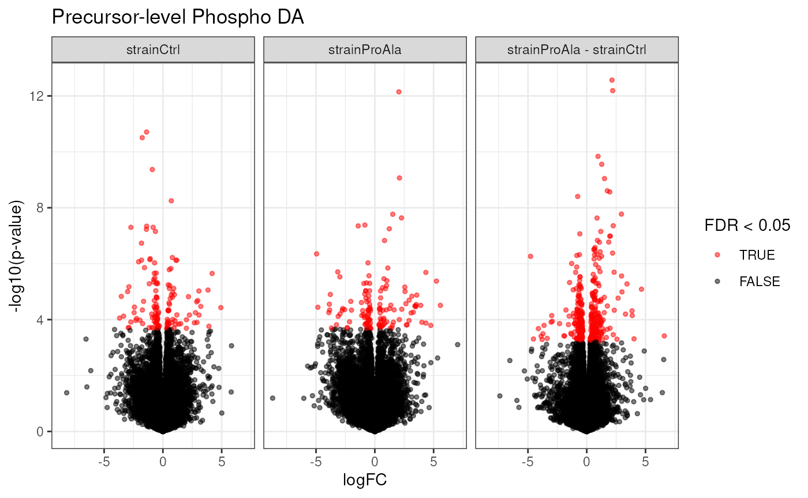

#### Heatmaps

We will make a heatmap for each contrast. Note that we cluster the rows
ourselves to avoid issues with missing values.

``` r

lapply(colnames(L),
                   function(contrast, se, alpha)
                   {
                     sig <- rowData(se)[[contrast]] |> 
                       filter(adjPval < alpha) |> 
                       rownames()
                     quants <- t(scale(t(assay(se[sig,]))))
                     colnames(quants) <- se$sampleId #specific to this dataset to get short colnames
                     rowclushlp <- quants
                     rowclushlp[is.na(rowclushlp)] <- min(quants,na.rm=TRUE) - 2
                     rowclus <- hclust(dist(rowclushlp))
                     annotations <- columnAnnotation(
                       group = se$strain
                       ) #3.
                     set.seed(1234) ## annotation colours are randomly generated by default
                     return(
                       Heatmap(show_row_names = FALSE,
                       quants, 
                       name = "log2 intensity",
                       top_annotation = annotations, 
                       column_title = paste0(contrast, " = 0"),
                       cluster_rows = rowclus
                       )
                     )
                   },
                   se = getWithColData(qf, "precursorsPTM_norm"),
                   alpha = alpha)
```

    ## [[1]]

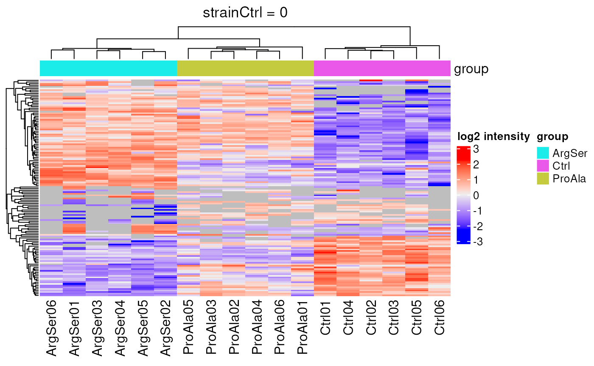

    ## 
    ## [[2]]

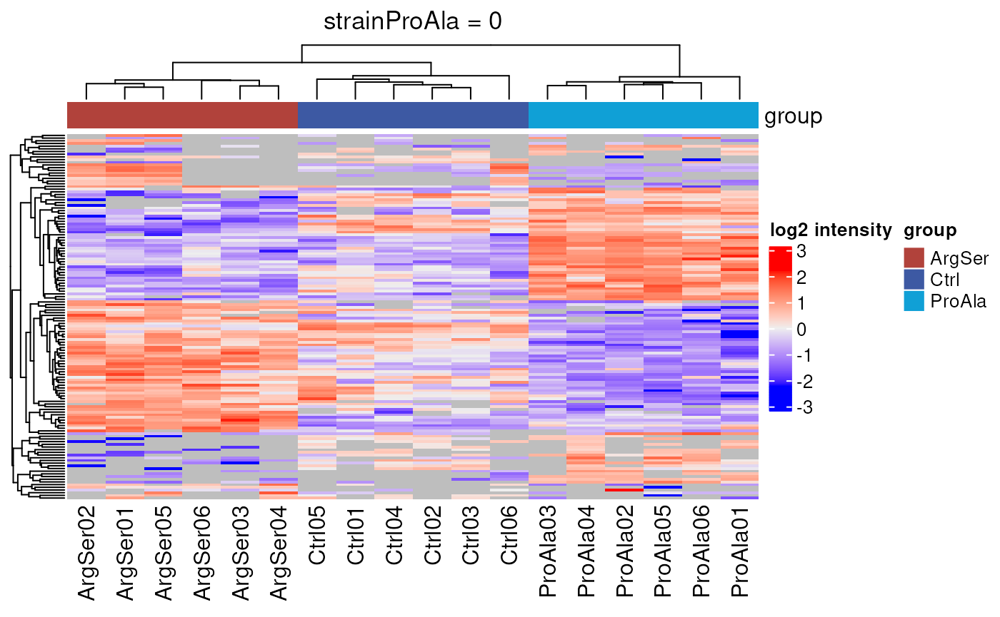

    ## 
    ## [[3]]

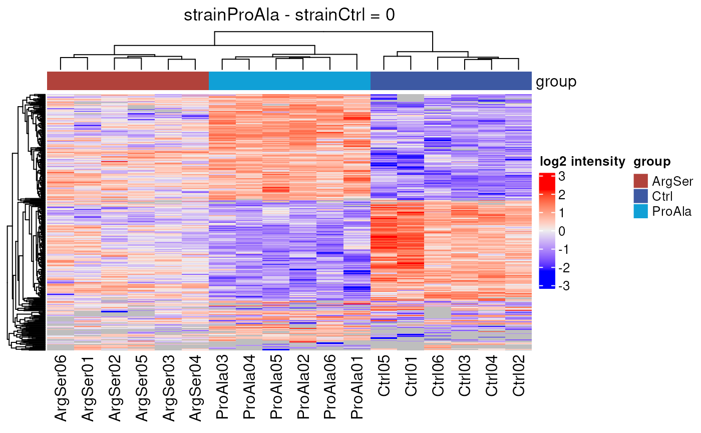

``` r

#Garbage collection to free space 
gc(); gc()
```

    ##            used  (Mb) gc trigger  (Mb)  max used   (Mb)
    ## Ncells 11739017 627.0   17340017 926.1  17340017  926.1
    ## Vcells 34970239 266.9  105312141 803.5 262549457 2003.1

    ##            used  (Mb) gc trigger  (Mb)  max used   (Mb)
    ## Ncells 11739024 627.0   17340017 926.1  17340017  926.1
    ## Vcells 34970287 266.9  105312141 803.5 262549457 2003.1

#### Detail plots

We can explore the data for a precursor to validate the statistical
inference results. For example, let’s explore the precursor and the
normalised precursor intensities for the precursor with the most
significant log2 fold change.

``` r

(target_feature <- inferencesPTM |> 
   dplyr::slice(which.min(pval)) |> 
   pull(feature)
)
```

    ## [1] "(UniMod:1)SDS(UniMod:21)EVNQEAKPEVK2"

``` r

inferencesPTM |> 
  filter(feature == target_feature)
```

    ##                                                                     logFC
    ## strainCtrl.(UniMod:1)SDS(UniMod:21)EVNQEAKPEVK2                -0.1018668
    ## strainProAla.(UniMod:1)SDS(UniMod:21)EVNQEAKPEVK2               2.0438618
    ## strainProAla - strainCtrl.(UniMod:1)SDS(UniMod:21)EVNQEAKPEVK2  2.1457286
    ##                                                                        se
    ## strainCtrl.(UniMod:1)SDS(UniMod:21)EVNQEAKPEVK2                0.09779209
    ## strainProAla.(UniMod:1)SDS(UniMod:21)EVNQEAKPEVK2              0.09989353
    ## strainProAla - strainCtrl.(UniMod:1)SDS(UniMod:21)EVNQEAKPEVK2 0.09850259
    ##                                                                      df
    ## strainCtrl.(UniMod:1)SDS(UniMod:21)EVNQEAKPEVK2                15.94953
    ## strainProAla.(UniMod:1)SDS(UniMod:21)EVNQEAKPEVK2              15.94953
    ## strainProAla - strainCtrl.(UniMod:1)SDS(UniMod:21)EVNQEAKPEVK2 15.94953
    ##                                                                        t
    ## strainCtrl.(UniMod:1)SDS(UniMod:21)EVNQEAKPEVK2                -1.041667
    ## strainProAla.(UniMod:1)SDS(UniMod:21)EVNQEAKPEVK2              20.460402
    ## strainProAla - strainCtrl.(UniMod:1)SDS(UniMod:21)EVNQEAKPEVK2 21.783474
    ##                                                                        pval
    ## strainCtrl.(UniMod:1)SDS(UniMod:21)EVNQEAKPEVK2                3.130993e-01
    ## strainProAla.(UniMod:1)SDS(UniMod:21)EVNQEAKPEVK2              7.155345e-13
    ## strainProAla - strainCtrl.(UniMod:1)SDS(UniMod:21)EVNQEAKPEVK2 2.721245e-13
    ##                                                                     adjPval
    ## strainCtrl.(UniMod:1)SDS(UniMod:21)EVNQEAKPEVK2                7.174904e-01
    ## strainProAla.(UniMod:1)SDS(UniMod:21)EVNQEAKPEVK2              2.281339e-08
    ## strainProAla - strainCtrl.(UniMod:1)SDS(UniMod:21)EVNQEAKPEVK2 8.623080e-09
    ##                                                                                 contrast
    ## strainCtrl.(UniMod:1)SDS(UniMod:21)EVNQEAKPEVK2                               strainCtrl
    ## strainProAla.(UniMod:1)SDS(UniMod:21)EVNQEAKPEVK2                           strainProAla
    ## strainProAla - strainCtrl.(UniMod:1)SDS(UniMod:21)EVNQEAKPEVK2 strainProAla - strainCtrl
    ##                                                                                             feature
    ## strainCtrl.(UniMod:1)SDS(UniMod:21)EVNQEAKPEVK2                (UniMod:1)SDS(UniMod:21)EVNQEAKPEVK2
    ## strainProAla.(UniMod:1)SDS(UniMod:21)EVNQEAKPEVK2              (UniMod:1)SDS(UniMod:21)EVNQEAKPEVK2
    ## strainProAla - strainCtrl.(UniMod:1)SDS(UniMod:21)EVNQEAKPEVK2 (UniMod:1)SDS(UniMod:21)EVNQEAKPEVK2

To obtain the required data, we perform a little data manipulation
pipeline:

- We use the QFeatures subsetting functionality to retrieve all data
  related to ion data used for model fitting.
- We then convert the data with longForm() for plotting.
- Finally, we plot the log2 normalised intensities for each sample for
  the unnormalised and normalised phospho precursors.

``` r

qf[target_feature, , c("precursorsPTM_log","precursorsPTM_norm")] |> #1
  longForm(colvars = colnames(colData(qf))) |> #2
  data.frame() |> 
  ggplot() +
  aes(x = sampleId,
      y = value) +
  geom_line(aes(group = rowname), linewidth = 0.1) +
  geom_point(aes(colour = strain)) +
  facet_wrap(~ assay, scales = "free") +
  ggtitle(target_feature) +
  theme_minimal() +
  theme(axis.text.x = element_blank())
```

    ## Warning: 'experiments' dropped; see 'drops()'

    ## harmonizing input:
    ##   removing 90 sampleMap rows not in names(experiments)
    ##   removing 18 colData rownames not in sampleMap 'primary'

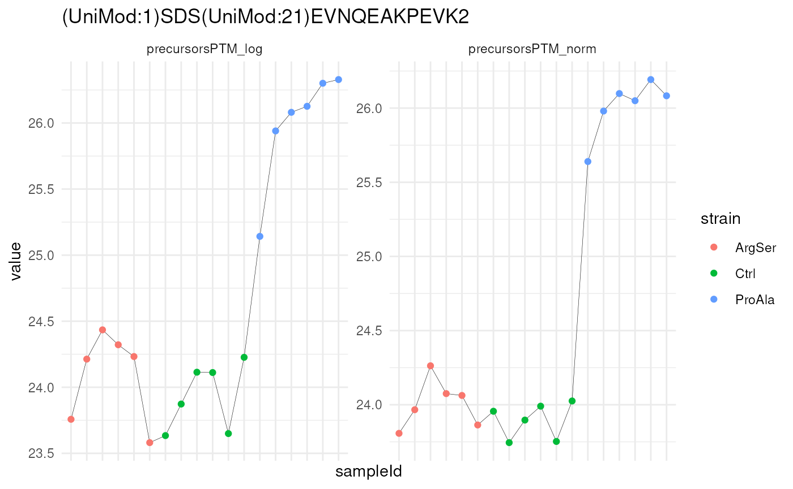

``` r

qf[target_feature, , c("precursorsPTM_log","precursorsPTM_norm")] |> #1
  longForm(colvars = colnames(colData(qf))) |> #2
  data.frame() |>
  filter(!is.na(value)) %>% 
  {
  ggplot(.) +
  aes(x = strain,
      y = value) +
  geom_boxplot(aes(colour = strain)) +
  facet_wrap(~ assay, scales = "free") +
  geom_jitter(aes(shape = rowname)) +
  scale_shape_manual(values = seq_len(dplyr::n_distinct(.$rowname))) +
  ggtitle(target_feature) +
  theme_minimal() +
  theme(axis.text.x = element_blank()) +
  guides(shape = "none")
  }
```

    ## Warning: 'experiments' dropped; see 'drops()'

    ## harmonizing input:
    ##   removing 90 sampleMap rows not in names(experiments)
    ##   removing 18 colData rownames not in sampleMap 'primary'

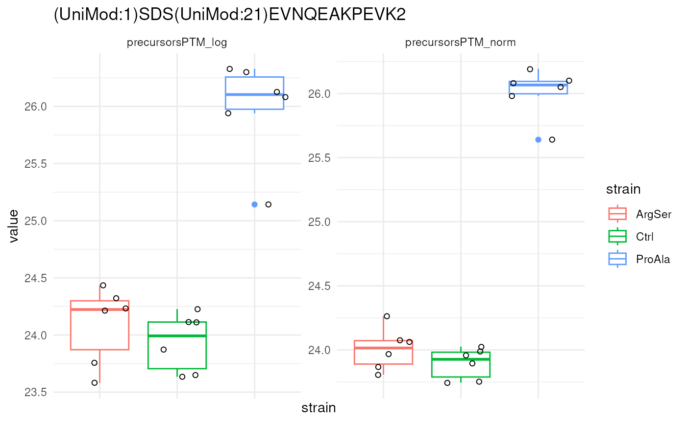

We prioritised DA phospho-precursors. However, they might be DA due to
the parent proteins on which the PTMs occur that can also change in
abundance regardless of the modification, which is clearly illustrated
for the top DA phospho-precursor!

Any changes in the abundance of a phospho-peptidoform can thus be
confounded with changes in protein abundance.

We therefore first assess differential abundance at the protein level
for the non-enriched samples and will then propose an differential usage
analysis where the precursor-level log2-FC is corrected for the
protein-level log2-FC.

``` r

#Garbage collection to free space 
gc(); gc()
```

    ##            used  (Mb) gc trigger  (Mb)  max used   (Mb)
    ## Ncells 11748229 627.5   17340017 926.1  17340017  926.1
    ## Vcells 34979699 266.9  105312141 803.5 262549457 2003.1

    ##            used  (Mb) gc trigger  (Mb)  max used   (Mb)
    ## Ncells 11748233 627.5   17340017 926.1  17340017  926.1
    ## Vcells 34979742 266.9  105312141 803.5 262549457 2003.1

## Data Modeling at protein-level (non-enriched samples)

Complete the R chunks in this section.

### Model estimation

We can use the same model to model the protein-level data of the
non-enriched runs. Indeed, they stem from the same biological samples.

We enabled M-estimation (`robust = TRUE`) for improved robustness
against outliers.

``` r

#Garbage collection to free space 
gc(); gc()
```

    ##            used  (Mb) gc trigger  (Mb)  max used   (Mb)
    ## Ncells 11748224 627.5   17340017 926.1  17340017  926.1
    ## Vcells 34979743 266.9  105312141 803.5 262549457 2003.1

    ##            used  (Mb) gc trigger  (Mb)  max used   (Mb)
    ## Ncells 11748234 627.5   17340017 926.1  17340017  926.1
    ## Vcells 34979796 266.9  105312141 803.5 262549457 2003.1

### Inference

We assess the contrast for each protein.

We extract the results table from the `proteins` summarised experiment
in the `qf` object.

``` r

#Garbage collection to free space 
gc(); gc()
```

    ##            used  (Mb) gc trigger  (Mb)  max used   (Mb)
    ## Ncells 11748225 627.5   17340017 926.1  17340017  926.1
    ## Vcells 34979793 266.9  105312141 803.5 262549457 2003.1

    ##            used  (Mb) gc trigger  (Mb)  max used   (Mb)
    ## Ncells 11748235 627.5   17340017 926.1  17340017  926.1
    ## Vcells 34979846 266.9  105312141 803.5 262549457 2003.1

### Report results

We report the results using a results table, volcano plots and heatmaps.

#### Results table

#### Volcanoplots

We notice that many proteins are DA at the nominal 5% FDR-level.

#### Heatmaps

#### Detail plots

We can explore the data for a protein to validate the statistical
inference results. For example, let’s explore the normalised precursor
and the summarised protein intensities for the protein with the most
significant log2 fold change.

To obtain the required data, we perform a little data manipulation
pipeline:

- We use the QFeatures subsetting functionality to retrieve all data
  related to and focusing on the precursors_log and proteins sets that
  contains the peptide ion data used for model fitting.
- We then convert the data with longForm() for plotting.
- Finally, we plot the log2 normalised intensities for each sample at
  the protein and at the peptide level. Since multiple peptides are
  recorded for the protein, we link peptides across samples using a grey
  line. Samples are colored according to strain.

#### Compare phospo-precursor level intensities to protein level intensities

We compare the intensities for the top 5 DA phospo-precursors for the
first contrast to these of their corresponding protein in the
non-enriched assay.

``` r

contr = colnames(L)[1]
top5 <- inferencesPTM |> 
  filter(contrast == contr) |> 
  arrange(pval) |> 
  head(n = 5) |> 
  pull(feature)

for (feat in top5)
{
  ptm_data <- qf[,,c("precursorsPTM_norm")] |> 
    longForm(colvars = colnames(colData(qf)), rowvars = "Protein.Group") |>
    data.frame() |> 
    filter(rowname==feat)
  feature_protein <- ptm_data |> 
    pull("Protein.Group") |> 
    unique()
  prot_data <- qf[,,"proteins"]|>
    longForm(colvars = colnames(colData(qf)), rowvars = "Protein.Group") |>
    data.frame() |> 
    filter(Protein.Group==feature_protein) 
  ptm_protein <- rbind(ptm_data, prot_data)
  ylims <- ptm_protein |> 
  group_by(assay) |> 
  summarise(cent = mean(range(value,na.rm=TRUE)), ampl = diff(range(value,na.rm=TRUE))) |> 
  mutate(lower = cent - max(ampl)/2, 
         upper = cent + max(ampl)/2) |> 
  select(-c(cent, ampl))
  
  comparison_plot <- ptm_protein |>
    ggplot() +
    aes(x = sampleId,
        y = value) +
    geom_line(aes(group = rowname), linewidth = 0.1) +
    geom_point(aes(colour = strain)) +
    facet_wrap(~ assay, scales = "free") +
    labs(
      title = paste0(feat," / ", feature_protein),
      subtitle = paste("padj PTM =", 
                       inferencesPTM |> 
                         filter(feature == feat & contrast == contr) |> 
                         pull(adjPval) |> 
                         round(digits = 3))
    ) +
    theme_minimal() +
    theme(axis.text.x = element_blank()) +
    ggh4x::facetted_pos_scales(
    y = list(
      assay == ylims$assay[1] ~ scale_y_continuous(limits = unlist(ylims[1,c("lower","upper")])),
      assay == ylims$assay[2] ~ scale_y_continuous(limits = unlist(ylims[2,c("lower","upper")])),
      assay == ylims$assay[3] ~ scale_y_continuous(limits = unlist(ylims[3,c("lower","upper")]))
    )
    ) 
 print(comparison_plot)
}
```

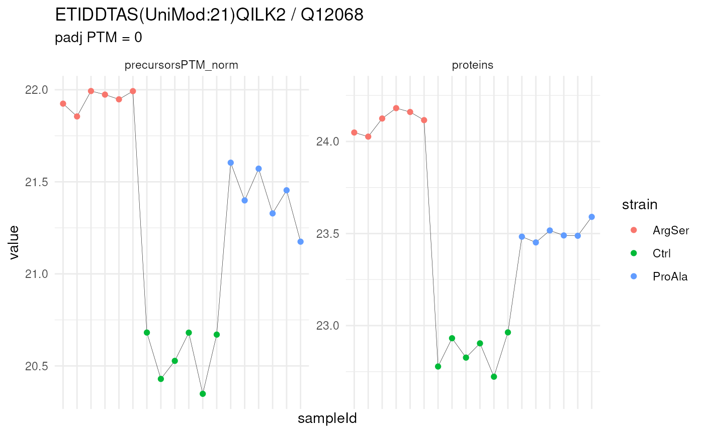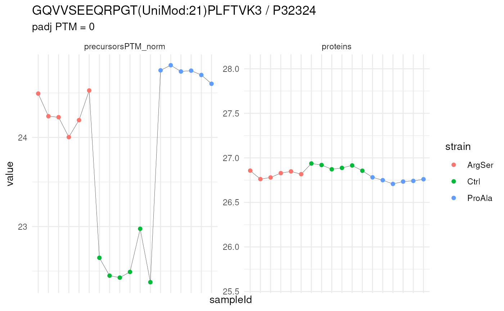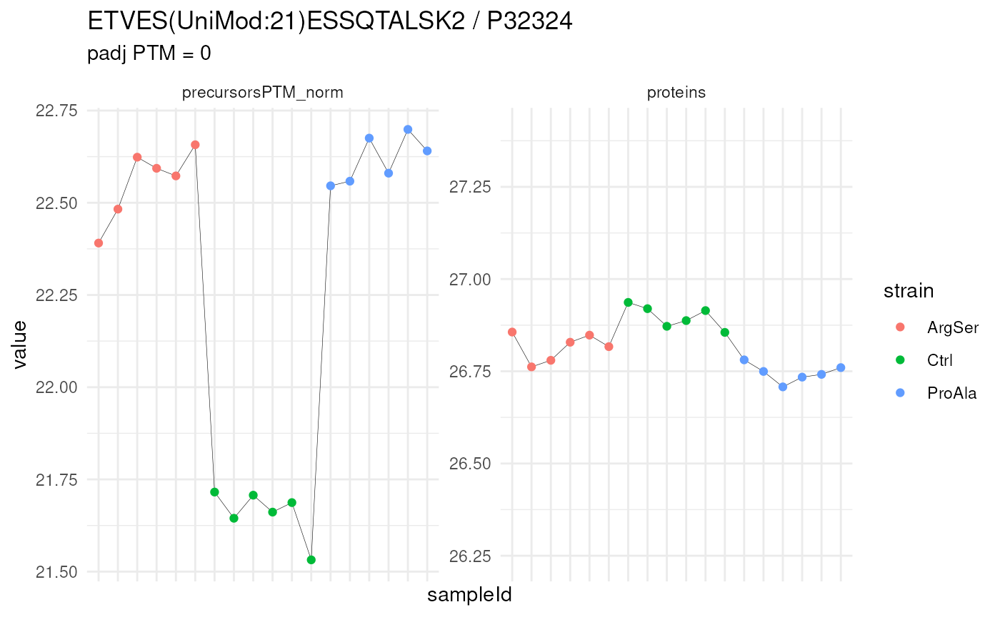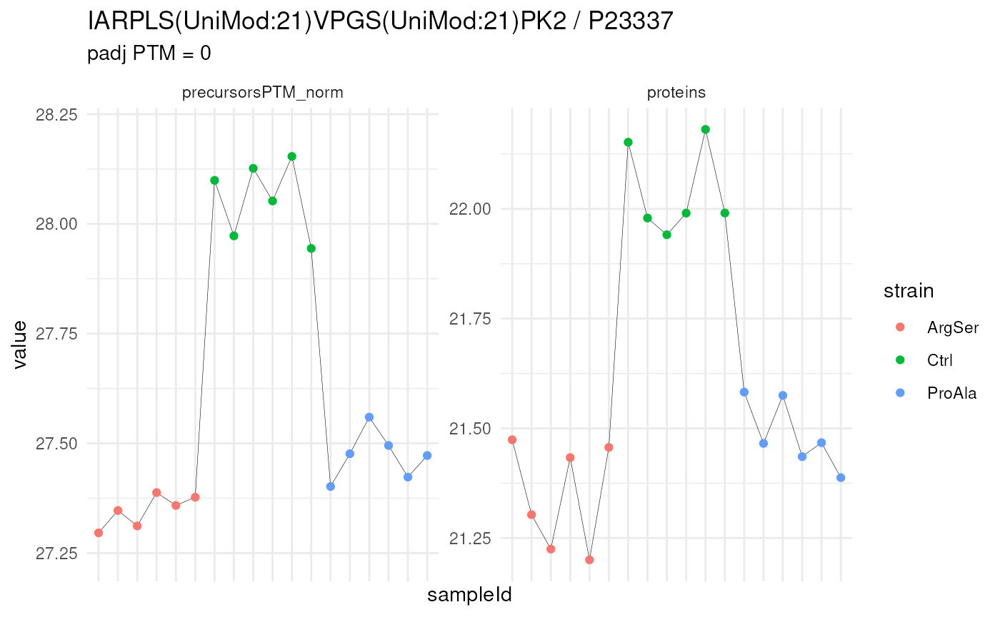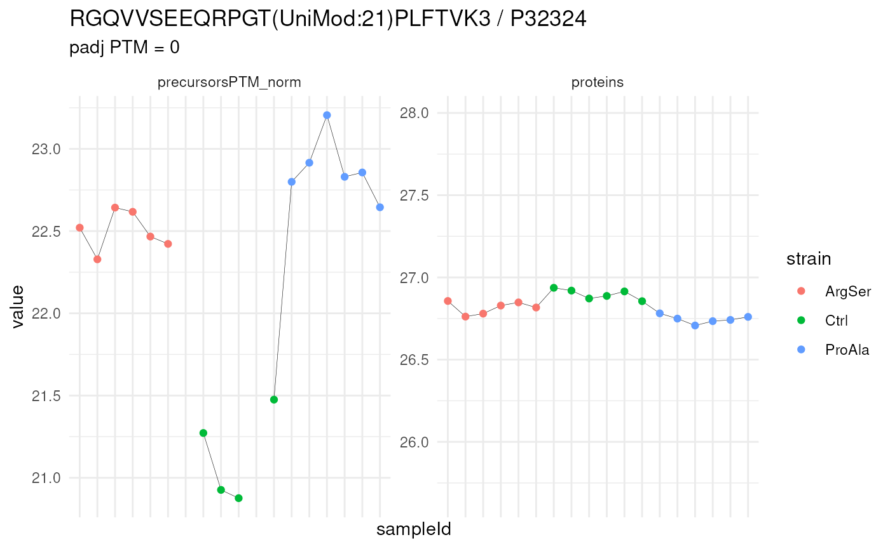

``` r

#Garbage collection to free space 
gc(); gc()
```

    ##            used  (Mb) gc trigger  (Mb)  max used   (Mb)
    ## Ncells 11758263 628.0   17340017 926.1  17340017  926.1
    ## Vcells 34999793 267.1  105312141 803.5 262549457 2003.1

    ##            used  (Mb) gc trigger  (Mb)  max used   (Mb)
    ## Ncells 11758270 628.0   17340017 926.1  17340017  926.1
    ## Vcells 34999841 267.1  105312141 803.5 262549457 2003.1

We see for multiple top DA phospho-precursors, that the reason for DA
seems to be associated with the similar changes in overall protein
abundance. Interestingly for other phospho-precursors the abundance of
the precursor changes between strains while the abundances at the
protein-level remains stable between strains. Hence, there is a strong
need to correct the phospho-precursor level fold changes/ abundances for
corresponding changes at the protein level.

## Data Modeling of phospho-peptidoform usages

### Background

- Differentially abundant PTMs can arise either from changes in PTM
  regulation or simply from changes in the abundance of the underlying
  protein.

- To distinguish PTM-specific regulation from protein-level changes, we
  extend the concept of *differential usage* (DU) to PTMs:

``` math
\log_2 DU = \log_2 FC^\text{PTM} - \log_2 FC^\text{protein},
```

where $`log_2 FC^\text{PTM}`$ is the fold change of the modified
precursor/PTM and $`log_2 FC^\text{protein}`$ is the fold change of the
corresponding protein.

- In other words, differential usage represents the differential
  abundance (DA) of a PTM after correcting for changes in protein
  abundance.

- This metric highlights PTMs whose abundance changes cannot be
  explained solely by changes in the total protein level, thereby
  prioritising PTMs that may be under specific regulatory control.

Two experimental designs are commonly used to quantify precursor-level
(PTM-level) and protein-level abundances:

- **Paired design:** PTM and protein abundances are measured in the same
  biological replicate (sample).

- **Unpaired design:** PTM and protein abundances are measured in
  independent biological replicates (different samples).

#### Paired samples

1.  Perform regular data processing at the protein-level:

    - log2-transformation,
    - normalisation and
    - summarisation

2.  Calculate relative log2 transformed abundances at peptidoform level
    ``` math
    y^\text{pep,rel}_i = y^\text{pep}_i - y^\text{prot}_i
    ```

3.  Perform conventional differential msqrob2 analysis on the relative
    peptidoform level. $`\rightarrow`$ Immediately gives us diferential
    usages!

4.  Optionally

&nbsp;

1.  aggregate relative log2 transformed abundances at peptidoform level
    to PTM-level
2.  perform a differential msqrob2 analysis at PTM-level

&nbsp;

5.  The paired design has the advantage that both metrics are estimated
    on the same biorepeat/sample, which enables a better estimation of
    the standard error on the usages.

#### Unpaired PTM-level and protein samples

This is the default MSstatsTMT approach, which they also use for paired
designs?!

1.  Perform regular msqrob2 differential analysis at the protein-level
2.  Perform regular msqrob2 differential analysis at the peptidoform
    (PTM-level)
3.  Calculate usages

``` math
 
\begin{array}{ccc}
\log_2 \widehat{DU} & =& \log_2 \widehat{FC}^\text{PTM} - log_2 \widehat{FC}^\text{protein}\\
SE_\widehat{DU} &=& \sqrt{(SE_\widehat{FC}^{PTM})^2 + (SE_\widehat{FC}^{protein})^2}
\end{array}
```

#### Our study

For this dataset we have phospho-enriched and non-enriched runs on the
same biological samples. So we have a paired design!

### Paired samples: calculate usages

We can calculate the usages for every precursor ion by subtracting the
corresponding log-transformed protein level abundance values from the
log2 transformed and normalized precursor ion intensities.

We first develop a function that will extract the corresponding protein
level abundance values.

It has following inputs:

- `se`: summarised experiment of the log2-transformed and normalized
  precursor ion
- `seNE`: summarised experiment of the log2-transformed, normalized and
  aggregated protein level abundances.
- `fcol`: annotation column with protein name for the precursor ions
- `fcolNE`: annotation column with protein name for the protein level
  abundances
- `matchColsSeToseNE`: a vector that matches the columns of `seNE` to
  these in `se`.

The function

1.  Initiates the matrix with log2 tranformed correction factors at NA.
2.  Matches the rows of se with these of seNE using the annotation
    columns
3.  Extracts the protein abundance values for the precursors from the
    matching rows and columns in the protein level assay.

``` r

calculate_usage_nfLog <- function(se, 
                               seNE, 
                               fcol = "Protein.Group", 
                               fcolNE = "Protein.Group", 
                               matchColsSeToseNE = 1:ncol(se)
                               )
{
    nf <- assay(se); nf[,] <- NA #1. 
    matchSeRowsToSeNERows <- match(
      rowData(se)[[fcol]], 
      rowData(seNE)[[fcolNE]]) #2.
    idsMatch <- which(!is.na(matchSeRowsToSeNERows))
    nf[idsMatch, ] <- assay(seNE)[matchSeRowsToSeNERows[idsMatch], matchColsSeToseNE] #3.
    return(nf)
}
```

Here we

1.  Match the samples of the phosho enriched samples to these of the
    non-enriched assay.
2.  Calculate the correction factors
3.  Make a new assay with usages by sweeping out the log2 protein
    abundances from from the log2 precursor abundances.

``` r

matchedSamps <- match(
  getWithColData(qf,"precursorsPTM_norm")$sampleId,
  getWithColData(qf,"proteins")$sampleId
  ) ## 1.

nfLog <- calculate_usage_nfLog(qf[["precursorsPTM_norm"]], 
                               qf[["proteins"]], 
                               fcol= "Protein.Group", 
                               fcolNE = "Protein.Group", 
                               matchColsSeToseNE = matchedSamps) ## 2.

qf <- sweep( #4. Subtract log2 norm factor elementwise (MARGIN = 1:2)
      qf,
      MARGIN = 1:2,
      STATS = nfLog,
      i = "precursorsPTM_norm",
      name = "precursorsPTM_usage"
      ) ## 3. 
```

We only keep precursors for which the usage can be calculated in at
least 6 samples.

``` r

n <- ncol(qf[["precursorsPTM_usage"]])
qf <- filterNA(qf, i = "precursorsPTM_usage", pNA = (n - nObs) / n)
```

We assess the distribution of the usages.

``` r

qf[, , "precursorsPTM_usage"] |> #1.
  longForm(colvars = colnames(colData(qf))) |>  #2. 
  data.frame() |> 
  filter(!is.na(value)) |>
  ggplot() + #3.
  aes(x = value,
      colour = strain,
      group = colname) +
  geom_density() +
  labs(subtitle = "Usage") +
  theme_minimal()
```

    ## harmonizing input:
    ##   removing 126 sampleMap rows not in names(experiments)
    ##   removing 18 colData rownames not in sampleMap 'primary'

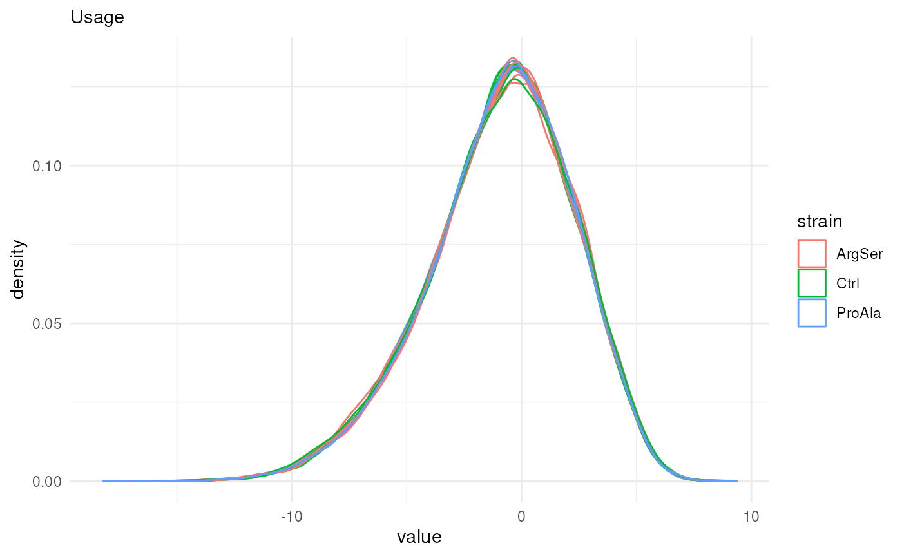

``` r

#Garbage collection to free space 
gc(); gc()
```

    ##            used  (Mb) gc trigger  (Mb)  max used   (Mb)
    ## Ncells 11773825 628.8   17340017 926.1  17340017  926.1
    ## Vcells 43462212 331.6  105312141 803.5 262549457 2003.1

    ##            used  (Mb) gc trigger  (Mb)  max used   (Mb)
    ## Ncells 11773832 628.8   17340017 926.1  17340017  926.1
    ## Vcells 43462260 331.6  105312141 803.5 262549457 2003.1

### Model estimation

Again we can estimate the same model but now for the usages.

``` r

qf <- msqrob(
  qf,
  i = "precursorsPTM_usage",
  formula = model,
  robust = TRUE,
  overwrite = TRUE)
```

We enabled M-estimation (`robust = TRUE`) for improved robustness
against outliers.

``` r

#Garbage collection to free space 
gc(); gc()
```

    ##            used  (Mb) gc trigger   (Mb)  max used   (Mb)
    ## Ncells 12439609 664.4   22558697 1204.8  17340017  926.1
    ## Vcells 45300116 345.7  105312141  803.5 262549457 2003.1

    ##            used  (Mb) gc trigger   (Mb)  max used   (Mb)
    ## Ncells 12439616 664.4   22558697 1204.8  17340017  926.1
    ## Vcells 45300164 345.7  105312141  803.5 262549457 2003.1

### Inference

Contrasts remain the same. We assess the contrast for each precursor.

``` r

qf <- hypothesisTest(qf, i = "precursorsPTM_usage", contrast = L, overwrite = TRUE)
```

We extract the results table from the `proteins` summarised experiment
in the `qf` object.

``` r

inferencesUsage <- 
  msqrobCollect(qf[["precursorsPTM_usage"]], L)
```

``` r

#Garbage collection to free space 
gc(); gc()
```

    ##            used  (Mb) gc trigger   (Mb)  max used   (Mb)
    ## Ncells 12439855 664.4   22558697 1204.8  22558697 1204.8
    ## Vcells 46107423 351.8  105312141  803.5 262549457 2003.1

    ##            used  (Mb) gc trigger   (Mb)  max used   (Mb)
    ## Ncells 12439859 664.4   22558697 1204.8  22558697 1204.8
    ## Vcells 46107466 351.8  105312141  803.5 262549457 2003.1

### Report results

We report the results using a results table, volcano plots and heatmaps.

#### Results table

``` r

for (j in colnames(L)) {

  inference <- inferencesUsage |> 
    dplyr::filter(adjPval < alpha & contrast == j)

  cat("**Median - Contrast:**", j, "= 0 (", nrow(inference),
      "significant proteins)\n\n")

  cat('<div style="max-height:300px; overflow-y:auto;">')

  print(
    kable(
      inference |>
        dplyr::arrange(pval) |>
        dplyr::relocate(feature),
      row.names = FALSE
    )
  )

  cat('</div>')

  cat("\n\n\n---\n\n")
}
```

**Median - Contrast:** strainCtrl = 0 ( 36 significant proteins)

| feature | logFC | se | df | t | pval | adjPval | contrast |
|:---|---:|---:|---:|---:|---:|---:|:---|
| GQVVSEEQRPGT(UniMod:21)PLFTVK3 | -1.8482677 | 0.1068439 | 15.836972 | -17.298767 | 0.00e+00 | 0.0000003 | strainCtrl |
| ETVES(UniMod:21)ESSQTALSK2 | -0.9952475 | 0.0783042 | 16.197308 | -12.710008 | 0.00e+00 | 0.0000119 | strainCtrl |
| RAT(UniMod:21)YAGFLLADPK3 | -2.7741769 | 0.2279059 | 11.950433 | -12.172465 | 0.00e+00 | 0.0004465 | strainCtrl |
| RGQVVSEEQRPGT(UniMod:21)PLFTVK3 | -1.4603261 | 0.1402037 | 13.802960 | -10.415744 | 1.00e-07 | 0.0004999 | strainCtrl |
| ETVESESS(UniMod:21)QTALSK2 | -1.9360818 | 0.1621744 | 10.909544 | -11.938270 | 1.00e-07 | 0.0008275 | strainCtrl |
| GSSS(UniMod:21)LYTLVINDAGK2 | 1.1442699 | 0.1346803 | 16.943653 | 8.496195 | 2.00e-07 | 0.0008472 | strainCtrl |
| IS(UniMod:21)PPVVAYR2 | -1.8883643 | 0.2283225 | 15.390528 | -8.270603 | 5.00e-07 | 0.0017963 | strainCtrl |
| GSS(UniMod:21)SLYTLVINDAGK3 | 1.0582663 | 0.1296797 | 15.395842 | 8.160619 | 6.00e-07 | 0.0017963 | strainCtrl |
| LVQIT(UniMod:21)PDGK2 | 0.7593899 | 0.0947649 | 15.893705 | 8.013408 | 6.00e-07 | 0.0017963 | strainCtrl |
| T(UniMod:21)GAAPQTTFNVAPNSTPIVSTAATGLQHK4 | -1.0891227 | 0.1291096 | 14.475080 | -8.435648 | 6.00e-07 | 0.0017963 | strainCtrl |
| T(UniMod:21)GAAPQTTFNVAPNSTPIVSTAATGLQHK3 | -0.6099364 | 0.0764334 | 15.165634 | -7.979970 | 8.00e-07 | 0.0023318 | strainCtrl |
| LYDLLGVS(UniMod:21)PSANEQELK2 | -1.0772610 | 0.1437330 | 15.383013 | -7.494876 | 1.60e-06 | 0.0042276 | strainCtrl |
| VSSFNHS(UniMod:21)SSGMTSSDSLASEEVPSNK3 | 4.2615011 | 0.2899826 | 6.774257 | 14.695715 | 2.20e-06 | 0.0052068 | strainCtrl |
| GSEIVIAT(UniMod:21)PGR2 | -0.9925106 | 0.1377531 | 15.595807 | -7.204996 | 2.40e-06 | 0.0054067 | strainCtrl |
| DLARENS(UniMod:21)LETTFSSVNTR3 | -0.7759475 | 0.1127871 | 16.683016 | -6.879753 | 3.00e-06 | 0.0061279 | strainCtrl |
| RGQVVSEEQRPGT(UniMod:21)PLFTVK4 | -1.6691797 | 0.1777611 | 9.684021 | -9.390016 | 3.60e-06 | 0.0069362 | strainCtrl |
| DPIPSDPS(UniMod:21)ER2 | -0.6518697 | 0.0984945 | 16.943653 | -6.618339 | 4.40e-06 | 0.0076468 | strainCtrl |
| RNT(UniMod:21)AIPTK2 | 1.0023303 | 0.1484774 | 15.995194 | 6.750728 | 4.70e-06 | 0.0076468 | strainCtrl |
| NGLNELASS(UniMod:21)ATK2 | 0.8900045 | 0.1335761 | 16.492505 | 6.662903 | 4.70e-06 | 0.0076468 | strainCtrl |
| NNEGSSNMNMNRNDLDDVS(UniMod:21)HYEMK3 | 3.6974238 | 0.4017140 | 8.943653 | 9.204121 | 7.40e-06 | 0.0115386 | strainCtrl |
| EIVFAS(UniMod:21)PPRK2 | -0.8539713 | 0.1367768 | 16.248668 | -6.243540 | 1.09e-05 | 0.0161016 | strainCtrl |
| M(UniMod:35)TEAGS(UniMod:21)LDLIDDAGENS(UniMod:21)DLEDRIDNSLPGSQR4 | -2.8200375 | 0.2645438 | 7.206195 | -10.660002 | 1.14e-05 | 0.0161016 | strainCtrl |
| AES(UniMod:21)DAVAEANDIDD2 | -0.5139705 | 0.0847688 | 16.815572 | -6.063202 | 1.33e-05 | 0.0179509 | strainCtrl |
| SDEEHTFENADAGAS(UniMod:21)ATYPM(UniMod:35)QC(UniMod:4)SALR3 | 3.0092552 | 0.2748446 | 6.811645 | 10.948935 | 1.43e-05 | 0.0185201 | strainCtrl |
| NTTATPIQFADFNT(UniMod:21)SSNNLTPSQSVTNSGTQVAHGNNMEVDR4 | 3.1647276 | 0.2445506 | 5.787366 | 12.940991 | 1.72e-05 | 0.0198799 | strainCtrl |
| RPTYSSS(UniMod:21)KSNNWTPGEASDTPPLPPHATPK4 | -3.0060290 | 0.3923709 | 9.943653 | -7.661193 | 1.77e-05 | 0.0198799 | strainCtrl |
| MQNIAPS(UniMod:21)RSSESTPTSGPPLLPPR3 | 3.8203404 | 0.3076323 | 5.943653 | 12.418528 | 1.78e-05 | 0.0198799 | strainCtrl |
| ETNNNLSNM(UniMod:35)NSS(UniMod:21)PAQNPK3 | -3.5348867 | 0.2182677 | 4.943653 | -16.195190 | 1.79e-05 | 0.0198799 | strainCtrl |
| (UniMod:27)EYS(UniMod:21)NVDQYGHQR3 | 2.0973159 | 0.3162318 | 12.075387 | 6.632210 | 2.35e-05 | 0.0251931 | strainCtrl |
| (UniMod:27)EKSPT(UniMod:21)PQT(UniMod:21)STASLSSVTK3 | 3.2079677 | 0.4670287 | 10.645516 | 6.868888 | 3.18e-05 | 0.0330043 | strainCtrl |
| (UniMod:27)EAVVDDGS(UniMod:21)ENAFGIPEFTR2 | 1.2763621 | 0.2202474 | 15.015793 | 5.795128 | 3.52e-05 | 0.0352965 | strainCtrl |
| NEHS(UniMod:21)NLAVEDNIPEEEPK3 | -0.5980074 | 0.1085922 | 16.254505 | -5.506911 | 4.52e-05 | 0.0434145 | strainCtrl |
| SNNWTPGEAS(UniMod:21)DT(UniMod:21)PPLPPHATPK3 | 4.8956957 | 0.4653275 | 5.943653 | 10.520967 | 4.61e-05 | 0.0434145 | strainCtrl |
| EQATDPILTATGPEDM(UniMod:35)QQSAS(UniMod:21)IVGPSSNANPVTATAATENQPK4 | -3.4580659 | 0.5320764 | 10.825838 | -6.499191 | 4.78e-05 | 0.0436994 | strainCtrl |
| MSES(UniMod:21)PMFAANGMPK2 | 2.6889135 | 0.4182244 | 10.934164 | 6.429356 | 5.02e-05 | 0.0445779 | strainCtrl |
| RAT(UniMod:21)YAGFLLADPK2 | -2.3458417 | 0.3564194 | 10.268941 | -6.581690 | 5.49e-05 | 0.0474368 | strainCtrl |

------------------------------------------------------------------------

**Median - Contrast:** strainProAla = 0 ( 58 significant proteins)

| feature | logFC | se | df | t | pval | adjPval | contrast |
|:---|---:|---:|---:|---:|---:|---:|:---|
| (UniMod:1)SDS(UniMod:21)EVNQEAKPEVK2 | 2.0007583 | 0.0807470 | 15.201633 | 24.778123 | 0.00e+00 | 0.0000000 | strainProAla |
| S(UniMod:21)DSEVNQEAKPEVK2 | 2.0851157 | 0.1437238 | 16.193635 | 14.507793 | 0.00e+00 | 0.0000016 | strainProAla |
| S(UniMod:21)DSEVNQEAKPEVK3 | 2.3155078 | 0.1874540 | 13.858093 | 12.352405 | 0.00e+00 | 0.0000656 | strainProAla |
| LYDLLGVS(UniMod:21)PSANEQELK2 | -1.5736386 | 0.1405310 | 15.383013 | -11.197804 | 0.00e+00 | 0.0000656 | strainProAla |
| AINS(UniMod:21)PIIR2 | 1.1395342 | 0.1173179 | 16.074020 | 9.713220 | 0.00e+00 | 0.0002442 | strainProAla |
| RNT(UniMod:21)AIPTK2 | 1.4055365 | 0.1517256 | 15.995194 | 9.263673 | 1.00e-07 | 0.0004074 | strainProAla |
| NNEES(UniMod:21)REEATAALK3 | -0.8573307 | 0.0929604 | 15.486627 | -9.222534 | 1.00e-07 | 0.0004864 | strainProAla |
| INMGGGLFLSPEDIT(UniMod:21)KIASGLIS(UniMod:21)PVLGEVSER4 | -5.0261755 | 0.3832550 | 8.914191 | -13.114442 | 4.00e-07 | 0.0015288 | strainProAla |
| APVAS(UniMod:21)PRPAAT(UniMod:21)PNLSK3 | -0.7254025 | 0.0903886 | 16.348450 | -8.025377 | 5.00e-07 | 0.0015776 | strainProAla |
| HSRPLS(UniMod:21)IS(UniMod:21)ST(UniMod:21)TPLDLQR3 | 5.3704830 | 0.2719755 | 5.943653 | 19.746205 | 1.20e-06 | 0.0037231 | strainProAla |
| GSSS(UniMod:21)LYTLVINDAGK2 | 0.9759734 | 0.1346803 | 16.943653 | 7.246595 | 1.40e-06 | 0.0039199 | strainProAla |
| VSSFNHS(UniMod:21)SSGMTSSDSLASEEVPSNK3 | 4.3675411 | 0.2982378 | 6.774257 | 14.644494 | 2.20e-06 | 0.0057447 | strainProAla |
| SDEEHTFENADAGAS(UniMod:21)ATYPM(UniMod:35)QC(UniMod:4)SALR3 | 3.3647961 | 0.2393724 | 6.811645 | 14.056741 | 2.80e-06 | 0.0066184 | strainProAla |
| (UniMod:1)TT(UniMod:21)ASSSASQLQQR2 | 1.0472439 | 0.1505212 | 15.863188 | 6.957450 | 3.40e-06 | 0.0074838 | strainProAla |
| GSS(UniMod:21)SLYTLVINDAGK3 | 0.8802596 | 0.1288067 | 15.395842 | 6.833958 | 4.90e-06 | 0.0092999 | strainProAla |
| M(UniMod:35)TEAGS(UniMod:21)LDLIDDAGENS(UniMod:21)DLEDRIDNSLPGSQR4 | -2.9411947 | 0.2453088 | 7.206195 | -11.989765 | 5.10e-06 | 0.0092999 | strainProAla |
| T(UniMod:21)GAAPQTTFNVAPNSTPIVSTAATGLQHK4 | -0.9008766 | 0.1284796 | 14.475080 | -7.011823 | 5.10e-06 | 0.0092999 | strainProAla |
| APVAS(UniMod:21)PRPAAT(UniMod:21)PNLSK2 | -0.7488539 | 0.1107006 | 15.377494 | -6.764679 | 5.60e-06 | 0.0094000 | strainProAla |
| T(UniMod:21)GAAPQTTFNVAPNSTPIVSTAATGLQHK3 | -0.5462570 | 0.0804674 | 15.165634 | -6.788552 | 5.80e-06 | 0.0094000 | strainProAla |
| LVQIT(UniMod:21)PDGK2 | 0.6109495 | 0.0934934 | 15.893705 | 6.534683 | 7.10e-06 | 0.0106696 | strainProAla |
| SST(UniMod:21)EHMLISPGR3 | 3.4504443 | 0.1934187 | 5.175661 | 17.839250 | 7.60e-06 | 0.0106696 | strainProAla |
| NNEGSSNMNMNRNDLDDVS(UniMod:21)HYEMK3 | 3.6130811 | 0.3935977 | 8.943653 | 9.179630 | 7.60e-06 | 0.0106696 | strainProAla |
| TPTPTPPVVAEPAIS(UniMod:21)PRPVSQR3 | -0.4663034 | 0.0739539 | 16.775678 | -6.305322 | 8.40e-06 | 0.0109398 | strainProAla |
| MQNIAPS(UniMod:21)RSSESTPTSGPPLLPPR3 | 3.9673353 | 0.2808286 | 5.943653 | 14.127249 | 8.50e-06 | 0.0109398 | strainProAla |
| QAGS(UniMod:21)PSSTVSSLAK2 | 0.9815689 | 0.1497656 | 15.013679 | 6.554036 | 9.10e-06 | 0.0112600 | strainProAla |
| MSEES(UniMod:21)LFESSPQK2 | -3.8347949 | 0.6096303 | 16.015957 | -6.290361 | 1.07e-05 | 0.0127550 | strainProAla |
| S(UniMod:21)DS(UniMod:21)EVNQEAKPEVK3 | 2.0185320 | 0.2384652 | 9.073396 | 8.464683 | 1.34e-05 | 0.0153179 | strainProAla |
| AALDEPDLNAVMT(UniMod:21)NEDSIDLNASEVDHSSR3 | 2.6824678 | 0.3278499 | 9.097476 | 8.181999 | 1.73e-05 | 0.0191485 | strainProAla |
| LRDLY(UniMod:21)LEQTESDSDFDEGSQANGSVPPLK3 | -4.9926570 | 0.6690994 | 10.210581 | -7.461756 | 1.92e-05 | 0.0204825 | strainProAla |
| M(UniMod:35)TDPHLNTPQVSTS(UniMod:21)PTFER3 | -3.1318378 | 0.4611515 | 11.721168 | -6.791342 | 2.17e-05 | 0.0224006 | strainProAla |
| S(UniMod:21)S(UniMod:21)IPAGTDPGSC(UniMod:4)GANFK3 | -3.7429438 | 0.3652596 | 6.777048 | -10.247352 | 2.27e-05 | 0.0226635 | strainProAla |
| MS(UniMod:21)DSEVNQEAKPEVK3 | 2.6987332 | 0.4358959 | 13.988217 | 6.191234 | 2.36e-05 | 0.0227736 | strainProAla |
| TGAAPQTTFNVAPNSTPIVSTAAT(UniMod:21)GLQHK3 | -1.0815174 | 0.1731465 | 13.615245 | -6.246256 | 2.43e-05 | 0.0227736 | strainProAla |
| APVAS(UniMod:21)PRPAATPNLSK2 | -0.5787964 | 0.0983087 | 14.876090 | -5.887539 | 3.09e-05 | 0.0280994 | strainProAla |
| GT(UniMod:21)QSQYESGLTSNK2 | -0.5976299 | 0.1054515 | 15.850881 | -5.667344 | 3.63e-05 | 0.0303160 | strainProAla |
| SNNWTPGEAS(UniMod:21)DT(UniMod:21)PPLPPHATPK3 | 5.5877970 | 0.5097408 | 5.943653 | 10.962037 | 3.65e-05 | 0.0303160 | strainProAla |
| MS(UniMod:21)DSEVNQEAKPEVK2 | 3.1037347 | 0.5412374 | 15.205809 | 5.734516 | 3.75e-05 | 0.0303160 | strainProAla |
| LVPADS(UniMod:21)DEEEYETSHISDTPVSLSSANDR4 | 4.8949772 | 0.2853207 | 4.328816 | 17.156053 | 3.81e-05 | 0.0303160 | strainProAla |
| MSES(UniMod:21)PMFAANGMPK2 | 2.7744928 | 0.4184729 | 10.934164 | 6.630041 | 3.82e-05 | 0.0303160 | strainProAla |
| DIPGDEAYNS(UniMod:21)DDIM(UniMod:35)APLREK3 | -3.9371653 | 0.3730761 | 5.943653 | -10.553250 | 4.53e-05 | 0.0341862 | strainProAla |
| S(UniMod:21)SSVYM(UniMod:35)DSEPAVNK2 | -4.3428436 | 0.4110750 | 5.937846 | -10.564601 | 4.53e-05 | 0.0341862 | strainProAla |
| NTTATPIQFADFNT(UniMod:21)SSNNLTPSQSVTNSGTQVAHGNNMEVDR4 | 3.6741388 | 0.3411907 | 5.787366 | 10.768578 | 4.80e-05 | 0.0354081 | strainProAla |
| SFGSGLKLKITDS(UniMod:21)NLENMEDVEAK3 | 3.1851425 | 0.2997127 | 5.762111 | 10.627317 | 5.32e-05 | 0.0363446 | strainProAla |
| ETNNNLSNM(UniMod:35)NSS(UniMod:21)PAQNPK3 | -2.8210861 | 0.2182677 | 4.943653 | -12.924890 | 5.34e-05 | 0.0363446 | strainProAla |
| TGLGTPNQQVSVPNIVS(UniMod:21)PK3 | 3.3709742 | 0.4316564 | 7.943653 | 7.809393 | 5.40e-05 | 0.0363446 | strainProAla |
| IS(UniMod:21)M(UniMod:35)SPNRELLK3 | -3.2032646 | 0.3147309 | 5.943653 | -10.177790 | 5.56e-05 | 0.0363446 | strainProAla |
| MKT(UniMod:21)TDTYPSLPK2 | 0.9145450 | 0.1545666 | 12.721892 | 5.916836 | 5.57e-05 | 0.0363446 | strainProAla |
| (UniMod:27)ES(UniMod:21)VHNHSDGDDVDIPM(UniMod:35)DDSPVNEEAR4 | 2.8977437 | 0.2274719 | 4.943653 | 12.738910 | 5.72e-05 | 0.0363446 | strainProAla |
| TVDPAS(UniMod:21)APNHSPEIDNLDDLVVLK4 | 2.2915891 | 0.3857961 | 12.506918 | 5.939896 | 5.75e-05 | 0.0363446 | strainProAla |
| DASM(UniMod:35)QHDLIPLNSSDDYHNDASVTAATSNNFLSS(UniMod:21)PSSSDSLSK4 | -2.9980051 | 0.4497650 | 9.838373 | -6.665715 | 6.05e-05 | 0.0367797 | strainProAla |
| LGLPHGS(UniMod:21)GPT(UniMod:21)SVYNNK2 | -2.2257780 | 0.2534438 | 6.775273 | -8.782137 | 6.06e-05 | 0.0367797 | strainProAla |
| M(UniMod:35)KVEVDS(UniMod:21)FSGAK3 | -0.9864823 | 0.1862873 | 16.781519 | -5.295490 | 6.19e-05 | 0.0368632 | strainProAla |
| (UniMod:28)QAGS(UniMod:21)PSSTVSSLAK2 | 1.3099345 | 0.2442919 | 15.672697 | 5.362169 | 6.82e-05 | 0.0398108 | strainProAla |
| ALLELLDDS(UniMod:21)PVTPGETR3 | 1.5166606 | 0.2182537 | 8.891094 | 6.949071 | 7.10e-05 | 0.0407351 | strainProAla |
| ITIDS(UniMod:21)PYLVC(UniMod:4)TEGEK2 | 0.5405267 | 0.1037362 | 16.500582 | 5.210591 | 7.77e-05 | 0.0437645 | strainProAla |
| NVSTEHQNQSHPVNS(UniMod:21)ESHLIAEPNILTPYVPSESSQTPVMK4 | 3.1528234 | 0.2676530 | 4.943653 | 11.779517 | 8.34e-05 | 0.0461112 | strainProAla |
| TT(UniMod:21)PSFVAFTDTER2 | 0.5073982 | 0.0989436 | 16.523363 | 5.128158 | 9.16e-05 | 0.0492623 | strainProAla |
| RPLS(UniMod:21)QPTTSIGFPALEK3 | -0.5812232 | 0.1112470 | 15.508035 | -5.224620 | 9.23e-05 | 0.0492623 | strainProAla |

------------------------------------------------------------------------

**Median - Contrast:** strainProAla - strainCtrl = 0 ( 115 significant
proteins)

| feature | logFC | se | df | t | pval | adjPval | contrast |
|:---|---:|---:|---:|---:|---:|---:|:---|
| (UniMod:1)SDS(UniMod:21)EVNQEAKPEVK2 | 2.0718815 | 0.0818991 | 15.201633 | 25.297983 | 0.0000000 | 0.0000000 | strainProAla - strainCtrl |
| GQVVSEEQRPGT(UniMod:21)PLFTVK3 | 2.3554048 | 0.1042088 | 15.836972 | 22.602750 | 0.0000000 | 0.0000000 | strainProAla - strainCtrl |
| ETVES(UniMod:21)ESSQTALSK2 | 1.1121529 | 0.0762780 | 16.197308 | 14.580258 | 0.0000000 | 0.0000010 | strainProAla - strainCtrl |
| S(UniMod:21)DSEVNQEAKPEVK2 | 1.8593632 | 0.1469425 | 16.193635 | 12.653676 | 0.0000000 | 0.0000063 | strainProAla - strainCtrl |
| RGQVVSEEQRPGT(UniMod:21)PLFTVK3 | 1.8829844 | 0.1426789 | 13.802960 | 13.197357 | 0.0000000 | 0.0000200 | strainProAla - strainCtrl |
| AINS(UniMod:21)PIIR2 | 1.2208742 | 0.1146020 | 16.074020 | 10.653168 | 0.0000000 | 0.0000481 | strainProAla - strainCtrl |
| RAT(UniMod:21)YAGFLLADPK3 | 3.0804606 | 0.2239632 | 11.950433 | 13.754318 | 0.0000000 | 0.0000481 | strainProAla - strainCtrl |
| IS(UniMod:21)PPVVAYR2 | 2.3977791 | 0.2279889 | 15.390528 | 10.517085 | 0.0000000 | 0.0000766 | strainProAla - strainCtrl |
| EIVFAS(UniMod:21)PPRK2 | 1.3240693 | 0.1377710 | 16.248668 | 9.610654 | 0.0000000 | 0.0001395 | strainProAla - strainCtrl |
| S(UniMod:21)DSEVNQEAKPEVK3 | 1.8834481 | 0.1763438 | 13.858093 | 10.680546 | 0.0000000 | 0.0001395 | strainProAla - strainCtrl |
| ETVESESS(UniMod:21)QTALSK2 | 2.0626558 | 0.1644077 | 10.909544 | 12.545978 | 0.0000001 | 0.0002239 | strainProAla - strainCtrl |
| (UniMod:1)TT(UniMod:21)ASSSASQLQQR2 | 1.4414307 | 0.1585706 | 15.863188 | 9.090148 | 0.0000001 | 0.0002802 | strainProAla - strainCtrl |
| GSEIVIAT(UniMod:21)PGR2 | 1.2009457 | 0.1377531 | 15.595807 | 8.718102 | 0.0000002 | 0.0005012 | strainProAla - strainCtrl |
| ASYPLT(UniMod:21)PR2 | 1.1063106 | 0.1280723 | 15.749328 | 8.638172 | 0.0000002 | 0.0005012 | strainProAla - strainCtrl |
| RGQVVSEEQRPGT(UniMod:21)PLFTVK4 | 2.1765772 | 0.1773476 | 9.684021 | 12.272944 | 0.0000003 | 0.0006465 | strainProAla - strainCtrl |
| NAVSTKPTPPPAPEASAES(UniMod:21)GLSS(UniMod:21)K3 | 1.1073904 | 0.1323121 | 15.768443 | 8.369535 | 0.0000003 | 0.0006465 | strainProAla - strainCtrl |
| (UniMod:1)SS(UniMod:21)AITALTPNQVNDELNK2 | 0.7708770 | 0.0935191 | 16.110768 | 8.242990 | 0.0000004 | 0.0006465 | strainProAla - strainCtrl |
| INMGGGLFLSPEDIT(UniMod:21)KIASGLIS(UniMod:21)PVLGEVSER4 | -4.7276674 | 0.3791225 | 8.914191 | -12.470026 | 0.0000006 | 0.0010360 | strainProAla - strainCtrl |
| PTPPPAPEASAESGLSS(UniMod:21)K3 | 0.5702916 | 0.0759555 | 16.140373 | 7.508234 | 0.0000012 | 0.0019177 | strainProAla - strainCtrl |
| EIVFAS(UniMod:21)PPR2 | 1.3149020 | 0.1707884 | 14.976598 | 7.699012 | 0.0000014 | 0.0021388 | strainProAla - strainCtrl |
| HSRPLS(UniMod:21)IS(UniMod:21)ST(UniMod:21)TPLDLQR3 | 5.0425550 | 0.2719755 | 5.943653 | 18.540478 | 0.0000017 | 0.0025489 | strainProAla - strainCtrl |
| NGLNELASS(UniMod:21)ATK2 | -0.9456091 | 0.1340302 | 16.492505 | -7.055195 | 0.0000023 | 0.0032074 | strainProAla - strainCtrl |
| NILPQRT(UniMod:21)PRS(UniMod:21)AAK3 | -0.8869830 | 0.1212636 | 14.811779 | -7.314502 | 0.0000027 | 0.0036620 | strainProAla - strainCtrl |
| DPIPSDPS(UniMod:21)ER2 | 0.6749551 | 0.0984945 | 16.943653 | 6.852721 | 0.0000029 | 0.0036620 | strainProAla - strainCtrl |
| SAES(UniMod:21)EFTDK2 | 0.5656277 | 0.0828192 | 16.227194 | 6.829669 | 0.0000038 | 0.0046201 | strainProAla - strainCtrl |
| ALLELLDDSPVT(UniMod:21)PGETR2 | 2.8678276 | 0.2883992 | 8.943653 | 9.943953 | 0.0000039 | 0.0046504 | strainProAla - strainCtrl |
| QAGS(UniMod:21)PSSTVSSLAK2 | 1.0062638 | 0.1440249 | 15.013679 | 6.986737 | 0.0000044 | 0.0049618 | strainProAla - strainCtrl |
| PTPPPAPEASAESGLSS(UniMod:21)K2 | 0.6803107 | 0.0951277 | 13.770331 | 7.151554 | 0.0000054 | 0.0059384 | strainProAla - strainCtrl |
| PYTEES(UniMod:21)E1 | 2.1895001 | 0.3054818 | 13.618399 | 7.167367 | 0.0000056 | 0.0059571 | strainProAla - strainCtrl |
| TGLGTPNQQVSVPNIVS(UniMod:21)PK3 | 3.4515710 | 0.3263016 | 7.943653 | 10.577856 | 0.0000059 | 0.0060265 | strainProAla - strainCtrl |
| NAVSTKPTPPPAPEASAESGLSS(UniMod:21)K3 | 0.6317515 | 0.0973985 | 15.626658 | 6.486255 | 0.0000084 | 0.0081367 | strainProAla - strainCtrl |
| RAT(UniMod:21)YAGFLLADPK2 | 2.8487272 | 0.3494948 | 10.268941 | 8.150986 | 0.0000085 | 0.0081367 | strainProAla - strainCtrl |
| ENSTIQSSS(UniMod:21)SSNLR2 | 0.6529945 | 0.0955381 | 13.762171 | 6.834912 | 0.0000089 | 0.0082913 | strainProAla - strainCtrl |
| (UniMod:1)SS(UniMod:21)AITALTPNQVNDELNK3 | 0.6416068 | 0.1043362 | 16.943653 | 6.149420 | 0.0000109 | 0.0098244 | strainProAla - strainCtrl |
| NS(UniMod:21)PLAPIK1 | -0.6134114 | 0.0990469 | 16.049002 | -6.193139 | 0.0000127 | 0.0111775 | strainProAla - strainCtrl |
| SST(UniMod:21)EHMLISPGR3 | 3.8233557 | 0.2460098 | 5.175661 | 15.541475 | 0.0000153 | 0.0129828 | strainProAla - strainCtrl |
| DYGDAFEGIENTSLS(UniMod:21)PK2 | 0.5206040 | 0.0856060 | 16.048536 | 6.081396 | 0.0000157 | 0.0129828 | strainProAla - strainCtrl |
| KIEENSNSPFNPLLS(UniMod:21)GEK3 | -0.6993245 | 0.1143339 | 15.727959 | -6.116512 | 0.0000160 | 0.0129828 | strainProAla - strainCtrl |
| (UniMod:28)QAGS(UniMod:21)PSSTVSSLAK2 | 1.5409672 | 0.2540068 | 15.672697 | 6.066638 | 0.0000179 | 0.0140883 | strainProAla - strainCtrl |
| RLSSVVTTS(UniMod:21)PDK2 | -0.5540824 | 0.0905204 | 15.152310 | -6.121078 | 0.0000187 | 0.0144000 | strainProAla - strainCtrl |
| RPTYSSS(UniMod:21)KSNNWTPGEASDTPPLPPHATPK4 | 2.9668323 | 0.3923709 | 9.943653 | 7.561296 | 0.0000199 | 0.0149003 | strainProAla - strainCtrl |
| AQHESSS(UniMod:21)PVLC(UniMod:4)TR3 | 0.8735449 | 0.1394756 | 14.042826 | 6.263065 | 0.0000205 | 0.0150314 | strainProAla - strainCtrl |
| SGLPEPNSQIVS(UniMod:21)PELAK2 | -0.6052133 | 0.1036982 | 16.421202 | -5.836293 | 0.0000228 | 0.0159776 | strainProAla - strainCtrl |
| DSTNEFVGS(UniMod:21)PSLTSPQYIPS(UniMod:21)PLSSTK3 | 1.7549233 | 0.2910847 | 14.943653 | 6.028909 | 0.0000235 | 0.0159776 | strainProAla - strainCtrl |
| (UniMod:27)ES(UniMod:21)VHNHSDGDDVDIPM(UniMod:35)DDSPVNEEAR4 | 3.4755760 | 0.2274719 | 4.943653 | 15.279146 | 0.0000237 | 0.0159776 | strainProAla - strainCtrl |
| S(UniMod:21)FELC(UniMod:4)EDR2 | 0.9103099 | 0.1567568 | 16.445756 | 5.807150 | 0.0000240 | 0.0159776 | strainProAla - strainCtrl |
| SQSNGDEEDS(UniMod:21)ILK2 | 0.5599062 | 0.0975505 | 16.937017 | 5.739653 | 0.0000244 | 0.0159776 | strainProAla - strainCtrl |
| SDGKVS(UniMod:21)PEVVYVAEK3 | 0.5275550 | 0.0923148 | 15.874303 | 5.714737 | 0.0000329 | 0.0208825 | strainProAla - strainCtrl |
| QASAAVS(UniMod:21)EK2 | -0.7324025 | 0.1295463 | 16.332162 | -5.653595 | 0.0000333 | 0.0208825 | strainProAla - strainCtrl |
| NFHAEVSTPQVLS(UniMod:21)AKK3 | -0.5537069 | 0.1000574 | 16.470690 | -5.533891 | 0.0000408 | 0.0251310 | strainProAla - strainCtrl |
| DKT(UniMod:21)SSDDLLNWLQSR3 | 0.6639109 | 0.1188601 | 15.901911 | 5.585651 | 0.0000419 | 0.0253017 | strainProAla - strainCtrl |
| IRS(UniMod:21)EPTLNASSSDHK3 | 0.6092121 | 0.1109014 | 16.476516 | 5.493279 | 0.0000442 | 0.0261674 | strainProAla - strainCtrl |
| RGT(UniMod:21)IATLDDSSYSIDGGK3 | 0.9540220 | 0.1661297 | 14.086101 | 5.742635 | 0.0000497 | 0.0279565 | strainProAla - strainCtrl |
| TLSLIQSYS(UniMod:21)LLDKPDEAIEK3 | 1.2434008 | 0.2059821 | 12.434757 | 6.036452 | 0.0000506 | 0.0279565 | strainProAla - strainCtrl |
| S(UniMod:21)SVATTASTESSEQGPK2 | 1.4592232 | 0.2423153 | 12.452816 | 6.022003 | 0.0000514 | 0.0279565 | strainProAla - strainCtrl |
| VVVNT(UniMod:21)PREPVR3 | -0.8347893 | 0.1509717 | 15.444442 | -5.529441 | 0.0000520 | 0.0279565 | strainProAla - strainCtrl |
| SDT(UniMod:21)PLLYR2 | 1.1425875 | 0.2035850 | 14.704306 | 5.612335 | 0.0000533 | 0.0279565 | strainProAla - strainCtrl |
| ALLELLDDS(UniMod:21)PVTPGETR3 | 1.4626482 | 0.2035628 | 8.891094 | 7.185245 | 0.0000550 | 0.0279565 | strainProAla - strainCtrl |
| KPPVTT(UniMod:21)PR2 | -0.6430105 | 0.1203641 | 16.891322 | -5.342209 | 0.0000551 | 0.0279565 | strainProAla - strainCtrl |
| QSAVT(UniMod:21)PNQS(UniMod:21)GTPTPSASTTSLTSLNEK4 | 0.9245268 | 0.1311385 | 9.131197 | 7.050004 | 0.0000557 | 0.0279565 | strainProAla - strainCtrl |
| QELNKLS(UniMod:21)PEK2 | -0.5693319 | 0.1060106 | 16.550376 | -5.370518 | 0.0000557 | 0.0279565 | strainProAla - strainCtrl |
| (UniMod:27)EKSPT(UniMod:21)PQT(UniMod:21)STASLSSVTK3 | -3.0321531 | 0.4712402 | 10.645516 | -6.434411 | 0.0000563 | 0.0279565 | strainProAla - strainCtrl |
| KDS(UniMod:21)PSFLPGQQR3 | 0.5833984 | 0.1081128 | 16.132497 | 5.396200 | 0.0000577 | 0.0281767 | strainProAla - strainCtrl |
| DNNLDNT(UniMod:21)YLNGK2 | -0.4940556 | 0.0915549 | 16.062031 | -5.396276 | 0.0000586 | 0.0281767 | strainProAla - strainCtrl |
| NILPQRT(UniMod:21)PRS(UniMod:21)AAK2 | -1.1804792 | 0.2104377 | 14.136054 | -5.609638 | 0.0000621 | 0.0293828 | strainProAla - strainCtrl |
| QET(UniMod:21)LTESLK2 | 0.5411621 | 0.1016681 | 16.094071 | 5.322831 | 0.0000673 | 0.0313869 | strainProAla - strainCtrl |
| DFS(UniMod:21)PVHK2 | -1.1468873 | 0.2103519 | 14.864181 | -5.452233 | 0.0000690 | 0.0316679 | strainProAla - strainCtrl |
| AC(UniMod:4)VVYGGS(UniMod:21)PIGNQLR2 | 0.6400190 | 0.1210600 | 15.907293 | 5.286790 | 0.0000752 | 0.0335204 | strainProAla - strainCtrl |
| VNS(UniMod:21)SSTIR2 | 0.4916219 | 0.0945035 | 16.766385 | 5.202157 | 0.0000752 | 0.0335204 | strainProAla - strainCtrl |
| SQS(UniMod:21)NGDEEDSILK2 | 1.1255279 | 0.2108794 | 15.352211 | 5.337306 | 0.0000767 | 0.0335962 | strainProAla - strainCtrl |
| EGPSS(UniMod:21)PASILPAK2 | -0.5337460 | 0.1032171 | 16.943653 | -5.171101 | 0.0000775 | 0.0335962 | strainProAla - strainCtrl |
| TLTPQNKQS(UniMod:21)PANTK3 | -0.5488952 | 0.1044576 | 15.907295 | -5.254715 | 0.0000801 | 0.0339015 | strainProAla - strainCtrl |
| MS(UniMod:21)DSEVNQEAKPEVK3 | 2.2718231 | 0.4141013 | 13.988217 | 5.486153 | 0.0000804 | 0.0339015 | strainProAla - strainCtrl |
| WQS(UniMod:21)EAEDQTEAEIIADR3 | 1.0562360 | 0.1792142 | 11.603818 | 5.893706 | 0.0000839 | 0.0348826 | strainProAla - strainCtrl |
| NS(UniMod:21)PLAPIK2 | -0.5575666 | 0.1053512 | 15.012401 | -5.292457 | 0.0000901 | 0.0365914 | strainProAla - strainCtrl |
| TSS(UniMod:21)DLGIFGHR2 | 0.5781662 | 0.1089579 | 14.848939 | 5.306328 | 0.0000910 | 0.0365914 | strainProAla - strainCtrl |
| SNDSFINDDRNS(UniMod:21)FTNATTNAR3 | 0.5902190 | 0.1149105 | 16.433957 | 5.136338 | 0.0000916 | 0.0365914 | strainProAla - strainCtrl |
| S(UniMod:21)LDEIIGSNK1 | -0.6570783 | 0.1230775 | 14.389574 | -5.338737 | 0.0000953 | 0.0375739 | strainProAla - strainCtrl |
| LINTISDDDAPQS(UniMod:21)PR2 | 0.3884449 | 0.0757567 | 16.237530 | 5.127532 | 0.0000968 | 0.0376856 | strainProAla - strainCtrl |
| EIQEALS(UniMod:21)EKPTREPTPSVK3 | -0.4585421 | 0.0908605 | 16.943653 | -5.046663 | 0.0001004 | 0.0384534 | strainProAla - strainCtrl |
| NAVSTKPTPPPAPEASAES(UniMod:21)GLSSK4 | 0.5932089 | 0.1096447 | 13.616983 | 5.410283 | 0.0001012 | 0.0384534 | strainProAla - strainCtrl |
| VGAENDGDS(UniMod:21)SLFLR2 | -0.4697870 | 0.0908777 | 15.373926 | -5.169445 | 0.0001057 | 0.0396444 | strainProAla - strainCtrl |
| ITAQESIKS(UniMod:21)PEAAR3 | -0.4672433 | 0.0930015 | 16.840097 | -5.024040 | 0.0001071 | 0.0396444 | strainProAla - strainCtrl |
| LAS(UniMod:21)LDNLR2 | 0.8466997 | 0.1626645 | 14.805479 | 5.205191 | 0.0001113 | 0.0396444 | strainProAla - strainCtrl |
| VSIS(UniMod:21)HDDLQAVAVAVSTK2 | 1.4419688 | 0.2668696 | 13.299234 | 5.403271 | 0.0001113 | 0.0396444 | strainProAla - strainCtrl |
| NYPNHIGLGLFDIHS(UniMod:21)PR3 | 0.8532128 | 0.1689875 | 16.332859 | 5.048971 | 0.0001115 | 0.0396444 | strainProAla - strainCtrl |
| SFYPNS(UniMod:21)NKK2 | -1.5513768 | 0.2641792 | 10.880858 | -5.872442 | 0.0001121 | 0.0396444 | strainProAla - strainCtrl |
| S(UniMod:21)PVVDGIVR2 | 0.7902940 | 0.1484180 | 13.679829 | 5.324786 | 0.0001160 | 0.0405488 | strainProAla - strainCtrl |
| RGS(UniMod:21)WC(UniMod:4)C(UniMod:4)LVSSQK3 | 0.5951334 | 0.1176455 | 15.858939 | 5.058702 | 0.0001194 | 0.0410720 | strainProAla - strainCtrl |
| S(UniMod:21)FELC(UniMod:4)EDRWWER3 | 0.9652345 | 0.1892849 | 15.415643 | 5.099374 | 0.0001201 | 0.0410720 | strainProAla - strainCtrl |
| KTS(UniMod:21)SDLGIFGHR3 | 0.8025664 | 0.1592852 | 15.621130 | 5.038549 | 0.0001301 | 0.0435605 | strainProAla - strainCtrl |
| ITAQESIKS(UniMod:21)PEAAR2 | -0.4866011 | 0.0955194 | 15.065122 | -5.094263 | 0.0001303 | 0.0435605 | strainProAla - strainCtrl |
| IEAPS(UniMod:21)PSVNKK2 | -0.4495955 | 0.0892201 | 15.516404 | -5.039171 | 0.0001326 | 0.0438656 | strainProAla - strainCtrl |
| VVVNT(UniMod:21)PREPVR2 | -0.7853791 | 0.1528306 | 14.430485 | -5.138886 | 0.0001368 | 0.0447846 | strainProAla - strainCtrl |
| EERS(UniMod:21)NNLLTPQPTNFTTK3 | -0.6160504 | 0.1255770 | 16.764643 | -4.905758 | 0.0001388 | 0.0449670 | strainProAla - strainCtrl |
| LGLPHGS(UniMod:21)GPT(UniMod:21)SVYNNK2 | -1.8671502 | 0.2435920 | 6.775273 | -7.665073 | 0.0001413 | 0.0452833 | strainProAla - strainCtrl |
| TTS(UniMod:21)NPSSILHDLPR2 | -0.5970773 | 0.1176373 | 14.754198 | -5.075579 | 0.0001439 | 0.0456591 | strainProAla - strainCtrl |
| DIPGDEAYNS(UniMod:21)DDIM(UniMod:35)APLREK3 | -4.5038176 | 0.5276093 | 5.943653 | -8.536274 | 0.0001491 | 0.0459552 | strainProAla - strainCtrl |
| ETERS(UniMod:21)PSSSPIHNATK3 | 0.4804431 | 0.0955866 | 15.023895 | 5.026261 | 0.0001498 | 0.0459552 | strainProAla - strainCtrl |
| ILGTS(UniMod:21)PDMIDSAENR2 | 0.7514516 | 0.1407486 | 12.579640 | 5.338961 | 0.0001505 | 0.0459552 | strainProAla - strainCtrl |
| T(UniMod:21)RNPLTHSTPK3 | -2.3177156 | 0.2722097 | 5.943653 | -8.514449 | 0.0001512 | 0.0459552 | strainProAla - strainCtrl |
| (UniMod:1)SIC(UniMod:4)EQY(UniMod:21)YPEEPTKPTVK2 | 1.7987033 | 0.3578900 | 14.943653 | 5.025855 | 0.0001523 | 0.0459552 | strainProAla - strainCtrl |
| LEAEEIPS(UniMod:21)EDQNEFLLER3 | 1.0489698 | 0.2119744 | 15.379908 | 4.948569 | 0.0001627 | 0.0479565 | strainProAla - strainCtrl |
| IHFPLVSYS(UniMod:21)PVLSK3 | 1.1620088 | 0.2234585 | 13.194257 | 5.200110 | 0.0001630 | 0.0479565 | strainProAla - strainCtrl |
| SSAVPQTS(UniMod:21)PGQPR2 | -0.3794305 | 0.0772219 | 15.634112 | -4.913510 | 0.0001665 | 0.0479565 | strainProAla - strainCtrl |
| SENPDVT(UniMod:21)FGQVGR2 | -0.4775492 | 0.0971039 | 15.565394 | -4.917918 | 0.0001671 | 0.0479565 | strainProAla - strainCtrl |
| LSTEDEEIHS(UniMod:21)AR3 | -0.5579761 | 0.1147679 | 16.187061 | -4.861779 | 0.0001676 | 0.0479565 | strainProAla - strainCtrl |
| YAS(UniMod:21)SSSTDIENDDEK2 | 0.5810017 | 0.1210413 | 16.943653 | 4.800030 | 0.0001683 | 0.0479565 | strainProAla - strainCtrl |
| VDIIANDQGNRT(UniMod:21)TPSFVAFTDTER3 | 0.5789923 | 0.1112553 | 12.957906 | 5.204179 | 0.0001717 | 0.0484528 | strainProAla - strainCtrl |
| (UniMod:27)ENSSELPDS(UniMod:21)YDYSDSEFEDNLERR3 | -3.6464498 | 0.3627175 | 4.943653 | -10.053139 | 0.0001777 | 0.0496543 | strainProAla - strainCtrl |
| ITAQESIKS(UniMod:21)PEAARK3 | -0.6566213 | 0.1365118 | 16.427414 | -4.809996 | 0.0001791 | 0.0496543 | strainProAla - strainCtrl |
| EVSNSTVDADNGAS(UniMod:21)DFEAGQQFATELDQGEK3 | 1.6876535 | 0.2884649 | 9.654792 | 5.850464 | 0.0001854 | 0.0497877 | strainProAla - strainCtrl |
| VTPT(UniMod:21)KTEVIIR2 | 1.0805705 | 0.2117751 | 13.378263 | 5.102444 | 0.0001855 | 0.0497877 | strainProAla - strainCtrl |
| DTVDSGNVT(UniMod:21)TTESTER2 | -0.4489829 | 0.0940048 | 16.638379 | -4.776172 | 0.0001857 | 0.0497877 | strainProAla - strainCtrl |
| GNLGNRFS(UniMod:21)PTK2 | -0.4485452 | 0.0940041 | 16.687504 | -4.771549 | 0.0001861 | 0.0497877 | strainProAla - strainCtrl |

------------------------------------------------------------------------

#### Volcanoplots

``` r

plotVolcano(inferencesUsage) + 
  facet_wrap(~contrast) + 
  labs(title = "Usage")
```

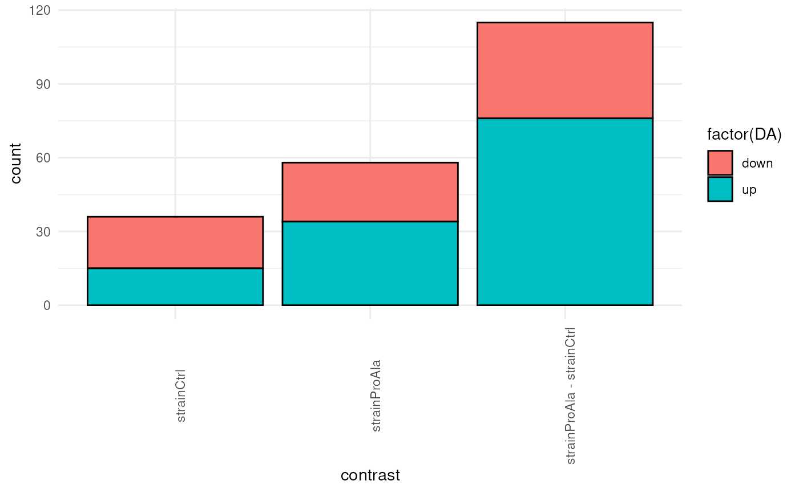

``` r

inferencesUsage |> 
  filter(adjPval < alpha) |> 
  mutate(DA = sign(logFC) |> as.factor() |> recode("-1"= "down","1" = "up")) |>
  group_by(contrast, DA) |> 
  ggplot(aes(x = contrast)) +
  geom_bar(aes(fill = factor(DA)),
           colour = "black") +
  theme_minimal() + 
  theme(axis.text.x = element_text(angle = 90))
```


We observe that the number of significant precursors reduced
drastically.

#### Heatmaps

``` r

lapply(colnames(L),
                   function(contrast, se, alpha)
                   {
                     sig <- rowData(se)[[contrast]] |> 
                       filter(adjPval < alpha) |> 
                       rownames()
                     quants <- t(scale(t(assay(se[sig,]))))
                     colnames(quants) <- se$sampleId #specific to this dataset to get short colnames
                     rowclushlp <- quants
                     rowclushlp[is.na(rowclushlp)] <- min(quants,na.rm=TRUE) - 2
                     rowclus <- hclust(dist(rowclushlp))
                     annotations <- columnAnnotation(
                       group = se$strain
                       ) #3.
                     set.seed(1234) ## annotation colours are randomly generated by default
                     return(
                       Heatmap(show_row_names = FALSE,
                       quants, 
                       name = "log2 intensity",
                       top_annotation = annotations, 
                       column_title = paste0(contrast, " = 0"),
                       cluster_rows = rowclus
                       )
                     )
                   },
                   se = getWithColData(qf, "precursorsPTM_usage"),
                   alpha = alpha)
```

#### Detail plots

We can explore the data for a protein to validate the statistical
inference results. For example, let’s explore the normalised precursor
abundance, usages as well as the summarised protein intensities for the
precursor with the most significant log2 usage.

``` r

(target_feature <- inferencesUsage |> 
   dplyr::slice(which.min(pval)) |> 
   pull(feature)
)
```

    ## [1] "(UniMod:1)SDS(UniMod:21)EVNQEAKPEVK2"

``` r

inferencesUsage |> 
  filter(feature == target_feature)
```

    ##                                                                      logFC
    ## strainCtrl.(UniMod:1)SDS(UniMod:21)EVNQEAKPEVK2                -0.07112323
    ## strainProAla.(UniMod:1)SDS(UniMod:21)EVNQEAKPEVK2               2.00075827
    ## strainProAla - strainCtrl.(UniMod:1)SDS(UniMod:21)EVNQEAKPEVK2  2.07188151
    ##                                                                        se
    ## strainCtrl.(UniMod:1)SDS(UniMod:21)EVNQEAKPEVK2                0.08446100
    ## strainProAla.(UniMod:1)SDS(UniMod:21)EVNQEAKPEVK2              0.08074697
    ## strainProAla - strainCtrl.(UniMod:1)SDS(UniMod:21)EVNQEAKPEVK2 0.08189908
    ##                                                                      df
    ## strainCtrl.(UniMod:1)SDS(UniMod:21)EVNQEAKPEVK2                15.20163
    ## strainProAla.(UniMod:1)SDS(UniMod:21)EVNQEAKPEVK2              15.20163
    ## strainProAla - strainCtrl.(UniMod:1)SDS(UniMod:21)EVNQEAKPEVK2 15.20163
    ##                                                                         t
    ## strainCtrl.(UniMod:1)SDS(UniMod:21)EVNQEAKPEVK2                -0.8420837
    ## strainProAla.(UniMod:1)SDS(UniMod:21)EVNQEAKPEVK2              24.7781228
    ## strainProAla - strainCtrl.(UniMod:1)SDS(UniMod:21)EVNQEAKPEVK2 25.2979833
    ##                                                                        pval
    ## strainCtrl.(UniMod:1)SDS(UniMod:21)EVNQEAKPEVK2                4.127935e-01
    ## strainProAla.(UniMod:1)SDS(UniMod:21)EVNQEAKPEVK2              1.044776e-13
    ## strainProAla - strainCtrl.(UniMod:1)SDS(UniMod:21)EVNQEAKPEVK2 7.673615e-14
    ##                                                                     adjPval
    ## strainCtrl.(UniMod:1)SDS(UniMod:21)EVNQEAKPEVK2                8.319430e-01
    ## strainProAla.(UniMod:1)SDS(UniMod:21)EVNQEAKPEVK2              3.234626e-09
    ## strainProAla - strainCtrl.(UniMod:1)SDS(UniMod:21)EVNQEAKPEVK2 2.361018e-09
    ##                                                                                 contrast
    ## strainCtrl.(UniMod:1)SDS(UniMod:21)EVNQEAKPEVK2                               strainCtrl
    ## strainProAla.(UniMod:1)SDS(UniMod:21)EVNQEAKPEVK2                           strainProAla
    ## strainProAla - strainCtrl.(UniMod:1)SDS(UniMod:21)EVNQEAKPEVK2 strainProAla - strainCtrl
    ##                                                                                             feature
    ## strainCtrl.(UniMod:1)SDS(UniMod:21)EVNQEAKPEVK2                (UniMod:1)SDS(UniMod:21)EVNQEAKPEVK2
    ## strainProAla.(UniMod:1)SDS(UniMod:21)EVNQEAKPEVK2              (UniMod:1)SDS(UniMod:21)EVNQEAKPEVK2
    ## strainProAla - strainCtrl.(UniMod:1)SDS(UniMod:21)EVNQEAKPEVK2 (UniMod:1)SDS(UniMod:21)EVNQEAKPEVK2

We again make a similar plot as before.

``` r

ptm <-  qf[target_feature, , c("precursorsPTM_norm", "precursorsPTM_usage")] |> #1
  longForm(colvars = colnames(colData(qf)), rowvars = "Protein.Group") |> #2
  data.frame()
```

    ## Warning: 'experiments' dropped; see 'drops()'

    ## harmonizing input:
    ##   removing 108 sampleMap rows not in names(experiments)
    ##   removing 18 colData rownames not in sampleMap 'primary'

``` r

protein <- qf[unique(ptm$Protein.Group), , c("proteins")] |> #1
  longForm(colvars = colnames(colData(qf)), rowvars = "Protein.Group") |> #2
  data.frame()
```

    ## Warning: 'experiments' dropped; see 'drops()'

    ## harmonizing input:
    ##   removing 126 sampleMap rows not in names(experiments)
    ##   removing 18 colData rownames not in sampleMap 'primary'

``` r

ptm_protein <- rbind(ptm, protein)
ylims <- ptm_protein |> 
  group_by(assay) |> 
  summarise(cent = mean(range(value,na.rm=TRUE)), ampl = diff(range(value,na.rm=TRUE))) |> 
  mutate(lower = cent - max(ampl)/2, 
         upper = cent + max(ampl)/2) |> 
  select(-c(cent, ampl))

outplot <- ptm_protein |>
  ggplot() +
  aes(x = sampleId,
      y = value) +
  geom_line(aes(group = rowname), linewidth = 0.1) +
  geom_point(aes(colour = strain)) +
  facet_wrap(~ assay, scales = "free") +
  ggh4x::facetted_pos_scales(
    y = list(
      assay == ylims$assay[1] ~ scale_y_continuous(limits = unlist(ylims[1,c("lower","upper")])),
      assay == ylims$assay[2] ~ scale_y_continuous(limits = unlist(ylims[2,c("lower","upper")])),
      assay == ylims$assay[3] ~ scale_y_continuous(limits = unlist(ylims[3,c("lower","upper")]))
    )
    ) +
  labs(subtitle = target_feature) +
  theme_minimal() +
  theme(axis.text.x = element_blank())
print(outplot)
```

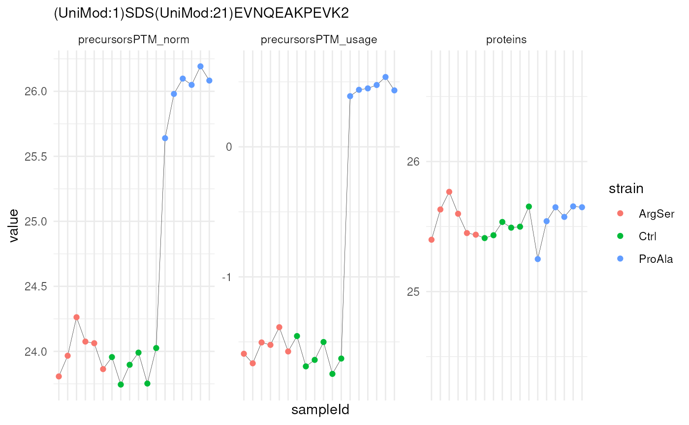

``` r

rbind(ptm, protein) %>%
  {
  ggplot(.) +
  aes(x = strain,
      y = value) +
  geom_boxplot(aes(colour = strain)) +
  facet_wrap(~ assay, scales = "free") +
  geom_jitter(aes(shape = rowname)) +
  scale_shape_manual(values = seq_len(dplyr::n_distinct(.$rowname))) +
  ggtitle(target_feature) +
  theme_minimal() +
  theme(axis.text.x = element_blank()) +
  guides(shape = "none")
  }
```


We compare the intensities for the top 5 DA phospo-precursors for the
first contrast to these of their corresponding protein in the
non-enriched assay and to the usages.

``` r

contr = colnames(L)[1]
top5 <- inferencesPTM |> 
  filter(contrast == contr) |> 
  arrange(pval) |> 
  head(n = 5) |> 
  pull(feature)

for (feat in top5)
{
  ptm_data <- qf[,,c("precursorsPTM_norm","precursorsPTM_usage")] |> 
    longForm(colvars = colnames(colData(qf)), rowvars = "Protein.Group") |>
    data.frame() |> 
    filter(rowname==feat)
  feature_protein <- ptm_data |> 
    pull("Protein.Group") |> 
    unique()
  prot_data <- qf[,,"proteins"]|>
    longForm(colvars = colnames(colData(qf)), rowvars = "Protein.Group") |>
    data.frame() |> 
    filter(Protein.Group==feature_protein) 
  ptm_protein <- rbind(ptm_data, prot_data)
  ylims <- ptm_protein |> 
  group_by(assay) |> 
  summarise(cent = mean(range(value,na.rm=TRUE)), ampl = diff(range(value,na.rm=TRUE))) |> 
  mutate(lower = cent - max(ampl)/2, 
         upper = cent + max(ampl)/2) |> 
  select(-c(cent, ampl))
  
  comparison_plot <- ptm_protein |>
    ggplot() +
    aes(x = sampleId,
        y = value) +
    geom_line(aes(group = rowname), linewidth = 0.1) +
    geom_point(aes(colour = strain)) +
    facet_wrap(~ assay, scales = "free") +
    labs(
      title = paste0(feat," / ", feature_protein),
      subtitle = paste("padj PTM =", 
                       inferencesPTM |> 
                         filter(feature == feat & contrast == contr) |> 
                         pull(adjPval) |> 
                         round(digits = 3),
                       "padj usage =", 
                       inferencesUsage |> 
                         filter(feature == feat & contrast == contr) |> 
                         pull(adjPval) |>
                         round(digits = 3))
    ) +
    theme_minimal() +
    theme(axis.text.x = element_blank()) +
    ggh4x::facetted_pos_scales(
    y = list(
      assay == ylims$assay[1] ~ scale_y_continuous(limits = unlist(ylims[1,c("lower","upper")])),
      assay == ylims$assay[2] ~ scale_y_continuous(limits = unlist(ylims[2,c("lower","upper")])),
      assay == ylims$assay[3] ~ scale_y_continuous(limits = unlist(ylims[3,c("lower","upper")]))
    )
    ) 
 print(comparison_plot)
}
```

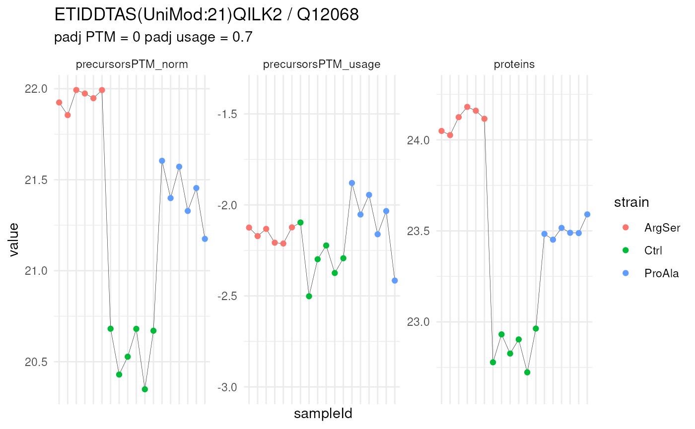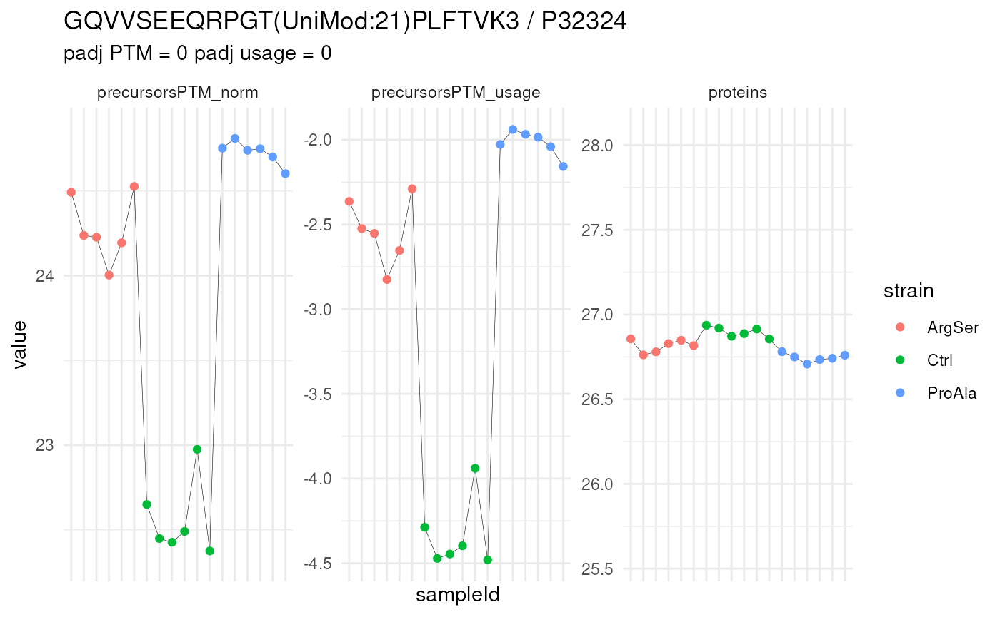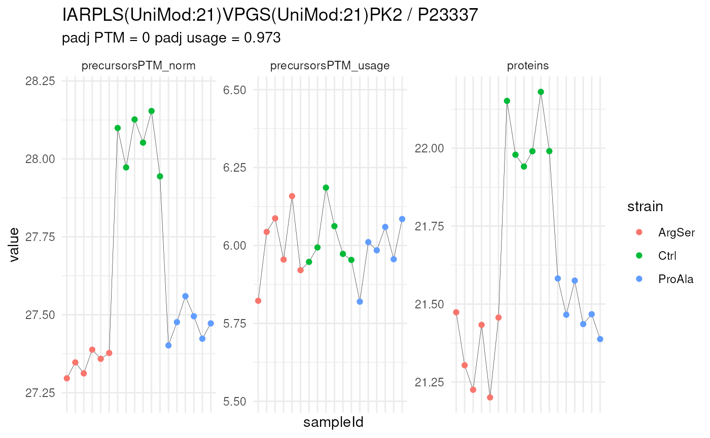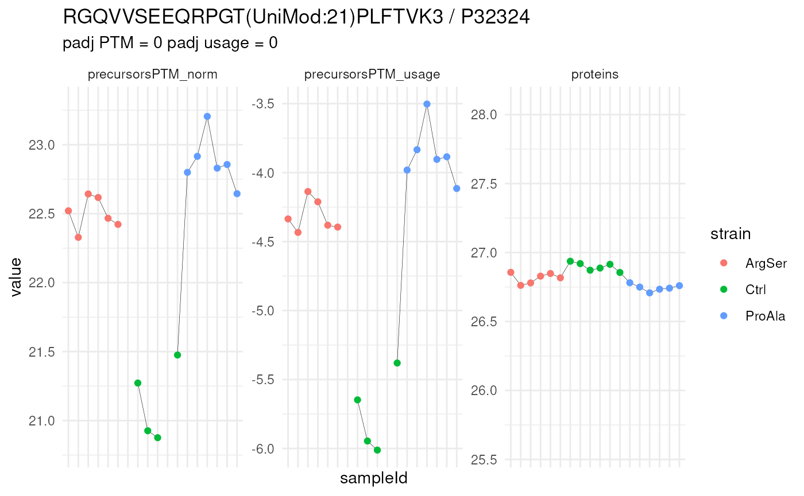

We compare the intensities for the top 5 DU phospo-precursors for the
first contrast to these of their corresponding protein in the
non-enriched assay and to their unadjusted abundances.

``` r

contr = colnames(L)[1]
top5 <- inferencesUsage |> 
  filter(contrast == contr) |> 
  arrange(pval) |> 
  head(n = 5) |> 
  pull(feature)

for (feat in top5)
{
  ptm_data <- qf[,,c("precursorsPTM_norm","precursorsPTM_usage")] |> 
    longForm(colvars = colnames(colData(qf)), rowvars = "Protein.Group") |>
    data.frame() |> 
    filter(rowname==feat)
  feature_protein <- ptm_data |> 
    pull("Protein.Group") |> 
    unique()
  prot_data <- qf[,,"proteins"]|>
    longForm(colvars = colnames(colData(qf)), rowvars = "Protein.Group") |>
    data.frame() |> 
    filter(Protein.Group==feature_protein) 
  ptm_protein <- rbind(ptm_data, prot_data)
  ylims <- ptm_protein |> 
  group_by(assay) |> 
  summarise(cent = mean(range(value,na.rm=TRUE)), ampl = diff(range(value,na.rm=TRUE))) |> 
  mutate(lower = cent - max(ampl)/2, 
         upper = cent + max(ampl)/2) |> 
  select(-c(cent, ampl))
  
  comparison_plot <- ptm_protein |>
    ggplot() +
    aes(x = sampleId,
        y = value) +
    geom_line(aes(group = rowname), linewidth = 0.1) +
    geom_point(aes(colour = strain)) +
    facet_wrap(~ assay, scales = "free") +
    labs(
      title = paste0(feat," / ", feature_protein),
      subtitle = paste("padj PTM =", 
                       inferencesPTM |> 
                         filter(feature == feat & contrast == contr) |> 
                         pull(adjPval) |> 
                         round(digits = 3),
                       "padj usage =", 
                       inferencesUsage |> 
                         filter(feature == feat & contrast == contr) |> 
                         pull(adjPval) |>
                         round(digits = 3))
    ) +
    theme_minimal() +
    theme(axis.text.x = element_blank()) +
    ggh4x::facetted_pos_scales(
    y = list(
      assay == ylims$assay[1] ~ scale_y_continuous(limits = unlist(ylims[1,c("lower","upper")])),
      assay == ylims$assay[2] ~ scale_y_continuous(limits = unlist(ylims[2,c("lower","upper")])),
      assay == ylims$assay[3] ~ scale_y_continuous(limits = unlist(ylims[3,c("lower","upper")]))
    )
    ) 
 print(comparison_plot)
}
```

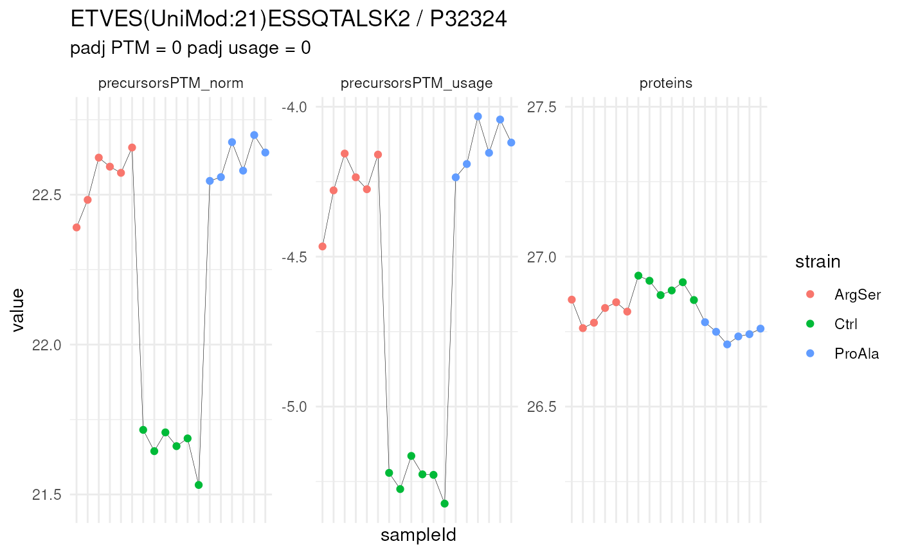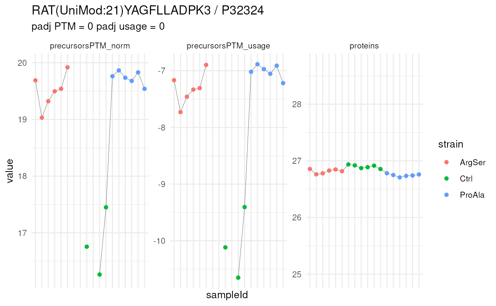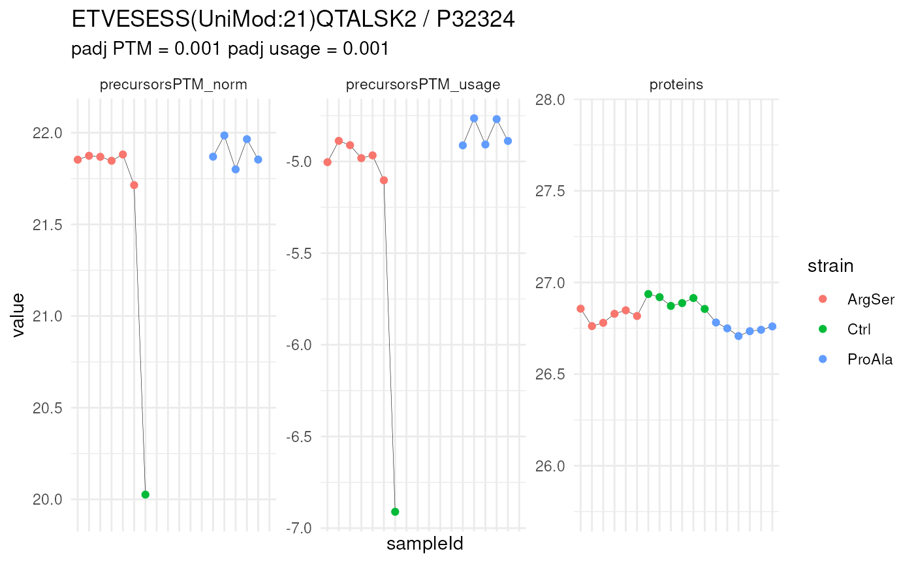

``` r

#Garbage collection to free space 
gc(); gc()
```

    ##            used  (Mb) gc trigger   (Mb)  max used   (Mb)
    ## Ncells 12441560 664.5   22558697 1204.8  22558697 1204.8
    ## Vcells 40107054 306.0  105312141  803.5 262549457 2003.1

    ##            used  (Mb) gc trigger   (Mb)  max used   (Mb)
    ## Ncells 12441564 664.5   22558697 1204.8  22558697 1204.8
    ## Vcells 40107097 306.0  105312141  803.5 262549457 2003.1

## Differential usage analysis at the PTM level

Multiple precursors are carrying the same PTM (cover the PTM at a
certain position in the protein). We can aggregate them together.

### Data processing

The variable `Protein.Sites` in the DIA-NN parquet file contains
information on the exact modified residue position in the full protein
sequence.

We first will make a new assay with duplicates for the precursors that
contain multiple phospho sites.

1.  We extract the usage assay
2.  We extract the row data with the original variables (drop msqrob2
    colums)
3.  Add a new variable with the modification type, which can derived
    from the variable `Modified.Sequence`. Indeed, all modifications
    start with string “UniMod:” followed by a number, i.e. 21 is a
    phoshorylation. So we extract all patterns “UniMod:\[0-9\]+”
    (`UniMod:` to match the literal text “UniMod:”, `[0-9]` to match any
    digit (0–9) and `+` to match one or more digits. We then replace
    pattern `Uniprot:` with an empty string.
4.  Add a new variable with the location of the modification on the
    original protein, which can be extracted from the variable
    `Protein.Sites`. Indeed, this variables contains the residu and its
    position in the protein sequence. If the sequence contains multiple
    modifications, the sites are separated with a `,`. Regex
    `(?<=:)[^\]]+` extracts all characters immediately after the colon
    without returning the colon and ignores `]`, e.g. for
    “\[P52871:A2,S4\]” it will return “A2,S4”. The resulting string is
    then splitted and subsequently the residue (first character) is
    removed.
5.  Replace the rowData of se
6.  Make vector of the row numbers with duplicates for the sequences
    containing multiple PTMs
7.  Make a corresponding vector with the positions of the individual PTM
    sites
8.  Make a corresponding vector with the modification type
9.  Extract the ids of rows that correspond to phospho sites
10. Make a new summarised experiment with duplicate entries for
    precursors with multiple phospho sites.
11. Add the position of the phospho site
12. Add a variable with the Protein.Group name and the phospho site
    position attached to it.
13. Make the rownames unique by appending the phospho site position to
    it.
14. Add the assay to the QFeatures object.

``` r

se <- qf[["precursorsPTM_usage"]] #1. 

rd <- rowData(se)[,names(rowData(qf[["precursorsPTM"]]))] |> ##2.
  as.data.frame() |> 
  mutate(
    mods  = str_extract_all(Modified.Sequence, 
                           "UniMod:[0-9]+") |> 
      lapply(FUN = gsub, pattern="UniMod:",replacement=""), ##3.
    pos = str_extract(Protein.Sites, 
                      "(?<=:)[^\\]]+") |> 
      strsplit(split = ",") |> 
      lapply(FUN=substr,start=2,stop=10000) |> 
      lapply(FUN=as.integer) ##4.
  )

rowData(se) <- rd ##5.

ids <- rep(rd |> 
             nrow() |>
             seq_len(), 
           rd |>
             pull(pos) |>
             sapply(FUN = length))##6.
pos <- unlist(rd$pos) ##7.
mod <- unlist(rd$mods) ##8. 

phosIds <- ids[mod == "21"] ##9.


seDup <- se[phosIds,] ##10.
rowData(seDup)$pos <- pos[mod == "21"] ##11.

rowData(seDup)$Protein.Group.Mod <- paste(
  rowData(seDup)$Protein.Group,
  rowData(seDup)$pos, sep = "_") ##12.

rownames(seDup) <- paste(rownames(seDup), rowData(seDup)$pos, sep = "_") ##13.
qf <- addAssay(qf, seDup, "precursorsPTM_usage_unnested") ##14.
```

We now aggregate the data of precursors that map to the same PTM
position on a protein in one protein expression value.

``` r

qf <- aggregateFeatures(qf, 
                   i = "precursorsPTM_usage_unnested",
                   fcol = "Protein.Group.Mod", 
                   name = "ptm_usage",
                   fun = function(X, ...) iq::maxLFQ(X)$estimate
                   )
```

    ##   |                                                                              |                                                                      |   0%  |                                                                              |======================================================================| 100%

    ## The following messages occurred during aggregation:

    ## 
    ## Your quantitative data contain missing values. Please read the relevant
    ## section(s) in the aggregateFeatures manual page regarding the effects
    ## of missing values on data aggregation.
    ## 
    ## Occurred during the aggregation of set(s): precursors

We assess the distribution of the PTM usages.

``` r

qf[, , "ptm_usage"] |> #1.
  longForm(colvars = colnames(colData(qf))) |>  #2. 
  data.frame() |> 
  filter(!is.na(value)) |>
  ggplot() + #3.
  aes(x = value,
      colour = strain,
      group = colname) +
  geom_density() +
  labs(subtitle = "Usage") +
  theme_minimal()
```

    ## harmonizing input:
    ##   removing 162 sampleMap rows not in names(experiments)
    ##   removing 18 colData rownames not in sampleMap 'primary'

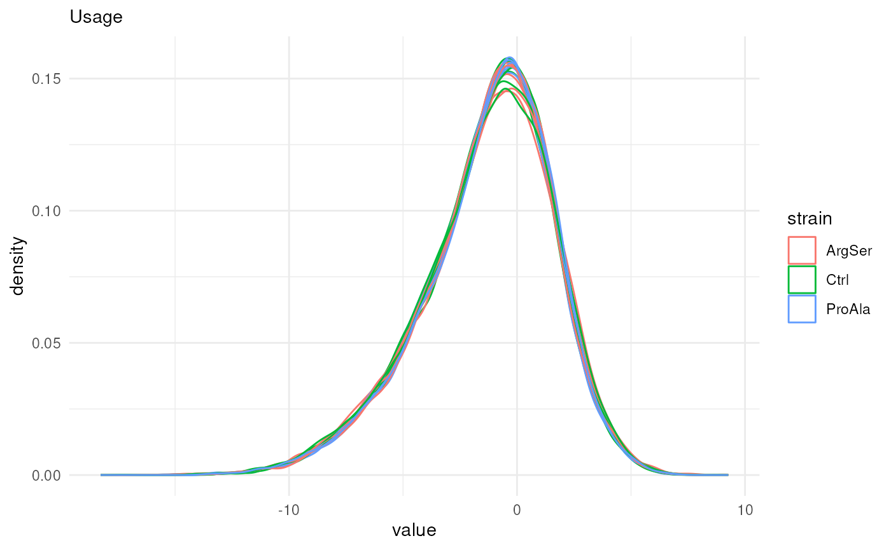

We remove temporarily objects

``` r

rm(se, seDup, mod, pos, ids, phosIds)
```

``` r

#Garbage collection to free space 
gc(); gc()
```

    ##            used  (Mb) gc trigger   (Mb)  max used   (Mb)
    ## Ncells 12625475 674.3   22558697 1204.8  22558697 1204.8
    ## Vcells 47383270 361.6  105312141  803.5 262549457 2003.1

    ##            used  (Mb) gc trigger   (Mb)  max used   (Mb)
    ## Ncells 12625479 674.3   22558697 1204.8  22558697 1204.8
    ## Vcells 47383313 361.6  105312141  803.5 262549457 2003.1

### Model estimation

Again we can estimate the same model but now for the usages.

``` r

qf <- msqrob(
  qf,
  i = "ptm_usage",
  formula = model,
  robust = TRUE)
```

We enabled M-estimation (`robust = TRUE`) for improved robustness
against outliers.

``` r

#Garbage collection to free space 
gc(); gc()
```

    ##            used  (Mb) gc trigger   (Mb)  max used   (Mb)
    ## Ncells 13059271 697.5   22558697 1204.8  22558697 1204.8
    ## Vcells 48635706 371.1  105312141  803.5 262549457 2003.1

    ##            used  (Mb) gc trigger   (Mb)  max used   (Mb)
    ## Ncells 13059278 697.5   22558697 1204.8  22558697 1204.8
    ## Vcells 48635754 371.1  105312141  803.5 262549457 2003.1

### Inference

Contrasts remain the same. We assess the contrast for each precursor.

``` r

qf <- hypothesisTest(qf, i = "ptm_usage", contrast = L)
```

We extract the results table from the `proteins` summarised experiment
in the `qf` object.

``` r

inferencesPtmUsage <- 
  msqrobCollect(qf[["ptm_usage"]], L)
```

``` r

#Garbage collection to free space 
gc(); gc()
```

    ##            used  (Mb) gc trigger   (Mb)  max used   (Mb)
    ## Ncells 13121821 700.8   22558697 1204.8  22558697 1204.8
    ## Vcells 49930446 381.0  105312141  803.5 262549457 2003.1

    ##            used  (Mb) gc trigger   (Mb)  max used   (Mb)
    ## Ncells 13121825 700.8   22558697 1204.8  22558697 1204.8
    ## Vcells 49930489 381.0  105312141  803.5 262549457 2003.1

### Report results

We report the results using a results table, volcano plots and heatmaps.

#### Results table

``` r

for (j in colnames(L)) {

  inference <- inferencesPtmUsage |> 
    dplyr::filter(adjPval < alpha & contrast == j)

  cat("**Median - Contrast:**", j, "= 0 (", nrow(inference),
      "significant proteins)\n\n")

  cat('<div style="max-height:300px; overflow-y:auto;">')

  print(
    kable(
      inference |>
        dplyr::arrange(pval) |>
        dplyr::relocate(feature),
      row.names = FALSE
    )
  )

  cat('</div>')

  cat("\n\n\n---\n\n")
}
```

**Median - Contrast:** strainCtrl = 0 ( 33 significant proteins)

| feature | logFC | se | df | t | pval | adjPval | contrast |
|:---|---:|---:|---:|---:|---:|---:|:---|
| P32324_763 | -1.6927585 | 0.0917931 | 16.250700 | -18.441012 | 0.00e+00 | 0.0000001 | strainCtrl |
| P32324_569 | -0.9952475 | 0.0789379 | 16.400086 | -12.607977 | 0.00e+00 | 0.0000075 | strainCtrl |
| P32324_713 | -2.6258869 | 0.2112654 | 13.381730 | -12.429329 | 0.00e+00 | 0.0000674 | strainCtrl |
| P32324_572 | -1.9360818 | 0.1633248 | 11.112322 | -11.854185 | 1.00e-07 | 0.0005111 | strainCtrl |
| P49167_50 | 1.1442699 | 0.1344706 | 17.146431 | 8.509444 | 1.00e-07 | 0.0005111 | strainCtrl |
| P32599_88 | -0.8161790 | 0.0865461 | 14.414079 | -9.430565 | 2.00e-07 | 0.0005111 | strainCtrl |
| P32324_557 | -1.8883643 | 0.2272816 | 15.593306 | -8.308479 | 4.00e-07 | 0.0011862 | strainCtrl |
| P49167_49 | 1.0582663 | 0.1295957 | 15.598620 | 8.165904 | 5.00e-07 | 0.0012399 | strainCtrl |
| P38968_396 | 0.7593899 | 0.0951348 | 16.096483 | 7.982251 | 5.00e-07 | 0.0012399 | strainCtrl |
| P25294_14 | -1.0772610 | 0.1434632 | 15.585791 | -7.508973 | 1.50e-06 | 0.0029640 | strainCtrl |
| P38713_440 | 4.2615011 | 0.2882973 | 6.977035 | 14.781619 | 1.60e-06 | 0.0029640 | strainCtrl |
| P24783_243 | -0.9925106 | 0.1375819 | 15.798585 | -7.213964 | 2.20e-06 | 0.0037743 | strainCtrl |
| P16474_461 | 1.0023303 | 0.1481254 | 16.197972 | 6.766769 | 4.20e-06 | 0.0062721 | strainCtrl |
| P38181_43 | 0.8900045 | 0.1333837 | 16.695283 | 6.672514 | 4.30e-06 | 0.0062721 | strainCtrl |
| P15274_94 | -3.4608404 | 0.4352252 | 11.558673 | -7.951838 | 5.10e-06 | 0.0068885 | strainCtrl |
| P35180_87 | -0.5825995 | 0.0960762 | 17.036076 | -6.063931 | 1.25e-05 | 0.0143803 | strainCtrl |
| Q12191_286 | 3.1647276 | 0.2426027 | 5.990144 | 13.044896 | 1.27e-05 | 0.0143803 | strainCtrl |
| P47129_206 | 3.8203404 | 0.3046938 | 6.146431 | 12.538293 | 1.31e-05 | 0.0143803 | strainCtrl |
| P35180_172 | -0.5139705 | 0.0852123 | 17.018350 | -6.031648 | 1.34e-05 | 0.0143803 | strainCtrl |
| P47135_123 | 1.4996611 | 0.2339126 | 13.930864 | 6.411201 | 1.66e-05 | 0.0169330 | strainCtrl |
| Q01560_224 | -0.6061690 | 0.1031075 | 16.917066 | -5.878999 | 1.86e-05 | 0.0180276 | strainCtrl |
| P00815_514 | -0.7889347 | 0.1319660 | 15.185227 | -5.978316 | 2.40e-05 | 0.0222512 | strainCtrl |
| Q12271_991 | 3.2079677 | 0.4632099 | 10.848294 | 6.925516 | 2.69e-05 | 0.0238021 | strainCtrl |
| Q04779_68 | -0.5980074 | 0.1087306 | 16.457283 | -5.499901 | 4.38e-05 | 0.0372015 | strainCtrl |
| P32607_2 | -3.6867193 | 0.4140249 | 6.979826 | -8.904583 | 4.65e-05 | 0.0379041 | strainCtrl |
| P05749_55 | 6.4094068 | 0.4779809 | 4.738617 | 13.409337 | 5.98e-05 | 0.0423395 | strainCtrl |
| P05749_57 | 6.4094068 | 0.4779809 | 4.738617 | 13.409337 | 5.98e-05 | 0.0423395 | strainCtrl |
| P05749_61 | 6.4094068 | 0.4779809 | 4.738617 | 13.409337 | 5.98e-05 | 0.0423395 | strainCtrl |
| Q12363_436 | -1.7348244 | 0.3057279 | 13.821177 | -5.674407 | 6.03e-05 | 0.0423395 | strainCtrl |
| P42945_841 | -1.4844036 | 0.2765285 | 15.513844 | -5.367995 | 6.98e-05 | 0.0459683 | strainCtrl |
| P53303_269 | 0.9962285 | 0.1840269 | 15.115075 | 5.413495 | 6.99e-05 | 0.0459683 | strainCtrl |
| P35732_273 | -0.7536289 | 0.1453613 | 17.112317 | -5.184522 | 7.31e-05 | 0.0465306 | strainCtrl |
| P38013_171 | 1.4663620 | 0.2854371 | 17.146431 | 5.137252 | 8.02e-05 | 0.0494850 | strainCtrl |

------------------------------------------------------------------------

**Median - Contrast:** strainProAla = 0 ( 37 significant proteins)

| feature | logFC | se | df | t | pval | adjPval | contrast |
|:---|---:|---:|---:|---:|---:|---:|:---|
| P25294_14 | -1.5736386 | 0.1402672 | 15.585791 | -11.218866 | 0.00e+00 | 0.0001463 | strainProAla |
| P16474_461 | 1.4055365 | 0.1513660 | 16.197972 | 9.285685 | 1.00e-07 | 0.0006994 | strainProAla |
| Q05050_393 | -5.0261755 | 0.3804217 | 9.116969 | -13.212116 | 3.00e-07 | 0.0020222 | strainProAla |
| P32599_88 | -0.6906942 | 0.0837567 | 14.414079 | -8.246440 | 8.00e-07 | 0.0033014 | strainProAla |
| Q07950_77 | 5.3704830 | 0.2695045 | 6.146431 | 19.927246 | 8.00e-07 | 0.0033014 | strainProAla |
| P49167_50 | 0.9759734 | 0.1344706 | 17.146431 | 7.257896 | 1.30e-06 | 0.0043174 | strainProAla |
| P38713_440 | 4.3675411 | 0.2965045 | 6.977035 | 14.730099 | 1.60e-06 | 0.0047686 | strainProAla |
| Q12117_289 | -0.6514795 | 0.0915145 | 15.682227 | -7.118864 | 2.70e-06 | 0.0069192 | strainProAla |
| Q03533_3 | 1.0472439 | 0.1501312 | 16.065966 | 6.975525 | 3.10e-06 | 0.0069192 | strainProAla |
| Q06010_439 | 1.1230659 | 0.1615640 | 15.126717 | 6.951214 | 4.40e-06 | 0.0084473 | strainProAla |
| P49167_49 | 0.8802596 | 0.1287233 | 15.598620 | 6.838384 | 4.60e-06 | 0.0084473 | strainProAla |
| P47129_206 | 3.9673353 | 0.2781461 | 6.146431 | 14.263493 | 6.10e-06 | 0.0103325 | strainProAla |
| P38968_396 | 0.6109495 | 0.0938583 | 16.096483 | 6.509276 | 7.00e-06 | 0.0109543 | strainProAla |
| P15274_94 | -2.7936460 | 0.3728751 | 11.558673 | -7.492177 | 9.10e-06 | 0.0132387 | strainProAla |
| P27466_343 | -4.9926570 | 0.6628412 | 10.413359 | -7.532207 | 1.58e-05 | 0.0214527 | strainProAla |
| P32607_2 | -3.7429438 | 0.3611440 | 6.979826 | -10.364132 | 1.72e-05 | 0.0219390 | strainProAla |
| P32599_111 | -1.0815174 | 0.1725991 | 13.818023 | -6.266065 | 2.20e-05 | 0.0262916 | strainProAla |
| P24000_7 | -0.8164666 | 0.1373779 | 15.547322 | -5.943217 | 2.32e-05 | 0.0262916 | strainProAla |
| P38928_651 | -4.3428436 | 0.4052367 | 6.140624 | -10.716808 | 3.34e-05 | 0.0355112 | strainProAla |
| P17106_67 | -0.5976299 | 0.1056597 | 16.053659 | -5.656175 | 3.53e-05 | 0.0355112 | strainProAla |
| Q12191_286 | 3.6741388 | 0.3384731 | 5.990144 | 10.855040 | 3.66e-05 | 0.0355112 | strainProAla |
| Q12373_353 | -0.5652907 | 0.1015264 | 16.330996 | -5.567920 | 3.94e-05 | 0.0364570 | strainProAla |
| Q12306_2 | 0.4616846 | 0.0849830 | 17.031675 | 5.432670 | 4.45e-05 | 0.0394037 | strainProAla |
| P16862_163 | 0.5191360 | 0.0959890 | 16.884814 | 5.408285 | 4.82e-05 | 0.0394110 | strainProAla |
| Q06836_388 | -2.2257780 | 0.2528713 | 6.978052 | -8.802018 | 5.02e-05 | 0.0394110 | strainProAla |
| Q12149_640 | 2.2915891 | 0.3830766 | 12.709696 | 5.982065 | 5.03e-05 | 0.0394110 | strainProAla |
| P15992_208 | -1.0687461 | 0.1913388 | 14.744397 | -5.585622 | 5.54e-05 | 0.0418253 | strainProAla |
| Q06108_969 | -2.6455100 | 0.4690092 | 13.912381 | -5.640636 | 6.24e-05 | 0.0440817 | strainProAla |
| P38853_537 | 3.1528234 | 0.2663120 | 5.146431 | 11.838833 | 6.28e-05 | 0.0440817 | strainProAla |
| Q12019_4443 | -0.6147425 | 0.1163580 | 15.850955 | -5.283199 | 7.66e-05 | 0.0487954 | strainProAla |
| P32324_763 | 0.4770509 | 0.0913882 | 16.250700 | 5.220048 | 8.01e-05 | 0.0487954 | strainProAla |
| P05749_55 | 5.7636221 | 0.4594214 | 4.738617 | 12.545392 | 8.14e-05 | 0.0487954 | strainProAla |
| P05749_57 | 5.7636221 | 0.4594214 | 4.738617 | 12.545392 | 8.14e-05 | 0.0487954 | strainProAla |
| P05749_61 | 5.7636221 | 0.4594214 | 4.738617 | 12.545392 | 8.14e-05 | 0.0487954 | strainProAla |
| P25491_58 | -1.9684991 | 0.2375495 | 6.791442 | -8.286690 | 8.60e-05 | 0.0489042 | strainProAla |
| P32774_102 | -0.6146229 | 0.1203290 | 17.068305 | -5.107855 | 8.64e-05 | 0.0489042 | strainProAla |
| P10591_36 | 0.5073982 | 0.0991781 | 16.726141 | 5.116031 | 9.04e-05 | 0.0497717 | strainProAla |

------------------------------------------------------------------------

**Median - Contrast:** strainProAla - strainCtrl = 0 ( 108 significant
proteins)

| feature | logFC | se | df | t | pval | adjPval | contrast |
|:---|---:|---:|---:|---:|---:|---:|:---|
| P32324_763 | 2.1698095 | 0.0933511 | 16.250700 | 23.243535 | 0.0000000 | 0.0000000 | strainProAla - strainCtrl |
| P32324_569 | 1.1121529 | 0.0768953 | 16.400086 | 14.463213 | 0.0000000 | 0.0000009 | strainProAla - strainCtrl |
| P32324_713 | 3.0035670 | 0.2097059 | 13.381730 | 14.322762 | 0.0000000 | 0.0000114 | strainProAla - strainCtrl |
| P16862_163 | 0.9615896 | 0.0949133 | 16.884814 | 10.131240 | 0.0000000 | 0.0000666 | strainProAla - strainCtrl |
| P32324_557 | 2.3977791 | 0.2269496 | 15.593306 | 10.565250 | 0.0000000 | 0.0000666 | strainProAla - strainCtrl |
| P00815_514 | 1.3059254 | 0.1351987 | 15.185227 | 9.659304 | 0.0000001 | 0.0002063 | strainProAla - strainCtrl |
| P32324_572 | 2.0626558 | 0.1655739 | 11.112322 | 12.457613 | 0.0000001 | 0.0002063 | strainProAla - strainCtrl |
| Q03533_3 | 1.4414307 | 0.1581598 | 16.065966 | 9.113763 | 0.0000001 | 0.0002406 | strainProAla - strainCtrl |
| P24783_243 | 1.2009457 | 0.1375819 | 15.798585 | 8.728953 | 0.0000002 | 0.0004151 | strainProAla - strainCtrl |
| Q01662_95 | 1.1063106 | 0.1279841 | 15.952106 | 8.644125 | 0.0000002 | 0.0004151 | strainProAla - strainCtrl |
| Q05050_393 | -4.7276674 | 0.3763197 | 9.116969 | -12.562901 | 0.0000005 | 0.0008496 | strainProAla - strainCtrl |
| Q08979_610 | 0.9214698 | 0.1138236 | 15.372814 | 8.095593 | 0.0000006 | 0.0010596 | strainProAla - strainCtrl |
| P16862_167 | 0.6303716 | 0.0800056 | 15.484083 | 7.879090 | 0.0000008 | 0.0013101 | strainProAla - strainCtrl |
| Q07950_77 | 5.0425550 | 0.2695045 | 6.146431 | 18.710465 | 0.0000012 | 0.0017178 | strainProAla - strainCtrl |
| P22203_3 | 0.7412991 | 0.1008642 | 16.439922 | 7.349476 | 0.0000014 | 0.0018776 | strainProAla - strainCtrl |
| P47035_679 | -1.0045670 | 0.1325666 | 14.591666 | -7.577830 | 0.0000020 | 0.0023655 | strainProAla - strainCtrl |
| Q06010_439 | 1.1862477 | 0.1601743 | 15.126717 | 7.405979 | 0.0000021 | 0.0023655 | strainProAla - strainCtrl |
| P38181_43 | -0.9456091 | 0.1338371 | 16.695283 | -7.065372 | 0.0000021 | 0.0023655 | strainProAla - strainCtrl |
| P22203_2 | 0.8174736 | 0.1193296 | 16.373426 | 6.850551 | 0.0000034 | 0.0036713 | strainProAla - strainCtrl |
| P31385_82 | 0.6460889 | 0.0935269 | 15.915680 | 6.908056 | 0.0000036 | 0.0036713 | strainProAla - strainCtrl |
| P36123_867 | 0.5656277 | 0.0833656 | 16.429972 | 6.784908 | 0.0000038 | 0.0036764 | strainProAla - strainCtrl |
| Q12363_436 | 2.1895001 | 0.3037274 | 13.821177 | 7.208767 | 0.0000048 | 0.0043791 | strainProAla - strainCtrl |
| P40066_81 | 0.9380922 | 0.1391068 | 15.736327 | 6.743685 | 0.0000051 | 0.0043791 | strainProAla - strainCtrl |
| P35180_87 | 0.6234918 | 0.0956293 | 17.036076 | 6.519883 | 0.0000052 | 0.0043791 | strainProAla - strainCtrl |
| P32644_212 | 0.6529945 | 0.0959738 | 13.964949 | 6.803884 | 0.0000087 | 0.0070145 | strainProAla - strainCtrl |
| P47035_676 | -0.7641278 | 0.1193511 | 15.405181 | -6.402351 | 0.0000105 | 0.0081663 | strainProAla - strainCtrl |
| P47035_385 | -0.8821967 | 0.1456136 | 15.688410 | -6.058476 | 0.0000181 | 0.0132100 | strainProAla - strainCtrl |
| Q12363_98 | 0.5759240 | 0.0950597 | 15.646656 | 6.058548 | 0.0000183 | 0.0132100 | strainProAla - strainCtrl |
| P23201_1087 | -0.5687071 | 0.0947155 | 15.727783 | -6.004373 | 0.0000198 | 0.0137989 | strainProAla - strainCtrl |
| Q12363_200 | 0.5599062 | 0.0977837 | 17.139795 | 5.725965 | 0.0000240 | 0.0161803 | strainProAla - strainCtrl |
| Q08972_110 | 0.6650956 | 0.1157119 | 16.371625 | 5.747861 | 0.0000274 | 0.0179040 | strainProAla - strainCtrl |
| P19097_1872 | 1.3107861 | 0.2152537 | 13.848551 | 6.089495 | 0.0000293 | 0.0185284 | strainProAla - strainCtrl |
| Q02455_1710 | -0.6915129 | 0.1178104 | 14.643173 | -5.869708 | 0.0000340 | 0.0208601 | strainProAla - strainCtrl |
| P17123_118 | 0.5783995 | 0.1030330 | 16.167609 | 5.613730 | 0.0000373 | 0.0222532 | strainProAla - strainCtrl |
| Q12495_294 | 0.6639109 | 0.1188671 | 16.104689 | 5.585322 | 0.0000401 | 0.0223597 | strainProAla - strainCtrl |
| P32389_528 | 0.6092121 | 0.1109659 | 16.679294 | 5.490084 | 0.0000426 | 0.0223597 | strainProAla - strainCtrl |
| P47035_1017 | -0.7604924 | 0.1318212 | 14.408249 | -5.769122 | 0.0000434 | 0.0223597 | strainProAla - strainCtrl |
| P07149_971 | 1.2434008 | 0.2050281 | 12.637535 | 6.064540 | 0.0000452 | 0.0223597 | strainProAla - strainCtrl |
| Q12680_2070 | 0.9540220 | 0.1656330 | 14.288879 | 5.759855 | 0.0000456 | 0.0223597 | strainProAla - strainCtrl |
| Q04336_956 | 1.4592232 | 0.2410134 | 12.655594 | 6.054531 | 0.0000456 | 0.0223597 | strainProAla - strainCtrl |
| P53946_9 | -0.7002631 | 0.1296835 | 17.146431 | -5.399786 | 0.0000465 | 0.0223597 | strainProAla - strainCtrl |
| P49687_431 | -0.4743980 | 0.0871979 | 16.590899 | -5.440475 | 0.0000480 | 0.0223597 | strainProAla - strainCtrl |
| Q12271_991 | -3.0321531 | 0.4673870 | 10.848294 | -6.487457 | 0.0000481 | 0.0223597 | strainProAla - strainCtrl |
| P09436_406 | 1.1425875 | 0.2027569 | 14.907084 | 5.635259 | 0.0000486 | 0.0223597 | strainProAla - strainCtrl |
| P53114_268 | 1.2906180 | 0.2301329 | 14.930319 | 5.608142 | 0.0000508 | 0.0228545 | strainProAla - strainCtrl |
| P47035_357 | -0.6430105 | 0.1203089 | 17.094100 | -5.344663 | 0.0000526 | 0.0231850 | strainProAla - strainCtrl |
| Q12280_1347 | -1.1468873 | 0.2094536 | 15.066959 | -5.475615 | 0.0000629 | 0.0271154 | strainProAla - strainCtrl |
| Q12363_193 | 1.1255279 | 0.2099661 | 15.554989 | 5.360523 | 0.0000701 | 0.0280723 | strainProAla - strainCtrl |
| P32468_326 | -0.4473303 | 0.0860681 | 17.146431 | -5.197401 | 0.0000707 | 0.0280723 | strainProAla - strainCtrl |
| Q12306_2 | 0.4446711 | 0.0853963 | 17.031675 | 5.207150 | 0.0000708 | 0.0280723 | strainProAla - strainCtrl |
| P38631_1178 | 0.7910246 | 0.1501937 | 16.345442 | 5.266696 | 0.0000716 | 0.0280723 | strainProAla - strainCtrl |
| P06634_263 | 0.6400190 | 0.1210541 | 16.110071 | 5.287050 | 0.0000721 | 0.0280723 | strainProAla - strainCtrl |
| P53236_607 | 0.4916219 | 0.0947963 | 16.969163 | 5.186087 | 0.0000748 | 0.0283651 | strainProAla - strainCtrl |
| P03871_264 | 1.0562360 | 0.1785411 | 11.806596 | 5.915926 | 0.0000756 | 0.0283651 | strainProAla - strainCtrl |
| P25366_291 | 0.5781662 | 0.1091327 | 15.051717 | 5.297824 | 0.0000884 | 0.0320105 | strainProAla - strainCtrl |
| P10961_458 | 0.5902190 | 0.1149506 | 16.636735 | 5.134546 | 0.0000885 | 0.0320105 | strainProAla - strainCtrl |
| P47035_803 | -1.5513768 | 0.2625980 | 11.083636 | -5.907801 | 0.0000989 | 0.0339954 | strainProAla - strainCtrl |
| P38213_323 | 0.5894801 | 0.1157870 | 16.445349 | 5.091073 | 0.0001002 | 0.0339954 | strainProAla - strainCtrl |
| Q08977_470 | 0.8466997 | 0.1621370 | 15.008257 | 5.222125 | 0.0001031 | 0.0339954 | strainProAla - strainCtrl |
| P36166_330 | -0.8792587 | 0.1696024 | 15.322922 | -5.184236 | 0.0001038 | 0.0339954 | strainProAla - strainCtrl |
| P05694_706 | 0.8532128 | 0.1684630 | 16.535637 | 5.064691 | 0.0001040 | 0.0339954 | strainProAla - strainCtrl |
| P53303_23 | -0.5612435 | 0.1119357 | 17.110816 | -5.013981 | 0.0001044 | 0.0339954 | strainProAla - strainCtrl |
| P35177_1293 | -0.4697870 | 0.0913546 | 15.576704 | -5.142455 | 0.0001069 | 0.0339954 | strainProAla - strainCtrl |
| P17123_125 | 0.5839602 | 0.1143861 | 15.896178 | 5.105167 | 0.0001081 | 0.0339954 | strainProAla - strainCtrl |
| Q06685_430 | 0.7902940 | 0.1482397 | 13.882608 | 5.331192 | 0.0001091 | 0.0339954 | strainProAla - strainCtrl |
| P17106_19 | -0.5663603 | 0.1133371 | 16.723109 | -4.997131 | 0.0001156 | 0.0344404 | strainProAla - strainCtrl |
| P19097_1479 | 1.2304170 | 0.2472816 | 16.886378 | 4.975773 | 0.0001175 | 0.0344404 | strainProAla - strainCtrl |
| P38630_61 | -1.1790944 | 0.1870369 | 9.373277 | -6.304074 | 0.0001176 | 0.0344404 | strainProAla - strainCtrl |
| Q06836_388 | -1.8671502 | 0.2430418 | 6.978052 | -7.682425 | 0.0001199 | 0.0344404 | strainProAla - strainCtrl |
| P24276_578 | 0.6006073 | 0.1209989 | 16.858120 | 4.963740 | 0.0001211 | 0.0344404 | strainProAla - strainCtrl |
| P25366_290 | 0.8025664 | 0.1588462 | 15.823908 | 5.052474 | 0.0001217 | 0.0344404 | strainProAla - strainCtrl |
| P17076_22 | -2.3177156 | 0.2707529 | 6.146431 | -8.560260 | 0.0001224 | 0.0344404 | strainProAla - strainCtrl |
| P47035_1066 | -0.5307200 | 0.1073855 | 16.859620 | -4.942196 | 0.0001266 | 0.0351450 | strainProAla - strainCtrl |
| Q12158_349 | -0.6160504 | 0.1254723 | 16.967421 | -4.909852 | 0.0001331 | 0.0364373 | strainProAla - strainCtrl |
| P07259_1085 | 0.7514516 | 0.1404961 | 12.782418 | 5.348559 | 0.0001402 | 0.0378672 | strainProAla - strainCtrl |
| P38631_1185 | 0.5208195 | 0.1060385 | 16.503785 | 4.911609 | 0.0001433 | 0.0382120 | strainProAla - strainCtrl |
| P09733_274 | 1.1620088 | 0.2222959 | 13.397035 | 5.227305 | 0.0001479 | 0.0389008 | strainProAla - strainCtrl |
| P47035_1032 | -0.4107450 | 0.0847307 | 17.043259 | -4.847655 | 0.0001499 | 0.0389220 | strainProAla - strainCtrl |
| P50276_42 | 1.6876535 | 0.2861599 | 9.857570 | 5.897588 | 0.0001604 | 0.0406028 | strainProAla - strainCtrl |
| P39009_139 | 0.5810017 | 0.1209785 | 17.146431 | 4.802521 | 0.0001622 | 0.0406028 | strainProAla - strainCtrl |
| P23201_961 | -0.4649970 | 0.0926319 | 14.687024 | -5.019837 | 0.0001623 | 0.0406028 | strainProAla - strainCtrl |
| P11633_53 | -0.4775492 | 0.0974667 | 15.768172 | -4.899614 | 0.0001671 | 0.0407769 | strainProAla - strainCtrl |
| P10591_35 | 0.5789923 | 0.1116077 | 13.160684 | 5.187747 | 0.0001680 | 0.0407769 | strainProAla - strainCtrl |
| P05750_44 | 1.0805705 | 0.2107311 | 13.581041 | 5.127723 | 0.0001691 | 0.0407769 | strainProAla - strainCtrl |
| Q00684_429 | -0.3794305 | 0.0778497 | 15.836891 | -4.873887 | 0.0001738 | 0.0414284 | strainProAla - strainCtrl |
| P17649_7 | 1.7103359 | 0.3460379 | 14.942645 | 4.942626 | 0.0001790 | 0.0418946 | strainProAla - strainCtrl |
| P12754_131 | 0.4595307 | 0.0957374 | 16.529099 | 4.799909 | 0.0001799 | 0.0418946 | strainProAla - strainCtrl |
| P25357_416 | 0.9037854 | 0.1858181 | 15.618381 | 4.863817 | 0.0001844 | 0.0419063 | strainProAla - strainCtrl |
| Q12159_8 | -0.4493205 | 0.0913213 | 14.976268 | -4.920215 | 0.0001858 | 0.0419063 | strainProAla - strainCtrl |
| P33314_1066 | -0.4485452 | 0.0943069 | 16.890282 | -4.756229 | 0.0001862 | 0.0419063 | strainProAla - strainCtrl |
| P00815_524 | 0.4530860 | 0.0953425 | 16.459300 | 4.752194 | 0.0002009 | 0.0437364 | strainProAla - strainCtrl |
| P25297_15 | 2.5289533 | 0.3954244 | 8.076172 | 6.395542 | 0.0002018 | 0.0437364 | strainProAla - strainCtrl |
| P41318_106 | 0.9158580 | 0.1874916 | 14.884616 | 4.884794 | 0.0002025 | 0.0437364 | strainProAla - strainCtrl |
| P25558_1350 | -0.3670884 | 0.0777594 | 16.814965 | -4.720824 | 0.0002029 | 0.0437364 | strainProAla - strainCtrl |
| Q02455_774 | -0.5506372 | 0.1129022 | 14.741759 | -4.877117 | 0.0002112 | 0.0444822 | strainProAla - strainCtrl |
| P35201_134 | -0.7098323 | 0.1506181 | 16.648611 | -4.712797 | 0.0002117 | 0.0444822 | strainProAla - strainCtrl |
| Q12176_818 | -0.5971696 | 0.1271016 | 16.752419 | -4.698366 | 0.0002148 | 0.0444822 | strainProAla - strainCtrl |
| Q01217_529 | 0.5343197 | 0.1092066 | 14.456267 | 4.892740 | 0.0002167 | 0.0444822 | strainProAla - strainCtrl |
| Q03780_390 | -0.5776465 | 0.1222648 | 16.324823 | -4.724551 | 0.0002174 | 0.0444822 | strainProAla - strainCtrl |
| P08153_278 | 0.6951872 | 0.1379839 | 12.794210 | 5.038178 | 0.0002385 | 0.0481018 | strainProAla - strainCtrl |
| Q03361_726 | -0.7526987 | 0.1618762 | 16.646419 | -4.649840 | 0.0002417 | 0.0481018 | strainProAla - strainCtrl |
| P27466_343 | -4.0168004 | 0.7366109 | 10.413359 | -5.453083 | 0.0002425 | 0.0481018 | strainProAla - strainCtrl |
| P32500_412 | -0.4932956 | 0.1066440 | 16.913539 | -4.625630 | 0.0002446 | 0.0481018 | strainProAla - strainCtrl |
| P47116_587 | 0.3771683 | 0.0817350 | 16.863750 | 4.614524 | 0.0002522 | 0.0491092 | strainProAla - strainCtrl |
| P02994_240 | 0.4713281 | 0.1011285 | 16.161567 | 4.660685 | 0.0002545 | 0.0491092 | strainProAla - strainCtrl |
| P38850_699 | -0.7764632 | 0.1673903 | 16.231325 | -4.638638 | 0.0002635 | 0.0495121 | strainProAla - strainCtrl |
| P38720_163 | 0.9859957 | 0.2075622 | 14.871771 | 4.750362 | 0.0002638 | 0.0495121 | strainProAla - strainCtrl |
| P33750_161 | 0.5304439 | 0.1090147 | 13.729791 | 4.865800 | 0.0002639 | 0.0495121 | strainProAla - strainCtrl |

------------------------------------------------------------------------

#### Volcanoplots

``` r

plotVolcano(inferencesPtmUsage) + 
  facet_wrap(~contrast) + 
  labs(title = "PTM Usage")
```

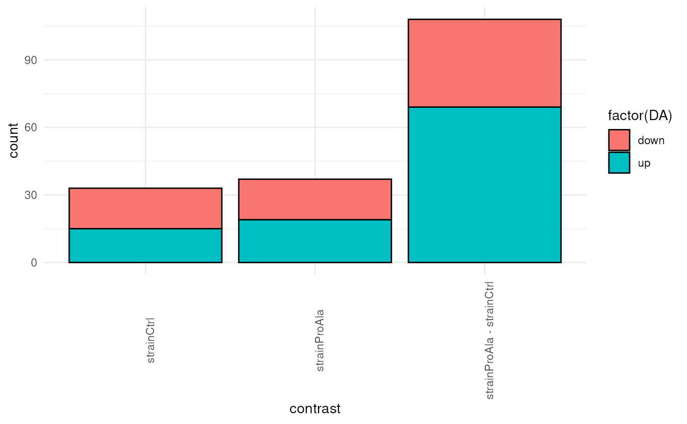

``` r

inferencesPtmUsage |> 
  filter(adjPval < alpha) |> 
  mutate(DA = sign(logFC) |> as.factor() |> recode("-1"= "down","1" = "up")) |>
  group_by(contrast, DA) |> 
  ggplot(aes(x = contrast)) +
  geom_bar(aes(fill = factor(DA)),
           colour = "black") +
  theme_minimal() + 
  theme(axis.text.x = element_text(angle = 90))
```


#### Heatmaps

``` r

lapply(colnames(L),
                   function(contrast, se, alpha)
                   {
                     sig <- rowData(se)[[contrast]] |> 
                       filter(adjPval < alpha) |> 
                       rownames()
                     quants <- t(scale(t(assay(se[sig,]))))
                     colnames(quants) <- se$sampleId #specific to this dataset to get short colnames
                     rowclushlp <- quants
                     rowclushlp[is.na(rowclushlp)] <- min(quants,na.rm=TRUE) - 2
                     rowclus <- hclust(dist(rowclushlp))
                     annotations <- columnAnnotation(
                       group = se$strain
                       ) #3.
                     set.seed(1234) ## annotation colours are randomly generated by default
                     return(
                       Heatmap(show_row_names = FALSE,
                       quants, 
                       name = "log2 intensity",
                       top_annotation = annotations, 
                       column_title = paste0(contrast, " = 0"),
                       cluster_rows = rowclus
                       )
                     )
                   },
                   se = getWithColData(qf, "ptm_usage"),
                   alpha = alpha)
```

#### Detail plots

We can explore the data for a protein to validate the statistical
inference results. For example, let’s explore the precursor, summarized
PTM and summarised protein intensities for the PTM with the most
significant log2 fold change.

``` r

(target_feature <- inferencesPtmUsage |> 
   dplyr::slice(which.min(pval)) |> 
   pull(feature)
)
```

    ## [1] "P32324_763"

``` r

inferencesPtmUsage |> 
  filter(feature == target_feature)
```

    ##                                           logFC         se      df          t
    ## strainCtrl.P32324_763                -1.6927585 0.09179315 16.2507 -18.441012
    ## strainProAla.P32324_763               0.4770509 0.09138822 16.2507   5.220049
    ## strainProAla - strainCtrl.P32324_763  2.1698095 0.09335110 16.2507  23.243535
    ##                                              pval      adjPval
    ## strainCtrl.P32324_763                2.529190e-12 5.152465e-08
    ## strainProAla.P32324_763              8.009496e-05 4.879538e-02
    ## strainProAla - strainCtrl.P32324_763 6.704455e-14 1.358255e-09
    ##                                                       contrast    feature
    ## strainCtrl.P32324_763                               strainCtrl P32324_763
    ## strainProAla.P32324_763                           strainProAla P32324_763
    ## strainProAla - strainCtrl.P32324_763 strainProAla - strainCtrl P32324_763

``` r

ptm <-  qf[target_feature, , c("precursorsPTM_usage_unnested", "ptm_usage")] |> #1
  longForm(colvars = colnames(colData(qf)), rowvars = "Protein.Group") |> #2
  data.frame()
```

    ## Warning: 'experiments' dropped; see 'drops()'

    ## harmonizing input:
    ##   removing 144 sampleMap rows not in names(experiments)
    ##   removing 18 colData rownames not in sampleMap 'primary'

``` r

precursor <- qf[ptm |> 
                   filter(assay =="precursorsPTM_usage_unnested") |>
                   pull(rowname) |>
                   sub(pattern = "_.*", replacement = "") |> 
                   unique(), , "precursorsPTM_norm"] |>
  longForm(colvars = colnames(colData(qf)), rowvars = "Protein.Group") |> #2
  data.frame()
```

    ## Warning: 'experiments' dropped; see 'drops()'

    ## harmonizing input:
    ##   removing 162 sampleMap rows not in names(experiments)
    ##   removing 18 colData rownames not in sampleMap 'primary'

``` r

protein <- qf[unique(ptm$Protein.Group), , c("proteins")] |> #1
  longForm(colvars = colnames(colData(qf)), rowvars = "Protein.Group") |> #2
  data.frame()
```

    ## Warning: 'experiments' dropped; see 'drops()'

    ## harmonizing input:
    ##   removing 162 sampleMap rows not in names(experiments)
    ##   removing 18 colData rownames not in sampleMap 'primary'

``` r

ptm_protein <- rbind(ptm, precursor, protein)
ylims <- ptm_protein |> 
  group_by(assay) |> 
  summarise(cent = mean(range(value,na.rm=TRUE)), ampl = diff(range(value,na.rm=TRUE))) |> 
  mutate(lower = cent - max(ampl)/2, 
         upper = cent + max(ampl)/2) |> 
  select(-c(cent, ampl))

ptm_protein |>
  filter(!is.na(value)) |>
  ggplot() +
  aes(x = sampleId,
      y = value) +
  geom_line(aes(group = rowname), linewidth = 0.1) +
  geom_point(aes(colour = strain)) +
  facet_wrap(~ assay, scales = "free") +
  ggh4x::facetted_pos_scales(
    y = list(
      assay == ylims$assay[1] ~ scale_y_continuous(limits = unlist(ylims[1,c("lower","upper")])),
      assay == ylims$assay[2] ~ scale_y_continuous(limits = unlist(ylims[2,c("lower","upper")])),
      assay == ylims$assay[3] ~ scale_y_continuous(limits = unlist(ylims[3,c("lower","upper")])),
      assay == ylims$assay[4] ~ scale_y_continuous(limits = unlist(ylims[4,c("lower","upper")]))
    )
    ) +
  labs(subtitle = paste0("Protein:", sub("_"," / phosho-position: ", target_feature))) +
  theme_minimal() +
  theme(axis.text.x = element_blank())
```

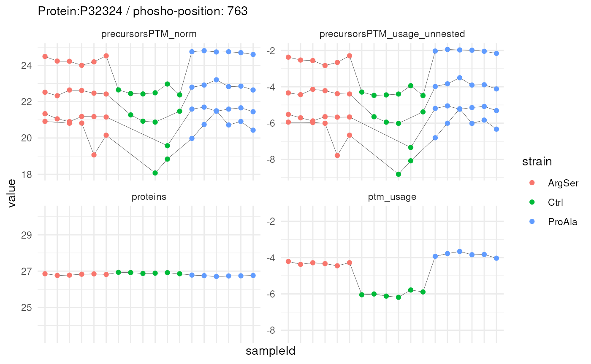

``` r

rbind(ptm, precursor, protein) %>%
  {
  ggplot(.) +
  aes(x = strain,
      y = value) +
  geom_boxplot(aes(colour = strain)) +
  facet_wrap(~ assay, scales = "free") +
  geom_jitter(aes(shape = rowname)) +
  scale_shape_manual(values = seq_len(dplyr::n_distinct(.$rowname))) +
  labs(subtitle = paste0("Protein:", sub("_"," / phosho-position: ", target_feature))) +
  theme_minimal() +
  theme(axis.text.x = element_blank()) +
  guides(shape = "none")
  }
```

    ## Warning: Removed 24 rows containing non-finite outside the scale range
    ## (`stat_boxplot()`).

    ## Warning: Removed 24 rows containing missing values or values outside the scale range
    ## (`geom_point()`).


``` r

#Garbage collection to free space 
gc(); gc()
```

    ##            used  (Mb) gc trigger   (Mb)  max used   (Mb)
    ## Ncells 13122670 700.9   22558697 1204.8  22558697 1204.8
    ## Vcells 45753204 349.1  105312141  803.5 262549457 2003.1

    ##            used  (Mb) gc trigger   (Mb)  max used   (Mb)
    ## Ncells 13122674 700.9   22558697 1204.8  22558697 1204.8
    ## Vcells 45753247 349.1  105312141  803.5 262549457 2003.1

### Along Protein Mapping

In this section we will make Along Protein graphs. Therefore we need
sequence information on the protein sequence, which we can find in the
fasta file from uniprot that was used for mapping.

Note, that it is recommended to use the fasta that was used for the
mapping. However, this file was not uploaded by the authors so we use
the version of the current release for illustration purposes.

1.  Read fasta file

``` r

fastaFile <- bfcrpath(bfc,"https://rest.uniprot.org/uniprotkb/stream?compressed=true&download=true&format=fasta&query=%28%28proteome%3AUP000002311%29+AND+reviewed%3Dtrue%29")
fasta <- seqinr::read.fasta(fastaFile, seqtype = "AA", as.string = T) #2.
```

2.  Extract the proteins from the fasta file.

``` r

# read in fasta file for protein sequence & length -> to calculate the coverage
mapping <- data.frame(fullName = fasta |> names(), 
                      accession = fasta |> names() |> stringr::str_split_i("\\|", 2),
                      sequence = unlist(fasta)) |> 
  mutate(length = nchar(sequence))
rownames(mapping) <- mapping$accession
```

#### PTM barcode plot

We make a barplot for all phosphorylated residues on protein P32324

We first gather the data:

1.  We extract the protein name
2.  we filter all PTMs for that protein
3.  we add the phospho-position in the rowData to it
4.  we make a new variable type to indicate if the PTM usage is up,
    down, non-significant or missing

``` r

prot <- sub("_.*","", target_feature) ## 1.
ptmListProt <- inferencesPtmUsage |> 
  filter(grepl(prot, feature)) |> ## 2. 
  left_join(rowData(qf[["ptm_usage"]]) |> 
              as.data.frame() |> 
              select(Protein.Group.Mod, pos),
            by = c("feature" = "Protein.Group.Mod")) |> ## 3. 
  mutate(type = ifelse(is.na(adjPval),  
                       "missing", 
                       ifelse(adjPval < 0.05, 
                              ifelse(logFC < 0, 
                                     "down",
                                     "up"),
                              "non-sig")) ## 4.
  )
```

We make the barplot by adding a geom_point layer and a vertical line
(geom_vline) to indicate the residue position.

``` r

ptmListProt |> 
  ggplot(aes(x=pos,y=0,col=type)) +
  geom_point() +
  geom_vline(aes(xintercept=pos,col=type)) + 
  xlab("residue") + 
  ylab("") +
  scale_color_manual(values = c("black","grey","blue","red"), 
                     breaks = c("missing","non-sig","down", "up")) +
  theme(
    axis.ticks.y = element_blank(),
    axis.text.y = element_blank(), 
    panel.grid = element_blank(),
    panel.background = element_blank(),
    panel.border = element_rect(color = "black", fill = NA),
    strip.background = element_rect(color = "black")
    ) +
  xlim(0, mapping[prot,"length"]) +
  ggtitle(paste0(prot, ": Phospho residues")) +
  facet_grid(contrast~.) 
```

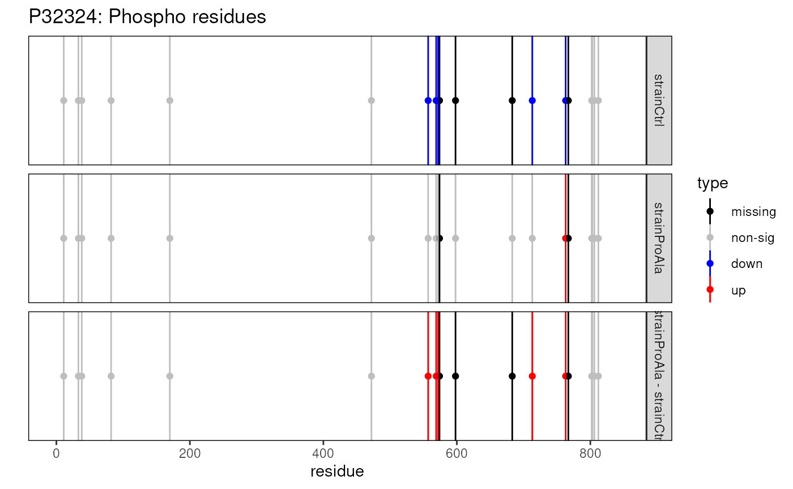

#### Along protein plot for all precursors

We first gather the data from all precursors that map to protein P32324

``` r

prot <- sub("_.*","", target_feature) ## 1.

precursorListProt <- inferencesUsage |> 
  left_join(rowData(qf[["precursorsPTM_usage"]]) |> 
              as.data.frame() |> 
              select(Precursor.Id, Protein.Group, Stripped.Sequence, Protein.Sites, Modified.Sequence),
            by = c("feature" = "Precursor.Id")) |> ## 2. 
  filter(Protein.Group == prot) |> ## 3. 
  mutate(seqOrder = as.factor(feature) |> as.numeric(),
         type = ifelse(is.na(adjPval),  
                       "missing", 
                       ifelse(adjPval < 0.05, 
                              ifelse(logFC < 0, 
                                     "down",
                                     "up"),
                              "non-sig")), ## 4.
         tmp = str_locate_all(mapping[prot,"sequence"], Stripped.Sequence),
         start = purrr::map(tmp, ~ .x[, "start"]),
         end = purrr::map(tmp, ~ .x[, "end"])) |>
  unnest(c(start, end))
```

Add location of Phospo residues.

1.  Add a new variable with the modification type (21 is phosho)
2.  Add a new variable with the location of the modification on the
    original protein
3.  Make vector of the row numbers with duplicates for the sequences
    containing multiple PTMs
4.  Make a corresponding vector with the positions of the individual PTM
    sites
5.  Make a corresponding vector with the modification type
6.  Extract the ids of rows that correspond to phospho sites
7.  Make a data.frame with duplicate entries for precursors with
    multiple phospho sites with variables seqOrder, type and contrast
8.  Add the position of the phospho site

``` r

precursorListProt <-  precursorListProt |> mutate(
    mods  = str_extract_all(Modified.Sequence, 
                           "UniMod:[0-9]+") |> 
      lapply(FUN = gsub, pattern="UniMod:",replacement=""), ##1.
    pos = str_extract(Protein.Sites, 
                      "(?<=:)[^\\]]+") |> 
      strsplit(split = ",") |> 
      lapply(FUN=substr,start=2,stop=10000) |> 
      lapply(FUN=as.integer)) ## 2.

ids <- rep(precursorListProt |> 
             nrow() |>
             seq_len(), 
           precursorListProt |>
             pull(pos) |>
             sapply(FUN = length))## 3.
pos <- unlist(precursorListProt$pos) ## 4.
mod <- unlist(precursorListProt$mods) ## 5. 

phosIds <- ids[mod == "21"] ## 6.


precursorPosListProt <- precursorListProt[phosIds,] |> ## 7.
  select(seqOrder,type, contrast) |>
  mutate(pos = pos[mod == "21"]) ## 8.
```

Make along protein plot.

``` r

precursorListProt |> 
  ggplot(aes(y=seqOrder)) +
    geom_segment(aes(x = start, xend = end, yend = seqOrder, color = type),
                  linewidth = 1) + 
    xlim(0, mapping[prot,"length"]) +
  ylab("Precursors") + xlab("Residue") +  #6. 
  scale_y_continuous(breaks = precursorListProt$seqOrder, labels = precursorListProt$Stripped.Sequence) +
  scale_color_manual(values = c("black","grey","blue","red", "black"), 
                     breaks = c("missing","non-sig","down", "up", "black")) +
  geom_segment(data = precursorPosListProt,
               aes(x = pos, xend = pos, y = seqOrder - 0.5, yend = seqOrder + 0.5, 
                   color = "black"), linewidth = 1) +
  facet_grid(contrast~.) +
  theme(
    axis.ticks.y = element_blank(),
    axis.text.y = element_blank(), #We suppress the feature sequence here because there are too many sequences
    panel.grid = element_blank(),
    panel.background = element_blank(),
    panel.border = element_rect(color = "black", fill = NA),
    strip.background = element_rect(color = "black")
    ) +
    labs(title = paste0(prot, " along with precursors"),
           subtitle = "(phospho residue in black vertical line)") 
```

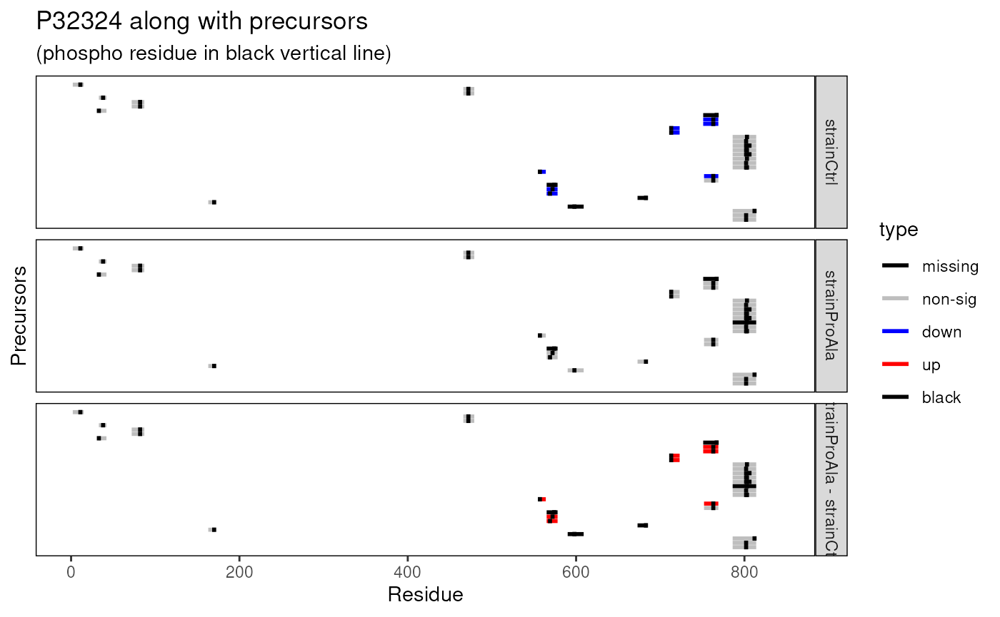

[^1]: The ion selection for MS2 depends on the data recorded in MS1.
    Therefore, this approach is referred to as data dependent
    acquisition (DDA).

[^2]: Improving peptide identification is outside the scope of this
    tutorial
